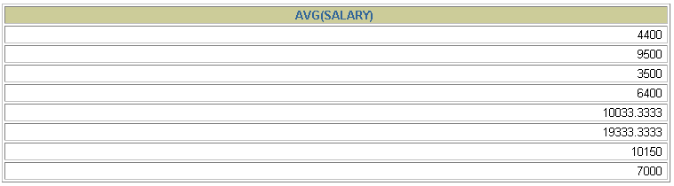
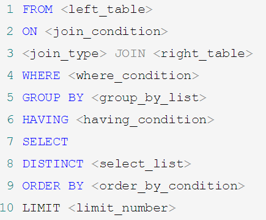

# 第08章_聚合函数

***

​	我们上一章讲到了 SQL 单行函数。实际上 SQL 函数还有一类，叫做聚合（或聚集、分组）函数，它是对一组数据进行汇总的函数，输入的是一组数据的集合，输出的是单个值。

## 1. 聚合函数介绍

- **什么是聚合函数**

聚合函数作用于一组数据，并对一组数据返回一个值。


- **聚合函数类型**
  - **AVG()** 
  - **SUM()**
  - **MAX()** 
  - **MIN()** 
  - **COUNT() **

- 聚合函数语法


- 聚合函数不能嵌套调用。比如不能出现类似“AVG(SUM(字段名称))”形式的调用。
- 如果SELECT中仅有聚合函数，正常；若是SELECT中有聚合函数之外的列名，则此列名必须出现在GROUP BY中

### 1.1 AVG和SUM函数

可以对**数值型数据**使用AVG 和 SUM 函数。

```sql
SELECT AVG(salary), MAX(salary), MIN(salary), SUM(salary)
FROM   employees
WHERE  job_id LIKE '%REP%';
# 如下的操作没有意义
SELECT SUM(last_name),AVG(last_name),SUM(hire_date)
FROM employees;

# AVG = SUM / COUNT
# commission_pct字段中有null，因此COUNT()得到的行数是错误的，不会计算NULL的行
# SUM(commission_pct)/COUNT(commission_pct)的结果却是正确的，因为sum也自动将null过滤掉了
SELECT AVG(salary),SUM(salary) / COUNT(salary),
AVG(commission_pct), # 0.22
SUM(commission_pct)/COUNT(commission_pct), # 0.22
SUM(commission_pct) / 107 # 0.07
FROM employees;

############################################# 需求：查询公司中平均奖金率
# 错误的！在有奖金的里面计算平均的
SELECT AVG(commission_pct)
FROM employees;

#################################### 正确的：将为null的也计算上，下面这两种方法都可以 ###############################
SELECT SUM(commission_pct) / COUNT(IFNULL(commission_pct,0)),
AVG(IFNULL(commission_pct,0))
FROM employees;
```


### 1.2 MIN和MAX函数

可以对**任意数据类型**的数据使用 MIN 和 MAX 函数。

```sql
SELECT MIN(hire_date), MAX(hire_date)
FROM employees;
# 字符串、日期等取最大和最小是有意义的
SELECT MAX(last_name), MIN(last_name)
FROM employees;
```


### 1.3 COUNT函数

- COUNT(*)计算指定字段在查询结构中出现的个数，适用于**任意数据类型**。


```sql
SELECT COUNT(*)
FROM	  employees
WHERE  department_id = 50;
```


- COUNT(expr) 返回**expr不为空**的记录总数。


```sql
SELECT COUNT(commission_pct)
FROM   employees
WHERE  department_id = 50;
```


```mysql
SELECT COUNT(employee_id),COUNT(salary),COUNT(2 * salary),COUNT(1),COUNT(2),COUNT(*)
FROM employees ;
# count(常数)相当于将每条数据当作一个1来充当，最后返回的是数据的条数

# 如果计算表中有多少条记录，如何实现？
# 方式1：COUNT(*)
# 方式2：COUNT(1)
# 方式3：COUNT(具体字段) : 不一定对！因为有的字段可能包含null
```


- **问题：用count(*)，count(1)，count(列名)谁好呢?**

  对于MyISAM引擎的表是没有区别的。这种引擎内部有一计数器在维护着行数。三者效率相同，都是O(1)

  Innodb引擎的表用count(* ),count(1)直接读行数，复杂度是O(n)，因为innodb真的要去数一遍。三者效率：COUNT(*) = COUNT(1) > COUNT(字段)
  
- **问题：能不能使用count(列名)替换count(*)?**

  不要使用 count(列名)来替代 `count(*)`，`count(*)`是 SQL92 定义的标准统计行数的语法，跟数据库无关，跟 NULL 和非 NULL 无关。 

  说明：count(*)会统计值为 NULL 的行，而 count(列名)不会统计此列为 NULL 值的行。

## 2. GROUP BY

> ​	在 SELECT 列表中所有未包含在组函数中的列都应该包含在 GROUP BY子句中，而包含在 GROUP BY 子句中的列不必包含在SELECT 列表中

### 2.1 基本使用


```mysql
# 需求：查询各个部门的平均工资，最高工资
SELECT department_id, AVG(salary), SUM(salary)
FROM employees
GROUP BY department_id
# null表示其中没有部门的自成一组
```


**可以使用GROUP BY子句将表中的数据分成若干组**

```sql
SELECT column, group_function(column)
FROM table
[WHERE	condition]
[GROUP BY	group_by_expression]
[ORDER BY	column];
```

> **明确：WHERE一定放在FROM后面**

**在SELECT列表中所有未包含在组函数中的列都应该包含在 GROUP BY子句中**。即这里SELECT后有两个列名，其中department_id未包含在组函数中，因此必须包含在GROUP BY子句中

```sql
# 在SELECT列表中所有未包含在组函数中的列都应该包含在 GROUP BY子句中，否则的话，在mysql中就会每个department_id的都显示一条，在其他数据库中会报错。
# 错误写法
SELECT   department_id, job_id, SUM(salary)
FROM     employees
GROUP BY department_id;

# 正确写法
SELECT   department_id, job_id, SUM(salary)
FROM     employees
GROUP BY department_id, job_id;

SELECT   department_id, AVG(salary)
FROM     employees
GROUP BY department_id ;
```


**包含在 GROUP BY 子句中的列不必包含在SELECT 列表中**，如这里SELECT后仅有AVG(salary)，因此仅显示这个。department_id包含在GROUP BY中，但不会显示这一列

```sql
SELECT   AVG(salary)
FROM     employees
GROUP BY department_id ;
```



### 2.2 使用多个列分组


```sql
# 需求：查询各个department_id、job_id的平均工资
SELECT   department_id, job_id, SUM(salary)
FROM     employees
GROUP BY department_id, job_id ;
# 注意，这两个是等价的，最后都是同一部门且同一工种的分在一组
SELECT   job_id, department_id, SUM(salary)
FROM     employees
GROUP BY job_id, department_id;
```


### 2.3 GROUP BY中使用WITH ROLLUP

使用`WITH ROLLUP`关键字之后，在所有查询出的分组记录之后增加一条记录，该记录计算查询出的所有记录的总和，即统计记录数量。

```mysql
SELECT department_id,AVG(salary)
FROM employees
WHERE department_id > 80
GROUP BY department_id WITH ROLLUP;
```

> * 当使用ROLLUP时，不能同时使用ORDER BY子句进行结果排序，即**ROLLUP和ORDER BY是互相排斥**的。

## 3. HAVING

### 3.1 基本使用


**过滤分组：HAVING子句**

1. 行已经被分组。
2. 使用了聚合函数。
3. 满足HAVING 子句中条件的分组将被显示。
4. **HAVING 不能单独使用，必须要跟 GROUP BY 一起**使用。
4. HAVING必须声明在 GROUP BY后面

**若过滤条件中使用了聚合函数，则必须使用HAVING而不是WHERE**

**若过滤条件中没有聚合函数，则更推荐声明在WHERE中，执行效率更高**


```sql
SELECT   department_id, MAX(salary)
FROM     employees
GROUP BY department_id
HAVING   MAX(salary)>10000 ;
```


- 非法使用聚合函数 ： **不能在 WHERE 子句中使用聚合函数。**如下：

```sql
SELECT   department_id, AVG(salary)
FROM     employees
WHERE    AVG(salary) > 8000
GROUP BY department_id;
```

 

### 3.2 WHERE和HAVING的对比

**区别1：WHERE 可以直接使用表中的字段作为筛选条件，但不能使用分组中的计算函数作为筛选条件；HAVING 必须要与 GROUP BY 配合使用，可以把分组计算的函数和分组字段作为筛选条件。** 

这决定了，在需要对数据进行分组统计的时候，HAVING 可以完成 WHERE 不能完成的任务。这是因为，在查询语法结构中，**WHERE 在 GROUP BY 之前，所以无法对分组结果进行筛选。HAVING 在 GROUP BY 之后，可以使用分组字段和分组中的计算函数**，对分组的结果集进行筛选，这个功能是 WHERE 无法完成的。另外，WHERE排除的记录不再包括在分组中。

**区别2：如果需要通过连接从关联表中获取需要的数据，WHERE 是先筛选后连接，而 HAVING 是先连接后筛选。** 这一点，就决定了在关联查询中，WHERE 比 HAVING 更高效。因为 WHERE 可以先筛选，用一个筛选后的较小数据集和关联表进行连接，这样占用的资源比较少，执行效率也比较高。HAVING 则需要先把结果集准备好，也就是用未被筛选的数据集进行关联，然后对这个大的数据集进行筛选，这样占用的资源就比较多，执行效率也较低。 

小结如下：

|        | 优点                         | 缺点                                   |
| ------ | ---------------------------- | -------------------------------------- |
| WHERE  | 先筛选数据再关联，执行效率高 | 不能使用分组中的计算函数进行筛选       |
| HAVING | 可以使用分组中的计算函数     | 在最后的结果集中进行筛选，执行效率较低 |

**开发中的选择：**

WHERE 和 HAVING 也不是互相排斥的，我们可以在一个查询里面同时使用 WHERE 和 HAVING。**包含分组统计函数的条件用 HAVING，普通条件用 WHERE**。这样，我们就既利用了 WHERE 条件的高效快速，又发挥了 HAVING 可以使用包含分组统计函数的查询条件的优点。当数据量特别大的时候，运行效率会有很大的差别。

## 4. SELECT的执行过程

### 4.1 查询的结构

```mysql
#方式1：
SELECT ...,....,...
FROM ...,...,....
WHERE 多表的连接条件
AND 不包含组函数的过滤条件
GROUP BY ...,...
HAVING 包含组函数的过滤条件
ORDER BY ... ASC/DESC
LIMIT ...,...

#方式2：
SELECT ...,....,...
FROM ... JOIN ... 
ON 多表的连接条件
JOIN ...
ON ...
WHERE 不包含组函数的过滤条件
AND/OR 不包含组函数的过滤条件
GROUP BY ...,...
HAVING 包含组函数的过滤条件
ORDER BY ... ASC/DESC
LIMIT ...,...

#其中：
#（1）from：从哪些表中筛选
#（2）on：关联多表查询时，去除笛卡尔积
#（3）where：从表中筛选的条件
#（4）group by：分组依据
#（5）having：在统计结果中再次筛选
#（6）order by：排序
#（7）limit：分页
```

### 4.2 SELECT执行顺序


你需要记住 SELECT 查询时的两个顺序：

**1. 关键字的顺序是不能颠倒的：**

```
SELECT ... FROM ... WHERE ... GROUP BY ... HAVING ... ORDER BY ... LIMIT...
```

**2.SELECT 语句的执行顺序**（在 MySQL 和 Oracle 中，SELECT 执行顺序基本相同）：

```
FROM -> WHERE -> GROUP BY -> HAVING -> SELECT 的字段 -> DISTINCT -> ORDER BY -> LIMIT
```



比如你写了一个 SQL 语句，那么它的关键字顺序和执行顺序是下面这样的：

```mysql
SELECT DISTINCT player_id, player_name, count(*) as num # 顺序 5
FROM player JOIN team ON player.team_id = team.team_id # 顺序 1
WHERE height > 1.80 # 顺序 2
GROUP BY player.team_id # 顺序 3
HAVING num > 2 # 顺序 4
ORDER BY num DESC # 顺序 6
LIMIT 2 # 顺序 7
```

在 SELECT 语句执行这些步骤的时候，每个步骤都会产生一个`虚拟表`，然后将这个虚拟表传入下一个步骤中作为输入。需要注意的是，这些步骤隐含在 SQL 的执行过程中，对于我们来说是不可见的。

### 4.3 SQL 的执行原理

SELECT 是先执行 FROM 这一步的。在这个阶段，如果是多张表联查，还会经历下面的几个步骤：

1. 首先先通过 CROSS JOIN 求笛卡尔积，相当于得到虚拟表 vt（virtual table）1-1；
2. 通过 ON 进行筛选，在虚拟表 vt1-1 的基础上进行筛选，得到虚拟表 vt1-2；
3. 添加外部行。如果我们使用的是左连接、右链接或者全连接，就会涉及到外部行，也就是在虚拟表 vt1-2 的基础上增加外部行，得到虚拟表 vt1-3。

当然如果我们操作的是两张以上的表，还会重复上面的步骤，直到所有表都被处理完为止。这个过程得到是我们的原始数据。

当我们拿到了查询数据表的原始数据，也就是最终的虚拟表 `vt1`，就可以在此基础上再进行 `WHERE 阶段`。在这个阶段中，会根据 vt1 表的结果进行筛选过滤，得到虚拟表 `vt2`。

然后进入第三步和第四步，也就是 `GROUP 和 HAVING 阶段`。在这个阶段中，实际上是在虚拟表 vt2 的基础上进行分组和分组过滤，得到中间的虚拟表 `vt3` 和 `vt4`。

当我们完成了条件筛选部分之后，就可以筛选表中提取的字段，也就是进入到 `SELECT 和 DISTINCT 阶段`。

首先在 SELECT 阶段会提取想要的字段，然后在 DISTINCT 阶段过滤掉重复的行，分别得到中间的虚拟表 `vt5-1` 和 `vt5-2`。

当我们提取了想要的字段数据之后，就可以按照指定的字段进行排序，也就是 `ORDER BY 阶段`，得到虚拟表 `vt6`。

最后在 vt6 的基础上，取出指定行的记录，也就是 `LIMIT 阶段`，得到最终的结果，对应的是虚拟表 `vt7`。

当然我们在写 SELECT 语句的时候，不一定存在所有的关键字，相应的阶段就会省略。

同时因为 SQL 是一门类似英语的结构化查询语言，所以我们在写 SELECT 语句的时候，还要注意相应的关键字顺序，**所谓底层运行的原理，就是我们刚才讲到的执行顺序。**


# 练习

```sql
#1.where子句可否使用组函数进行过滤?
#不可以，组函数要用HAVING过滤

#2.查询公司员工工资的最大值，最小值，平均值，总和
SELECT MAX(salary), MIN(salary), AVG(salary), SUM(salary)
FROM employees

#3.查询各job_id的员工工资的最大值，最小值，平均值，总和
SELECT job_id, MAX(salary), MIN(salary), AVG(salary), SUM(salary)
FROM employees
GROUP BY job_id

#4.选择具有各个job_id的员工人数
SELECT job_id, COUNT(*)
FROM employees
GROUP BY job_id

# 5.查询员工最高工资和最低工资的差距（DIFFERENCE）
SELECT MAX(salary) - MIN(salary) "DIFFERENCE"
FROM employees

# 6.查询各个管理者手下员工的最低工资，其中最低工资不能低于6000，
# 没有管理者的员工不计算在内
SELECT manager_id, MIN(salary)
FROM employees
WHERE manager_id IS NOT NULL
GROUP BY manager_id
HAVING MIN(salary) >= 6000

# 7.查询所有部门的名字，location_id，员工数量和平均工资，并按平均工资降序
# 注意是所有！！！外连接
# 注意，有16个部门是没有人的，因此其salary为null，但对应的COUNT就不对了！
# 因为count(*)显示的就是一条记录。如果想让count显示真正的值，即0，这里该用COUNT(employee_id)
# 因为没有部门的，是由null的employee_id对应的
SELECT department_name, location_id, COUNT(employee_id), AVG(salary)
FROM employees e RIGHT JOIN departments d
ON e.`department_id` = d.department_id
GROUP BY department_name, location_id
ORDER BY AVG(salary) DESC

# 8.查询每个工种、每个部门的部门名、工种名和最低工资
# 注意是每个！！！！外连接
SELECT d.department_name, job_id, MIN(salary)
FROM employees e RIGHT JOIN departments d
ON d.department_id = e.department_id
GROUP BY department_name, job_id

```

