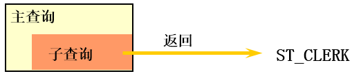
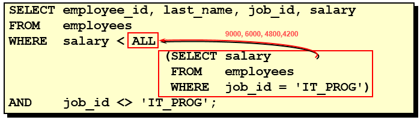
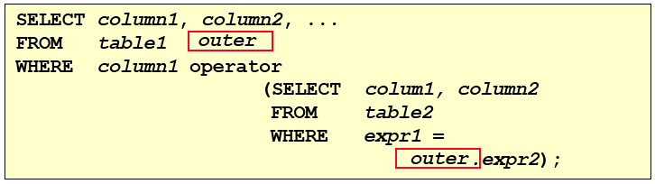

# 第09章_子查询

子查询指一个查询语句嵌套在另一个查询语句内部的查询，这个特性从MySQL 4.1开始引入。

SQL 中子查询的使用大大增强了 SELECT 查询的能力，因为很多时候查询需要从结果集中获取数据，或者需要从同一个表中先计算得出一个数据结果，然后与这个数据结果（可能是某个标量，也可能是某个集合）进行比较。

## 1. 需求分析与问题解决

### 1.1 实际问题


现有解决方式：

```mysql
#方式一：
SELECT salary
FROM employees
WHERE last_name = 'Abel';

SELECT last_name,salary
FROM employees
WHERE salary > 11000;

#方式二：自连接
SELECT e2.last_name,e2.salary
FROM employees e1,employees e2
WHERE e1.last_name = 'Abel'
AND e1.`salary` < e2.`salary`
```

```mysql
#方式三：子查询
SELECT last_name,salary
FROM employees
WHERE salary > (
		SELECT salary
		FROM employees
		WHERE last_name = 'Abel'
		);
```

 

### 1.2 子查询的基本使用

> 除了 GROUP BY 和 LIMIT 外，其他位置都可以声明子查询，如SELECT、FROM、WHERE、HAVING、PRDER BY等

- 子查询的基本语法结构：

 

- 子查询（内查询）在主查询之前一次执行完成。
- 子查询的结果被主查询（外查询）使用
- **注意事项**
  - 子查询要包含在括号内
  - 将子查询放在比较条件的右侧
  - 单行操作符对应单行子查询，多行操作符对应多行子查询

### 1.3 子查询的分类

**分类方式1：**

我们按内查询的结果返回一条还是多条记录，将子查询分为`单行子查询`、`多行子查询`。

- 单行子查询

  

- 多行子查询


**分类方式2：**

我们按内查询是否被执行多次，将子查询划分为`相关(或关联)子查询`和`不相关(或非关联)子查询`。

子查询从数据表中查询了数据结果，如果这个数据结果只执行一次，然后这个数据结果作为主查询的条件进行执行，那么这样的子查询叫做不相关子查询。

同样，如果子查询需要执行多次，即采用循环的方式，先从外部查询开始，每次都传入子查询进行查询，然后再将结果反馈给外部，这种嵌套的执行方式就称为相关子查询。

```sql
# 不相关子查询
# 查询工资大于本公司平均工资的员工信息
# 相关子查询
# 查询工资大于本部门平均工资的员工信息，比如主查询查到张三，则子查询返回张三所在部门的平均工资进行比较；查到李四，子查询返回李四所在部门的。虽然子查询返回的还是一个数，但这个数是和主查询相关的
```


## 2. 单行子查询

> 做相关题时要注意 **其他** ！！！即要除自己外的
>
> `AND	xxx <> xxx;`

### 2.1 单行比较操作符

| 操作符 | 含义                     |
| ------ | ------------------------ |
| =      | equal to                 |
| >      | greater than             |
| >=     | greater than or equal to |
| <      | less than                |
| <=     | less than or equal to    |
| <>     | not equal to             |

### 2.2 代码示例

**题目：查询工资大于149号员工工资的员工的信息**


**题目：返回job_id与141号员工相同，salary比143号员工多的员工姓名，job_id和工资**

```sql
SELECT last_name, job_id, salary
FROM   employees
WHERE  job_id =  
                (SELECT job_id
                 FROM   employees
                 WHERE  employee_id = 141)
AND    salary >
                (SELECT salary
                 FROM   employees
                 WHERE  employee_id = 143);
```


**题目：返回公司工资最少的员工的last_name,job_id和salary**

```sql
SELECT last_name, job_id, salary
FROM   employees
WHERE  salary = 
                (SELECT MIN(salary)
                 FROM   employees);
```


**题目：查询与141号员工的manager_id和department_id相同的其他员工的employee_id，manager_id，department_id**

实现方式1：不成对比较

```sql
SELECT  employee_id, manager_id, department_id
FROM    employees
WHERE   manager_id = (
    			  SELECT  manager_id
                   FROM    employees
                   WHERE   employee_id = 141)
AND     department_id = (
    			  SELECT  department_id
                   FROM    employees
                   WHERE   employee_id = 141)
AND	employee_id <> 141;
```

实现方式2：成对比较

```sql
SELECT	employee_id, manager_id, department_id
FROM	employees
WHERE  (manager_id, department_id) =
                      (SELECT manager_id, department_id
                       FROM   employees
                       WHERE  employee_id = 141)
AND	employee_id <> 141;
```

### 2.3 HAVING 中的子查询

- 首先执行子查询。
- 向主查询中的HAVING 子句返回结果。

**题目：查询最低工资大于50号部门最低工资的部门id和其最低工资**

```sql
SELECT   department_id, MIN(salary)
FROM     employees
GROUP BY department_id
HAVING   MIN(salary) >
                       (SELECT MIN(salary)
                        FROM   employees
                        WHERE  department_id = 50);
```

### 2.4 CASE中的子查询

在CASE表达式中使用单列子查询：

**题目：显式员工的employee_id,last_name和location。其中，若员工department_id与location_id为1800的department_id相同，则location为’Canada’，其余则为’USA’。**

```sql
SELECT employee_id,last_name,
	CASE department_id
	WHEN (
	SELECT department_id
	FROM departments
	WHERE location_id = 1800
	) 
	THEN 'Canada'
	ELSE 'USA'
	END location
FROM employees
```

### 2.5 子查询中的空值情况

> 内查询为空时，外查询也不会有数据

```sql
SELECT last_name, job_id
FROM   employees
WHERE  job_id =
                (SELECT job_id
                 FROM   employees
                 WHERE  last_name = 'Haas');
```


> **子查询不返回任何行**

### 2.5 非法使用子查询

> 子查询输出了各个部门的最低工资，而外查询用的等号，这是错误的
>
> (应该用IN)

```sql
SELECT employee_id, last_name
FROM   employees
WHERE  salary =
                (SELECT   MIN(salary)
                 FROM     employees
                 GROUP BY department_id);
```


> **多行子查询使用单行比较符**

## 3. 多行子查询

- 也称为集合比较子查询
- 内查询返回多行
- 使用多行比较操作符

### 3.1 多行比较操作符

| 操作符 | 含义                                                         |
| ------ | ------------------------------------------------------------ |
| IN     | 等于列表中的**任意一个**                                     |
| ANY    | 需要和单行比较操作符一起使用，和子查询返回的**某一个**值比较 |
| ALL    | 需要和单行比较操作符一起使用，和子查询返回的**所有**值比较   |
| SOME   | 实际上是ANY的别名，作用相同，一般常使用ANY                   |

> 体会 ANY 和 ALL 的区别
>
> ANY——任一，比如比某个部门中任意一个的工资要低就行，那比如那个部门工资有9000、6000、4200，则显示工资低于9000的
>
> ALL——所有，则是比这个部门所有人的工资都要低的，则显示工资低于4200的

### 3.2 代码示例

**IN**

题目：查询与141号或174号员工的manager_id和department_id相同的**其他**员工的employee_id，manager_id，department_id

实现方式1：不成对比较

```sql
SELECT employee_id, manager_id, department_id
FROM employees
WHERE manager_id IN (
	SELECT manager_id
	FROM employees
	WHERE employee_id IN (141, 174)
)
AND
department_id IN (
	SELECT department_id
	FROM employees
	WHERE employee_id IN (141, 174)
)
AND employee_id NOT IN (141, 174)
# AND employee_id <> (174,141);
```

实现方式2：成对比较

```sql
SELECT	employee_id, manager_id, department_id
FROM	employees
WHERE  (manager_id, department_id) IN
                      (SELECT manager_id, department_id
                       FROM   employees
                       WHERE  employee_id IN (141,174))
AND	employee_id NOT IN (141,174);
```

**ANY**

题目：返回其它job_id中比job_id为‘IT_PROG’部门任一工资低的员工的员工号、姓名、job_id 以及salary

```sql
SELECT employee_id, last_name, job_id, salary
FROM employees
WHERE salary < ANY (
	SELECT salary
	FROM employees
	WHERE job_id = 'IT_PROG'
	)
AND job_id <> 'IT_PROG'
```


**ALL**

题目：返回其它job_id中比job_id为‘IT_PROG’部门所有工资都低的员工的员工号、姓名、job_id以及salary

```SQL
SELECT employee_id, last_name, job_id, salary
FROM employees
WHERE salary < ALL (
	SELECT salary
	FROM employees
	WHERE job_id = 'IT_PROG'
	)
AND job_id <> 'IT_PROG'
```




**题目：查询平均工资最低的部门id**

> 1.GROUP BY 与 HAVING 配合
> 2.在 SELECT 列表中所有未包含在组函数中的列都应该包含在 GROUP BY子句中，而包含在 GROUP BY 子句中的列不必包含在SELECT 列表中
> 3.聚合函数不能嵌套

```mysql
#方式1：将各部门的平均薪资视为一张表，然后查MIN
SELECT department_id
FROM employees
GROUP BY department_id
HAVING AVG(salary) = (
			SELECT MIN(avg_sal)
			FROM (
				SELECT AVG(salary) avg_sal
				FROM employees
				GROUP BY department_id
				) dept_avg_sal
			)
```

```mysql
#方式2：
SELECT department_id
FROM employees
GROUP BY department_id
HAVING AVG(salary) <= ALL (
				SELECT AVG(salary) avg_sal
				FROM employees
				GROUP BY department_id
)
```

### 3.3 空值问题

对于 `SELECT manager_id FROM employees` 显示了所有的管理者的 `manager_id ` 。我们想显示所有不是管理者的员工姓名，但结果输出为空：

```mysql
SELECT last_name
FROM employees
WHERE employee_id NOT IN (
			SELECT manager_id
			FROM employees
			);
```

问题在于子查询中存在NULL，我们需要去掉他

```sql
SELECT last_name
FROM employees
WHERE employee_id NOT IN (
			SELECT manager_id
			FROM employees
			WHERE manager_id IS NOT NULL
			);
```

## 4. 相关子查询

### 4.1 相关子查询执行流程

如果子查询的执行依赖于外部查询，通常情况下都是因为子查询中的表用到了外部的表，并进行了条件关联，因此每执行一次外部查询，子查询都要重新计算一次，这样的子查询就称之为`关联子查询`。

相关子查询按照一行接一行的顺序执行，主查询的每一行都执行一次子查询。




说明：**子查询中使用主查询中的列**

### 4.2 代码示例

题目：查询员工中工资大于本部门平均工资的员工的last_name,salary和其department_id

**方式一：相关子查询的写法**

```sql
SELECT last_name, salary, department_id
FROM employees e1
WHERE salary > (
	SELECT AVG(salary)
	FROM employees
	WHERE department_id = e1.`department_id`
	)
```


**方式二：在 FROM 中使用子查询**

```sql
SELECT last_name, salary, e1.department_id
FROM employees e1, (
    SELECT department_id,AVG(salary) dept_avg_sal 
    FROM employees 
    GROUP BY department_id) e2
WHERE e1.`department_id` = e2.department_id
AND e2.dept_avg_sal < e1.`salary`;
```

> from型的子查询：子查询是作为from的一部分，子查询要用()引起来，并且要给这个子查询取别名，
> 把它当成一张“临时的虚拟的表”来使用。

**在ORDER BY 中使用子查询：**

题目：查询员工的id,salary,按照department_name 排序

```sql
SELECT employee_id,salary
FROM employees e
ORDER BY (
	  SELECT department_name
	  FROM departments d
	  WHERE e.`department_id` = d.`department_id`
	);
# 默认 ASC 升序
```

题目：若employees表中employee_id与job_history表中employee_id相同的数目不小于2，输出这些相同id的员工的employee_id,last_name和其job_id

```sql
SELECT e.employee_id, e.last_name, e.job_id
FROM   employees e 
WHERE  2 <= (SELECT COUNT(*)
             FROM   job_history j
             WHERE  j.employee_id = e.employee_id);
```

### 4.3 EXISTS 与 NOT EXISTS关键字

- 关联子查询通常也会和 EXISTS操作符一起来使用，用来检查在子查询中是否存在满足条件的行
- **如果在子查询中不存在满足条件的行：**
  - 条件返回 FALSE
  - 继续在子查询中查找
- **如果在子查询中存在满足条件的行：**
  - 不在子查询中继续查找
  - 条件返回 TRUE
- NOT EXISTS关键字表示如果不存在某种条件，则返回TRUE，否则返回FALSE

**EXISTS**

题目：查询公司管理者的employee_id，last_name，job_id，department_id信息

方式一：

```sql
SELECT employee_id, last_name, job_id, department_id
FROM   employees e1
WHERE  EXISTS ( SELECT * # SELECT后面可以写任意的东西，因为只是找有没有这条记录
                 FROM   employees e2
                 WHERE  e2.manager_id = 
                        e1.employee_id);
```

方式二：自连接

注意用 DISTINCT 去除重复行

```sql
SELECT DISTINCT e1.employee_id, e1.last_name, e1.job_id, e1.department_id
FROM   employees e1 JOIN employees e2
WHERE e1.employee_id = e2.manager_id;
```

方式三：子查询

```sql
SELECT employee_id, last_name, job_id, department_id
FROM employees
WHERE employee_id IN (
		     SELECT DISTINCT manager_id
		     FROM employees
		     );
```

**NOT EXISTS**

题目：查询departments表中，不存在于employees表中的部门的department_id和department_name

**NOT EXISTS**

```sql
SELECT department_id, department_name
FROM departments d
WHERE NOT EXISTS (SELECT 'X'
                  FROM   employees
                  WHERE  department_id = d.department_id);
```

**左外链接 - A ∩ B**

```sql
SELECT d.department_id, d.department_name
FROM departments d LEFT JOIN employees e
ON e.`department_id` = d.`department_id`
WHERE e.department_id IS NULL
```


### 4.4 相关更新

```sql
UPDATE table1 alias1
SET    column = (SELECT expression
                 FROM   table2 alias2
                 WHERE  alias1.column = alias2.column);
```

使用相关子查询依据一个表中的数据更新另一个表的数据。

**题目：在employees中增加一个department_name字段，数据为员工对应的部门名称**

```mysql
# 1）
ALTER TABLE employees
ADD(department_name VARCHAR2(14));

# 2）
UPDATE employees e
SET department_name =  (SELECT department_name 
	                       FROM   departments d
	                       WHERE  e.department_id = d.department_id);

```

### 4.4 相关删除

```sql
 DELETE FROM table1 alias1
 WHERE column operator (SELECT expression
                        FROM   table2 alias2
                        WHERE  alias1.column = alias2.column);
```

使用相关子查询依据一个表中的数据删除另一个表的数据。

**题目：删除表employees中，其与emp_history表皆有的数据**

```sql
DELETE FROM employees e
WHERE employee_id in  
           (SELECT employee_id
            FROM   emp_history 
            WHERE  employee_id = e.employee_id);
```

## 5. 抛一个思考题

**问题：**谁的工资比Abel的高？

**解答：**

```mysql
#方式1：自连接
SELECT e2.last_name,e2.salary
FROM employees e1,employees e2
WHERE e1.last_name = 'Abel'
AND e1.`salary` < e2.`salary`
```

```mysql
#方式2：子查询
SELECT last_name,salary
FROM employees
WHERE salary > (
		SELECT salary
		FROM employees
		WHERE last_name = 'Abel'
		);
```

**问题：**以上两种方式有好坏之分吗？

**解答：**自连接方式好！

题目中可以使用子查询，也可以使用自连接。一般情况建议你使用自连接，因为在许多 DBMS 的处理过程中，**对于自连接的处理速度要比子查询快得多**。

可以这样理解：子查询实际上是通过未知表进行查询后的条件判断，而自连接是通过已知的自身数据表进行条件判断，因此在大部分 DBMS 中都对自连接处理进行了优化。


# 练习

```sql
#1.查询和Zlotkey相同部门的员工姓名和工资
SELECT last_name, salary
FROM employees
WHERE department_id = (
	SELECT department_id
	FROM employees
	WHERE last_name = 'Zlotkey'
)

#2.查询工资比公司平均工资高的员工的员工号，姓名和工资。
SELECT employee_id, last_name, salary
FROM employees
WHERE salary > (
	SELECT AVG(salary)
	FROM employees
	)
#3.选择工资大于所有JOB_ID = 'SA_MAN'的员工的工资的员工的last_name, job_id, salary
SELECT last_name, job_id, salary
FROM employees
WHERE salary > ALL (
	SELECT salary
	FROM employees
	WHERE job_id = 'SA_MAN'
	)
#4.查询和姓名中包含字母u的员工在相同部门的员工的员工号和姓名
SELECT employee_id, last_name
FROM employees
WHERE department_id IN (
	SELECT DISTINCT department_id # DISTINCT去重后内容更少，效率更高
	FROM employees
	WHERE last_name LIKE '%u%'
	)

SELECT employee_id, last_name
FROM employees
WHERE department_id = ANY (
	SELECT DISTINCT department_id
	FROM employees
	WHERE last_name LIKE '%u%'
	)
#5.查询在部门的location_id为1700的部门工作的员工的员工号
SELECT employee_id
FROM employees
WHERE department_id IN (
	SELECT department_id
	FROM departments
	WHERE location_id = 1700
	)

#6.查询管理者是King的员工姓名和工资，即看谁的管理者是King
# 注意这里要用 IN ，因为查出来姓名为King的是两条数据
SELECT last_name, salary
FROM employees
WHERE manager_id IN (
	SELECT employee_id
	FROM employees
	WHERE last_name = 'King'
	)

SELECT e.last_name, e.salary
FROM employees e
WHERE EXISTS (
	SELECT *
	FROM employees
	WHERE last_name = 'King'
	AND e.manager_id = employee_id
	)
#7.查询工资最低的员工信息: last_name, salary
SELECT last_name, salary
FROM employees
WHERE salary <= ALL (
	SELECT salary
	FROM employees
)

SELECT last_name, salary
FROM employees
WHERE salary = (
	SELECT MIN(salary)
	FROM employees
)
#8.查询平均工资最低的部门信息
SELECT department_id
FROM employees
GROUP BY department_id
HAVING AVG(salary) = (
	SELECT MIN(avg_sal)
	FROM (
		SELECT  AVG(salary) avg_sal
		FROM employees
		GROUP BY department_id) t_sal
)
# 上面只是找到了 department_id ，我们要显示部门的全部信息，还要嵌套一层
SELECT *
FROM departments
WHERE department_id = (
	SELECT department_id
	FROM employees
	GROUP BY department_id
	HAVING AVG(salary) = (
		SELECT MIN(avg_sal)
		FROM (
			SELECT  AVG(salary) avg_sal
			FROM employees
			GROUP BY department_id) t_sal
	)
)
# 方法二 用比较操作符简化
SELECT *
FROM departments
WHERE department_id = (
	SELECT department_id
	FROM employees
	GROUP BY department_id
	HAVING AVG(salary) <= ALL(
		SELECT  AVG(salary)
		FROM employees
		GROUP BY department_id)
	)
# 方式三 使用 ORDER BY 和 LIMIT
SELECT *
FROM departments
WHERE department_id = (
	SELECT department_id
	FROM employees
	GROUP BY department_id
	HAVING AVG(salary) = (
		SELECT  AVG(salary) avg_sal
		FROM employees
		GROUP BY department_id
		ORDER BY avg_sal
		LIMIT 1
		)
	)
# 方式四 将子查询的结果视为一张表
SELECT d.*
FROM departments d, (
	SELECT department_id, AVG(salary) avg_sal
	FROM employees
	GROUP BY department_id
	ORDER BY avg_sal
	LIMIT 1
	) e
WHERE d.`department_id` = e.department_id
	
#9.查询平均工资最低的部门信息和该部门的平均工资（相关子查询）
# 其他方法同样在 SELECT 中加上这条子查询即可
SELECT d.*, (SELECT AVG(salary) FROM employees WHERE department_id = d.`department_id`) avg_sal
FROM departments d
WHERE department_id = (
	SELECT department_id
	FROM employees
	GROUP BY department_id
	HAVING AVG(salary) = (
		SELECT MIN(avg_sal)
		FROM (
			SELECT  AVG(salary) avg_sal
			FROM employees
			GROUP BY department_id) t_sal
	)
)
#10.查询平均工资最高的 job 信息
SELECT *
FROM employees
WHERE job_id = (
	SELECT job_id
	FROM employees
	GROUP BY job_id
	HAVING AVG(salary) >= ALL (
		SELECT AVG(salary)
		FROM employees
		GROUP BY job_id
		)
	)

SELECT *
FROM employees
WHERE job_id = (
	SELECT job_id
	FROM employees
	GROUP BY job_id
	HAVING AVG(salary) = (
		SELECT AVG(salary)
		FROM employees
		GROUP BY job_id
		ORDER BY AVG(salary)
		LIMIT 1
		)
	)
```

