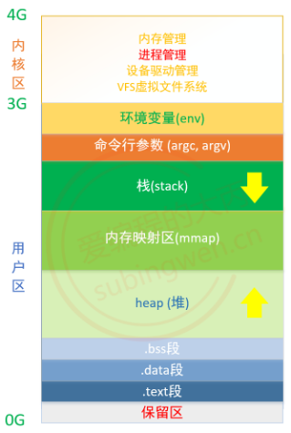
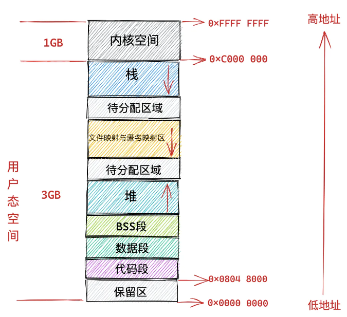

1、整理类型安全的笔记 https://www.cnblogs.com/Joe-BM/articles/2613245.html

2、STL部分的笔记 http://c.biancheng.net/view/6860.html https://blog.csdn.net/QIANGWEIYUAN/article/details/88792786?spm=1001.2014.3001.5501


# 一、程序的执行

## 1.return 0

​	对于main函数中的return 0;，如果没自己加，编译器会自动给添加一个。但最好自己加，养成习惯，表示程序的正常退出

## 2. g++ 和 gcc 编译器

​	GCC是一个编译器。GCC 编译器已经为我们提供了调用它的接口，对于 C 语言或者 C++ 程序，可以通过执行 gcc 或者 g++ 指令来调用 GCC 编译器。
​	实际使用中我们更习惯使用 gcc 指令编译 C 语言程序，用 g++ 指令编译 C++ 代码。需要强调的一点是，这并不是 gcc 和 g++ 的区别，gcc 指令也可以用来编译 C++ 程序，同样 g++ 指令也可以用于编译 C 语言程序。

g++ 和gcc**区别**：

​	gcc 指令可以根据程序文件的后缀名自行判断出当前程序所用编程语言的类别。而 g++ 指令一律按照编译 C++ 代码的方式编译该文件。g++编译的话，c++标准对代码书写规范的要求更加严格。

​	另一个区别是，在编译过程中，很多 C++ 程序都会调用某些标准库中现有的函数或者类对象，而单纯的 gcc 命令是无法自动链接这些标准库文件的，需要手动的链接c++的标准库，所以通常使用`g++完成链接操作`。

举个例子：

```cpp
#include <iostream>
#include <string>
using namespace std;
int main(){
    string str ="C语言中文网";
    cout << str << endl;
    return 0;
}
```

​	gcc 指令会报错，其根本原因就在于，该程序中使用了标准库 iostream 和 string 提供的类对象，而 gcc 默认是无法找到它们的。
​	如果想使用 gcc 指令来编译执行 C++ 程序，需要在使用 gcc 指令时，手动为其添加 -lstdc++ -shared-libgcc  选项，表示 gcc 在编译 C++ 程序时可以链接必要的 C++ 标准库。也就是说，我们可以这样编译 demo.cpp 文件：

```cpp
gcc -xc++ demo.cpp -lstdc++ -shared-libgcc
/*
gcc 指令为用户提供了“手动指定代表编译方式”的接口，即使用 -x 选项。例如，gcc -xc xxx 表示以编译 C 语言代码的方式编译 xxx 文件；而 gcc -xc++ xxx 则表示以编译 C++ 代码的方式编译 xxx 文件。有关 -x 选项的用法，后续会给出具体样例。
*/
```

> 读者可以这样认为，g++ 指令就等同于`gcc -xc++ -lstdc++ -shared-libgcc`指令。显然后者书写是非常麻烦的，大多数人会更喜欢前者。

gcc编译选项


-std=c++17

**g++编译选项**


## 3.编译器和链接器(c++从代码到可执行程序)

C/C++语言从源文件到可执行文件的整个过程：

预处理 -> 编译 -> 汇编 -> 链接


### 3.1 预处理(预编译)

```cpp
g++ -E testESc.cpp -o testESc.i 
```

主要处理源代码文件中的以“#”开头的预编译指令。处理规则见下：

1. 展开所有的define**宏定义**。
2. 处理所有的**条件编译指令**，如“#if”、“#endif”、"#ifdef"、"#ifndef"、“#elif”和“#else”。
3. 处理“#include”预编译指令，将文件内容替换到它的位置，这个过程是递归进行的，文件中包含其他文件
4. 删除所有的**注释**：“//”和“/**/”。
5. 保留所有的`#pragma 编译器指令`，pragma用于指示编译器完成一些特定的动作：#pragma message 用于自定义编译信息；#pragma once 用于保证头文件只被编译一次，#pragama pack用于指定内存对齐(一般用在结构体)
6. `添加行号`和文件标识，便于编译时编译器产生调试用的行号信息，和编译时产生编译错误或警告时能够显示行号。
7. 最后生成.i文件(C语言)或.ii文件(C++)

### 3.2 编译

```cpp
g++ -S testESc.cpp -o testESc.s 
```

把预处理之后生成的xxx.i或xxx.ii文件，进行一系列`词法分析、语法分析、语义分析及优化`后，生成相应的汇编代码文件。

1. 词法分析：利用类似于“有限状态机”的算法，将源代码程序输入到扫描机中，将其中的字符序列分割成一系列的记号。
2. 语法分析：语法分析器对由扫描器产生的记号，进行语法分析，产生语法树。由语法分析器输出的语法树是一种以表达式为节点的树。
3. 语义分析：语法分析器只是完成了对表达式语法层面的分析，语义分析器则对表达式是否有意义进行判断，其分析的语义是静态语义——在编译期能分期的语义，相对应的动态语义是在运行期才能确定的语义。
4. 优化：源代码级别的一个优化过程。
5. 目标代码生成：由代码生成器将中间代码转换成目标机器代码，生成一系列的代码序列——**汇编语言**表示。
6. 目标代码优化：目标代码优化器对上述的目标机器代码进行优化：寻找合适的寻址方式、使用位移来替代乘法运算、删除多余的指令等。

（若修改了其中一个源文件，那么只需要重新编译那个改动了的文件）

> 静态编译和动态编译
>
> 1. 静态编译，编译器在**编译**可执行文件时，把需要用到的对应动态链接库中的部分提取出来，**连接到可执行文件中**去，使可执行文件在运行时不需要依赖于动态链接库；
> 2. 动态编译的可执行文件需要**附带一个动态链接库**，在执行时，需要调用其对应动态链接库的命令。所以其优点一方面是缩小了执行文件本身的体积，另一方面是**加快了编译速度**，节省了系统资源。缺点是哪怕是很简单的程序，只用到了链接库的一两条命令，也需要附带一个相对庞大的链接库；二是如果其他计算机上没有安装对应的运行库，则用动态编译的可执行文件就不能运行。

### 3.3 汇编

​	将编译完的汇编代码转变成机器可以执行的指令，并生成可重定位目标程序的 对象文件/可执行文件/.o文件(有多个称呼)，该文件为二进制文件，字节编码是机器指令。 汇编器的汇编过程只是根据汇编指令和机器指令的对照表一一翻译过来，汇编过程由汇编器as完成。xxx.o(Windows 下)、xxx.obj(Linux下)。

### 3.4 链接(link)

```cpp
g++ -c testESc.cpp -o testESc.o 
```

> 当多种编程语言希望混合编译时，就可以通过分别编译成.o文件，再链接（link）成可执行文件
>
> g++ -c add.cpp
> g++ -c main.cpp
> g++ main.o add.o -o test
> ./test

​	将不同的源文件产生的目标文件进行链接，从而形成一个可以执行的程序(win为.exe，linux为.out)。链接分为静态链接和动态链接，两者最大的区别就在于链接的时机不一样，静态链接是在形成可执行程序前，而动态链接则是在程序执行时


#### 静态链接

​	使用静态库进行链接，静态库就是函数和数据被编译进一个二进制文件。在使用静态库的情况下，在编译链接可执行文件时，链接器从库中复制这些函数和数据并把它们和应用程序的其它模块组合起来创建最终的可执行文件。


​	静态链接器以一组可重定位目标文件为输入，生成一个完全链接的可执行目标文件作为输出。链接器主要完成以下两个任务：

* 符号解析：每个符号对应于一个函数、一个全局变量或一个静态变量，符号解析的目的是将每个符号引用与一个符号定义关联起来。
* 重定位：链接器通过把每个符号定义与一个内存位置关联起来，然后修改所有对这些符号的引用，使得它们指向这个内存位置。


> 为什么要进行静态链接？
> 	在我们的实际开发中，不可能将所有代码放在一个源文件中，所以会出现多个源文件，而且多个源文件之间不是独立的，而会存在多种依赖关系，如一个源文件可能要调用另一个源文件中定义的函数，但是每个源文件都是独立编译的，即每个*.c文件会形成一个*.o文件，为了满足前面说的依赖关系，则需要将这些源文件产生的目标文件进行链接，从而形成一个可以执行的程序。这个链接的过程就是静态链接
>
> 优缺点：
> **空间浪费**：因为每个可执行程序中对所有需要的目标文件都要有一份副本，所以如果多个程序对同一个目标文件都有依赖，会出现同一个目标文件都在内存存在多个副本；
> **更新困难**：每当库函数的代码修改了，这个时候就需要重新进行编译链接形成可执行程序。
> **运行速度快**：但是静态链接的优点就是，在可执行程序中已经具备了所有执行程序所需要的任何东西，在执行的时候运行速度快。

#### 动态链接

​	动态链接使用动态链接库进行链接，基本思想是把程序按照模块拆分成各个相对独立部分，在程序`运行`时才将它们链接在一起形成一个完整的程序，而不是像静态链接一样把所有程序模块都链接成一个单独的可执行文件。

>为什么会出现动态链接？
>	动态链接出现的原因就是为了解决静态链接中提到的两个问题，一方面是空间浪费，另外一方面是更新困难。
>
>动态链接的过程：
>	假设现在有两个程序program1.o和program2.o，这两者共用同一个库lib.o,假设首先运行程序program1，系统首先加载program1.o，当系统发现program1.o中用到了lib.o，即program1.o依赖于lib.o，那么系统接着加载lib.o，如果program1.o和lib.o还依赖于其他目标文件，则依次全部加载到内存中。当program2运行时，同样的加载program2.o，然后发现program2.o依赖于lib.o，但是此时lib.o已经存在于内存中，这个时候就不再进行重新加载，而是将内存中已经存在的lib.o映射到program2的虚拟地址空间中，从而进行链接（这个链接过程和静态链接类似）形成可执行程序。
>
>优缺点：
>**共享库**：就是即使需要每个程序都依赖同一个库，但是该库不会像静态链接那样在内存中存在多份副本，而是这多个程序在执行时共享同一份副本；
>**更新方便**：更新时只需要替换原来的目标文件，而无需将所有的程序再重新链接一遍。当程序下一次运行时，新版本的目标文件会被自动加载到内存并且链接起来，程序就完成了升级的目标；
>**性能损耗**：因为把链接推迟到了程序运行时，所以每次执行程序都需要进行链接，所以性能会有一定损失。据估算，动态链接和静态链接相比，性能损失大约在5%以下。经过实践证明，这点性能损失用来换区程序在空间上的节省和程序构建和升级时的灵活性是值得的。

## #ifndef和#pragma once

#pragma once是编译器的一种支持，# ifndef为c++的标准

\#pragma once 不能保证多个文件的拷贝不会被重复包含，即若工程中包含了两个完全相同的文件，但这种错误更容易发现，且 #pragma once 大大提高了编译效率，所以一般还是用这个

```c++
//头文件名：stack.h
# ifndef STACK_H
# define STACK_H

//内容
    
# endif
```

```c++
#pragma once//加在头文件第一行
```


## 4.动态链接库DLL

​	动态链接库（Dynamic Link Library 或者 Dynamic-link Library，缩写为  DLL），是微软公司在微软Windows操作系统中，实现共享函数库概念的一种方式。Windows 中，DLL 多数情况下是带有 ".dll" 扩展名的文件，但也可能是 ".ocx"或其他扩展名；Linux系统中常常是 ".so" 的文件。它们向运行于 Windows操作系统下的程序提供代码、数据或函数。程序可根据 DLL 文件中的指令打开、启用、查询、禁用和关闭驱动程序。

优点

1. 扩展了应用程序的特性；
2. 可以用许多种编程语言来编写；
3. 简化了软件项目的管理；
4. 有助于节省内存；
5. 有助于资源共享；
6. 有助于应用程序的本地化；
7. 有助于解决平台差异；
8. 可以用于一些特殊的目的。Windows 使得某些特性只能为 DLL 所用。

## 5.符号表/记号表/symbol table

> 符号表在这里有两种常见且相关的含义。
>
> ​    首先，目标文件中有符号表。通常，C 或 C++ 编译器将单个源文件编译为扩展名为 .obj 或 .o 的目标文件。这包含链接器可以处理到工作应用程序或共享库中的可执行代码和数据的集合。**目标文件中有一个称为符号表的数据结构，它将目标文件中的不同项目映射到链接器可以理解的名称。**如果从代码中调用函数，编译器不会将例程的最终地址放入目标文件中。 相反，它在代码中放入一个占位符值并添加一个注释，告诉链接器从它正在处理的所有目标文件中查找各种符号表中的引用，并将最终位置粘贴在那里。
> ​    其次，**共享库或 DLL 中还有符号表**。 这是**由链接器生成的，用于命名库用户可见的所有函数和数据项**。 这允许系统进行运行时链接，将这些名称的打开引用解析到库在内存中加载的位置。
>
>
> 1. 符号表是编译器在编译过程中产生的关于源程序中语法符号的数据结构；
> 2. 如常量表、变量名表、数组名表、函数名表等等；
> 3. 符号表是编译器自用的内部数据结构；
> 4. 符号表不会进入最终产生的可执行程序中

​	C++中，编译器对const做了特殊处理，将const常量放到**符号表**中，调用const常量的时候会在符号表中取值。

​	**常量折叠**(常量替换)，即将const常量放在符号表中，给其分配内存，但实际读取时类似宏替换。或者说const变量（即常量）值放在编译器的符号表中，计算时编译器直接从表中取值，省去了访问内存的时间，从而达到了优化。

​	**符号表/常量表/Symbol Table**是分配给函数和变量的名称与其在内存中的地址的映射，包括类型、范围和大小等元数据。最终**由编译器使用**。编译后的目标文件中有一个称为符号表的数据结构，它将**目标文件**中的不同项目映射到链接器可以理解的名称


# 二、内存管理

## reference

侯捷c++内存分配课程（建议直接看笔记：https://blog.csdn.net/qq_34269632/category_10970012.html

[cppreference-DMM](https://en.cppreference.com/w/cpp/memory)

## 1、c++的内存分区

C++中的内存分区，分别是栈、堆、自由存储区、全局/静态存储区、常量存储区和代码区


**栈**：由编译器自动分配和释放，用于存放函数调用时的参数、局部变量以及函数调用的返回地址等信息。函数执行结束时这些存储单元自动被释放。栈区是一个先进后出的数据结构，其分配和释放速度快，但其大小和生命周期一般都比较有限。栈内存分配运算内置于处理器的指令集中，效率很高，但是分配的内存容量有限。

**堆**：由程序员通过new delete等手动分配和释放，用于存放动态分配的内存空间。堆区的分配和释放速度较慢，但其大小和生命周期一般比较灵活，可以根据实际需要进行调整。如果程序员没有释放掉，那么在程序结束后，操作系统会自动回收

**自由存储区**：如果说堆是操作系统维护的一块内存，那么自由存储区就是C++中通过new和delete动态分配和释放对象的抽象概念。需要注意的是，自由存储区和堆比较像，但不等价。自由存储区可以是**堆、全局存储区**等，具体是在哪个区，主要还是要看new的实现以及C++编译器默认new申请的内存是在哪里。但是基本上，很多C++编译器**默认使用堆**来实现自由存储，运算符new和delete内部默认是使用malloc和free的方式来被实现，说它在堆上也对，说它在自由存储区上也正确。因为在C++中new和delete符号是可以重载的，我们可以重新实现new的实现代码，可以让其分配的内存位置在静态存储区等。而malloc和free是C里的库函数，无法对其进行重载

**全局/静态存储区**：全局变量和静态变量被分配到同一块内存中，在以前的C语言中，全局变量和静态变量又分为初始化的和未初始化的，在C++里面没有这个区分了，它们共同占用同一块内存区，在该区定义的变量若没有初始化，则会被自动初始化，例如int型变量自动初始为0

**常量存储区**：这是一块比较特殊的存储区，这里面存放的是常量，常量区一般是只读的，不允许修改

**代码区**：存放函数体的二进制代码。代码区也是只读的，不允许修改其内容。


linux下的虚拟地址空间布局。其中.bss段用来存放程序中未初始化的全局变量，属于静态内存分配。



[详细分析](https://zhuanlan.zhihu.com/p/348026261)

**保留区**：0x0000 0000 到 0x0804 8000 这段虚拟内存地址是一段不可访问的保留区，因为在大多数操作系统中，数值比较小的地址通常被认为不是一个合法的地址，这块小地址是不允许访问的。比如在 C 语言中我们通常会将一些无效的指针设置为 NULL，指向这块不允许访问的地址。

**代码段：**用来存放程序执行代码的内存区域。这部分区域的大小在程序运行前就已经确定，并且内存区域通常属于只读（某些架构也允许代码段为可写，即允许修改程序）。也有可能包含一些只读的常数变量，例如字符串常量等。

**数据段**：用来存放程序中已初始化的全局变量的内存区域，属于静态内存分配。

**bss段：**bss是Block Started by Symbol的简称，用来存放程序中未初始化的全局变量的内存区域，属于静态内存分配。

**文件映射段 / mmap区域**：包括`动态链接库`中的代码段，数据段，BSS 段，以及通过 mmap 系统调用映射的共享内存区，在虚拟内存空间的存储区域叫做**文件映射与匿名映射区**。**地址增长方向是从高地址向低地址增长**。

## 栈溢出

栈溢出指程序在使用栈空间时，向栈空间中写入了超出其分配空间的数据，导致覆盖了其他内存区域的数据

* 函数递归调用的层数过多
* 函数中局部变量过多，比如定义一个非常大的数组

## 3、new/delete与malloc/free

> C++的内存分配动作最终都会回到malloc，malloc再根据不同的操作系统类型(Windows，Linux，Unix等)底层的系统API来获取内存

| 分配                  | 释放                    | 是否包含构造和析构 | 类型          | 使用                 | 可否重载                 |                                                              |
| --------------------- | ----------------------- | ------------------ | ------------- | -------------------- | ------------------------ | ------------------------------------------------------------ |
| malloc()              | free()                  | ×                  | C函数         |                      | 不可                     |                                                              |
| new                   | delete                  | √                  | C++表达式     | 最常用               | 不可                     | 分配内存操作通过调用::operator new()实现，而::operator new()默认是malloc实现 |
| ::operator new()      | ::operator delete()     | ×                  | C++标准库函数 | 由new和allocator调用 | 可                       | 默认是malloc实现                                             |
| allocator::allocate() | allocator::deallocate() | ×                  | C++标准库     | STL中的容器内存分配  | 可自由设计并搭配任何容器 | std::allocator中的allocate和deallocate调用的是全局的::operator new()和delete()，底层也是malloc，但不是所有的实现都是 用malloc/free管理内存的 |

### 2.1 new/delete与malloc/free的异同

相同点：都能用于内存的动态申请和释放

**属性的区别**

new/delete：这两个是C++中的关键字，若要使用，需要编译器支持；

malloc/free：这两个是库函数，若要使用则需要引入相应的头文件<cstdlib>才可以正常使用。

**使用上的区别**

malloc：申请空间需要显式填入申请内存的大小；

new：无需显式填入申请的内存大小，new会根据new的类型分配内存

```cpp
#include<cstdlib>
int* a = (int*)malloc(4);  // (int*)是强制类型转换为指向int的指针
free(a);
a = NULL;  // “free(p)”释放的是指针变量 p 所指向的内存，而不是指针变量 p 本身。指针变量 p 并没有被释放，仍然指向原来的存储空间。因此，在释放内存后，必须把指针指向 NULL，以防止指针在后面不小心又被解引用了。

int* a = new int(4);
delete a;
```

**内存位置的区别**

* new：分配的内存空间是在自由存储区；
* malloc：申请的内存是在堆空间。
* 操作系统有一个记录空闲内存地址的链表，当系统收到程序的申请时，会遍历该链表，寻找第一个空间大于所申请空间的堆结点，然后将该结点从空闲结点链表中删除，并将该结点的空间分配给程序，另外，对于大多数系统，会在这块内存空间中的首地址处记录本次分配的大小，这样代码中的delete或free语句才能正确的释放本内存空间。

**返回类型的区别/类型安全**

* new操作符内存分配成功时，返回的是对象类型的指针，类型严格与对象匹配，无须进行类型转换，故new是符合类型安全性的操作符。

* malloc内存分配成功则是返回void * ，需要通过强制类型转换将void*指针转换成我们需要的类型。所以在C++程序中使用new会比malloc安全可靠。

```cpp
int* a = (int*)malloc(4);  // (int*)是强制类型转换为指向int的指针

int *p = new float[2];  // 编译错误
int *p = (int*)malloc(2 * sizeof(double));  // 对返回的dobule*强制类型转换为int*，编译⽆错误
```

**分配失败情况的区别**

* malloc分配内存失败时返回NULL，我们可以通过判断返回值可以得知是否分配成功；
* new内存分配失败时，会抛出bac_alloc异常，它不会返回NULL，分配失败时如果不捕捉异常，那么程序就会异常退出，我们可以通过异常捕捉的方式获取该异常。

```cpp
int *p = new int;  // 若无可用内存导致分配失败，会抛出一个类型为bad_alloc的异常
// 定位new，允许我们向new传递额外的参数
int *p = new (std::nothrow) int;  // 传递给new一个由标准库定义的nothrow对象，不会抛出异常，只返回一个空指针
```


**定义对象系统调度过程的区别**

new简单类型直接调用operator new分配内存；使用new操作符来分配对象内存时会经历三个步骤：

* 调用operator new 函数（对于数组是operator new[]）分配一块足够的内存空间（通常底层默认使用malloc实现，除非程序员重载new符号）以便存储特定类型的对象；
* 编译器运行相应的构造函数以构造对象，并为其传入初值。
* 对象构造完成后，返回一个指向该对象的指针。

delete简单数据类型默认只是调用free函数；使用delete操作符来释放对象内存时会经历两个步骤：

* 调用对象的析构函数。
* 编译器调用operator delete(或operator delete[])函数释放内存空间（通常底层默认使用free实现，除非程序员重载delete符号）

malloc/free是库函数，只能动态的申请和释放内存，无法强制要求其做自定义类型对象构造和析构函数。在对⾮基本数据类型的对象使⽤的时候，对象创建的时候还需要执⾏构造函数，销毁的时候要执行析构函数。而malloc/free是库函数，是已经编译的代码，所以不能把构造函数和析构函数的功能强加给malloc/free，所以new/delete是必不可少的  

**扩张内存大小的区别**

malloc：使用malloc分配内存后，发现内存不够用，那我们可以通过realloc函数来扩张内存大小，realloc会先判断当前申请的内存后面是否还有足够的内存空间进行扩张，如果有足够的空间，那么就会往后面继续申请空间，并返回原来的地址指针；否则realloc会在另外有足够大小的内存申请一块空间，并将当前内存空间里的内容拷贝到新的内存空间里，最后返回新的地址指针。

new：new没有扩张内存的机制。

**重载**

C++允许重载new/delete操作符，特别的placement new的就不需要为对象分配内存，而是指定了一个地址作为内存起始区域，new在这段内存上为对象调用构造函数完成初始化工作，并返回地址。malloc不允许重载。

### 2.2 malloc与free的实现原理==（未）==

> 详见9.9动态内存分配

​	malloc 需要最大化吞吐率和内存利用率。malloc 设计的比较简单，吞吐率就会比较高，但利用率可能较差。而利用率是受内部碎片和外部碎片影响的。内部碎片就是给一个内容分配了一个比他大的空间，碎片大小就是已分配块大小和他的有效荷载的差；而外部碎片是当空闲内存合计起来足够满足一个分配请求，但没有一个单独的空闲块足够大来处理这个请求。

#### 隐式空闲链表

​	可以通过将各种信息嵌入到块上，来区分块边界以及区别已分配块和空闲块。一个块由一个字（32位系统中为4字节，即32位）的头部、有效荷载，以及可能的一些额外的填充组成（用于满足对齐要求或处理外部碎片）。头部包括块的大小和块是否空闲。


​	将堆块组织为一个连续的已分配块和空闲块的序列，称为**隐式空闲链表**。空闲块通过头部中的大小字段隐含的连接着，如图中的箭头连接所示。这里结束块是一个设置了已分配位而大小为0的终止头部


​	隐式空闲链表的优点是简单。显著的缺点是任何操作的开销，例如放置分配的块，要求对空闲链表进行搜索，该搜索所需时间与堆中已分配块和空闲块的总数呈线性关系。

​	系统对齐要求和分配器对块格式的选择会对分配器上的最小块大小有强制的要求。没有已分配块或者空闲块可以比这个最小值还小。例如，如果我们假设一个双字的对齐要求，那么每个块的大小都必须是双字(8字节)的倍数。因此，图中的块格式就导致最小的块大小为两个字：一个字作头，另一个字维持对齐要求。即使应用只请求一字节，分配器也仍然需要创建一个两字的块。

#### 分配策略

​	放置已分配的块：当需要找一个空闲块来放置时，分配器执行这种搜索的方式是由放置策略（placementpolicy）确定的。一些常见的策略是**首次适配**(first fit)、**下一次适配**(next fit)和**最佳适配**(best fit)。首次适配从头开始搜索空闲链表，选择第一个合适的空闲块。下一次适配和首次适配很相似，只不过不是从链表的起始处开始每次搜索，而是从上一次查询结束的地方开始。最佳适配检查每个空闲块，选择适合所需请求大小的最小空闲块。

​	分割空闲块：找到一个匹配的空闲块后，可以使用整个空闲块，或将空闲块分割为一个分配块和一个新的空闲块获取额外的堆内存：若找不到合适的空闲块，一个选择是合并相邻的空闲块，若还是不能产生足够大的块，或者如果空闲块已经最大程度地合并了，那么分配器就会通过调用sbrk函数，向内核请求额外的堆内存。分配器将额外的内存转化成一个大的空闲块，将这个块插人到空闲链表中，然后将被请求的块放置在这个新的空闲块中。

​	合并的策略有两种，分配器可以选择立即合并，也就是在每次一个块被释放时，就合并所有的相邻块。或者它也可以选择推迟合并，也就是等到某个稍晚的时候再合并空闲块。例如，分配器可以推迟合并，直到某个分配请求失败，然后扫描整个堆，合并所有的空闲块。
​	注意，立即合并很简单明了，可以在常数时间内执行完成，但是对于某些请求模式，这种方式会产生一种形式的抖动，块会反复地合并，然后马上分割。快速的分配器通常会选择某种形式的推迟合并。

​	边界标记：在每个块的结尾处添加一个脚部(边界标记)，其中脚部就是头部的一个副本。如果每个块包括这样一个脚部，那么分配器就可以通过检查它的脚部，判断前面一个块的起始位置和状态，这个脚部总是在距当前块开始位置一个字的距离。


### 显式空闲链表

​	对于隐式空闲链表，块的分配策略与堆块的综述呈线性关系。这是不合适的。

​	因此将空闲块组织为一个双向空闲链表，这就将分配时间从块总数减小到了空闲块数量的线性时间。


​	而对于空闲链表中块的排序策略：


### 分离的空闲链表


* 检查当前内存池中是否有足够空闲内存，有则分配并返回指针。操作系统中有一个记录空闲内存地址的链表。当操作系统收到程序的申请时，就会遍历该链表，然后就寻找第一个空间大于所申请空间的堆结点，然后就将该结点从空闲结点链表中删除，并将该结点的空间分配给程序
* 若无空闲内存，则发起系统调用，请求分配一块新的内存空间
  * malloc小于128k的内存，使用 `brk` 分配内存，将堆的结束地址_edata向高地址方向移动，即增大了堆空间；
  * malloc大于128k的内存，使用 `mmap` 分配内存，在内存映射区内存地址的增长方向是由高地址向低地址增长，mmap_base 定义内存映射区的起始地址；
  * 这两种方式分配的都是虚拟内存，没有分配物理内存。在第一次访问已分配的虚拟地址空间的时候，发生缺页中断，操作系统负责分配物理内存，然后建立虚拟内存和物理内存之间的映射关系；
  * brk分配的内存需要等到高地址内存释放以后才能释放，而mmap分配的内存可以单独释放。当最高地址空间的空闲内存超过128K（可由M_TRIM_THRESHOLD选项调节）时，执行内存紧缩操作（trim）。在上一个步骤free的时候，发现最高地址空闲内存超过128K，于是内存紧缩。
* malloc将新的内存空间加入到内存池中，并分一块给程序使用


* 被free回收的内存会首先被ptmalloc使用双链表保存起来，当用户下一次申请内存的时候，会尝试从这些内存中寻找合适的返回。这样就避免了频繁的系统调用，占用过多的系统资源。同时ptmalloc也会尝试对小块内存进行合并，避免过多的内存碎片。


### 2.3 动态数组/delete[]/allocator

> ​	某些应用需要一次为很多对象分配内存的功能，为了支持这种需求，c++语言和标准库提供了两种一次分一个对象数组的方法：c++语言定义了另一种new表达式语法，可以分配并初始化一个对象数组；标准库中包含一个名为allocator的类，允许我们将分配和初始化分离。使用allocator通常会提供更好的性能和更灵活的内存管理能力。
> ​	不过，大多数应用应该使用标准库容器（如StrBlob中的vector）而不是动态分配的数组，使用容器更为简单、更不容易出现内存管理错误并且可能有更好的性能。

**delete[]**

​	单一对象的内存布局一般而言不同于数组的内存布局。更明确地说，数组所用的内存通常还包括“数组大小”的记录，以便delete知道需要调用多少次析构函数。单一对象的内存则没有这笔记录。你可以把两种不同的内存布局想象如下，其中n是数组大小:


​	通过在delete后加上[]，就可以让他知道内存中是否存在一个数组大小记录，来删除一个由对象组成的数组。

​	针对简单类型，delete和delete[]等同。对于其他情况，假设指针p指向new[]分配的内存。因为要4字节存储数组大小，实际分配的内存地址为[p-4]，系统记录的也是这个地址。delete[]实际释放的就是p-4指向的内存。而delete会直接释放p指向的内存，这个内存根本没有被系统记录，所以会崩溃。 

```cpp
// delete[]时，数组中的元素按逆序的顺序进行销毁
// []指示编译器此指针指向一个对象数组的第一个元素
// 若直接delete p而不加[]，其行为是未定义的
delete[] p;
```


**new T[]**


​	new T[]⼀个对象数组时，需要保存数组的维度，C++的做法是在分配数组空间时多分配了4个字节的大小，专门保存数组的大小，在delete[]时就可以取出这个保存的数，就知道了需要调用析构函数多少次了。  

​	```new T[]```分配的内存称为动态数组，但用new分配一个数组时，并不会得到一个数组类型的对象，而是得到一个**数组元素类型的指针**。动态数组并不是数组类型，因此不能调用begin或end函数，也不能用范围for语句来处理动态数组中的元素

​	对于简单类型，new[]计算好大小后调用operator new；对于复杂数据结构，new[]先调用operator new[]分配内存，然后在p的前四个字节写⼊数组大小n，然后调用n次构造函数，针对复杂类型，new[]会额外存储数组大小；  

```cpp
// []中的大小必须是整数，但不必是常量
int *p = new int[get_size()];
int i = 5;
int *p = new int[i];

// 也可以用一个表示数组类型的类型别名
typedef int arrT[42];  // arrT表示42个int的数组类型
// 这里编译器执行如下形式 int *p = new int[42];
int *p = new arrT;

// new分配的对象，无论是单个分配还是数组中的，都是默认初始化的
int *p = new int[10];  // 10个未初始化的int\
// 可以对数组中的元素进行值初始化，即在后面加一个()
int *p = new int[10]();  // 值初始化为0 
// 还可以提供一个元素初始化器的花括号列表。与内置数组对象的列表初始化一样
int *p = new int[10]{0, 1, 2, 3, 4};

// 错误，不能定义长度为0的数组
char arr[0];  
// 但可以用new分配一个大小为0的数组，不过cp不能解引用，可以当作尾后指针一样使用
char *cp = new char[0];  
```


**delete与delete[]区别**

​	当释放基本数据类型数组内存时，delete和delete[] 是一样的，而当释放对象数组内存时，delete只会调用**首地址对象的析构函数**，而delete [] 是在释放内存前调用了对象数组**每个元素的析构函数**。

- new的实现过程是：首先调用名为**operator new**的标准库函数，分配足够大的原始为类型化的内存，以保存指定类型的一个对象；接下来运行该类型的一个或多个构造函数，用指定初始化构造对象；最后返回指向新分配并构造后的对象的指针
- delete的实现过程：对指针指向的对象运行一个或多个**析构函数**；然后通过调用名为**operator delete**的标准库函数释放该对象所用内存。**而即将被删除的内存中对象的数量决定了有多少个析构函数会被调用**。释放一块并非new分配的内存，或将相同指针值释放多次，都是未定义的，虽然编译会通过，但会产生无法估量的问题。delete后指针就变成了**空悬指针**，即指向一块曾经保存数据对象但现在已经无效的内存的指针，可以delete之后赋nullptr，来指出指针不指向任何对象

### 2.4 new的使用

```cpp
// 默认初始化
// 在自由空间分配的内存是无名的，因此new无法为其分配的对象命名，而是返回一个指向该对象的指针
// 定义在函数体内(包括main)的内置类型变量，默认初始化时将产生未定义的值
int *p = new int;  // 对于内置类型或组合类型的对象，未定义
string *p = new string;  // 对于有默认构造函数的类类型，比如这个初始化了一个空string

// 值初始化
// 对于定义了自己的构造函数的类类型如string，要求值初始化是没有意义的，对象都会通过默认构造函数来初始化
// 对于内置类型，值初始化的内置类型对象有着良好定义的值
string *ps = new string(10,'9');  // 初始化为“99999999999”
string *ps1 = new string();  // 值初始化为空string
int *p = new int();  // 0
int *p = new int(1024);

// 列表初始化
vector<int> *v = new vector<int>{5.4,7,3};
delete v;  // 执行两个动作：销毁给定的指针指向的对象；释放对应的内存
v = nullptr;  // 释放后v还是指向了已经释放了的动态内存的地址，也叫空悬指针。此时可以将其置空，可以一定程度上避免使用已经释放的内存。

// 如果提供了一个括号包围的初始化器，就可以使用auto自动推断。但要求括号中仅有单一初始化器，如auto p = new auto{a, b, c}就是错误的
// p指向和obj类型相同的对象
auto p = new auto(obj);

// 动态分配的const对象
const int *p = new const int(1024);
delete p;


Foo* factory(T arg) {
	return new Foo(arg); 
}

void use_factory(T arg) {
	Foo *p = factory(arg); 
	// 这里p离开了作用域被销毁，但指向的内存并没有被释放
    delete p;  // 要记得先释放内存
}


// 
class CV{
public:
	float x;
	float y;
	CV(){};
	CV(float a, float b):x(a),y(b){};
	~CV(){};
};
template<typename T>
void destroy_vector(std::vector<T*> &v)
{
    while(!v.empty()) {
        delete v.back();
        v.pop_back();
    }
}
int main() {
	std::vector<CV*>* c = new std::vector<CV*>;  // 默认初始化，size为0
	for(int j=0;j<4;j++){
        c->push_back( new CV(10.0+j, 11.99+j) );
    }
    destroy_vector<CV>(*c);
	return 0;
}
```

### 2.5 malloc申请的存储空间能用delete释放吗

​	new和delete会自动进行类型检查和大小，malloc/free不能执行构造函数与析构函数，所以对于动态对象是无法使用的。因此malloc能申请的动态内存都是基本数据类型，是可以通过delete释放的。不过⼀般不这样写的。而且也不能保证每个C++的运⾏时都能正常。

### 2.6 malloc、calloc、realloc

malloc与calloc

```cpp
// malloc
void* malloc(unsigned int num_size);
int *p = malloc(20 * sizeof(int));  // 申请20个int类型的空间，值是随机初始化的

// calloc输入个数和类型的大小，省去了人为的空间计算
void* calloc(size_t n, size_t size);
int *p = calloc(20, sizeof(int));  // 值是初始化为0的
```

realloc

​	realloc尝试重新调整之前调用 malloc 或 calloc 所分配的 ptr 所指向的内存块的大小，给动态分配的空间分配额外的空间，用于扩充容量。

```cpp
void realloc(void* p, size_t new_size);
```

​	ptr  ——指针指向一个要重新分配内存的内存块，该内存块之前是通过调用 malloc、calloc 或 realloc 进行分配内存的。如果为空指针，则会分配一个新的内存块，且函数返回一个指向它的指针。
​	size  ——内存块的新的大小，以字节为单位。如果大小为 0，且 ptr 指向一个已存在的内存块，则 ptr 所指向的内存块会被释放，并返回一个空指针。此时ptr仍指向已释放的块
​	返回值：该函数返回一个指针，指向重新分配的（并且可能已移动的）内存。如果没有足够的可用内存将块扩展到给定大小，则原始块保持不变，并 `NULL` 返回。

​	通过realloc的方式确实能够改变原数组的尺寸。给用户的感受，就好像我的数组根据要求扩大或缩小了一样。然而，底层实现可以知道，我们要分情况讨论：就拿扩大来说，并不是在原数组的地址空间基础上，继续往后按照我们的意愿去扩展。因为，我们并不能保证拟扩展的地址空间上，是否有其他程序已经先行占用了？如果拟扩展地址空间上没有占用，那么后续扩展的内容调整后的内存空间和原来的内存空间，保持同一内存**始址**。否则，程序会在内存的堆区重新找一块空闲的地址空间，并返回**新的**内存**始址**。所以，realloc返回的指针很可能指向一个新的地址。即**realloc有可能原地收缩/扩张，但也可能静默地重新分配内存，用户无法选择。**

### 2.7 是否可以通过realloc改善vector的扩容机制？

C++ vector 的 push_back 扩容机制为什么不考虑在尾元素后面的空间申请内存?

vector 采用的 allocator（默认的或自定义的）是否可以基于 C 的 realloc() 实现，以完成 [先判断 vector 尾元素之后的内存空间是否满足扩容后的需求，若满足就直接在后面分配，而一律重新分配内存空间，再对所有元素做一次拷贝构造] 的功能。存在哪些限制和陷阱？

​	首先，vector 的内存是用作为模板参数提供的 allocator 分配的，而不是 malloc， realloc 只能处理 malloc/calloc/realloc 分配的内存(虽然默认的 allocator 最底层一般还是用 malloc 分配的内存，但 C++ 层未必能知道)，而 allocator 也没有提供对应的的功能。

​	其次，vector 使用 malloc 分配内存的情况下，realloc 也只能在值类型是 [trivially copyable](https://link.zhihu.com/?target=https%3A//en.cppreference.com/w/cpp/named_req/TriviallyCopyable) 的情况下才能使用，realloc在未能原地分配（扩容）的时候，会重新分配空间，直接 free 掉原本的内存并将原来的内容复制(memcpy)到新的空间里。非 trivially copyable 的对象根本不能这样拷贝。

​	另外 vector 本身已经保留了一定的容量起到类似的效果，可以用 [capacity](https://link.zhihu.com/?target=https%3A//en.cppreference.com/w/cpp/container/vector/capacity) 方法查看分配的大小。

## 4、::operator new()与::operator delete()

> ::表示命名空间是全局的

operator new()：指对new的重载形式，它是一个函数，并不是运算符。

​	对于operator new来说，分为全局重载和类重载，全局重载是void* ::operator new(size_t size)，在类中重载形式 void* A::operator new(size_t size)。事实上系统默认的全局::operator new(size_t size)也只是**调用malloc**分配内存，并且返回一个void*指针。而构造函数的调用(如果需要)是在new运算符中完成的。可以在类中对operator new等进行重载，通过new就能调用了。

与new、delete的关系：负责其中分配内存的操作


## 5、allocator类

> [allocator](https://en.cppreference.com/w/cpp/memory/allocator)是C++ Standard Library标准库中的，是STL容器默认的分配器

**allocator类**

​	标准库allocator类定义在头文件**memory**中，它帮助我们将内存分配和对象构造分离开来。它提供一种类型感知的内存分配方法，它分配的内存是原始的、**未构造**的。他会根据给定的对象类型来确定恰当的内存大小和对齐位置


### 5.1 使用

```cpp
allocator<string> alloc;
// 分配n个未初始化的string，分配的是未构造的内存，不允许解引用
auto const p = alloc.allocate(n);

// 在allocate分配的内存中构造对象。
auto q = p;
alloc.construct(q++);  // *q为空字符串
alloc.construct(q++, 10, 'c');  // *q为ccccc
alloc.construct(q++, "hi");  // *q为hi

// 使用完对象后，必须对每个构造的元素调用destroy进行销毁
while (q != p)
    alloc.destroy(--q);
// 销毁后就可以重新使用这部分内存保存其他string，或者释放内存
// 释放内存通过deallocate完成
alloc.deallocate(p, n);

// 标准库还为allocator类定义了两个伴随算法，可以在未初始化内存中创建对象
// 例如，我们要将一个vector<int> vi的内容拷贝到动态内存中
allocator<int> alloc;
// 分配比vi中元素所占用空间大一倍的动态内存
auto p = alloc.allocate(vi.size() * 2);
// 拷贝
auto q = uninitialized_copy(vi.begin(), vi.end(), p);
// 将剩余元素初始化为42
uninitialized_fill_n(q, vi.size(), 42)
```

### 5.2 容器与allocator的关系


### 5.2 底层实现(operator new/==placement new==)

> allocator最重要的四个接口就是allocate、deallocate、construct、destroy，底层实现分别是`::operator new`和`::operator delete`，placement new调用构造函数和直接调用对象的析构函数

```cpp
template<typename _Tp> 
class allocator : public __allocator_base<_Tp> { 
public: 
    // 定义的型别 
    typedef _Tp value_type; 
    typedef size_t size_type; 
    typedef ptrdiff_t difference_type; 
    typedef _Tp* pointer; 
    typedef _Tp& reference; 
    // 定义的rebind类型，other就是具体类型的alloc 
    template<typename _Tp1> 
    struct rebind { 
        typedef allocator<_Tp1> other; 
    }; 
    // 构造函数 
    allocator() {} 
    // allocate函数，调用全局的operator new 
    constexpr _Tp* allocate(size_t __n) { 
        return static_cast<_Tp*>(::operator new(__n * sizeof(_Tp))); 
    } 
    // deallocate函数，调用全局的operator delete 
    void deallocate(_Tp* __p, size_t __n) { 
        ::operator delete(__p); return ; 
    } 
    // construct函数，调用placement new
    void construct(_Up* __p, _Args&&... __args) { 
        ::new((void *)__p) _Up(std::forward<_Args>(__args)...); 
    } 
    // 对于placement new，必须手动的进行析构
    void destroy(_Up* __p) { 
        __p->~_Up(); 
    } 
}
```

​	[placement new](https://en.cppreference.com/w/cpp/language/new)是重载operator new 的一个标准、全局的版本，它不能够被自定义的版本代替（不像普通版本的operator new 和 operator delete能够被替换）。它并不分配内存，只是返回指向已经分配好的某段内存的一个指针。因此不能删除它，但需要调用对象的析构函数。

```cpp
void *operator new( size_t, void *p ) throw() { 
    return p;
}
int *p = new int(2);  // 普通new
int *p = new (指针) T(value);  // placement new

class A{};
A* p = new A;  // 普通new
char mem[100];
// 用定位放置new操作，既可以在栈(stack)上生成对象，也可以在堆（heap）上生成对象。如本例就是在栈上生成一个对象。
// 想在堆上生成一个对象，就先new一个空间，再传到placement new中
// 使用语句A *p=new (mem) A;定位生成对象时，会自动调用类A的构造函数，但是由于对象的空间不会自动释放（对象实际上是借用别人的空间），所以必须显示的调用类的析构函数，如本例中的p->~A()。
A* p = new (mem)A;  // placement new
p->~A();
```

​	如果你想在已经分配的内存中创建一个对象，使用new是不行的。也就是说placement new允许你在一个已经分配好的内存中（栈或堆中）构造一个新的对象。原型中void*p实际上就是指向一个已经分配好的内存缓冲区的的首地址。

​	我们知道使用new操作符分配内存需要在堆中查找足够大的剩余空间，这个操作速度是很慢的，而且有可能出现无法分配内存的异常（空间不够）。placement  new就可以解决这个问题。我们构造对象都是在一个预先准备好了的内存缓冲区中进行，不需要查找内存，内存分配的时间是常数；而且不会出现在程序运行中途出现内存不足的异常。所以，placement new非常适合那些对时间要求比较高，长时间运行不希望被打断的应用程序。

```cpp
{
    // 静态的分配存储，存储期自动 with automatic storage duration
    // 分配的大小足够任意类型对象使用
    alignas(T) unsigned char buf[sizeof(T)];
 
    T* tptr = new(buf) T; // Construct a `T` object, placing it directly into your 
                          // pre-allocated storage at memory address `buf`.
 
    tptr->~T();           // 必须手动的进行析构
}                         // 离开这个作用域会自动释放 `buf`.
```


allocator的construct成员函数就是使用placement new实现的，construct函数的功能就是在allocate分配的内存中构造对象。具体见下面的allocator类的源码

```cpp
template <class T1, class T2>
inline void construct(T1* p, const T2& value) {
	// placement new；调用 T1::T1(value)
	new (p) T1(value);
}
```


### 5.3 相比new和delete的优点

​	new在灵活性上有一些限制，其将内存分配和对象构造组合在了一起，delete将对象析构和内存释放组合到了一起。缺点就是当我们分配并初始化了N个对象时，实际需要的可能是其中的一小部分，这样的话**一是会创建了一些用不着的对象**；**二是对于我们用的到的数据，进行了两次赋值**，一次是创建对象时的默认初始化，一次是赋值。并且对于**没有默认构造函数的类**，就不能动态分配数组了

```cpp
// 将内存分配和对象构造组合在一起，可能会导致不必要的浪费
string* const p = new string[n];  // 创建n个空string
string s;
string *q = p;  // q指向第一个string
while(cin >> s && q != p + n) *q++ = s;
const size_t size = q - p;  // 对于创建的n个对象，实际使用的数量
delete[] p;
```

​	在分配单个对象时，通常希望将内存分配和对象初始化组合到一起，因为这种情况下，我们几乎肯定知道对象应该有什么值。而在分配一大块内存时，我们通常计划在这块内存上按需构造对象，因此希望**将内存分配和对象构造分离**，即可以分配大块的内存，但只在真正需要时才执行对象创建操作。allocator就可以将这两部分分开进行，allocator申请⼀部分内存，不进行初始化对象，只有当需要的时候才进行初始化操作。

### 5.4 简单的分配器Loki Allocator的实现

[侯捷内存管理课中介绍的一个Loki Allocator](https://blog.csdn.net/qq_34269632/article/details/116525485?spm=1001.2014.3001.5502)

## 6、STL标准模板库中的allocator

standard template library

> STL有多个版本。第一个实现的版本是HP STL，其他的STL一般是以其为蓝本实现。SGI STL源码可读性比较好，也支持GCC（Linux 下的 C++ 编译器，在windows平台使用的是GCC的移植版本，如MinGW），性能比较出色。GCC编译器采用的SGI STL版本是最常用的版本


> STL标准要求STL实现一定要有`std::allocator`这个配置器，但SGI版本使用的是自己的一套std::alloc，而SGI中的std::allocator仅是对new和delete的简单封装。
>
> 各个容器的alloctor实际上是`simple_alloc`，而这个就是对`std::alloc`的简单封装。
>
> STL中将空间配置和对象构造分离开来，前者采用`std::alloc`（stl_alloc.h），后者用全局函数`std::construct`（stl_construct.h）

### .1 std::alloc


`std::alloc`定义在`stl_alloc.h`文件中，整个配置器分为两级，第一级配置器`malloc_alloc`和第二级配置器`default_alloc`，默认是后者。

而STL里面，在allocate时，会根据配置大小来决定使用哪一个配置器。如果大于128byes，会使用`malloc_alloc`，否则就是`default_alloc`。

#### malloc_alloc

```cpp
template <int __inst>
class __malloc_alloc_template {
private:
  //用来处理内存不足的情况
  static void* _S_oom_malloc(size_t);
  static void* _S_oom_realloc(void*, size_t);
#ifndef __STL_STATIC_TEMPLATE_MEMBER_BUG
  static void (* __malloc_alloc_oom_handler)();
#endif

public:
  static void* allocate(size_t __n)
  {
    void* __result = malloc(__n);
    if (0 == __result) __result = _S_oom_malloc(__n);
    return __result;
  }

  static void deallocate(void* __p, size_t /* __n */)
  {
    free(__p);
  }

  static void* reallocate(void* __p, size_t /* old_sz */, size_t __new_sz)
  {
    void* __result = realloc(__p, __new_sz);
    if (0 == __result) __result = _S_oom_realloc(__p, __new_sz);
    return __result;
  }
};

// malloc_alloc out-of-memory handling
#ifndef __STL_STATIC_TEMPLATE_MEMBER_BUG
template <int __inst>
void (* __malloc_alloc_template<__inst>::__malloc_alloc_oom_handler)() = 0;
#endif
```

​	正如其名，`allocate`、`deallocate`和`reallocte`都是对`malloc`相关函数的封装，只不过加入了一个新的玩意，就是`__malloc_alloc_oom_handler`，这个东西的作用是为了实现类似于C++`new`里面的`set_new_handler()`函数。就是在空间配置失败的时候，会尝试去调用这个回调函数。

​	总结一下，`malloc_alloc`是对`malloc`带handler的封装。

#### default_alloc

> default_alloc的实现，反映出了使用分配器而不是malloc的优点：
>
> ​	使用malloc申请内存时，比如申请10个字节，他不只返回10还会返回其他的东西，比如记录大小的cookie，这样每调用一次就会产生一些不需要的浪费，如果有100万次甚至更多就会浪费内存，即分配次数越多，那么内存中数据越零散，这些额外的数据开销就越大。
>
> 
>
> 
>
> **所以一个优秀的分配器，应当尽可能的让这些额外的空间占比更小，让速度更快。**	
>
> ​	malloc分配出的内存区块中需要有地方来存放这个内存区块的大小。然而对于同一个容器而言，它的内置类型应当是相同的，所以对于容器的分配器，我们可以对此作出优化。
> ​	标准库采用一次申请大块的内存，这样就减少了malloc的调用。把这些内存，进行切割，按八的倍数增长。相同大小的放到一个链表中，这些链表放在一个数组内，类似于哈系表。当用户需要内存时，会先去数组中找到对应大小的链表，如果有就返回链表的头节点，链表指向下一节点，如果没有，他会先检查自己的内存池，看是否有内存，没有就申请，有就分割，返回一块，剩下的插入到链表中去。它的优点就是，由于每个链表都只有一种大小的元素，那么对于这条链表上的每一个元素，我们就不必再单独使用内存空间来记录它的大小。从而节省了内存空间
>
> 
>
> 具体的实例分析见[1](https://blog.csdn.net/ZLP_CSDN/article/details/106427351)

​	`default_alloc`的内存管理策略是，维护了一个链表数组，每个链表的节点都是不同大小的内存块 mem_block，大小分别是8、16、24 ... 128byte，即按8的倍数。每次要分配内存的时候，就选择最适合的块大小来分配。如果遇到了块不够的情况，就从这个`default_alloc`的内存池中分配内存，然后切成block，并加入到对应链表中。如果内存池也不够了，就只能`malloc`来补充内存池了。

```cpp
template <bool threads, int inst>
class __default_alloc_template {
private:

  //获取bytes最适合的块大小，比如7->8， 9->16, 22->24
  static size_t
  _S_round_up(size_t __bytes) 
    { return (((__bytes) + (size_t) _ALIGN-1) & ~((size_t) _ALIGN - 1)); }

__PRIVATE:
  union _Obj {
        union _Obj* _M_free_list_link;
        char _M_client_data[1];
  };
private:
  static _Obj* __STL_VOLATILE _S_free_list[]; 
  static  size_t _S_freelist_index(size_t __bytes) {
        return (((__bytes) + (size_t)_ALIGN-1)/(size_t)_ALIGN - 1);
  }
  //返回一个size为__n的对象，然后加入到对应的free list
  static void* _S_refill(size_t __n);
  //配置一大块内存
  static char* _S_chunk_alloc(size_t __size, int& __nobjs);
  //内存池起始位置和结束位置
  static char* _S_start_free;
  static char* _S_end_free;
  static size_t _S_heap_size;

# ifdef __STL_THREADS
    //多线程环境会用到的锁
    static _STL_mutex_lock _S_node_allocator_lock;
# endif
    class _Lock;
    friend class _Lock;
    class _Lock {
        public:
            _Lock() { __NODE_ALLOCATOR_LOCK; }
            ~_Lock() { __NODE_ALLOCATOR_UNLOCK; }
    };
public:
  static void* allocate(size_t __n);
  static void deallocate(void* __p, size_t __n);
  static void* reallocate(void* __p, size_t __old_sz, size_t __new_sz);
} ;
```

​	首先，`union __Obj`就是我们所说的内存块了，没分配的时候，在free list中，它就是一个链表节点，所以有指向下一个节点的指针，而如果分配了，它就是给用户内存块了。然后，`_S_free_list[]`就是我们所说的空闲块链表们了。然后就是`start_free`和`end_free`，这两个是内存池的起始地址和结束地址。

​	对于allocate、deallocate等函数，也是封装的malloc，具体实现参考[这个](https://zhuanlan.zhihu.com/p/51918715)

### .2 std::construct

> STL中，通常使用`std::alloc`分配内存，使用`std::construct`构造对象
>
> 在stl_construct.h中定义的叫std::_ Construct和std::_ Destroy函数，实现和allocator类中一致

### .3 operator new 和 ==placement new==，STL中用的哪个

​	STL中，通常使用`std::alloc`分配内存，使用`std::construct`构造，construct是placement new实现（见上文），因此STL中用的是placement new

 ### .4 std::simple_alloc

> 各个容器的alloctor实际上是`simple_alloc`，而这个就是对`std::alloc`的简单封装。提供了allocate和deallocate两个接口给数据类型分配内存

```cpp
template<class _Tp, class _Alloc>
class simple_alloc {

public:
    static _Tp* allocate(size_t __n)
      { return 0 == __n ? 0 : (_Tp*) _Alloc::allocate(__n * sizeof (_Tp)); }
    static _Tp* allocate(void)
      { return (_Tp*) _Alloc::allocate(sizeof (_Tp)); }
    static void deallocate(_Tp* __p, size_t __n)
      { if (0 != __n) _Alloc::deallocate(__p, __n * sizeof (_Tp)); }
    static void deallocate(_Tp* __p)
      { _Alloc::deallocate(__p, sizeof (_Tp)); }
};
```

比如std::vector中

```cpp
template <class _Tp, class _Alloc> 
class _Vector_base {
public:
  typedef _Alloc allocator_type;
protected:
  typedef simple_alloc<_Tp, _Alloc> _M_data_allocator;
  _Tp* _M_allocate(size_t __n)
    { return _M_data_allocator::allocate(__n); }
  void _M_deallocate(_Tp* __p, size_t __n) 
    { _M_data_allocator::deallocate(__p, __n); }
};

template <class _Tp, class _Alloc = __STL_DEFAULT_ALLOCATOR(_Tp) >
class vector : protected _Vector_base<_Tp, _Alloc> {
    //balabala
}
```

一般容器们都把`std::alloc`作为他们的模板参数的默认值，然后用`simple_alloc`来作为内存分配器。实际上，就是在用`std::alloc`。

## 7、类的对象存储空间

> * 结构体内成员按照声明顺序存储，第一个成员地址和整个结构体地址相同。
> * 未特殊说明时，按结构体中size最大的成员对齐（比如若有double成员，按8字节对齐。）  

**一个类的对象的内存大小包括：**

> * 所有非静态数据成员的大小：类的静态成员变量不占用类的存储空间，是在全局数据区中分配空间，仅有一份，不会随着类的实例化存储在每个对象中。成员函数和静态成员函数存储在代码区，也和类的大小无关
>
>   > 一个类对象的地址就是类所包含的这一片内存空间的首地址，这个首地址也就对应具体某一个成员变量(一般是第一个成员变量)的地址。（在定义类对象的同时这些成员变量也就被定义了） 
>
> + 编译器加入的额外成员变量（如指向虚函数表的指针）
> + 由内存对齐而填补的内存大小：编译器为了边缘对齐优化加入的padding。对齐规则：变为最长数据类型的整数倍
> + （对于继承类则为基类的内存大小加上本身数据成员的大小）


对齐可以提高CPU的计算速度，因为可以一次性将数据读出来，而不需要额外的操作。假如没有内存对齐机制，数据可以任意存放，现在一个int变量存放在从地址1开始的连续四个字节地址中，该处理器去取数据时，要先从0地址开始读取第一个4字节块，剔除不想要的字节（0地址），然后从地址4开始读取下一个4字节块,同样剔除不要的数据（5，6，7地址）,最后留下的两块数据合并放入寄存器，这需要做很多工作。现在有了内存对齐，int类型数据只能存放在按照对齐规则的内存中，比如说0地址开始的内存。那么现在该处理器在取数据时一次性就能将数据读出来了，而且不需要做额外的操作，提高了效率。

如int char char，正常来说为6，对齐后为8

而若是char int char，则为12，因为是有顺序的，给前面和后面的char都对齐了

char short char char 同理，第一个char占2，后面两个char占1，共6

char short short int，则第一个char占2，short占2，第二个short对齐，占4，int占4，因此为12

```cpp
#include <iostream>
using namespace std;

class Car {
private:
    char chLogo;  // 1
	int nLength;  // 4
	int nWidth;  // 4
};

int main()
{
	int size = 0;
	Car objCar;
	cout << sizeof(objCar);  // 12
}
```


### 空类的size

* 空类(无非静态数据成员、无虚函数和虚基类)的对象的size为1（不同编译器设置不一样，vs设置为1）
    （静态数据成员存储在全局区，不占用类的大小）
    * 类中没有任何成员变量，占用的存储大小本该为0，但是如果是0，类实例化出的对象就不会在内存上占用空间，没有地址，也就无法区分这些对象。为了解决这个问题，编译器会给空类隐含加一个字节，保证用此类定义的对象都有一个独一无二的地址。
    * 避免除以sizeof(T)时得到除以0错误
    
* 类的成员函数不占用类的存储空间（虚函数除外）

​	成员函数（包括构造和析构函数、静态成员函数）编译后存放在代码区，不占用类的存储空间。注意，所有的函数无论是全局函数还是成员函数都放在代码区，因此静态成员函数虽然带着static，但不是放在全局数据区的。

```cpp
// 派生类继承的基类的这个函数，也都存储在同一个地方
class A {
public:
    int x, y;
    void show() { cout << "show" << endl; }
};
class B :public A {
public:
    int z;
};
int main() {
    printf("%p\n", &A::show);  // 00007FF75D8A152D
    printf("%p\n", &B::show);  // 00007FF75D8A152D
    return 0;
}
```


* 类的静态成员变量不占用类的存储空间

静态成员变量是在全局数据区/静态存储区中分配空间，仅有一份，不会随着类的实例化存储在每个对象中

```cpp
#include <iostream>
using namespace std;
 
class A {
private:
    static int n;
public:
	A(){}
	~A(){}
	int func1(){ return 0;}
	int func2(){ return 0;}
};

int main(){
	cout << sizeof(A) << endl;  // 1
	return 0;
}
```

* 当该空类作为基类时，该类的大小就优化为0了，子类的大小就是子类本身的大小。这就是所谓的空白基类最优化

```cpp
// 一个空类继承另一个空类，大小还是为1
class classA {};
class classB :public classA{};  // 1

// 多重继承
class Father1{};  // 1
class Father2{};  // 1
class Child:Father1, Father2{};  // 1
```

* 若是一个类中包含空类的对象，则对象的大小为1，需要计算进去

```cpp
#include<bits/stdc++.h>
using namespace std;
class A {};
class B {
	A a;
	int b;
};
int main() {
	cout << sizeof(B);  // 1 + 4 => 8，注意内存对齐
}
```


* 类中的虚函数占用类的存储空间(C++编译器一旦发现类型中有虚函数，就会为该类型生成虚函数表，并会为每个实例增加一个指向虚函数表的指针)，但所占的空间不会随着虚函数的个数增长

有虚成员函数的类实例化的时候，会有一个指针vptr指向虚函数表vtbl，而虚函数表里就存储着类中定义的所有虚函数。编译器必需要保证虚函数表的指针存在于对象实例中最前面的位置（这是为了保证正确取到虚函数的偏移量）。所以虚函数引起的额外内存占用就是指针vptr占用内存的大小。对于64位的编译器来讲，指针占用的内存空间为8，所以这里的结果是8。对于32位的编译器，结果就是4。（g++ -m32 test.cpp就是用32位编译器，g++ -m64 test.cpp就是用64位编译器）而且**不管定义几个虚函数，额外的内存占用都只是vptr指针所占空间的大小**。

（为什么64位下指针大小是8字节？因为1byte=8bit，64位下最大寻址范围就是8字节）

```cpp
#include <iostream>
using namespace std;
 
class A {
private:
    static int n;
public:
	A(){}
	~A(){}
	int func1(){ return 0;}
	int func2(){ return 0;}
	virtual int func3(){return 0;}
    virtual int func4(){return 0;}
    virtual int func5(){return 0;}
};

int main(){
	cout << sizeof(A) << endl;  // 32位编译器，输出4
	return 0;
}

// 有虚函数时
class A{ virtual void f(){} };  // 4
// 对于基类含有虚函数的继承，派生类的大小是基类和派生类的非静态数据成员的大小 + 一个vptr指针的大小；
class B:public A{};  // 4
class C { 
    char ch;
    virtual void func0() {}  // 对齐，8
}; 
class D { 
    char ch1; 
    char ch2; 
    virtual void func()  {  }   
    virtual void func1()  {  }  
};  // 1 + 1 + 4 = 8
class F {};
class E: public F, public D {    
    int d;    
    virtual void func()  {}  
    virtual void func1()  {} 
};  // 1 + 1 + 4 + 4 = 12 || 若指针是8字节，则是1 + 1 + 4 + 8 = 16


class X{}; //sizeof(X):1
class Y : public virtual X {}; //使用虚基类，sizeof(Y):4
class Z : public virtual X {}; //sizeof(Z):4
class A : public virtual Y {}; //sizeof(A):8，包括指向Y和Y指向X的两个虚表 
class B : public Y, public Z{}; //sizeof(B):8，包括指向Y和Z的两个虚表
class C : public virtual Y, public virtual Z {}; //sizeof(C):8
```

## ==8、内存池(待)==

> 可参照 STL源码剖析

​	内存池（Memory Pool） 是一种内存分配方式。通常我们习惯直接使用new、 malloc 等申请内存，这样做的缺点
在于：由于所申请内存块的大小不定，当频繁使用时会造成大量的内存碎片并进而降低性能：

* 内存碎片化：
  * 内碎片
      内部碎片是指一个已分配的块比有效载荷大时发生的。(假设以前分配了10个大小的字节，现在只用了5个字节，则剩下的5个字节就会内碎片)。内部碎片的大小就是已经分配的块的大小和他们的有效载荷之差的和。因此内部碎片取决于以前请求内存的模式和分配器实现(对齐的规则)的模式。
  * 外碎片
      假设系统依次分配了16byte、8byte、16byte、4byte，还剩余8byte未分配。这时要分配一个24byte的空间，操作系统回收了一个上面的两个16byte，总的剩余空间有40byte，但是却不能分配出一个连续24byte的空间，这就是外碎片问题。

 * malloc/free 和 new/delete 在堆上申请和释放内存都有一定的`额外开销`，开销来自维护 `内存空闲块表`
   	malloc和new 申请堆内存时，首先查找内部维护的内存空闲块表，并且需要根据一定的算法（例如分配最先找到的不小于申请大小的内存块给请求者，或者分配最适于申请大小的内存块，或者分配最大空闲的内存块等）`找到合适大小的空闲内存块`。如果该空闲内存块过大，还需要切割成已分配的部分和较小的空闲块。然后系统`更新内存空闲块表`，完成一次内存分配。
      	类似地，在free和delete释放内存时，系统把释放的内存块重新加入到空闲内存块表中。如果有可能的话，可以把相邻的空闲块合并成较大的空闲块。

* 默认的内存管理函数还考虑到`多线程的应用`，需要在每次`分配和释放内存时加锁`，同样增加了开销。

可见，如果`应用程序频繁地在堆上分配和释放内存`，则会`导致性能的损失`。并且会使系统中`出现大量的内存碎片`，`降低内存的利用率`。

​	内存池则是在真正使用内存之前，先申请分配一定数量的、大小相等(一般情况下)的内存块留作备用。当有新的内存需求时，就从内存池中分出一部分内存块，若内存块不够再继续申请新的内存。这样做的一个显著优点是尽量避免了内存碎片，使得内存分配效率得到提升

这里以**固定内存池**为例：

* 固定内存池由一系列`固定大小的内存块`组成，每一个内存块又包含了`固定数量和大小的内存单元`。

> 
>
> 上图中，`内存池=4个内存块`，`一个内存块=块头+3个内存单元`。

* 在内存池初次生成时，只向系统申请了一个内存块，返回的指针作为`整个内存池的头指针`。之后随着应用程序对内存的不断需求，`内存池判断需要动态扩大时`，才再次向系统申请新的内存块，并`把所有这些内存块通过指针链接起来`。
* 对于操作系统来说，它已经为该应用程序`分配了4个等大小的内存块`。由于是大小固定的，所以分配的速度比较快；而对于应用程序来说，其内存池使用了一定大小的内存单元，内存池内部却还有剩余的空间。
* 例如放大来看第4个内存块，其中包含一部分`内存池块头信息`和3个大小相等的`内存单元`。单元1和单元3是空闲的，单元2已经分配。当应用程序需要通过该内存池分配一个单元大小的内存时，只需要简单`遍历所有的内存池块头信息`，`快速定位到还有空闲单元的那个内存池块`。
  注意,不需要遍历每个内存单元，各个内存块的块头信息中会记录本内存块中管理的内存单元的整体情况。然后根据该块的块头信息直接定位到第1个空闲的单元地址，把这个地址返回，并且`标记下一个空闲单元`即可；当应用程序释放某一个内存池单元时，直接在对应的`内存池块头信息中标记`该内存单元为空闲单元即可


## ==9、智能指针==

> ​	RAII（Resource Acquisition Is Initialization）即资源获取即初始化。资源的使用一般经历三个步骤 a.获取资源 b.使用资源 c.销毁资源，而RAII便充分利用了C++语言局部对象自动销毁的特性来控制资源的生命周期
>
> ​	对于RAII对象，其复制、删除等操作时都要注意其管理的资源。我们常用的RAII类的copying行为，一般为抑制copying，或者使用引用计数法，这就引入了我们的智能指针。
>
> ​	引用计数法即希望保有资源，直到最后一个使用者被销毁，此时复制RAII对象时应该将资源的被引用数递增。


### 智能指针的作用

* 自动释放内存，避免了手动的释放内存，避免内存泄漏
* 避免空悬指针，会在指向的对象被销毁后自动将指针置为NULL
* 像是shared_ptr，可以延长对象的生命周期，因为只要有一个shared_ptr指向这个对象，这个对象就不会被销毁，像是在我的线程池项目中的任务对象，在创建后就通过shared_ptr延长生命周期，因为我们在向线程池提交任务后，需要线程来执行任务，我们必须保证这个任务在被执行前是一直存在的

### 动态内存

> **静态内存**：局部static对象、类的static数据成员、定义在任何函数之外的变量
> **栈内存**：定义在函数内的非static对象
>
> > 静态内存和栈内存都由编译器自动创建和销毁
>
> **自由空间(free store)或堆(heap)**：存储动态分配的对象，其生存期由程序控制，需要显式的销毁
>
> **动态内存的问题**：
>
> * 忘记释放内存引起的内存泄露
> * 尚有指针引用内存的情况下释放，会产生引用非法内存的指针


程序使用动态内存出于以下三种原因之一：

* 程序不知道自己需要使用多少对象。如容器类
* 程序不知道所需对象的准确类型。第十五章有举例
* 程序需要在多个对象间共享数据。如我们使用过的大部分类，分配的资源都与对应对象生存期一致。如当一个vector被销毁时，其中的元素也都被销毁，而之前拷贝过这个vector的另一个vector中的元素，是原来vector中元素的拷贝。而我们想要的是两对象共享底层的数据，当某个对象被销毁时，其中的元素不能被销毁，

### 智能指针

#### 项目中哪里用到了

> unique_ptr在项目哪里用到，什么时候用裸指针更好

​	线程池项目中构建了一个Thread类，每个线程对象的创建和销毁比较麻烦，这里就用了unique_ptr。

​	我们的线程类对象是用unordered_map来存的，线程id对应着一个unique_ptr对象。通过make_unique创建线程类对象，然后将创建的unique_ptr用std::move变为右值引用，存到unordered_map中（因为unique_ptr支持右值引用的拷贝和赋值，仅是转移所有权）

​	比如在cached模式下销毁多余的线程，或fixed模式下线程池对象析构，需要销毁线程对象，仅需要通过map.erase(id)，即可通过unique_ptr将线程类自动销毁。

> shared_ptr在项目哪里用到，什么时候用裸指针更好

​	在submitTask提交任务的时候，我们通过make_shared创建的packaged_task包装的任务对象，将任务对象用lambda表达式包装为函数对象后放到deque中

​	在出作用域的时候，容器中的对象和指针会被析构，但指针指向的对象不会被析构，需要手动释放，此时通过只能指针即可自动释放。

​	因为对于task，一开始存在deque中，而我们使用的时候又需要queue.front()取出来，因此用shared_ptr就可以使得可以多个指针指向这个对象，都销毁的时候才销毁

​	线程池中任务的提交就用到了shared_ptr，主要目的是为了延长任务对象的生命周期，因为我们在向线程池提交任务后，需要线程来执行任务，我们必须保证这个任务在被执行前是一直存在的

#### 介绍智能指针

> ​	智能指针是一个类，这个类的构造函数中传入一个普通指针，析构函数中释放传入的指针。智能指针可以自动释放所指向的对象，避免内存泄漏等问题
>
> ==#include<memory>==
> ​	比较常用的智能指针有shared_ptr、unique_ptr和weak_ptr。
>
> > 注意，std::auto_ptr，deprecated in C++11，removed in C++17

* auto_ptr有很多问题：

  * 不支持复制 (拷贝构造函数) 和赋值 (=)，但复制和赋值的时候不会提示出错。
  * **可能导致对同一块堆空间进行多次delete**。 当两个智能指针都指向同一个堆空间时，每个智能指针都会delete一下这个堆空间，这会导致未定义行为；
  * auto_ptr采用**copy语义来转移指针资源**，**转移指针资源的所有权的同时将原指针置为NULL**，这跟通常理解的copy行为是不一致的(正常的copy不会修改原数据)，而这样的行为在有些场合下不是我们希望看到的。**unique_ptr禁用了copy，而用move替代**

* **shared_ptr**允许多个指针指向同一个对象，内部使用了引用计数法，即每个shared_ptr都有一个关联的计数器，称为引用计数。拷贝shared_ptr时计数器就会递增；给shared_ptr赋新值或shared_ptr被销毁时，析构函数就会递减所指向对象的引用计数。引用计数变为0时，析构函数就会销毁对象，并释放它占用的内存。使用use_count()成员函数可以显示引用计数的值

* **unique_ptr**独占所指向的对象，同一时刻只能有一个 unique_ptr 指向给定对象(禁止通过拷贝语义)；不支持拷贝和赋值，但比 auot_ptr 好，直接赋值编译器会报错，可以使用 std::move 来转移所有权；unique_ptr的生命周期从创建开始，离开作用域后自动销毁

  ```cpp
  std::unique_ptr<int> p1(new int(5));
  std::unique_ptr<int> p2 = p1;  // 编译会出错，因为unique_ptr不支持拷贝赋值
  std::unique_ptr<int> p3 = std::move(p1);  // 转移所有权，现在那块内存归p3所有，p1成为了无效的指针；std::move(p1)将左值p1转换为右值
  ```

* **weak_ptr**是一种不控制所指向对象生存期的智能指针，指向由一个shared_ptr管理的对象，但不会增加引用计数，也不影响其释放。当所指对象被销毁时，会自动变成空指针。

  因为 weak_ptr 不保证它指向的内存一定是有效的，在使用之前需要检查 weak_ptr 是否为空指针；

  这个weak_ptr存在的意义，就是他不影响一个给定的shared_ptr管理的对象的生命周期，但可以用来阻止用户访问一个不存在的对象。比方说在一个函数里面处理一个对象的时候，若这个对象在函数外部有被销毁的可能，那么直接引用这个对象就是不安全的。所以，在进入函数的时候，生成一个将要处理对象的伴随类，每次需要操作对象的时候，先拿这个伴随类来进行判空，检查通过后再处理，程序就更安全了。

#### 智能指针开销

> 智能指针与原生指针的开销一样么？基于对象回答。单看10000个智能指针和原生指针开销一样么？

* std::unique_ptr 内存占用小，几乎可以媲美裸指针；但是它毕竟是一个类，在构造函数期间（如果必须复制提供的删除器和/或对指针进行null初始化）和析构函数(销毁所拥有的对象)期间具有时间开销。
* std::shared_ptr 会多一个指向引用计数的指针，因此内存开销会更大一些，复制的时候也会增加运行时开销【原子count操作】。std::shared_ptr在构造函数中会创建引用计数器，析构函数中会减小引用计数器并可能破坏对象，赋值运算符中用于增大引用计数器，这些操作都具有时间开销。由于std::shared_ptr的线程安全保证，这些增量/减量是原子的，因此又增加了一些开销。

#### shared_ptr

##### make_shared

​	最安全的分配和使用动态内存的方法是调用std::make_shared这个标准库函数，此函数在动态内存中分配一个对象并初始化它，返回指向此对象的shared_ptr。其类似顺序容器的emplace成员，是用其参数来构造给定类型的对象，即传递的参数必须与某个构造函数相匹配

make_shared 是一个模板函数，如：

```C++
shared_ptr<string> p1 = make_shared<string>(10,'c');
shared_ptr<string> p2 = make_shared<string>("hello");
shared_ptr<string> p3 = make_shared<string>();
```

> make_shared和new的区别？     //使用make_unique也是同样的理由（见CSDN《C++》收藏夹）

shared_ptr对象指向两个内存位置：1.指向对象的指针；2.用户控制引用计数的指针

* 使用new创建 shared_ptr 对象，在堆上创建了两块内存：存储对象的内存和用于引用计数的内存

  带有参数的shared_ptr构造函数是explicit类型（也就是只支持显示构造）

  ```C++
  std::shared_ptr<int> p1 = new int(10);		//错误：只支持显示构造
  std::shared_ptr<int> p1(new int(10));		//正确
  ```

* 使用 make_shared 创建空的 shared_ptr 对象，一次性为 int 对象和用于引用计数的数据都分配了内存，而 new 操作符只是为 int 分配了内存  (为引用计数的数据分配内存不太准确，应该是为控制块分配内存)

  ```C++
  std::shared_ptr<int> ptr = std::make_shared<int> (2);
  ```


所以使用 new 初始化 shared_ptr 会两次申请内存，使用 std::make_shared 只会申请一次

##### 线程安全问题

附：shared_ptr不是线程安全的

C++官方给出的解释是：

1）同一个shared_ptr被多个线程“读”是安全的；
2）**同一个shared_ptr被多个线程“写”是不安全的；**
3）共享引用计数的不同的 shared_ptr 被多个线程“写”是安全的

shared_ptr 一般包含两个对象：1.引用计数；2.对象指针

1).shared_ptr的**引用计数是原子的**，因此在多线程环境下的构造、复制、析构都是线程安全的

​	引用计数会随着指向这块资源的 shared_ptr 对象的增加而增加。因此引用计数是要（指向同一块资源的所有的对象）共享的，所以实际上引用计数在 shared_ptr 底层中是以指针的形式实现的，所有的对象通过指针访问同一块空间，从而实现共享。那么也就是说，引用计数是一个临界资源，所以在多线程中，我们必须要保证临界资源访问的安全性，因此在shared_ptr底层中在对引用计数进行访问之前，首先对其加锁，当访问完毕之后，再对其进行解锁，所以 shared_ptr 的引用计数是线程安全的

2).被shared_ptr对象所管理的资源

​	shared_ptr对象所	管理的资源存放在堆上，它可以由多个 shared_ptr 所访问，所以这也是一个临界资源。因此当多个线程访问它时，会出现线程安全的问题。

**智能指针的拷贝等操作一般分为两步：1.复制引用计数；2.复制指针**

由于这两步是分开的，有可能会被中断，因此对 shared_ptr 的操作不是原子的，也就是 shared_ptr 本身并不是线程安全的

结论：所以**当我们多个线程访问同一个 shared_ptr 时，应该要进行加锁操作**。比如线程池项目里存取任务的时候，就是用unique_lock加锁。

##### 环形引用问题

shared_ptr指针的引用计数有一个问题就是互相引用形成环，这样两个指针指向的内存都无法释放；需要手动打破循环或者使用weak_ptr

问题描述：如果有一个类A和类B，其数据成员是一个shared_ptr指向彼此。那么此时类A和类B的引用计数ref为1。如果此时又有两个智能指针分别指向A和B，那么此时类A和类B的引用计数为2，当这两个智能指针离开其作用域的时候ref减为1，但并不会释放智能指针所指向的对象。会造成内存泄漏。


解决方案：在类中相互指向的话用weak_ptr

```cpp
#include <iostream>
#include <memory>
//环形引用
class B;
class A
{
public:
	shared_ptr<B> _b;
    // weak_ptr<B> _b;
	A() { cout << "A()" << endl; }
	~A() { cout << "~A()"<< endl; }
};

class B
{
public:
	shared_ptr<A> _a;
    // weak_ptr<A> _a;
	B() { cout << "B()" << endl; }
	~B() { cout << "~B()" << endl; }
};

void fun()
{
	shared_ptr<A> pa = make_shared<A>();
	shared_ptr<B> pb = make_shared<B>();

	pa->_b = pb;
	pb->_a = pa;
}
int main()
{
	fun();
	return 0;
}

```


##### 使用


```cpp
#include<iostream>
#include<memory>
#include<string>
#include<list>

void smart_pointer() {
	// 与vector一样，智能指针也是模板，需要给出类型
	std::shared_ptr<std::string> p1;  // 指向string
	std::shared_ptr<std::list<int>> p2;  // 指向list
	
	// 默认初始化的智能指针中保存了空指针
	std::cout << p1 << std::endl;  // 输出0
	
	// 最安全的分配和使用动态内存的方法是调用std::make_shared这个标准库函数，此函数在动态内存中分配一个对象并初始化它，返回指向此对象的shared_ptr。其类似顺序容器的emplace成员，是用其参数来构造给定类型的对象，即传递的参数必须与某个构造函数相匹配
	auto p1 = std::make_shared<int>(42);  // 或shared_ptr<int> p1 = ....。指向值为42的shared_ptr<int>
	auto p2 = std::make_shared<int>();  // 不传递参数，则值初始化
	
	// 拷贝和赋值
	// 每个shared_ptr都有一个关联的计数器，称为引用计数
	// 拷贝shared_ptr时（用一个初始化另一个、作为参数传递给一个函数、作为函数的返回值）计数器就会递增
	// 给shared_ptr赋新值或shared_ptr被销毁时，析构函数就会递减所指向对象的引用计数。引用计数变为0时，析构函数就会销毁对象，并释放它占用的内存
	// 一个shared_ptr的计数器变为0时，就会自动释放管理的对象
	auto q(p1);  // q和p1指向相同对象，此对象有两个引用者
	std::cout << p1.get() << std::endl;  // p和q中保存的指针相同，指向一个地方
	std::cout << q.get() << std::endl;
	
	auto r = std::make_shared<int>(24);
	r = q1;  // 递增q1，递减r，此时r指向的对象没有引用者了，会自动释放
	
	// 内置类型或组合类型的对象的值将是未定义的，而类类型对象将用默认构造函数进行初始化。
	int *pi = new int;  // 指向一个动态分配的、未初始化的无名对象
	std::cout << *pi << std::endl;  // 16849152，这个数是随机的
	std::cout << pi << std::endl;  // 会分配一块地址
}

int main() {
	smart_pointer();
	return 0;
}

shared_ptr<Foo> factory(T arg) {
    return make_shared<Foo>(arg);
}
void use_factory(T arg) {
	shared_ptr<Foo> p = factory(arg);
    // 这里如果没有return p的话，p离开了作用域，指向的内存就会被自动释放
    // 但这里当我们返回p时，是返回一个p的拷贝，引用计数进行了递增操作，因此p被销毁时，指向的内存还有其他使用者，因此不会被释放
    return p;
}
```

> 注意，若将shared_ptr存放于一个容器中，而后不再需要全部元素，而只使用其中一部分，要记得用erase删除不再需要的那些元素。我们需要保证shared_ptr在无用之后不再保留，要记得销毁程序不再需要的shared_ptr，否则程序仍会正确执行，但会浪费内存


```cpp
shared_ptr<double> p1;  // 初始化为一个空指针
// 注意，接受指针参数的智能指针构造函数是explicit的，即只有当明确调用构造函数的时候才会调用它，不会发生隐式类型转换。因此必须使用直接初始化形式来初始化一个智能指针
shared_ptr<int> p(new int(42));  // 直接初始化形式，正确
// shared_ptr<int> p = new int(42);  // 错误，不能进行内置指针到智能指针的隐式转换
// 必须将shared_ptr显式绑定到一个想要返回的指针上
shared_ptr<int> clone(int p) {
	// 显式的用int*创建shared_ptr
    return shared_ptr<int>(new int(p));
}
```


#### 智能指针和异常

​	为了确保在异常发生后资源能被正确的释放，一个简单的方法是使用智能指针，即使程序块过早结束，智能指针类也能确保在内存不再需要时将其释放

```cpp
// 函数的退出有两种可能，正常处理结束或者发生了异常，无论哪种情况，局部对象都会被销毁
// 这里sp被销毁时会检查引用计数，因为是指向这块内存的唯一指针，因此内存会被释放掉
void f() {
	shared_ptr<int> sp(new int(42));
    // 这段代码抛出一个异常，且在f中未被捕获
}  // 在函数结束时，shared_ptr会自动释放内存

// 对于我们直接管理的内存，当发生异常时是不会自动释放的。
// 如果使用内置指针管理内存，且在new之后，在对应的delete之前发生了异常，则内存不会被释放
void f() {
	int *p = new int(42);
    // 这段代码抛出一个异常，且在f中未被捕获
    // 内存将永远不会被释放
    delete p;
}
```


**智能指针和哑类**

​	对于那些分配了资源，而又没有定义析构函数来释放这些资源的类，会容易忘记释放内存，且如果在资源分配和释放之间发生了异常，程序也会发生资源泄漏。因此对于这种类，要使用智能指针来确保资源的释放


**使用自己的释放操作**

​	可以定义一个删除器函数来代替delete，完成对shared_ptr中保存的指针进行释放的操作


***


#### unique_ptr

> ​	标准库的较早版本包含了auto_ptr的类，具有unique_ptr的部分特性，但在使用上有许多限制，因此一般都用unique_ptr
>
> ​	C++11引入了右值引用后，move语义有了语法层面的支持，std::unique_ptr是通过删除拷贝构造函数的方式禁止智能指针之间的拷贝，同样operator=版本的赋值构造也被显式的删除了，这样智能指针之间的拷贝赋值就被禁止了，但提供了移动构造函数来转移智能指针内实际指针的所有权，以此实现了资源独占

> unique_ptr 默认情况下大小为8字节，包含一个指向管理对象内存的指针，定义了删除器后大小是16字节，额外包含一个删除器函数的地址。
>
> ```cpp
> // _Tp为管理对象的类型，_Dp为析构器的类型
> // default_delete是默认析构器，默认析构器中使用delete运算符实现对象的析构
> template <typename _Tp, typename _Dp = default_delete<_Tp>>
> class unique_ptr
> {
>     // 使用__uniq_ptr_impl管理要管理的heap对象
>     // _Tp为管理对象类型，_Dp为析构器
>     __uniq_ptr_impl<_Tp, _Dp> _M_t;
> public:
>     using pointer    = typename __uniq_ptr_impl<_Tp, _Dp>::pointer;
>     using element_type  = _Tp;
>     using deleter_type  = _Dp;
> };
> ```
>
> 

某个时刻只能有一个unique_ptr指向一个给定对象，unique_ptr被销毁时，指向的对象也被销毁


> c++14中增加了`std::make_unique()`，使用：`auto ptr = std::make_unique<Thread>(std::bind(&ThreadPool::threadFunc, this));`，生成了个Thread类型的unique_ptr

```cpp
/********************** 初始化 **********************/
////////////////////// 直接初始化形式
unique_ptr<double> p1;
unique_ptr<int> p2(new int(42));
/////////////////////// c++14中make_unique函数初始化
unique_ptr<int> p1 = make_unique<int>(100);
auto p2 = make_unique<int>(200);

//////////////////////// 通过右值拷贝构造函数初始化
// 移动语义和匿名对象初始化最终都是调用右值拷贝构造函数
/////////////////////// 使用匿名对象初始化
//方法1
unique_ptr<string> p3 = unique_ptr<string>(new string("Hello World"));
//方法2(调用函数返回匿名对象)
unique_ptr<string> return_unique_ptr(string str)
{   
    //从函数返回一个局部的unique_ptr对象，这种局部对象，系统会给我们再次生成一个临时的unique_ptr对象，调用unique_ptr的移动构造函数
    unique_ptr<string> pr(new string(str));
    return pr;  
}
unique_ptr<string> p4 = return_unique_ptr("func return");

//////////////////////// 移动语义初始化
unique_ptr<string> ps1(new string("good luck"));
unique_ptr<string> ps2 = std::move(ps1);

/********************** 使用 **********************/
// unique_ptr不支持普通的拷贝或赋值操作
unique_ptr<string> p1(new string("aaa"));
unique_ptr<string> p2(p1);  // 错误，不支持拷贝
unique_ptr<string> p3;
p3 = p1;  // 错误，不支持赋值

//////////////////// release函数
// 可以通过release或reset将指针的所有权从一个(非const)unique_ptr转移给另一个unique_ptr
// 将所有权从p1转移给p2
// p2被初始化为p1原来保存的指针，并将p1置空
// 调用后智能指针和其所指向对象的联系再无联系，但是该内存仍然存在有效。它会返回裸指针，但是该智能指针被置空
// 返回的裸指针我们可以手工delete来释放，也可以用来初始化另外一个智能指针，或者给另外一个智能指针赋值
// 与move的区别是release返回裸指针，move返回本类型unique_ptr
unique_ptr<string> p2(p1.release());
delete p2;

////////////////////// reset函数
// 将所有权从p3转移给p2，并将p3置空，并用reset释放了p2原来指向的内存，令p2指向新内存即p3被置空后返回的裸指针
p2.reset(p3.release());
p2.reset();  // 释放p2所指向的对象，并将p2置空
p2 = nullptr;  // 实现和reset()同样的效果

////////////////////// 指向数组
unique_ptr<int[]> parr(new int[10]);
parr[0] = 12;
parr[1] = 12;

////////////////////////// 将unique_ptr转换成shared_ptr类型
auto myfunc()
{
    return unique_ptr<string>(new string("good luck")); //这是一个右值（临时对象都是右值）
}
 
void test18()
{
    shared_ptr<string> ps1 = myfunc(); //可以
    unique_ptr<int> pi1(new int(1));
    shared_ptr<int> pi2 = std::move(pi1); //可以，移动后pi1被置空

    // unique_ptr<int> pi3(new int(100));
    // shared_ptr<int> pi4(pi3);//不可以，原因pi4的参数不是右值
}
```

**传递删除器**

​	unique_ptr管理删除器的方式与shared_ptr不同，原因在599页介绍。重载一个unique_ptr中的删除器会影响到unique_ptr的类型以及如何构造(或reset)该类型的对象

```cpp
// p指向一个类型为objT的对象，并使用一个类型为delT的对象释放objT对象
// 它会调用一个名为fcn的delT类型对象
unique_ptr<objT, delT> p (new objT, fcn);
```


***

#### weak_ptr

​	是一种不控制所指向对象生存期的智能指针，指向由一个shared_ptr管理的对象。将weak_ptr绑定到一个shared_ptr上不会改变shared_ptr的引用计数，不影响其释放，即使有weak_ptr指向对象，对象也还是被释放，因此是一种弱共享对象。

​	使用场景的话，比如我们想用一个shared_ptr指向一个对象，但这个对象可能已经不存在了，这就可以用weak_ptr指向它，然后用lock()方法检查weak_ptr指向的对象是否存在
`if (shared_ptr<int> np = wp.lock()) {}`


```cpp
auto p = make_shared<int>(42);
// wp弱共享p，p的引用计数未改变
weak_ptr<int> wp(p);

// 由于对象可能不存在，因此不能直接使用weak_ptr访问对象，而必须调用lock检查weak_ptr指向的对象是否存在
if (shared_ptr<int> np = wp.lock()) {
}

// weak_ptr的作用，如在这个例子中，其不会影响一个给定的类所指向的vector的生存期，但可以阻止用户访问一个不再存在的vector的企图
// 这里为StrBlob类定义一个伴随指针类，作为weak_ptr用途的一个展示

class StrBlobPtr;
// 先前构造的StrBlob
class StrBlob{
    friend class StrBlobPtr;
public:
	typedef std::vector<std::string>::size_type size_type;
	StrBlob();
	// 可以接收initializer_list，即花括号列表
	StrBlob(std::initializer_list<std::string> i1);
	size_type size() const { return data->size(); }
	bool empty() const { return data->empty(); }
	void push_back(const std::string &t) {data->push_back(t);}
	void pop_back();
	// 元素访问
	std::string& front();
	std::string& back();
private:
	std::shared_ptr<std::vector<std::string>> data;
	// 检查一个给定索引是否在合法范围内。还接受一个string参数，会将参数传递给异常处理程序，这个string描述了错误内容
	void check(size_type i, const std::string &msg) const;
    
    // 返回指向首元素和尾后元素的StrBlobPtr
    StrBlobPtr begin() { return StrBlobPtr(*this); }
    StrBlobPtr end() {
        auto ret = StrBlobPtr(*this, data->size());
        return ret;
    }
};

// 伴随指针类
class StrBlobPtr {
public:
    StrBlobPtr():curr(0) {}  // 默认构造函数将wptr隐式初始化为一个空weak_ptr
    StrBlobPtr(StrBlob &a, size_t sz = 0):wptr(a.data), curr(sz) {}
    std::string& deref() const;
    StrBlobPtr& incr();  // 前缀递增
private:
    // 检查解引用StrBlobPtr是否安全
    // 若检查成功，check返回一个指向vector的shared_ptr
    std::shared_ptr<std::vector<std::string>> check(std::size_t, const std::string&) const;
    // 保存一个weak_ptr，意味着底层vector可能会被销毁
    std::weak_ptr<std::vector<std::string>> wptr;
    std::size_t curr;  // 在数组中的当前位置
}
std::shared_ptr<std::vector<std::string>> StrBlobPtr::check(std::size_t i, const std::string& msg) const {
    auto ret = wptr.lock();
    if (!ret)
        throw std::runtime_error("unbound StrBlobPtr");
    if (i >= ret->size())
        throw std::out_of_range(msg);
    return ret;
}
// 解引用
std::string& StrBlobPtr::deref() const {
	auto p = check(curr, "dereference past end");
    return (*p)[curr];
}
// 前缀递增：返回递增后的对象的引用
StrBlobPtr& StrBlobPtr::incr() {
	// 若curr已经指向容器尾后位置，就不能递增
    check(curr, "increment past end of StrBlobPtr");
    ++curr;
    return *this;
}
```


***

#### **智能指针和动态数组**

**unique_ptr**

​	标准库提供了一个可以管理new分配的数组的unique_ptr版本


```cpp
unique_ptr<int[]> up(new int[10]);
for (size_t i = 0; i != 10; ++i)
	up[i] = i;
up.release();  // 自动用delete[]销毁其指针
```

**shared_ptr**

​	shared_ptr不直接支持管理动态数组，需要提供自己定义的删除器

```cpp
shared_ptr<int> sp(new int[10], [](int *p) { delete[] p; });
// shared_ptr未定义下标运算符，且不支持指针的算术运算，因此必须用get获取一个内置指针，用来访问数组元素
for (size_t i = 0; i != 10; ++i)
    *(sp.get() + i) = i;
sp.reset();  // 使用我们提供的lambda释放数组
```


## 10、Asan(address-sanitize)

[详细使用](https://zhuanlan.zhihu.com/p/512578904)

> ASAN（Address Sanitizer）是针对 C/C++ 的快速内存错误检测工具，在运行时检测 C/C++ 代码中的多种内存错误。已经集成到了GCC中

``` cpp
g++ main.cpp -g -llsan -fsanitize=leak -o main
```

*  -g  在编译的时候，产生调试信息。
*  -lname 链接库为name的库，这里需要动态链接库liblsan.so，这个动态链接库会替换掉malloc等系统函数，在自己的malloc中加上统计信息，以达到检测内存泄露的作用。需要注意的点是，我们的环境中可能会有多个gcc或者找不到dso的时候。那么我们可以使用g++ --print-file-name=libasan.so来找到系统的动态链接库（只能是系统的库），这条命令会告诉你so在哪。
*  -fsanitize=，这个有好几种选项、

1. asan（内存检测），如标题；
2. ubsan（未定义行为检测）， 有的时候debug的程序没问题，release的程序会奇奇怪怪的core dump掉，那么你需要做这个检测；
3. tsan（线程安全检测），如标题；tsan有一个点需要注意，因为大家代码跑通后一般不会用tsan做检测，再者tsan出来时间不长，一些老的库会有非常多的线程安全问题。再加上检测条件非常严格。所以，大型项目第一用tsan做检查的时候，可能每一行都会有线程安全问题。
4. leak（泄露检测），被1包括了。

* -o main 生成名字叫main的可执行文件，不写的话默认是a

### 举例

**泄露检测**

```cpp
#include <iostream>
using namespace std;
int main()
{
    int *p = new int(5);
    std::cout << *p << std::endl;
    return 0;
}
```

```cpp
g++ test.cpp -g -llsan -fsanitize=leak
```

若提示没找到lsan,可以使用print找到，如下：

```cpp
g++ --print-file-name=liblsan.so
```

```cpp
g++ test.cpp -g -llsan -fsanitize=leak -L/文件位置
```

然后执行：./a.out

```cpp
=================================================================
==33823==ERROR: LeakSanitizer: detected memory leaks

Direct leak of 4 byte(s) in 1 object(s) allocated from:
    #0 0x7fc046157c3b in operator new(unsigned long) (/usr/lib/x86_64-linux-gnu/liblsan.so.0+0xfc3b)
    #1 0x55bf281eda53 in main /home/celia/wh/cpp/test.cpp:14
    #2 0x7fc0459efc86 in __libc_start_main (/lib/x86_64-linux-gnu/libc.so.6+0x21c86)

SUMMARY: LeakSanitizer: 4 byte(s) leaked in 1 allocation(s).
```

第9行，是个总结，他会告诉你总共泄露了4bytes，这4bytes属于1次开辟的。

4-7行，我们这里只泄露了一次，如果多次的话会有多个4-7行，会告诉你那个线程开辟的空间，哪个线程释放的空间。并且打印出详细的开辟和释放的函数栈，当然我们注意第五行，我们用的malloc已经被替换成lsan下的malloc了。

第2行，错误类型。

**越界检测**

```cpp
#include <iostream>
#include <stdint.h>
 
using namespace std;
 
int main()
{
    char p[5] = "";
    uint8_t tmp = 5;
    p[-1] = 7;  // 这里p[-1]的位置应该是\0
 
    cout << (void*)p << endl;
    cout << (void*)&tmp << endl;
    cout << (uint32_t)tmp << endl;
 
    return 0;
}
```

```cpp
g++ main.cpp -lasan -fsanitize=address -g
./a.out
```

很奇怪的发现tmp被修改成了7。其实我就想描述一下，别的线程或者一不小心的越界都会导致各种奇奇怪怪的错误。这个时候，我们用上述命令编译之后。就会报告如下错误。

```cpp
=================================================================
==1729613==ERROR: AddressSanitizer: stack-buffer-underflow on address 0x7ffd1db351ef at pc 0x400c24 bp 0x7ffd1db351b0 sp 0x7ffd1db351a8
WRITE of size 1 at 0x7ffd1db351ef thread T0
    #0 0x400c23 in main /root/code/test/asan/main.cpp:10
    #1 0x7fc9489b4504 in __libc_start_main (/lib64/libc.so.6+0x22504)
    #2 0x400a98 (/root/code/test/asan/main+0x400a98)
 
Address 0x7ffd1db351ef is located in stack of thread T0 at offset 31 in frame
    #0 0x400b75 in main /root/code/test/asan/main.cpp:7
 
  This frame has 1 object(s):
    [32, 37) 'p' <== Memory access at offset 31 underflows this variable
HINT: this may be a false positive if your program uses some custom stack unwind mechanism or swapcontext
      (longjmp and C++ exceptions *are* supported)
SUMMARY: AddressSanitizer: stack-buffer-underflow /root/code/test/asan/main.cpp:10 main
Shadow bytes around the buggy address:
  0x100023b5e9e0: 00 00 00 00 00 00 00 00 00 00 00 00 00 00 00 00
  0x100023b5e9f0: 00 00 00 00 00 00 00 00 00 00 00 00 00 00 00 00
  0x100023b5ea00: 00 00 00 00 00 00 00 00 00 00 00 00 00 00 00 00
  0x100023b5ea10: 00 00 00 00 00 00 00 00 00 00 00 00 00 00 00 00
  0x100023b5ea20: 00 00 00 00 00 00 00 00 00 00 00 00 00 00 00 00
=>0x100023b5ea30: 00 00 00 00 00 00 00 00 00 00 f1 f1 f1[f1]05 f4
  0x100023b5ea40: f4 f4 f3 f3 f3 f3 00 00 00 00 00 00 00 00 00 00
  0x100023b5ea50: 00 00 00 00 00 00 00 00 00 00 00 00 00 00 00 00
  0x100023b5ea60: 00 00 00 00 00 00 00 00 00 00 00 00 00 00 00 00
  0x100023b5ea70: 00 00 00 00 00 00 00 00 00 00 00 00 00 00 00 00
  0x100023b5ea80: 00 00 00 00 00 00 00 00 00 00 00 00 00 00 00 00
Shadow byte legend (one shadow byte represents 8 application bytes):
  Addressable:           00
  Partially addressable: 01 02 03 04 05 06 07
  Heap left redzone:       fa
  Heap right redzone:      fb
  Freed heap region:       fd
  Stack left redzone:      f1
  Stack mid redzone:       f2
  Stack right redzone:     f3
  Stack partial redzone:   f4
  Stack after return:      f5
  Stack use after scope:   f8
  Global redzone:          f9
  Global init order:       f6
  Poisoned by user:        f7
  Contiguous container OOB:fc
  ASan internal:           fe
==1729613==ABORTING
```

我们来分析一下结果。

第二行报出了错误类型。stack-buffer-underflow，并报出了sp，pc，bp寄存器里存放的值。

第三行报出操作WRITE，写了多少字节，且操作的线程是T0

第4-6行是T0的函数栈。

第八行表示那个地址出错，这个地址是属于谁，谁开辟的。

剩下的行表示出错误细节以及出错虚拟内存的情况，下面有有F1， F2等注解，可以详细看说明，我们这里表示错在了那个位置，覆盖了那个不该覆盖的变量。

我们只需要看函数栈就可以。


## memcpy

### 函数原型

是C标准库中的函数，只能用于字节级别的复制。因此，它不太灵活，不能处理自定义类型

```cpp
void *memcpy(void *str1, const void *str2, size_t n)  // 从存储区 str2 复制 n 个字节到存储区 str1
```

* **str1** -- 指向用于存储复制内容的目标数组，类型强制转换为 void* 指针。
* **str2** -- 指向要复制的数据源，类型强制转换为 void* 指针。
* **n** -- 要被复制的`字节数`。
* 返回值：返回一个指向目标存储区 str1 的指针

### 使用时的注意事项

* **n是要被赋值的字节数**，而不是元素个数

```cpp
int a[10] = {0,1,2,3,4,5,6,7,8,9};
memcpy(a, a + 3, 2*sizeof(int));  // int字节数为4，想移动多少个元素，就用n * sizeof(type)
```

* **避免memcpy访问到常量区**，比如指针指向的字符串常量，常量区写入非法，下面的代码执行到memcpy就会崩溃

  ```cpp
  // 所有的字符串常量都被放在静态内存区，因为字符串常量很少需要修改，放在静态内存区会提高效率
  char *a="abcde";  // abcde\0存放在常量区，a存放在栈上，相当于const char *p1 = "abcdef";
  
  char *b="12345";
  memcpy(a,b,2);
  printf("*a=%c,*b=%c",*a,*b);
  ```

  

* **区域重叠问题**，即在目标地址desk的起始地址在src的起始和末尾之间时，会发生数据的覆盖，目的是将src复制给desk，结果把src后面部分给覆盖了，src和desk都存了错误的内容


这个例子是src覆盖了desk的部分数据，和上面那个区域重叠不是一种。

```cpp
#include<stdio.h>
#include<string.h>
 
int main(void)
{
  char src[] = "***";
  char dest[] = "abcdefg";
  printf("使用 memcpy 前: %s\n", dest);  // abcdefg
  memcpy(dest, src, strlen(src));  // char占一个字节，因此第三个参数传入数组长度即可
  printf("使用 memcpy 后: %s\n", dest);  // ***defg
  return 0;
}

```

* memcpy是**浅拷贝**

  如vector底层模拟实现扩容的时候，使用memcpy拷贝数据会导致野指针和数据丢失问题：

通过实现reserve接口来扩容(memcpy拷贝数据)：

```cpp
void reserve(size_t n) {
	if (n > capacity()) {
		size_t oldSize = size();
		T* tmp = new T[n];
		if (_start) {
			memcpy(tmp, _start, sizeof(T)*oldSize);//这是错误的
			delete[] _start;
		}
		_start = tmp;
		_finish = tmp + oldSize;
		_endofstorage = _start + n;
	}
}
```

 
  

memcpy拷贝数据好像并没有问题，但在**二维数组**的时候问题就体现出来了

 
	我们在memcpy完以后delete原\_start指针，会自动调用**析构函数**，将指向的的数据的空间自动释放了，这个时候我们新扩容以后\_start里面的指针指向的就是一个个野指针了

  	最后的结果就是这样，可能直接打印一堆乱码，然后越界，也可能前四个都是乱码，新插入的数据能打印出来，也照样越界。

这是内置类型的二维数组vector，如果是自定义类型的的vector呢？  


那标准库中vector扩容是怎么实现的呢？

​	vector扩容时使用的是uninitialized_copy（[层层剖析见此](https://blog.csdn.net/qq_21197941/article/details/125231939)），会先判断一个元素是否为POD，如果是的话，通过std::copy实现；如果不是的话先通过**__uninitialized_copy** 实现内存初始化，再通过_Construct函数拷贝构造对象，调用construct函数，将输入区间[first,last) 的每个对象生成一个复制品，然后放置于未初始化输出区间 [result, result+(last-first))。

这就引出了std::copy这个函数，具体将在下下下节介绍


### memcpy引起的栈破坏、栈溢出攻击等问题

#### 地址分布

**高地址和低地址**：内存分区模型中从上到下是高地址到低地址

**高字节和低字节**：单个数据的存储方式，从左到右是高字节到低字节，如int a=16777220，化为十六进制是0x01 00 00 04，则04属于低字节，01属于高字节。

**大小端模式**：低字节存放在高地址，则为大端；反之为小端。我们用的都是小端，即低地址存储低位

**数据在内存中存放的原则**

* 一个整数类型内部
  低地址存储低位，高地址存储高位。比如int a=1，则存储情况为0000（高地址） 0000 0000 0001（低地址）。

* 若干个局部变量（在栈中存储）
  先定义的高地址，后定义的低地址。
* 类、结构体或数组的元素
  先定义的低地址，后定义的高地址。如数组从下标0到下标n对应地址也是从低到高，即数组元素是分布在连续递增的地址上。double a0[4]这个声明告诉编译器的是：栈帧里分配一块连续的空间，大小为sizeof(double)*4，并且让a0引用该空间的起始位置（最低地址）

**栈区和堆区的扩展方向**

​	栈区的扩展方向是从高地址到低地址，这也对应了内存分区中从上到下是高地址到低地址，而栈区在最顶端，向下扩展。

​	堆区从低地址想高地址增长，因为堆区是自己分配的，刚好对应程序员习惯从低向高去读写内存（所谓“指针指向下一个位置”，会默认“下一个位置默认”为高地址）


**栈帧**

* `栈帧`，也就是 `Sack Frame`，其本质就是一种栈，只是这种栈专门用于保存函数调用过程中的各种信息（参数，返回地址，本地变量等）。
* `栈帧` 有 `栈顶` 和 `栈底` 之分，其中栈顶的地址最低，栈底的地址最高。SP(栈指针) 就是一直指向栈顶的。在 x86 的 32 位 CPU 中，我们用 `%ebp` 寄存器指向栈底，也就是基址指针；用 `%esp` 寄存器指向栈顶，也就是栈指针。下面是一个栈帧的示意图：
  
* 一般来说，我们将 `%ebp` 到 `%esp` 之间区域当做栈帧。并不是整个栈空间只有一个栈帧，每调用一个函数，就会生成一个新的栈帧。
* 在函数调用过程中，我们将调用函数的函数称为：`调用者(caller)`，将被调用的函数称为：`被调用者(callee)`。在这个过程中：
  * `调用者`需要知道在哪里获取`被调用者`返回的值（一般存放到 `%eax` 寄存器）。
  * `被调用者` 需要知道传入的参数在哪里和调用完后的返回地址在哪里。
  * 我们需要保证在 `被调用者` 返回后，`%ebp` 和 `%esp` 寄存器的值应该和调用前一致。


#### 栈溢出攻击

* 调用函数的 `参数` 、执行完函数后的 `返回地址` 和被调用函数的 `局部变量` 都是存放在栈中的。
* 如果在调用函数时，不小心将 `返回地址` 覆盖了，那么调用完函数后，将不会跳转到原来的函数继续执行，而是跳转到覆盖后的地址执行。如下图所示：
  

* 怎样才能把 `返回地址` 覆盖呢？我们可以通过下面的例子来说明：

```cpp
#include <stdio.h>
#include <string.h>
#include <unistd.h>
#include <stdlib.h>
#include <stdint.h>

#define PTR_SIZE 8   // 指针的大小
#define EBP_SIZE 8   // ebp寄存器的大小

void inject_callback() {
    printf("inject_callback called...\n");
    exit(0);
}

void func_call(char *addr, int len) {
    char tmpBuf[16] = {0xff};
    // memcpy函数
    // tmpBuf + 16表示数组最后元素指向的位置。在数组的后面再往后ebp寄存器的大小的位置作为我们memcpy的初始地址，这个地址指向的就是 返回地址 
    // 从这个初始地址再向后复制len = PTR_SIZE个大小，内容是我们进行栈攻击的函数指针，这样就把 返回地址 改变了
    memcpy(tmpBuf + 16 + EBP_SIZE, addr, len);
    printf("func_call called...\n");
}

int main(int argc, char** argv)
{
    uint64_t injectPtr = (uint64_t)&inject_callback;
    func_call(&injectPtr, PTR_SIZE);
    printf("main exited...\n");
    return 0;
}
```

在编译上面程序时，一定要加上 `-fno-stack-protector` 参数，否则将会触发栈溢出保护，导致执行失败。

```cpp
gcc stack-overflow.c -fno-stack-protector -o stack-overflow
./stack-overflow
```


* 从上图可以看出，`func_call()` 函数在调用 `memcpy()` 函数复制数据时，由于不小心用 `inject_callback()` 函数的地址覆盖了返回地址，导致 `func_call()` 函数执行完毕后，跳转到 `inject_callback()` 函数处执行。
* 这就是 `栈溢出攻击` 的原理，而导致 `栈溢出攻击` 的原因就是：调用 `memcpy()`、`strcpy()` 等函数复制数据时，没有对数据的长度进行验证，从而 `返回地址` 被复制的数据覆盖了。
* 黑客可以利用 `栈溢出攻击` 来把函数的返回地址修改成入侵代码的地址，从而实现攻击的目的。

**另一个例子**

​	当向栈中写入了超过了限定长度的数据，溢出的数据会覆盖到指定区域，如果把想要执行的地址覆盖到到原来函数的返回地址，那么返回时候，就会执行被覆盖的地址的函数

```cpp
#include<stdio.h>
int fun1() {
	int a;
	gets((char *)&a);
	return 0;
}

int fun2() {
	printf("Stack overflow, function jump!\n");
	return 0;
}
 
int main(int argc, char *argv[]) {
	fun1();
	return 0;
}
```

​	注意这里利用了一个C语言里面非常危险的函数gets(),这个函数没有边界检查，只能检测4字节的大小（32位，即为4个字符），当输入字符大于数量这个的时候就会发生越界。当输入4个A，程序还正常，但当输入7个A的时候，就侵占了栈的基地址

下面是原理图：

IP为指令指针寄存器 指向将要执行的下一条指令的地址，是我们要入侵的地方；BP为栈底基地址


在栈区分配一个数组，使用memcpy的方式进行赋值需要注意一下什么

​	1.用memcpy赋值一个很长的数组时，就可能破坏栈区

​	2.可能会发生区域重叠导致数据被覆盖

### 手撕memcpy

#### **手撕strcpy**

```cpp
char *strcpy(char* strDest, const char* strSrc) {
    // 在函数入口处要检查源字符串指针和目标字符串指针是否有为空的，否则会产生不可预料的错误
    assert( (strDest != NULL) && (strSrc != NULL));
    char *address = strDest;
    while((*strDest++ = *strSrc++) != '\0');
    return address;
}
```

注意，以上代码是存在隐患的，当源字符串的长度超出目标字符串时，会导致把数据写入到我们无法控制的地址中去，存在很大的风险，所以就有了strncpy，下面也给一个strncpy的实现，如下：

```cpp
// 输入的n是目标字符串长度-1，因为最后位置是结束符'\0'
char *strcpy(char* strDest, const char* strSrc, size_t n) {
    assert( (strDest != NULL) && (strSrc != NULL));
    char *address = strDest;
    while(n-- && (*strDest++ = *strSrc++) != '\0');
    return address;
}
```

#### **memcpy**

注意避免区域重叠问题引起的数据覆盖


注意，和strcpy不同，这里就不能使用`'\0'`来判断拷贝的结束了，因为它是对一整块内存的拷贝，举一个浅显的例子，假设拷贝一个结构体，类似上面代码，那么它很可能拷贝到中间的某个地方就停止了，这个拷贝就相当于没有完成；

```cpp
// 模拟memcpy的实现，按一个字节拷贝
// 因为是按照一个字节拷贝，那就要把形参转换成char*类型来操作
void * mymemcpy(void *dest, const void *src, size_t n) {
    if (dest == NULL || src == NULL)
        return NULL;
    // (char *)
    char *pDest = static_cast <char*>(dest);
    const char *pSrc  = static_cast <const char*>(src);
    if (pDest > pSrc && pDest < pSrc + n) {  // 出现重叠，则逆序拷贝，就不会造成数据的覆盖
        for (size_t i = n - 1; i != -1; i--) {
                pDest[i] = pSrc[i];
        }
    } else {  // 没出现重叠，正常拷贝
        for (size_t i= 0; i < n; i++) {
                pDest[i] = pSrc[i];
        }
    }
    return dest;
}
```

按四个字节拷贝

满足4个字节的按照int类型去拷贝，不满足4个字节的就还是按照char类型去拷贝。

```cpp
void* mymemcpy(void* dest, const void* src, size_t n) {
    if (dest == NULL || src == NULL) return NULL;
    int* pDest = (int*)dest;
    int* pSrc = (int*)src;
    int wordNum = n / 4;
    int restNum = n % 4;
    while (wordNum--) {
        *pDest++ = *pSrc++;
    }
    char* pcDest = (char*)dest;
    char* pcSrc = (char*)src;
    while (restNum--) {
		*pcDest++ = *pcSrc++;
    }
    return dest;
}

int main() {
	int a[3] = {1, 2, 3};
	int b[4] = {0};
	void* c = mymemcpy((void*)b, (void*)a, 3 * sizeof(int));
	for (int i = 0; i < 4; i++) cout<<b[i]<<" ";  // 1 2 3 0
	cout << *((int*)c); // 输出c指向的数组首位元素 1
}
```

按四个字节拷贝，考虑区域重叠问题

```cpp
void *my_memcpy(void *dst, const void *src, int n)
{
    if (dst == NULL || src == NULL || n <= 0)
        return NULL;

    int * pdst = (int *)dst;
    int * psrc = (int *)src;
    char *tmp1 = NULL;
    char *tmp2 = NULL;
    int c1 = n / 4;
    int c2 = n % 4;
    /*if (pdst > psrc && pdst < psrc + n) 这样判断有问题*/
    if (pdst > psrc && pdst < (char *)psrc + n) {
        tmp1 = (char *)pdst + n - 1;
        tmp2 = (char *)psrc + n - 1;
        while(c2--)
            *tmp1-- = *tmp2--;
        /*这样有问题，忘记字节偏移
        pdst = (int *)tmp1;
        psrc = (int *)tmp2;
        */
        tmp1++;tmp2++;
        pdst = (int *)tmp1;
        psrc = (int *)tmp2;
        pdst--;psrc--;
        while (c1--)
            *pdst-- = *psrc--;
    } else {
        while (c1--)
            *pdst++ = *psrc++;
        tmp1 = (char *)pdst;
        tmp2 = (char *)psrc;
        while (c2--)
            *tmp1++ = *tmp2++;
    }
    return dst;
}　　　　　　
```


### std::copy与memcpy

> 最大的区别：std::copy可以调用类的拷贝构造函数或赋值运算符来复制对象，而memcpy只是简单地按字节复制，不会调用类的任何成员函数。即copy可以实现深拷贝，而memcpy为浅拷贝
>
> 具体的区别见https://blog.csdn.net/qq_42604176/article/details/129479559

**std::copy**

**函数说明**

将区间[first, last)内的元素复制到result指向的内存地址开始的内存区域中

**函数声明**

```cpp
template <class InputIterator, class OutputIterator>
  OutputIterator copy (InputIterator first, InputIterator last, OutputIterator result);
```

**返回值**

一个指向复制的元素末尾的迭代器

**使用**

```cpp
// copy algorithm example
#include <iostream>     // std::cout
#include <algorithm>    // std::copy
#include <vector>       // std::vector

int main () {
    int myints[]={10,20,30,40,50,60,70};
    std::vector<int> myvector (7);

    std::copy ( myints, myints+7, myvector.begin() );

    std::cout << "myvector contains:";
    for (std::vector<int>::iterator it = myvector.begin(); it!=myvector.end(); ++it)
    	std::cout << ' ' << *it;
    std::cout << '\n';
    return 0;
}

/////////  myvector contains: 10 20 30 40 50 60 70  /////////
```

**底层实现**

其实现与以下代码等价

```cpp
template<class InputIterator, class OutputIterator>
  OutputIterator copy (InputIterator first, InputIterator last, OutputIterator result)
{
    while (first!=last) {
    	*result = *first;
    	++result; ++first;
  	}
 	 return result;
}
```


# 输入输出


## 第八章 IO库

> IO库设施：
>
> * istream、ostream输入输出流类型
> * cin、cout、cerr、clog，分别为istream对象、ostream对象、输出程序错误信息的ostream对象
> * '>>'运算符和<<运算符
> * getline函数，从一个给定的istream读取一行数据，存入一个给定的string对象中

### IO对象：cin、cout、cerr、clog


> 对于为什么有cerr和clog
> 比如，你的程序遇到调用栈用完了的威胁（无限，没有出口的递归）。
> 你说，你到什么地方借内存，存放你的错误信息？
> 所以有了cerr。其目的，就是在你最需要它的紧急情况下，还能得到输出功能的支持。
> 而clog有缓冲区的目的，就是减少刷屏的次数——比如，你的程序输出圣经中的一篇文章。不带缓冲的话，就会每写一个字母，就输出一个字母，然后刷屏。有了缓冲，你将看到若干句子“同时”就出现在了屏幕上（由内存翻新到显存，然后刷新屏幕）。
>
> 具体使用的话，用法和cout一样


### cout、cerr、clog

> 都通过重载移位操作符<<实现数据流输出
>
> cout为标准输出流，在内存中开辟有缓冲区，缓存区满或插入换行符endl时输出缓冲区中的数据流到显示器
>
> cerr与clog均为标准错误流输出，不同的地方在于cerr输出不经过缓冲区，产生之后立即输出，故用于输出即时性的警告和错误消息，而clog则会首先输出到缓冲区，因此用于输出程序执行时产生的一般信息。

对于输出运算符和endl:

```cpp
std::cout << "hello" << std::endl;
```

输出运算符<< 接受两个运算对象，左侧必须为ostream对象，右侧为要打印的值。输出运算符的计算结果为左侧的运算对象。这里使用两次<< ，相当于先返回第一个运算符的结果。即：

```cpp
(std::cout << "hello") << std::endl;
```

这里双引号中的为 **字符串字面值常量(string literal)** ，endl为**操纵符(manipulator)**。endl的效果是结束当前行，并将与设备关联的缓冲区(buffer)中的内容刷新到设备中。缓冲刷新操作可以保证到目前为止程序所产生的所有输出都真正写入输出流中，而不是仅停留在内存中等待写入流。

**源码分析**：

cout之所以可以接受那么多类对象，是因为标准对操作符<<做出了非常多的重载


如果我们自己编写的类的对象想要进行打印，就需要自己对<<进行重载


### cin

和输出运算符相同，接受一个istream作为左侧运算对象。

```c++
cin>>i>>j;  // 先读取一个值存入i，再读取一个值存入j
```

输入结束条件：Enter、Space、Tab键

注意：
在while循环中， cin只有在遇到文件结束符(end-of-file)，或遇到一个无效输入时（例如输入的值不是一个整数，如字母a等），cin的状态会变为无效。输入运算符>>和输出运算符<<都是返回左侧运算符。所以，处于无效状态的cin会使得while判断条件为假。

```cpp
#include<iostream>
#include<fstream>
using namespace std;

int main() {
  int value, sum = 0;
  while (std::cin >> value) sum += value;
  cout<<sum;

  system("pause");
  return 0; 
}
```

文件结束符：Ctrl+z，再回车

这里输入字母也可以退出。但若while循环中的类型为char时，就只能通过文件结束符结束了

### cin.get(数组名，长度，结束符)

#### 读取字符

cin.get(char ch)

输入结束条件：Enter键

对结束符处理：不丢弃缓冲区中的Enter

```cpp
#include<iostream>
#include<fstream>
using namespace std;

int main() {
  char a,b;
  cin.get(a);
  cin.get(b);
  cout<<a<<" "<<b<<endl;
  cout<<(int)a<<" "<<(int)b<<endl;
  system("pause");
  return 0; 
}
```


输入的是a和结束符Enter，因为该函数不会丢弃第一次输入结束时缓冲区中残留的上次输入结束时的Enter字符

#### 读取字符串

cin.get(数组名，长度，结束符)，读入的字符个数最多为（长度-1）个

输入结束条件：默认Enter键（因此可接受空格，Tab键），可在第三个参数上自定义结束符

对结束符处理：丢弃缓冲区中的Enter

```cpp
#include<iostream>
#include<fstream>
using namespace std;

int main() {
  char ch,a[20];
  cin.get(a,5,'d');  // 读入4个字符，将结束符设为d
  cin>>ch;
  cout<<a<<" "<<ch<<endl;
  system("pause");
  return 0; 
}
```


这里cin.get取了四个字符，ch取了一个，最后的6被丢弃了

### 文件重定向

将标准输入和标准输出与命名文件关联起来

其中cout可以文件重定向，就不显示在屏幕中了。但cerr和clog只会在终端中打印出来，不能重定向

eg:a <infile.txt >outfile.txt

其中a为编译后的文件，infile.txt中存入了和cin对应的数据，cout的输出存在outfile.txt中

### 8.1 IO类

> * iostream处理控制台IO
> * fstream处理命名文件IO，继承自类iostream
> * stringstream完成内存string的IO，继承自类iostream


> 大部分IO类型和对象都是操纵char数据的。
> 	char为字符，最小尺寸为8位；wchar_t为宽字符，最小尺寸为16位。宽字符版本的类型和函数的名字以一个w开始


***

**继承机制**

为什么==设备类型和字符大小都不会影响我们要执行的IO操作==？

​	如用>>读取数据时，不需要注意是从控制台、磁盘文件还是string，对于读取的字符，也不需要注意能存入一个char对象内，还是需要一个wchar_t对象来存储。标准库使我们能忽略这些不同类型的流之间的差异，这就是通过==继承机制==实现的（具体细节见15章


***

**IO对象无拷贝或赋值**

IO类不能被拷贝，因此只能通过引用方式传递和返回流，如函数的形参和返回值都要写成引用类型。


***

**条件状态**

​	IO操作的问题就是可能发生错误。一些错误是可恢复的，而其他错误发生在系统深处，超出了应用程序可以修正的范围，我们可以通过IO类定义的一些函数和标志，来访问和操纵流的条件状态


```cpp
// 代码通常在使用一个流之前检查是否处于良好状态
while(cin >> word)
    // 读操作成功
```

***

**查询流的状态**

iostate、badbit、failbit、eofbit、goodbit


***

**管理条件状态**


***

==管理输出缓冲/缓冲区==

​	每个输出流都管理一个缓冲区，用来保存程序读写的数据，如执行```cout<<"aa;"``` 时，文本串可能立即打印出来，但也有可能被操作系统保存在缓冲区中，随后再打印。有了缓冲机制，操作系统就可以将程序的多个输出操作组合成单一的系统级写操作。由于设备的写操作可能很费时，允许操作系统将多个输出操作组合为单一的设备写操作可以带来很大的性能提升

​	导致缓冲刷新（数据真正写到输出设备或文件）的原因：

> 1. 缓冲区已满，当继续向缓冲区写入数据时，写入/读出缓冲区数据，然后刷新缓冲区，再写入下一个数据
>
> 2. 执行flush、endl或ends等语句显式刷新缓冲区。endl执行后，执行换行操作，同时将缓冲队列内容强制输出并清除缓冲队列；flush刷新缓冲区，但不输出任何额外的字符；ends向缓冲区插入一个空字符，然后刷新缓冲区
>    
>
> 3. 程序正常结束时，作为main函数的return操作的一部分，刷新缓冲区。程序异常终止就不会刷新缓冲区（导致一些字符并未显示，造成调试困难
>    
>
> 4. 通过unitbuf操纵符设置流的内部状态，清空缓冲区。默认情况下，对cerr是设置unitbuf的，因此写到cerr的内容都是立即刷新的
>
>    ```cpp
>    // 让流在接下来的每次写操作之后都进行一次flush操作，所有输出操作后都会立即刷新缓冲区，任何输出都立即刷新，无缓冲
>    cout << unitbuf;
>    
>    // nounitbuf操纵符可以重置流，使其恢复使用正常的系统管理的缓冲区刷新机制
>    cout << nounitbuf;
>    ```
>
> 5. 一个输出流可能被关联到另一个流。在这种情况下，当读写被关联的流时，关联到的流的缓冲区会被刷新。例如，默认情况下，cin和cerr都关联到cout，因此读cin或写cerr都会导致cout的缓冲区被刷新


> 补充一个概念
> 


==疑问：程序非正常终止到底刷不刷新缓冲区？？？==

由上，可知可能不是缓冲区满了，是因为程序正常结束了。那程序不正常结束呢？

```cpp
#include<iostream>
#include<fstream>
#include<exception>
using namespace std;

int main() {
  bool a;
  cout<<a;
  throw exception();
  
  system("pause");
  return -1;  // main的返回值被用来指示状态，0代表成功，非0的含义由系统定义，常用来指出错误类型。是返回给控制台的
}
```

可以发现，尽管抛出异常了，但还是输出了0

c++ primer中，又提到非正常终止时也会刷新cout，不明白了


在我们实际编程中发现，我们并未触发上述条件，输出还是显示出来了(即输出缓冲区自动刷新了)，经查找资料了解到：当系统空闲时（还有种说法是长时间无输入时）缓冲区会自动刷新。当然这种刷新只是一种“请求”，并不能保证刷新，会不会刷新完全看系统心情。
所以，并非未刷新缓冲区就输出了字符串，而是系统比较闲，所以顺手帮你刷新了缓冲区。但要想保证在该输出的地方输出，还是安安心心使用endl或fflush吧。
又但是，c++ 参考手册中中指出 endl 会显著地降低输出性能。建议用 "\n"。
确实，一直 endl 不就破环了缓冲区存在的意义？

***

**关联输入和输出流**

> 当一个输入流被关联到一个输出流时，任何试图从输入流读取数据的操作都会先刷新关联的输出流，

tie函数的两个重载版本：

* 一个版本不带参数，返回指向输出流的指针。若本对象当前关联到一个输出流，则返回指向这个流的指针；否则返回空指针。
* 第二个版本接受一个指向ostream的指针，将自己关联到此ostream。可以将一个istream对象关联到另一个ostream，也可以将一个ostream对象关联到另一个ostream


### 8.2 文件输入输出

283页


### 8.3  string流

287

#include< sstream>

istringstream从string读取数据
ostringstream向string写入数据
stringstream可读可写


