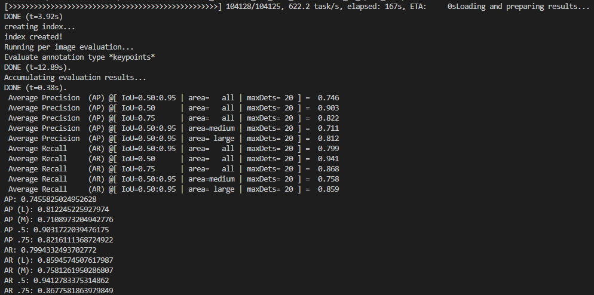
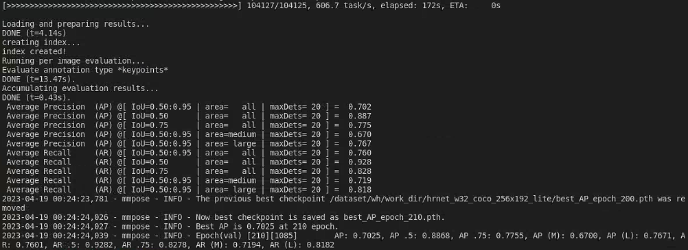

[Movenet的一个开源](https://www.zhihu.com/question/477523716/answer/2730886045) [github](https://github.com/jinfagang/movenet)      [官方开源](https://www.tensorflow.org/hub/tutorials/movenet)


# coco

[coco test-dev 测试集如何测试关键点检测结果（官网在线测试）](https://blog.csdn.net/sazass/article/details/120556924)

[使用COCO API评估模型在COCO数据集上的结果](https://blog.csdn.net/weixin_28951585/article/details/112442326)


无人机视角下数据集

比如目标检测的[VisDrone2021数据集](http://aiskyeye.com/download/object-detection-2/)


# yolo-pose(未训练完)

https://github.com/TexasInstruments/edgeai-yolov5/tree/yolo-pose

环境：

open-mmlab

```
# bs从64改为了16
python train.py --data coco_kpts.yaml --cfg yolov5s6_kpts.yaml --weights Yolov5s6_person_640.pt --batch-size 16 --img 960 --kpt-label --devices 3
```

--resume的话会加载之前使用的gpu，比如之前只用一个gpu跑的，resume后还是一个gpu，改不了；所以还是用--weight比较方便

上轮是俩gpu

这次四个，看看时间

训练了80/300 epoch

```cpp
python train.py --data coco_kpts.yaml --cfg yolov5s6_kpts.yaml --weights /dataset/wh/wh_code/edgeai-yolov5-yolo-pose/runs/train/exp12/weights/last.pt --batch-size 48 --img 960 --kpt-label --devices 0,1,2,3
```


# posefix

[一个pytorch版的](https://github.com/heimish-kyma/Pytorch-PoseFix)

[mks0601/PoseFix_RELEASE](https://github.com/mks0601/PoseFix_RELEASE)

**四张卡，一个epoch一小时**十分钟。模型是resnet152

现在改为了resnet50

环境：wh_tensorflow

/dataset/wh/wh_code/PoseFix_RELEASE-master

```
${POSE_ROOT}
|-- data 数据加载代码
|-- lib 包含2d多人姿态估计系统的核心代码 
|-- main 训练和测试代码
|-- tool 数据集转换器代码，没用
`-- output
```

训练：

需要提前准备`input_pose/test_on_trainset/result.json`，这是使用了gt box的训练集上的测试结果，在训练阶段被用于合成未标注关键点的输入姿态

```
python train.py --gpu 01
// 继续训练，用0-3四个gpu
python train.py --gpu 0-3 --continue
```

测试：

> 将Numpy从1.17.1升级到了最新，解决了测试时numpy.ndarray has the wrong size的报错

对于任何模型的结果`input_pose/name_of_input_pose.json`，注意修改datase.py文件中input_pose_path路径

将训练好的模型放在`output/model_dump/`

```
python test.py --gpu 0-1 --test_epoch 140
```


结果展示：

使用resnet152上训练好的模型，现在移动到了output/model_dump/res152dejieguo文件夹里

hrt_base_coco_256

原来：


现在，涨了0.16


使用resnet50上自己训练的模型，放在output/model_dump/文件夹中

两个gpu训练，一个epoch 16min，共140epoch

涨了0.11


coco数据集：17个人体关键点

CrowdPose多人数据集下，存在相互遮挡的场景；14个人体关键点

ochuman，多为单人情况下严重遮挡的人体


可行性分析

精细化的监督 or 换一种监督方式

posefix这种模块化网络，针对特定问题进行设计

movenet的轻量化方向

灰度图是否能跑？避免背景颜色干扰后效果是否会更好？应用场景：（红外摄像头指的是搭配了对应的红外补光灯。红外摄像头目前是应用较多的，但摄像头启用红外灯后监控的画面是黑白，如果需要呈现彩色画面，则需要使用白光/暖光灯补光。通常情况，红外摄像头白天为彩色画面，夜晚红外灯自动启动，画面为黑白图像。）黑白摄像机价格低、照度低、解像度高。在同样分辨率下，黑白相机的精度高于彩色相机？


# mmpose

[mmpose结构剖析](https://blog.csdn.net/weixin_61674495/article/details/126612550)

demo:

mul_top_down_img_demo_with_mmdet改为可以测试多张图片

[mmdet多图片测试的一种修改方法](https://blog.csdn.net/weixin_41922853/article/details/118807709)


# mmpose1.0

环境：openmmlab2

源码位置：/dataset/wh/mmpose


# HRNet-mmpose

位置：mmpose

[HRNet](https://github.com/leoxiaobin/deep-high-resolution-net.pytorch)的一些预训练模型：存放在根目录/dataset/wh/pretrained/下


conda activate ViTPose

CUDA_VISIBLE_DEVICES=0,1 ./tools/dist_train.sh ./configs/body/2d_kpt_sview_rgb_img/topdown_heatmap/coco/hrnet_w32_coco_256x192.py 2 --resume-from /home/celia/mmcv/mmpose/work_dirs/hrnet_w48_coco_256x192/latest.pth


w32:

训练：

CUDA_VISIBLE_DEVICES=0,1 ./tools/dist_train.sh ./configs/body/2d_kpt_sview_rgb_img/topdown_heatmap/coco/hrnet_w32_coco_256x192.py 2 --work-dir /dataset/wh/work_dir/hrnet_w32_coco_256x192

测试：

./tools/dist_test.sh configs/body/2d_kpt_sview_rgb_img/topdown_heatmap/coco/hrnet_w32_coco_256x192.py \ /dataset/wh/work_dir/hrnet_w32_coco_256x192/best_AP_epoch_190.pth 4 \ --eval mAP


w48:


```shell
python tools/train.py \
    --cfg experiments/coco/hrnet/w32_256x192_adam_lr1e-3.yaml \
```

# HRNet-pytorch

位置：dataset/wh/wh_code/HRNet-Human......

环境：ViTPose

```shell
python tools/train.py     --cfg experiments/coco/hrnet/w32_256x192_adam_lr1e-3.yaml
```

在yaml文件中加载checkpoint.pth继续训练时，由于0 1gpu被占用了，因此用了2和3，报错：

RuntimeError: module must have its parameters and buffers on device cuda:2

因此进行了更改，将2号卡作为主卡：

在train.py中增加了
`os.environ["CUDA_VISIBLE_DEVICES"] = "2,3"`改变了gpu的标识，将2、3号gpu视为0、1号 
对应yaml文件中的`GPUS: (0,1)`


# HRNet-lite-pytorch

添加了pose_hrnet_lite.py作为新的backbone

w32_256 192.yaml


# HRNet-lite-mmpose

程序位置：mmpose

> reference:[mmpose](https://mmpose.readthedocs.io/zh_CN/0.x/tutorials/4_new_modules.html#) [知乎](https://zhuanlan.zhihu.com/p/569702948)
>
> [hrnet 基于mmpose 训练body+foot 23点关键点](https://blog.csdn.net/qq_38284951/article/details/126345462)
>
> [mmpose1.0](https://mmpose.readthedocs.io/zh_CN/latest/overview.html)
>
> 再看看[Lite-HRNet](https://github.com/HRNet/Lite-HRNet)

```
CUDA_VISIBLE_DEVICES=3 ./tools/dist_train.sh ./configs/body/2d_kpt_sview_rgb_img/topdown_heatmap/coco/hrnet_w32_coco_256x192_lite.py 1 --work-dir /dataset/wh/work_dir/hrnet_w32_coco_256x192_lite --resume-from /dataset/wh/work_dir/hrnet_w32_coco_256x192_lite/latest.pth

# 文件和文件夹的内容需要改，格式是对的
bash ./tools/dist_test.sh configs/body/2d_kpt_sview_rgb_img/topdown_heatmap/coco/hrnet_w32_coco_256x192.py /dataset/wh/work_dir/hrnet_w32_coco_256x192/best_AP_epoch_190.pth 3
```

在w32基础上删掉了最后一层

/configs/body/2d_kpt_sview_rgb_img/topdown_heatmap/coco/hrnet_w32_coco_256x192_lite.py

mmpose/models/backbones/hrnetlite.py，对应HRNetLite

models/heads/topdown_heatmap_lite_head.py，对应头TopdownHeatmapLiteHead







# HRNet+GAU

configs/body_2d_keypoint/rtmpose/coco/xxxx_lite.py
对应head在heatmap_gau_head.py

heads/coord_cls_heads/rtmcc_head.py
中用到了RTMCCBlock来实现GAU


models/utils/rtmcc_block
RTMCCBlock

对于[cspnext](https://github.com/open-mmlab/mmdetection/blob/main/mmdet/models/backbones/cspnext.py)，在mmdet中输入是640×640×3，输出20×20×1024，输出通道数是1024。

RTMPose中，输入(192, 256, 3)，在cspnext中长宽缩小五次2，变为(6, 8, 1024)

head的输入就是(6, 8, 1024)。在head中输入inputsize= 192,256是为了计算出W和H。在head中通过final_layer将通道数变为17


RTMPose中GAU模块跟在这个骨干网络后面，因此head的输入通道是1024，，对应

# 1、UDP-Pose


```python
trans = get_warp_matrix(r, c * 2.0, image_size - 1.0, s * 200.0)

def get_warp_matrix(theta, size_input, size_dst, size_target):
    """Calculate the transformation matrix under the constraint of unbiased.
    Paper ref: Huang et al. The Devil is in the Details: Delving into Unbiased
    Data Processing for Human Pose Estimation (CVPR 2020).

    Args:
        theta (float): Rotation angle in degrees.
        size_input (np.ndarray): Size of input image [w, h].
        size_dst (np.ndarray): Size of output image [w, h].
        size_target (np.ndarray): Size of ROI in input plane [w, h].

    Returns:
        np.ndarray: A matrix for transformation.
    """
    theta = np.deg2rad(theta)
    matrix = np.zeros((2, 3), dtype=np.float32)
    scale_x = size_dst[0] / size_target[0]
    scale_y = size_dst[1] / size_target[1]
    matrix[0, 0] = math.cos(theta) * scale_x
    matrix[0, 1] = -math.sin(theta) * scale_x
    matrix[0, 2] = scale_x * (-0.5 * size_input[0] * math.cos(theta) +
                              0.5 * size_input[1] * math.sin(theta) +
                              0.5 * size_target[0])
    matrix[1, 0] = math.sin(theta) * scale_y
    matrix[1, 1] = math.cos(theta) * scale_y
    matrix[1, 2] = scale_y * (-0.5 * size_input[0] * math.sin(theta) -
                              0.5 * size_input[1] * math.cos(theta) +
                              0.5 * size_target[1])
    return matrix
```


https://github.com/HuangJunJie2017/UDP-Pose

```python
conda activate ViTPose

./tools/dist_train.sh ./configs/body/2d_kpt_sview_rgb_img/topdown_heatmap/coco/hrnet_w32_coco_256x192_udp.py 1

# 中断后继续训练
./tools/dist_train.sh ./configs/body/2d_kpt_sview_rgb_img/topdown_heatmap/coco/hrnet_w32_coco_256x192_udp.py 3 --resume-from /home/celia/mmcv/mmpose/work_dirs/hrnet_w32_coco_256x192_udp/latest.pth

./tools/dist_test.sh configs/body/2d_kpt_sview_rgb_img/topdown_heatmap/coco/hrnet_w32_coco_256x192_udp.py \ /home/celia/mmcv/mmpose/work_dirs/hrnet_w32_coco_256x192_udp/best_AP_epoch_230.pth 3 \ --eval mAP
```


## 可以测试一下，coco数据集训练下的crowdpose情况
* 有udp:

  hrnet_w32_coco_256x192_udp.pth

  ```python
  
  ```

  pip install mmcv-full==1.3.9 -f https://download.openmmlab.com/mmcv/dist/cu10.1/torch1.11.0/index.html

  ./tools/dist_test.sh configs/body/2d_kpt_sview_rgb_img/topdown_heatmap/crowdpose/hrnet_w32_crowdpose_256x192_udp.py checkpoints/hrnet_w32_coco_256x192_udp.pth \ --eval mAP

  图片演示

  ```python
  python demo/top_down_img_demo_with_mmdet.py \
      demo/mmdetection_cfg/faster_rcnn_r50_fpn_coco.py \
      checkpoints/faster_rcnn_r50_fpn_1x_coco_20200130-047c8118.pth \
      configs/body/2d_kpt_sview_rgb_img/topdown_heatmap/coco/hrnet_w32_coco_256x192_udp.py \
      checkpoints/hrnet_w32_coco_256x192_udp.pth \
      --img-root tests/data/wh/ \
      --img gallery-8.jpg \
      --out-img-root vis_results/hrnet_w32_coco_256x192_udp
      
  
  python demo/top_down_img_demo_with_mmdet.py \
      demo/mmdetection_cfg/faster_rcnn_r50_fpn_coco.py \
      checkpoints/faster_rcnn_r50_fpn_1x_coco_20200130-047c8118.pth \
      configs/body/2d_kpt_sview_rgb_img/topdown_heatmap/coco/hrnet_w48_coco_256x192.py \
      work_dirs/hrnet_w48_coco_256x192/best_AP_epoch_210.pth \
      --img-root tests/data/wh_new/ \
      --img 1.jpg \
      --out-img-root vis2
      
          --img gallery-8.jpg \
  python demo/top_down_img_demo.py \
      demo/mmdetection_cfg/faster_rcnn_r50_fpn_coco.py \
      checkpoints/faster_rcnn_r50_fpn_1x_coco_20200130-047c8118.pth \
      configs/body/2d_kpt_sview_rgb_img/topdown_heatmap/coco/hrnet_w48_coco_256x192.py \
      work_dirs/hrnet_w48_coco_256x192/best_AP_epoch_210.pth \
      --img-root tests/data/wh_new/ \
      --out-img-root vis2
  ```

  视频演示

  ```
  python demo/top_down_video_demo_with_mmdet.py \
      demo/mmdetection_cfg/faster_rcnn_r50_fpn_coco.py \
      checkpoints/faster_rcnn_r50_fpn_1x_coco_20200130-047c8118.pth \
      configs/body/2d_kpt_sview_rgb_img/topdown_heatmap/coco/hrnet_w32_coco_256x192_udp.py \
      checkpoints/hrnet_w32_coco_256x192_udp.pth \
      --video-path demo/resources/test2.mp4 \
      --out-video-root vis_results
  ```

  

  

* 无udp:
  hrnet_w32_coco_256x192.pth

  ./tools/test.sh configs/body/2d_kpt_sview_rgb_img/topdown_heatmap/crowdpose/hrnet_w32_crowdpose_256x192.py checkpoints/hrnet_w32_coco_256x192.pth --eval mAPs

  图片演示：

  ```python
  python demo/top_down_img_demo_with_mmdet.py \
      demo/mmdetection_cfg/faster_rcnn_r50_fpn_coco.py \
      checkpoints/faster_rcnn_r50_fpn_1x_coco_20200130-047c8118.pth \
      configs/body/2d_kpt_sview_rgb_img/topdown_heatmap/coco/hrnet_w32_coco_256x192.py \
      checkpoints/hrnet_w32_coco_256x192.pth \
      --img-root tests/data/wh/ \
      --img 100033.jpg \
      --out-img-root vis_results/hrnet_w32_coco_256x192
  ```

  

  


## crowdpose训练文件：

1.hrnet_w32


./tools/test.sh configs/body/2d_kpt_sview_rgb_img/topdown_heatmap/crowdpose/hrnet_w32_crowdpose_256x192.py checkpoints/hrnet_w32_crowdpose_256x192.pth --eval mAPs

图片演示：

```python
python demo/top_down_img_demo_with_mmdet.py \
    demo/mmdetection_cfg/faster_rcnn_r50_fpn_coco.py \
    checkpoints/faster_rcnn_r50_fpn_1x_coco_20200130-047c8118.pth \
    configs/body/2d_kpt_sview_rgb_img/topdown_heatmap/crowdpose/hrnet_w32_crowdpose_256x192.py \
    checkpoints/hrnet_w32_crowdpose_256x192.pth \
    --img-root tests/data/whcrowdpose/ \
    --img 102037.jpg \
    --out-img-root vis_results/hrnet_w32_crowdpose_256x192
```

# 8.HRFormer

最新结果

hrt-base-256 epoch_210.pth 0.757


small


环境：HRFormer

train:

bash run_dist.sh top_down/hrt/coco/hrt_base_coco_384x288

test:

./tools/dist_test.sh configs/top_down/hrt/coco/hrt_base_coco_256x192.py /dataset/wh/wh_code/HRFormer-main/mmpose-logs/hrt_base_coco_256x192/epoch_210.pth 4


```
demo
python demo/top_down_img_demo_with_mmdet.py \
    demo/mmdetection_cfg/faster_rcnn_r50_fpn_coco.py \
    checkpoints/faster_rcnn_r50_fpn_1x_coco_20200130-047c8118.pth \
    configs/top_down/hrt/coco/hrt_small_coco_256x192.py \
    checkpoints/hrt_small_coco_256x192.pth \
    --img-root wh_new/ \
    --img 1.jpg \
    --out-img-root vis2
```


COCO_2017年将训练集/验证集分配从8.3万/4.1万更改为11.8万/0.5万张，新的拆分使用相同的图像和标注(annotation)，测试集是 COCO_2015测试集的子集包含4.1万张。此外， COCO_2017版本包含一个新的未标注的12.3万张数据集。

MSCOCO 105698  共有250,000个标注关节点的人体，训练集、验证集和测试集分别包括57,000（150K/149813人实例），5,000和20,000张图像。

MPII 26429/14993 danren/多人。包含YouTube 491种活动的3913个视频。从视频中选出包含不同人或同一个人的不同姿势的24920帧。每个人注释了16个关节点，每个关节都注释了可见性和左/右标签。MPII数据集包含约25k图像和40k注释样本(28k用于训练，11k用于测试)。根据[43,28,38]，取3k个样本作为验证集来优化超参数并进行消融研究。The CrowdPose [12] dataset consists
of 20,000 images for 80,000 labelled persons. The training,
validation and test set are partitioned in proportional to 5:1:4. 

 

w48_4x_reg03_bs5_640_adam_lr1e-3_coco_x140.yaml


| 程序名        | 环境            | base         | num_images/samples                                           |                                                          | 分辨率  | 训练时间(2 gpus) h/num        | 目前结果         | 官方模型结果 | 论文结果（val                    | test | 实测/论文(time/ms) | 补充                                         |
| ------------- | --------------- | ------------ | ------------------------------------------------------------ | -------------------------------------------------------- | ------- | ----------------------------- | ---------------- | ------------ | -------------------------------- | ---- | ------------------ | -------------------------------------------- |
| HRNet         | ViTPose         | hrnet_w48    |                                                              |                                                          | 256x192 | 2gpus:43min；4gpus:32min      | 0.754            |              | 0.756                            |      |                    |                                              |
|               |                 | hrnet_w32    |                                                              |                                                          | 256x192 |                               | 0.746            |              | 0.744                            |      |                    |                                              |
| posefix       |                 |              |                                                              |                                                          |         | 官方四个1080Ti跑了两天        |                  |              |                                  |      |                    |                                              |
| **DEKR**      | ViTPose         | hrnet_w48    |                                                              |                                                          | 640x640 | 3gpus:3.25h                   |                  |              | 0.710/0.723 w/o multi-scale test |      |                    |                                              |
| udp           | ViTPose         | hrnet_w32    | 118287/149813                                                | Total boxes: 104125;num_images: 5000;load 104125 samples | 256x192 | 3gpus 16min                   | 0.758            | 0.76         | 0.768                            |      |                    | UDP采用Person detector has person AP of 65.1 |
| RLE(未)       | base            | res50        |                                                              |                                                          | 256x192 | 4GPUS 13min                   | 0.695            |              | 0.705(最高71.3                   |      |                    |                                              |
| ViTPose       | ViTPose         | ViTPose_base |                                                              |                                                          | 256x192 | 3gpus 21min                   | 0.755            | 0.758        |                                  |      |                    |                                              |
| Poseur        | Poseur          | poseur_r50   |                                                              |                                                          | 256x192 | 3                             | 0.692            | 0.755        |                                  |      |                    |                                              |
| simcc(还没跑) | bottom-up_hrnet | /w48_        |                                                              | num_images: 5000;load 6352 samples                       | 256x192 |                               |                  |              |                                  |      |                    |                                              |
| adaptive pose | adaptive        | hrnet48      | train 64115 samples; train: [31 ] [44/16028];-master_batch_size 4 --batch_size 4 ，gpu1个 | val 5000 samples                                         | 640     | 2gpus 3.7h                    | 30/0.657(多尺度) |              | 70.5/72.6(多尺度)                |      | /57                |                                              |
| HRFormer      | HRFormer        | HRFormer-B   | 118287/149813                                                | Total boxes: 104125;num_images: 5000;load 104125 samples | 384x288 | 2gpus:3.3h                    | 3/0.65           |              | 77.2                             | 76.2 |                    |                                              |
|               |                 | HRFormer-B   |                                                              |                                                          | 256x192 | 3gpus：1h14min 2gpus：1h43min | 0.757            |              | 75.6                             | 无   |                    |                                              |
|               |                 | HRFormer-S   |                                                              |                                                          |         |                               | 0.738            |              | 74                               |      |                    |                                              |

新的small模型一个epoch要跑27min，一共4天


posefix（只有官方tensorflow代码和第三方pytorch代码）


```cpp
/********************  改动  ************************/
// 更改from torch._six import container_abcs为import collections.abc as container_abcs

File "/dataset/wh/wh_code/HRFormer-main/pose/mmpose/models/backbones/vit.py", line 7, in <module>
    from torch._six import container_abcs
ImportError: cannot import name 'container_abcs' from 'torch._six' (/home/celia/anaconda3/envs/open-mmlab/lib/python3.7/site-packages/torch/_six.py)
```


大概率是环境问题

注意，torch版本、CUDA版本和mmcv版本要一致

> 先安装匹配版本的torch
>
> ```cpp
> conda install pytorch==1.6.0 torchvision==0.7.0 cudatoolkit=10.1 -c pytorch
> ```
>
> 在这个网址安装和torch版本对应的mmcv-full：[mmcv](https://mmcv.readthedocs.io/zh_CN/latest/get_started/installation.html)
> pip install mmcv-full==1.2.2 -f https://download.openmmlab.com/mmcv/dist/cu101/torch1.6/index.html


官方训练：

Python: 3.7.12；PyTorch: 1.6.0 TorchVision: 0.7.0

八块Tesla **V100**-SXM2-**32GB**

cuda-10.1-cudnn7.6.5；CuDNN 7.6.3

OpenCV: 4.5.3；MMCV: 1.3.13

一个epoch 15min


跑demo可能出现的一个问题：


不影响训练的一个问题：


# ——————————

# 2、RLE

Human Pose Regression with Residual Log-likelihood Estimation

* 对应程序位置：cd wh/res-loglikelihood-regression-master

* 环境：base

* github地址：https://github.com/Jeff-sjtu/res-loglikelihood-regression

* coco数据集下训练：CUDA_VISIBLE_DEVICES=0,1,2,3 ./scripts/train.sh ./configs/256x192_res50_regress-flow.yaml train_rle_coco

* 评估：./scripts/validate.sh ./configs/256x192_res50_regress-flow.yaml ./coco-laplace-rle.pth
  coco-laplace-rle.pth为作者提供的预训练模型，评估自己模型的话这里需要更改.pth文件
  ./scripts/validate.sh ./configs/256x192_res50_regress-flow.yaml ./exp/train_rle_coco-256x192_res50_regress-flow.yaml/model_267.pth
  
  **gt box: 0.7091090918415992 mAP | det box: 0.6951887347307529 mAP**
  
  model_269.pth：##### gt box: 0.7098270493077357 mAP | det box: 0.694616022900046 mAP #####
  
  final.pth不知道是出了什么问题，都没有结果了

训练得到的log和模型文件放在exp/train_rle_coco-256x192_res50_regress-flow.yaml文件夹中

因为将数据集放在了根目录，因此修改了configs/256x192_res50_regress-flow.yaml中数据集的位置，改为ROOT: '/dataset/coco/'

但发现在metrics.py，第88行中，另外对coco数据集的位置进行了设置，烦呐，需要另外改

并且在rlepose/datasets/coco_det.py文件第58行中，img_path = './data/coco/val2017/%012d.jpg' % img_id也需要进行修改，气死了

报错：
1.cv2.error: Caught error in DataLoader worker process 0.
解决方法：train.py中，num_workers=opt.nThreads，从opt.py中发现opt.nThreads默认值是60，然后发现train.sh中将其设置为了16，将其改为0

2

然后发现没有提供demo的文件，没法测试图片


# 3.ViTPose

环境：ViTPose

https://github.com/ViTAE-Transformer/ViTPose

```
bash tools/dist_train.sh ./configs/body/2d_kpt_sview_rgb_img/topdown_heatmap/coco/ViTPose_base_coco_256x192.py 3 --cfg-options model.pretrained=/dataset/wh/model_data/mae_pretrain_vit_base.pth --seed 0
```

```bash
# 中断后继续训练
bash tools/dist_train.sh ./configs/body/2d_kpt_sview_rgb_img/topdown_heatmap/coco/ViTPose_base_coco_256x192.py 3 --resume-from /home/celia/wh/ViTPose-main/work_dirs/ViTPose_base_coco_256x192/latest.pth --seed 0
```


# 4.Poseur

Poseur: Direct Human Pose Regression with Transformers

https://github.com/aim-uofa/Poseur

cd wh/Poseur-main

环境：conda activate Poseur

报了个错，`AttributeError: 'Tensor' object has no attribute 'clip'`，解决方法可以是将torch升级到1.7，但在这里我将`"/home/celia/wh/Poseur-main/mmpose/models/utils/transformer.py"`中的所有clip改成了clamp就行了

将samples_per_gpu从32改为24

./tools/dist_train.sh \
configs/body/2d_kpt_sview_rgb_img/poseur/coco/poseur_r50_coco_256x192.py 3 \
--work-dir /dataset/wh/work_dir/Poseur-main/work_dirs/poseur_r50_coco_256x192

```
./tools/dist_test.sh configs/body/2d_kpt_sview_rgb_img/poseur/coco/poseur_r50_coco_256x192.py \
   /dataset/wh/work_dir/Poseur-main/work_dirs/poseur_r50_coco_256x192/best_AP_epoch_325.pth 3 \
    --eval mAP \
    --cfg-options model.filp_fuse_type=\'type2\'
```


# 5.SimCC(在跑)

Is 2D Heatmap Even Necessary for Human Pose Estimation?

cd SimCC-main

环境：conda activate bottom-up_hrnet

将lib/config/default.py的_C.WORKERS = 0  # 从4改为0

https://github.com/leeyegy/SimCC#is-2d-heatmap-even-necessary-for-human-pose-estimation

SimDR*

```python
CUDA_VISIBLE_DEVICES=3 python tools/train.py \
    --cfg experiments/coco/hrnet/sa_simdr/w48_256x192_adam_lr1e-3_split2_sigma4.yaml\
```

hrnet/sa_simdr/w48


将torch.true_divide更改为了torch.div函数

w48，三个gpu，大约28min一个epoch


w32


hrnet_lite+simcc，对应w32_256×192_lite

5.15 20:29开始训练

13min一个epoch


现在_lite是只换了激活函数了的，但没跑完


superlite是加了[GAU](https://github.com/HJHGJGHHG/GAU-PyTorch) [GAU介绍](https://kexue.fm/archives/8934)和不加激活函数的，还是15min一个epoch，训练完要两天，周一晚上九点半差不多跑完.结果存到了w32_256×192_superlite/softmax文件夹下

0.74

现在在跑的superlite是在502行改为了softmax_plus后的程序

0.742


pose_hrnet_lite_gau_ca，在GAU前加入了CA


又跑到250后，涨了一点，感觉CA并没有什么效果


pose_hrnet_lite_supergau是将gau放在了网络中的三个位置处。同时去掉了效果不好的ca

200epoch 0.735

w

pose_hrnet_gau_gcn是将gcn放在了gau前

123个epoch，0.670


192个epoch，0.668


0.682


gau+gcn


GAU、SIMCC、GCN


[SemGCN](https://blog.csdn.net/qq_40520596/article/details/107372566)


调换gau和gcn的顺序？

1、GCN支路，与gau支路并在一起

2、cross attention，将GCN的结果作为 Q，GAU 的输出作为K和V？GCN的位置可以靠前一点？

GCN的优势在哪？？？


轮廓信息和其他信息混合在了一起？

测一下低分辨率下的效果

再改进的话就是在编码过程中搞一下，比如在映射时加个GAU


参数量的计算

LSK module 空间上的注意

SKNet 通道上的注意


最后加个AID，就是训练周期比较长


https://blog.csdn.net/qq_45957458/article/details/125287908

https://blog.csdn.net/qq_16763983/article/details/119887184

https://blog.csdn.net/qq_45364953/article/details/115392834

[SEGCN翻译](https://blog.csdn.net/weixin_50862344/article/details/128742595)

[GraFormer](https://github.com/Graformer/GraFormer)

# 7.AdaptivePose

https://github.com/buptxyb666/AdaptivePose

环境：adaptive

cd src
bash main_hrnet48_coco640.sh

***

**训练**

四个GPU，--master_batch_size 4 --batch_size 16 --num_workers 16 一个epoch 100分钟，全部训完需要14天

两个gpu，--master_batch_size 4 --batch_size 8 --num_workers 0 一个epoch 4小时

测试：跑了19个epoch的结果。测试时用了俩GPU

Start single-scale test:


Start single-scale test with flip 和 Start multi-scale test with flip:GPU显存都不够


 Start multi-scale test with flip——29个epoch左右


官方训练，换算了下2080ti下62min


# ——————————

# 待跑

# 9.DEKR

Bottom-Up Human Pose Estimation Via Disentangled Keypoint Regression

https://github.com/HRNet/DEKR


ViTPose

python tools/train.py --cfg experiments/coco/w32/w32_4x_reg03_bs10_512_adam_lr1e-3_coco_x140.yaml


# 6.TokenPose

https://github.com/leeyegy/TokenPose


# 错误记录

Fail to import ``MultiScaleDeformableAttention`` from ``mmcv.ops.multi_scale_deform_attn`

解决：将mmcv从1.4.7换为1.4.8


https://zhuanlan.zhihu.com/p/491128818
