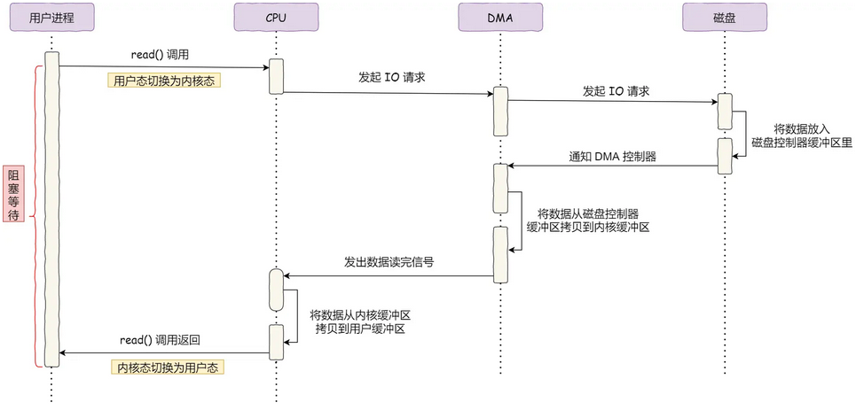
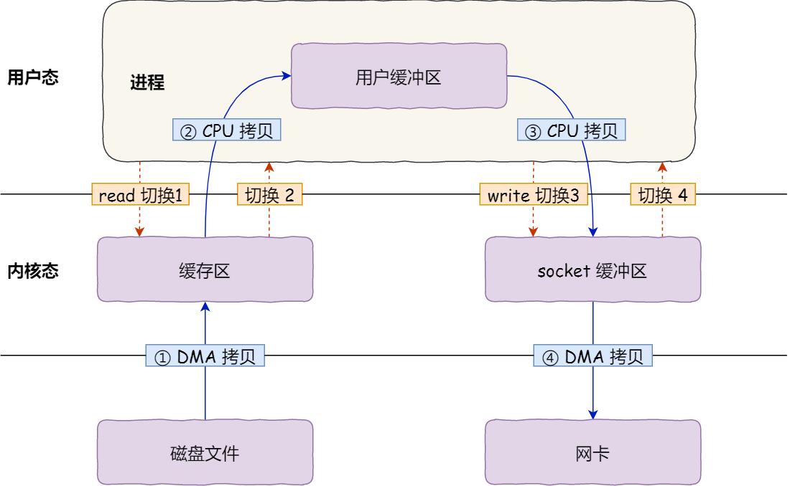
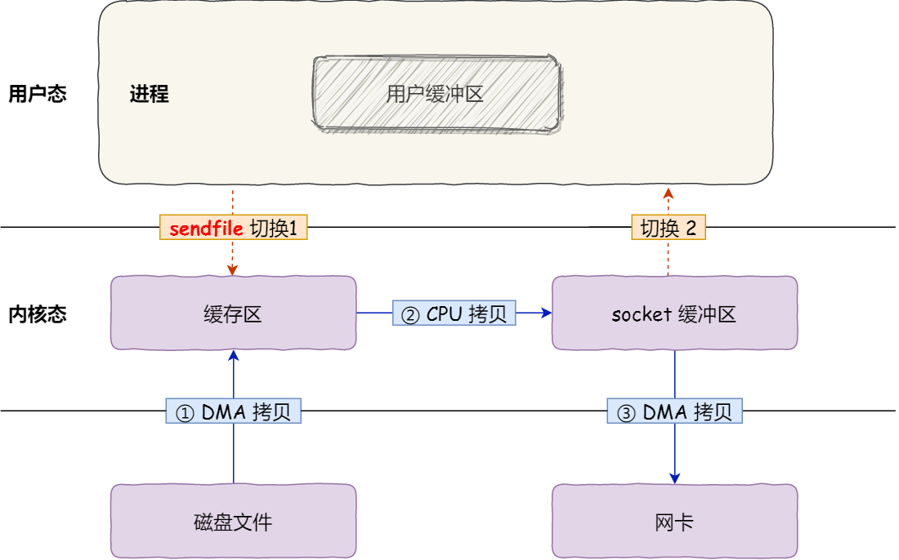
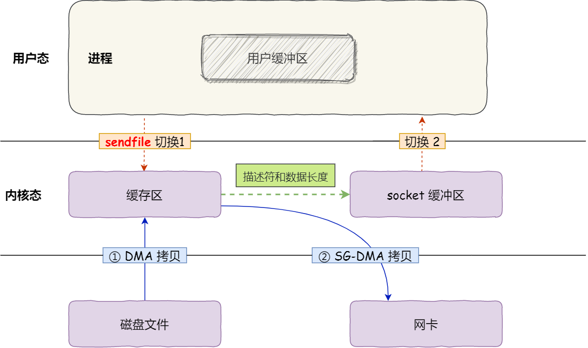

分布式存储了解吗：

> C++项目-实现分布式网络通信框架-rpc通信原理这个项目中有分布式理论基础
>
> RAFT 协议选举流程
>
> 
>
> 怎么用RAII和Exception来封装资源的，所有函数都用Exception封装了吗
>
> 浮点数存储方式
>
> 
>
> new的时候不够了咋办？（我感觉：new得到的都是虚拟内存，因此这个问题就是操作系统的垃圾回收等，操作系统方面的问题）
>
> new的内部实现，可重载吗
>
> 
>
> shared from this了解吗
>
> 
>
> \n和\r区别：**\n :** 换行符（newline），另起一行，对应ASCII值10（缩写：LF）。**\r :** 回车符（return），回到一行的开头，对应ASCII值13（缩写：CR）。Windows系统里面，每行结尾是 回车+换行(CR+LF)，即“\r\n”；Unix系统里，每行结尾只有 换行CR，即“\n”；
>
> 
>
> move、forward，Func(move(A))什么效果
>
> lambda表达式
>
> lambda表达式的类型，内含this指针吗
>
> this指针介绍

## 项目

#### **HTTP报文解析相关**

* https协议为什么安全？
* https的ssl连接过程

#### **综合能力**

* 你的项目解决了哪些其他同类项目没有解决的问题？
* 说一下前端发送请求后，服务器处理的过程，中间涉及哪些协议？

## 操作系统

### 死锁

​	死锁是多线程或多进程并发程序中的一种常见问题，指的是两个或多个进程（或线程）因**相互等待对方持有的资源释放**比如互斥锁而陷入无限等待的状态，导致程序无法继续执行。死锁通常发生在多个实体试图获取多个资源时，而每个实体都在等待其他实体释放资源。

### [死锁条件](https://xiaolincoding.com/os/4_process/deadlock.html)

* **互斥条件**；即多个线程不能同时访问同一个资源
* **持有并等待条件**；即一个线程已经持有了资源1，又需要获取资源2，但资源2被另一个线程持有，则线程就进入到了持有资源1且处于等待的状态
* **不可剥夺条件**；线程持有资源后，在自己使用完之前不能被其他线程获取
* **环路等待条件**：两个线程获取资源的顺序构成了环形链，即A持有1等待2，B持有2等待1

因此想要避免死锁，只需要破坏其中一个条件，比如使用**资源有序分配法**，即线程以相同的顺序申请想要的资源

### 静态局部变量不会发生资源竞争

​	这是联系到单例模式的懒汉模式，多线程读取单例时，如果单例不存在就创建，此时会有线程安全的问题，即多个线程访问获取实例函数时，会创建多个实例，因此对于创建实例的这部分代码，需要通过互斥锁来保证只有一个线程创建了一个实例。

​	而采用静态局部变量的话，每个线程读取到的变量都只会有这一个，且c++11标准保证了静态局部变量在创建时不存在线程安全问题：如果指令逻辑进入一个未被初始化的声明变量，所有并发执行应当等待该变量完成初始化。

### 中断

​	中断是一种**用于处理紧急事件或高优先级任务的机制**。当系统遇到一个特定事件（如硬件故障、定时器溢出、外设数据到达等）时，会触发中断信号，操作系统会停止当前执行流程，转而执行与中断相关的处理程序（中断服务例程，ISR）。处理完成后，会返回原来的执行流程。中断机制可以使系统在等待外部事件发生时继续执行其他任务，提高了系统的响应性。

​	中断请求的处理程序应该要短且快，这样才能减少对正常进程运行调度地影响，而且中断处理程序可能会暂时关闭中断，这时如果中断处理程序执行时间过长，可能在还未执行完中断处理程序前，会丢失当前其他设备的中断请求。

​	Linux 系统**为了解决中断处理程序执行过长和中断丢失的问题，将中断过程分成了两个阶段，分别是「上半部和下半部分」**。

* **上半部也就是硬中断，用来快速处理中断**，一般会暂时关闭中断请求，主要负责处理跟硬件紧密相关或者时间敏感的事情。
* **下半部是由内核触发，也就说软中断，用来延迟处理上半部未完成的工作**，一般以「内核线程」的方式运行。通常都是耗时比较长的事情，特点是延迟执行；
* 还有一个区别，硬中断是会打断 CPU 正在执行的任务，然后立即执行中断处理程序，而软中断是以内核线程的方式执行，并且每一个 CPU 都对应一个软中断内核线程，名字通常为「ksoftirqd/CPU 编号」，比如 0 号 CPU 对应的软中断内核线程的名字是 `ksoftirqd/0`

linux中三种实现下半部的方法：**软中断**softirq、**tasklet**(TASKLET_SOFTIRQ)和**工作队列**。

**tasklet：**

* 特点1. 与一般的软中断不同，同一段tasklet代码（也就是对应某一个`tasklet_struct`对象的func函数）在某个时刻只能在一个CPU上运行，而不像一般的软中断服务函数（即`softirq_action`结构中的`action`函数指针）那样——在同一时刻可以被多个CPU并发地执行。
* 特点2. 不同的tasklet代码在同一时刻可以在多个CPU上并发地执行。


### 硬件相关

存储器的层次结构：寄存器（通用寄存器、程序计数器等）、Cache、内存、硬盘。

​	其中CPU Cache用的就是SRAM（静态随机存储器）的芯片。特点是只要有电，数据就可以保持存在，而一旦断电，数据就会丢失了。其中 L1 高速缓存通常分成**指令缓存**和**数据缓存**。L1 L2都是每个CPU核心独有的，而L3是多个CPU核心共有的。

​	内存使用的是 DRAM（动态随机存取存储器）的芯片，数据被存储在电容里，需要定时刷新，数据才能被存储起来

### 指令周期

1. CPU 通过程序计数器读取对应内存地址的指令，这个部分称为 **Fetch（取得指令）**；
2. CPU 对指令进行解码，这个部分称为 **Decode（指令译码）**；
3. CPU 执行指令，这个部分称为 **Execution（执行指令）**；
4. CPU 将计算结果存回寄存器或者将寄存器的值存入内存，这个部分称为 **Store（数据回写）**；

上面这 4 个阶段，我们称为**指令周期（Instrution Cycle）**，CPU 的工作就是一个周期接着一个周期，周而复始。

### 时钟频率

​	CPU 的硬件参数都会有 `GHz` 这个参数，比如一个 1 GHz 的 CPU，指的是**时钟频率**是 1 G，代表着 1 秒会产生 1G 次数的脉冲信号，每一次脉冲信号高低电平的转换就是一个周期，称为时钟周期。

时钟周期 = 1 / 时钟频率

CPU 执行时间 = **CPU 时钟周期数 × 时钟周期时间**

> 常用单位换算
>
> 1GHz = 1000MHz = 10^9Hz，1MHz = 1000kHz，1kHz = 1000Hz
> 1s = 1000ms，1ms = 1000μs，1μs = 1000ns
>
> 如时钟频率为 120 MHz = 120 x 10^6 Hz
> 所以时钟周期 T = 1 / (120x10^6) = 8.3 x 10^(-9) s = 8.3ns

### CPU Cache

​	CPU Cache 的结构：CPU Cache 由很多个 Cache Line（缓存块）组成，Cache Line 是 CPU 从内存读取数据的基本单位，而 Cache Line 是由**组索引、有效位、标记位、数据块**组成。

​	CPU 在从 CPU Cache 读取数据的时候，并不是读取 CPU Cache Line 中的整个数据块，而是读取 CPU 所需要的一个数据片段，这样的数据统称为一个**字（Word）**。那怎么在对应的 CPU Cache Line 中数据块中找到所需的字呢？答案是，需要一个**偏移量（Offset）**。

* 内存的访问地址：**标记、组索引、偏移量**

* CPU Cache：组索引 + 有效位 + 标记位 + 数据块


​	cache 结构如图，高速缓存 cache 包含 S 个高速缓存组(cache set)，每个组包含E个高速缓存行(cache line)，每个 cache line 包含 有效位、标记 和 B个数据块。组索引确定是哪个组，而标记必须与这个cache line中的标记相同


直接映射 Cache：

​	CPU 访问内存数据时，是一小块一小块数据读取的，具体这一小块数据的大小，取决于 `coherency_line_size` 的值，一般 64 字节。在内存中，这一块的数据我们称为**内存块（Block）**，读取的时候我们要拿到数据所在内存块的地址。

​	而直接映射 Cache 采用的策略，就是把内存块的地址始终「映射」在一个 CPU Cache Line（缓存块） 的地址，至于映射关系实现方式，则是使用「取模运算」，取模运算的结果就是内存块地址对应的 CPU Cache Line（缓存块） 的地址。对于映射到一个Cache Line中的内存块，通过组标记进行区分。


如果内存中的数据已经在 CPU Cache 中了，那 CPU 访问一个内存地址的时候，会经历这 4 个步骤：

1. 根据内存地址中的组索引，计算在 CPU Cache 中的索引，也就是找出对应的 CPU Cache Line 的地址；
2. 找到对应 CPU Cache Line 后，判断 CPU Cache Line 中的有效位，确认 CPU Cache Line 中数据是否是有效的，如果是无效的，CPU 就会直接访问内存，并重新加载数据，如果数据有效，则往下执行；
3. 对比内存地址中标记和 CPU Cache Line 中的标记，确认 CPU Cache Line 中的数据是我们要访问的内存数据，如果不是的话，CPU 就会直接访问内存，并重新加载数据，如果是的话，则往下执行；
4. 根据内存地址中偏移量信息，从 CPU Cache Line 的数据块中，读取对应的字。

> 为什么要分这个组，要这个组索引，为什么不能根据标记直接找到cache line，再根据offset找到值？

​	硬件必须要在几个纳秒内完成这些工作，这就要求搜索是并行进行的，如果cache中包括100 cache line，硬件就要并行搜索100个 cache line 的tag，所以进行 100 个并行搜索非常困难，而且很昂贵。
​	引入了set组的层级，先根据组索引找出一个set，再在这个组中并行搜索少量cache line就容易多了。

### 用户态和内核态的区别

​	用户态和内核态是计算机操作系统中两种不同的特权级别，用于控制程序的执行和访问硬件资源。它们之间的主要区别在于对系统资源的**访问权限**和**操作级别**。

1. **权限级别**
   - **用户态：**运行用户程序。在用户态下运行的程序只能访问有限的资源，例如它们自己的内存空间（用户态的虚拟空间地址）和一些用户级别的资源。用户态下的程序不能直接访问硬件设备、执行特权指令或者操作操作系统的核心部分。
   
   - **内核态：**运行操作系统程序，操作硬件。内核态具有更高的权限，可以访问全部的虚拟空间地址，允许程序访问所有硬件资源、执行特权指令以及调用操作系统的核心功能。内核态下的程序能够执行敏感的操作，例如管理内存、文件系统、设备驱动等。
2. **安全性和稳定性**
   - 用户态的程序受限于操作系统所提供的资源和接口，这种限制增加了系统的安全性和稳定性。即使用户态程序出现错误或崩溃，也不会影响操作系统的核心部分。
3. **系统调用**
   - 在用户态下，当一个程序需要访问内核态的资源或执行特权操作时，它必须通过系统调用（System Call）来请求操作系统执行相应的操作。系统调用是从用户态切换到内核态的一种机制，操作系统会在内核态中执行请求的操作，然后将结果返回到用户态。
4. **切换开销**
- 从用户态切换到内核态会涉及上下文切换，这需要保存当前用户态程序的状态并加载内核态的状态。这种切换开销相对较大，因为涉及到寄存器的保存和恢复、内存的切换等操作。因此，频繁的用户态到内核态的切换会导致性能下降。

### 指令集

​	Inter把 `CPU指令集` 操作的权限由高到低划为4级：ring 0、ring 1、ring 2、ring 3，其中Linux系统仅采用ring 0 和 ring 3 这2个权限。

​	其中 ring 0 权限最高，可以使用所有 CPU指令集，ring 3 权限最低，仅能使用常规 CPU指令集，不能使用操作硬件资源的 CPU指令集，比如IO读写、网卡访问、申请内存都不行。

* ring 0被叫做内核态，完全在操作系统内核中运行
* ring 3被叫做用户态，在应用程序中运行

### 内核态抢占

​	处于内核态的任务正在运行，这个时候发生中断唤醒了一个高优先级的任务，那么这个被唤醒的任务能否被调度执行呢？

* 如果是抢占式内核那么高优先级任务就有可能抢占当前任务而调度执行（之所有是有可能是因为两者虚拟运行时间差值要大于抢占粒度才允许抢占）
* 如果是不可抢占式内核那么不允许抢占，除非当前进程执行完或者主动发生调度高优先级进程该有机会被调度。
* 也就是说，支持内核抢占的内核不仅允许在用户态的任务可以被抢占，处在内核态的任务也允许被抢占（请注意这里说的是内核态，因为用户空间任务可以通过系统调用等进入内核态）
  * 这样对于交互性或者低延迟的应用场景很友好，如手持设备和桌面应用，响应会很快。
  * 而对于服务器来说，它就对吞吐量要求较高，希望获得更多的cpu时间，而交互性或者低延迟都是次要的，所以被设计成不可抢占式内核。


### 用户态的程序如何访问内核

* 系统调用：系统调用允许用户态的程序请求内核执行某些特权操作，如**读写文件、创建进程、分配内存**等。系统调用的实现通常涉及到用户态和内核态之间的切换。如open函数等。系统调用的核心是使用了操作系统为用户特别开放的一个中断实现
* 异常：当CPU在执行运行在用户态下的程序时，发生了某些事先不可知的异常，这时会触发由当前运行进程切换到处理此异常的内核相关程序中，也就转到了内核态，比如缺页异常。
* 外围设备的中断：当外围设备完成用户请求的操作后，会向CPU发出相应的中断信号，这时CPU会暂停执行下一条即将要执行的指令转而去执行与中断信号对应的处理程序，如果先前执行的指令是用户态下的程序，那么这个转换的过程自然也就发生了由用户态到内核态的切换。比如硬盘读写操作完成，系统会切换到硬盘读写的中断处理程序中执行后续操作等。

### 用户态与内核态的切换

* 保留用户态现场（上下文、寄存器、用户栈等）
* 复制用户态参数，用户栈切到内核栈，进入内核态
* 额外的检查（因为内核代码对用户不信任）
* 执行内核态代码
* 复制内核态代码执行结果，回到用户态
* 恢复用户态现场（上下文、寄存器、用户栈等）

### 不加锁实现线程安全

在C++中，可以通过避免竞争条件来实现线程安全，而不必使用显式的锁。避免竞争条件的主要思路是通过合理的设计和编程技巧，确保多个线程访问共享资源时不会产生冲突或数据不一致的情况。以下是一些常见的实现线程安全的方法：

1. 使用局部变量：将共享资源封装在函数的局部变量中，而不是全局变量或类成员变量。局部变量在每个线程的栈上有独立的副本，因此不会产生竞争条件。
2. **thread_local**：thread_local 是 C++11 标准引入的关键字，用于声明线程局部存储的变量。线程局部存储意味着每个线程都拥有自己独立的变量副本，而这些变量在不同线程之间是隔离的，互不干扰。变量在创建线程时创建，并在销毁线程时销毁。
3. 原子操作：使用原子操作来保证某些操作的原子性，如使用C++11及以上标准提供的`std::atomic`来实现原子操作。原子操作可以确保在多线程环境下对变量的修改是线程安全的，避免了竞争条件。
4. CAS（Compare-and-Swap）


### 无锁实现线程安全的数组

> 通过atomic及其提供的load及store函数

```c++
template<typename T>
class ThreadSafeArray {
public:
    ThreadSafeArray(size_t size) : data(size) {}

    T& operator[](size_t index) {
        return data[index].load();
    }

    void set(size_t index, const T& value) {
        data[index].store(value);
    }

private:
    std::vector<std::atomic<T>> data;
};
```

> CAS算法中可能出现ABA问题：
> ABA问题是指，在CAS算法中，如果一个线程读取了某个变量的值A，然后另一个线程将该变量的值修改为B，然后再将其修改回A，此时第一个线程使用CAS算法进行比较并交换时，会发现变量的值仍然是A，因此会认为变量没有被修改过，从而出现错误。
> 为了解决ABA问题，可以使用版本号或时间戳等方式来标记变量的修改次数，每次修改时都将版本号或时间戳加1，这样即使变量的值被修改为A，但版本号或时间戳已经发生了变化，第一个线程使用CAS算法进行比较并交换时就会发现变量已经被修改过，从而避免出现ABA问题。

> C++ atomic的load和store操作不会出现ABA问题。
> C++ atomic的load和store操作是原子的，即它们是不可分割的操作，不会被其他线程中断。因此，即使在多线程环境下，也不会出现ABA问题。如果需要解决ABA问题，可以使用C++ atomic的compare_exchange_strong或compare_exchange_weak操作。这两个操作可以检查值是否被修改过，从而避免ABA问题的发生。

### 无锁实现线程安全的任务队列

通过实现一个无锁队列

https://zhuanlan.zhihu.com/p/433127374

```C++
#include <atomic>
#include <memory>

template<typename T>
class ConcurrentQueue final
{
private:
    struct Node
    {
        using SPtr = std::shared_ptr<Node>;

        T _val;
        SPtr _next = nullptr;
    };
    
    mutable std::atomic_uint32_t _size;

    mutable std::atomic_bool _bstop_pop;
    typename Node::SPtr _first;
    mutable std::atomic_bool _bstop_push;
    typename Node::SPtr _last;
    
    
public:    
    bool try_push(T&& v)
    {
        if (_bstop_push)
            return false;

        typename Node::SPtr last_node = nullptr;
        typename Node::SPtr v_node = std::make_shared<Node>();
        v_node->_val = std::move(v);
        v_node->_next = nullptr;

        // 将 _last 指向自己，算是入队一半
        last_node = std::atomic_exchange(&_last, v_node);
        // 将 获取的 _last 的 _next 指向自己，入队完全
        std::atomic_store(&(last_node->_next), v_node);
        ++_size;

        return true;
    }
    bool try_pop(T& v)
    {
        if (_bstop_pop)
            return false;
        typename Node::SPtr first_node = nullptr;
        typename Node::SPtr first_node_next = nullptr;

        do
        {
            first_node = std::atomic_load(&_first);
            first_node_next = std::atomic_load(&(first_node->_next));
            if (nullptr == first_node_next)
                return false;
        // 拿到 _first 并将 _first 指向其 _next
        } while (!(std::atomic_compare_exchange_strong(&_first, &first_node, first_node_next)));

        --_size;
        v = std::move(first_node_next->_val);

        return true;
    }
};
```


### Linux启动流程

* 内核引导

  ​	当计算机打开电源后，首先是BIOS开机自检，按照BIOS中设置的启动设备（通常是硬盘）来启动。操作系统接管硬件以后，首先读入 /boot 目录下的内核文件。

* 运行init
      init 进程是系统所有进程的起点，一大任务就是去运行这些开机启动的程序。Linux允许为不同的场合，分配不同的开机启动程序，这就叫做"运行级别"（runlevel）。也就是说，启动时根据"运行级别"，确定要运行哪些程序。
  
* 系统初始化
      调用一个bash shell的脚本完成一些系统初始化的工作，如激活交换分区，检查磁盘，加载硬件模块以及其它一些需要优先执行任务。
  
* 建立终端
      经过前面的操作，基本系统环境已经设置好了，各种守护进程也已经启动了。init接下来会打开6个终端，以便用户登录系统。
  
* 用户登录系统


### 虚拟内存的作用

* 虚拟地址是**操作系统提供的一种机制，将不同进程的虚拟地址和不同内存的物理地址映射起来。**
* 为了在多进程环境下，使得**进程之间的内存地址不受影响，相互隔离**，比如使一个程序出错不会影响另一个程序，于是操作系统就为每个进程独立分配一套虚拟地址空间，每个程序只关心自己的虚拟地址，不用关心物理地址的事情。操作系统（内存管理单元 MMU ）将虚拟地址转换成不同的物理地址，这样不同的进程运行的时候，写入的是不同的物理地址，这就解决了**多进程之间地址冲突**的问题。
* 虚拟内存可以使得进程的运行内存超过物理内存大小，因为程序运行符合局部性原理，CPU 访问内存会有很明显的重复访问的倾向性，对于那些没有被经常使用到的内存，操作系统会通过**内存交换**技术，把不常使用的内存暂时存放到硬盘（换出），在需要的时候再装载回物理内存（换入）
* 页表里的页表项中除了物理地址之外，还有一些标记属性的比特，比如控制一个页的读写权限，标记该页是否存在等。在内存访问方面，操作系统提供了更好的安全性。

### 内存分段和分页

内存分段：段根据实际需求分配内存，所以有多少需求就分配多大的段，所以不会出现内部内存碎片。但可能会产生多个不连续的小段，会出现外部内存碎片

内存分页：一页的大小为 4KB。页与页之间紧密排列，没有外部碎片问题。但分配内存的最小单位是一页，因此有内部碎片问题。

### Linux虚拟内存空间

​	以 Intel Core i7 处理器为例，64 位虚拟地址的格式为：全局页目录项（9位）+ 上层页目录项（9位）+ 中间页目录项（9位）+ 页表项（9位）+ 页内偏移（12位）。共 48 位组成的虚拟内存地址。


​	task_struct 是进程在内核中的描述符，包括进程id、用于标识线程所属的进程 pid、进程打开的文件信息files_struct、描述进程虚拟地址空间的内存描述符 `mm_struct` 结构。

​	对于 `mm_struct`，**每个进程都有唯一的 mm_struct 结构体**，也就是前边提到的每个进程的虚拟地址空间都是独立，互不干扰的。调用 fork() 函数创建进程的时候，表示进程地址空间的 mm_struct 结构会直接复制过来，**子进程在新创建出来之后它的虚拟内存空间是和父进程的虚拟内存空间一模一样的，直接拷贝过来**。 

​	内核线程和用户态线程的区别就是内核线程没有相关的内存描述符 mm_struct ，内核线程对应的 task_struct 结构中的 mm 域指向 Null，所以内核线程之间调度是不涉及地址空间切换的。
​	当一个内核线程被调度时，它会发现自己的虚拟地址空间为 Null，虽然它不会访问用户态的内存，但是它会访问内核内存，聪明的内核会将调度之前的上一个用户态进程的虚拟内存空间 mm_struct 直接赋值给内核线程，因为内核线程不会访问用户空间的内存，它仅仅只会访问内核空间的内存，所以直接复用上一个用户态进程的虚拟地址空间就可以避免为内核线程分配 mm_struct 和相关页表的开销，以及避免内核线程之间调度时地址空间的切换开销。


​	进程的内存描述符 mm_struct 结构体中的 task_size 变量定义了用户态地址空间与内核态地址空间之间的`分界线`。

​	mm_struct 结构体中包括上述用于划分虚拟内存区域的变量等。而在划分出的这些虚拟内存空间中如上图所示，里边又包含了许多特定的虚拟内存区域，比如：代码段，数据段，堆，内存映射区，栈。这些虚拟内存区域在内核中通过 `vm_area_struct` 结构体表示，每个结构体对应一块区域，包含这块区域的最高和最低地址。还包括这块区域的访问权限等。vm_area_struct 结构的双向链表将虚拟内存空间中的这些虚拟内存区域 VMA 串联起来。


​	在内核中，同样的内存区域 vm_area_struct 会有两种组织形式，一种是双向链表用于高效的遍历，另一种就是红黑树用于高效的查找。每个 VMA 区域都是红黑树中的一个节点，通过 struct vm_area_struct 结构中的 vm_rb 将自己连接到红黑树中。

​	而红黑树中的根节点存储在内存描述符 struct mm_struct 中的 mm_rb 中：


内核态虚拟内存空间

​	进程的内存描述符 mm_struct 结构体中的 task_size 变量定义了用户态地址空间与内核态地址空间之间的`分界线`。

​	当进程 a，进程 b，进程 c 进入到内核态之后，由于内核虚拟内存空间是各个进程共享的，所以它们在内核空间中看到的内容全部是一样的，比如进程 a，进程 b，进程 c 在内核态都去访问虚拟地址 y。这时它们看到的内容就是一样的了。注意，进程进入内核态之后使用的仍然是虚拟内存地址，只不过在内核中使用的虚拟内存地址被限制在了内核态虚拟内存空间范围中。

​	内核虚拟内存空间在 **32 位**体系下只有 1G 大小，实在太小了，因此需要精细化的管理，于是按照功能分类划分除了很多内核虚拟内存区域，这样就显得非常复杂：


* **直接映射区**：
        这块896M大小的虚拟内存地址会映射到 0 - 896M 这块连续的物理内存上。在这段 896M 大小的物理内存中，前 1M 已经在系统启动的时候被系统占用，1M 之后的物理内存存放的是内核代码段，数据段，BSS 段（这些信息起初存放在 ELF格式的二进制文件中，在系统启动的时候被加载进内存）。
        当我们使用 fork 系统调用创建进程的时候，内核会创建一系列进程相关的描述符，比如task_struct，进程的内存空间描述符 mm_struct，以及虚拟内存区域描述符 vm_area_struct 等。这些进程相关的数据结构也会存放在物理内存前 896M 的这段区域中，当然也会被直接映射至内核态虚拟内存空间中的 3G -- 3G + 896m 这段直接映射区域中。
        直接映射区的前 16M 专门让内核用来为 DMA(直接内存存取) 分配内存，这块 16M 大小的内存区域我们称之为 ZONE_DMA。


​	对于 64 位系统，直接映射就可以

### CPU访问主存

[CPU访问主存](https://xiaolincoding.com/os/3_memory/linux_mem.html#_8-%E5%88%B0%E5%BA%95%E4%BB%80%E4%B9%88%E6%98%AF%E7%89%A9%E7%90%86%E5%86%85%E5%AD%98%E5%9C%B0%E5%9D%80)

### ==进程线程==

### 线程进程的区别

* 资源分配
  * **进程是资源分配的基本单位**，每个进程都分配有PCB进程控制块，本质上是一个task_struct结构体，保存进程的id、状态、文件描述符等，每个进程都有独立的地址空间；
  * 一个进程下的所有线程共享相同进程的内存空间条件和资源，每个**线程**都有属于自己的**栈区、寄存器**，共享代码段、全局数据区、文件描述符等。好处就是节省系统资源，**线程的创建和终止时间比进程快**
* 调度
  * **线程是任务调度执行的单位**
  * 线程是**系统调度的最小粒度**。**一个ALU同一时间只能处理一个线程**。而每个CPU核心有几个ALU计算单元，**一个CPU核心同一时间就能处理n个线程**

* 通信和同步
  * 线程之间的通信比较简单，但需要额外的同步机制（例如互斥锁、条件变量）来避免竞态
  * 进程之间的通信需要使用进程间通信机制，例如管道、消息队列、共享内存、信号等。这使得通信相对复杂，但也提供了更好的隔离性。
* 切换开销
  * **同一进程下的线程的上下文切换比进程要快**，因为同一个进程的线程具有同一个页表，因此不需要切换页表，而进程中页表的切换过程开销会比较大

* 应用场景
  * 多线程：适用于共享数据、需要低开销的并发情况，比如图形界面应用程序、服务器应用等。
  * 多进程：适用于需要隔离性、稳定性较高的并发情况，以及需要利用多核处理器的计算密集型任务。也适用于安全性要求高的应用，如浏览器中的进程隔离。
* 线程崩溃，其进程也会崩溃。因为各个线程的地址空间是共享的，某个线程对地址的非法访问就会导致内存的不确定性，进而可能会影响到其他线程，于是干脆让整个进程崩溃。其中进程崩溃是使用的信号机制，如Kill

### 进程、线程、协程

> 协程的使用：https://zhuanlan.zhihu.com/p/59178345

​	线程存在的问题：在线程等待IO的时候，会堵塞当前线程，切换到其他线程。但像是线程比较多的时候，一个是会占用内存空间，一个是**大量线程的切换会占用系统时间**。

​	协程运行在线程之上，当一个协程执行完成后，可以选择主动让出，让另一个协程运行在当前线程之上。**协程并没有增加线程数量，只是在线程的基础之上通过分时复用的方式运行多个协程**，而且协程的切换在**用户态**完成，切换的代价比线程从用户态到内核态的代价小很多。

​	协程只有在**等待IO**的过程中才能重复利用线程。对于堵塞IO，当前的协程和其它绑定在该线程之上的协程都会陷入阻塞而得不到调度，即在协程调用阻塞IO操作的时候，操作系统会让线程进入阻塞状态，这往往是不能接受的。因此**在协程中不能调用导致线程阻塞的操作**。也就是说，**协程只有和异步IO结合**起来，才能发挥最大的威力。

​	协程对计算密集型的任务也没有太大的好处，计算密集型的任务本身不需要大量的线程切换，因此协程的作用也十分有限，反而还增加了协程切换的开销。

​	协程是非抢占式多任务，控制权的转移是由协程自身控制的，一个协程在执行时不会被其他协程中断，除非自己主动交出控制权。可以称为协作式多任务处理。
​	线程是抢占式多任务。


### 线程的实现

> reference:https://xiaolincoding.com/os/4_process/process_base.html#%E7%BA%BF%E7%A8%8B%E7%9A%84%E5%AE%9E%E7%8E%B0

主要有三种线程的实现方式：

* **用户线程（User Thread）**：在用户空间实现的线程，不是由内核管理的线程，是由用户态的线程库来完成线程的管理；用户线程的整个线程管理和调度，操作系统是不直接参与的，都无需利用系统调用实现，而是由用户级线程库函数来完成线程的管理，包括线程的创建、终止、同步和调度等。
  	用户线程的优点是轻量级，创建和销毁速度快，但缺点是在某些情况下可能无法充分利用多核处理器，因为操作系统内核不知道它们的存在。

  > std::thread创建的线程是用户线程。
* **内核线程（Kernel Thread）**：在内核中实现的线程，是由内核管理的线程，运行于内核态；进行内存回收，脏页回写，处理大量的软中断等

  > pthread_create明确地创建内核线程，可以更精细地控制线程的属性、调度和行为。
  >
  > 如果需要直接创建内核线程并进行底层控制，`pthread_create` 可能是更适合的选择。如果只需要创建和管理线程而不涉及底层细节，那么 `std::thread` 更方便。
* **轻量级进程（LightWeight Process）**：是内核支持的用户线程，一个进程可有一个或多个 LWP，每个 LWP 是跟内核线程一对一映射的，也就是 LWP 都是由一个内核线程支持，而且 LWP 是由内核管理并像普通进程一样被调度。

  > clone 可以用于创建轻量级线程，也叫作进程内线程或任务。与传统的`fork`创建进程的方式不同，`clone` 允许在一个进程内创建一个或多个共享同一进程地址空间的子进程（也可以称为线程）。这些子进程之间可以轻松地共享内存，文件描述符和其他资源。但使用较为复杂


### ==线程底层==

windows中线程底层是由Win32 API提供的；Linux中是由POSIX线程库，即pthread提供的。再底层就都是操作系统提供的

像是std::thread，通常包含一个线程ID，一个线程函数指针，一个线程状态和一些其他的控制信息。


再底层就是

> **程序计数器**（PC，Program counter）
>
> ​	用于存放指令的地址。为了保证程序(在操作系统中理解为进程)能够连续地执行下去，CPU必须具有某些手段来确定下一条指令的地址。当执行一条指令时，首先需要根据PC中存放的指令地址，将指令由内存取到指令寄存器中，此过程称，为“取指令”。与此同时，PC中的地址或自动加1或由转移指针给出下一条指令的地址。此后经过分析指令，执行指令。完成第一条指令的执行，而后根据PC取出第二条指令的地址，如此循环，执行每一条指令。
>
> **指令寄存器**（IR，Instruction Register）
>
> ​	用来保存当前正在执行的一条指令。是临时放置从内存里面取得的程序指令的寄存器，用于存放当前从主存储器读出的正在执行的一条指令。当执行一条指令时，先把它从内存取到数据寄存器（DR，Data Register）中，然后再传送至IR。指令划分为操作码和地址码字段，由二进制数字组成。为了执行任何给定的指令，必须对操作码进行测试，以便识别所要求的操作。指令译码器就是做这项工作的。指令寄存器中操作码字段的输出就是指令译码器的输入。操作码一经译码后，即可向操作控制器发出具体操作的特定信号。


线程的本质就是个函数的执行流

​	函数运行时的信息保存在栈帧中，栈帧中保存了函数的返回值、调用其它函数的参数、该函数使用的局部变量以及该函数使用的寄存器信息，如图所示，假设函数A调用函数B：


​	此外，CPU执行指令的信息保存在一个叫做程序计数器的寄存器中，通过这个寄存器我们就知道接下来要执行哪一条指令。由于操作系统随时可以暂停线程的运行，因此我们保存以及恢复程序计数器中的值就能知道线程是从哪里暂停的以及该从哪里继续运行了。

​	由于线程运行的本质就是函数运行，函数运行时信息是保存在栈帧中的，因此每个线程都有自己独立的、私有的栈区。

​	同时函数运行时需要额外的寄存器来保存一些信息，像部分局部变量之类，这些寄存器也是线程私有的，**一个线程不可能访问到另一个线程的这类寄存器信息**。

​	从上面的讨论中我们知道，到目前为止，所属线程的栈区、程序计数器、栈指针以及函数运行使用的寄存器是线程私有的。

​	以上这些信息有一个统一的名字，就是**线程上下文**，thread context。


### join

**join()**

​	使用这个成员函数，主线程会等待子线程结束，在子线程结束之前，主线程不会结束
​	使用join，我们可以确保子线程能够完全的运行，如果主线程走的快，主线程就会等待子线程的完毕，最后主线程和子线程都能运行完毕

**detach()**

​	主线程不会等待子线程,即使主线程结束的时候子线程还没有结束。
​	一但使用detach，与主线程相关的thread对象就会失去与主线程的关联，此时这个子线程就会驻留在后台运行，相当于被C++运行时库接管，当这个子线程执行完毕后，由运行时库负责清理该线程相关的资源

### 进程调度算法/策略

**FCFS先来先服务**

若一个长作业先运行了，则对短作业不利，要等待很久

**SJF最短作业优先**

优先选择运行时间最短的进程来运行，对长作业不利

**HRRN高响应比优先**，权衡短作业和长作业，优先权=(等待时间+服务时间)/服务时间。
	「等待时间」相同时，「要求的服务时间」越短，「响应比」就越高，这样短作业的进程容易被选中运行；
	「要求的服务时间」相同时，「等待时间」越长，「响应比」就越高，这就兼顾到了长作业进程。

**最高优先级**

进程的优先级可以分为：静态优先级或动态优先级：

* 静态优先级：创建进程时候，就已经确定了优先级了，然后整个运行时间优先级都不会变化；
* 动态优先级：根据进程的动态变化调整优先级，比如如果进程运行时间增加，则降低其优先级，如果进程等待时间（就绪队列的等待时间）增加，则升高其优先级，也就是**随着时间的推移增加等待进程的优先级**。

两种处理优先级高的方法：非抢占式和抢占式：

* 非抢占式：当就绪队列中出现优先级高的进程，运行完当前进程，再选择优先级高的进程。
* 抢占式：当就绪队列中出现优先级高的进程，当前进程挂起，调度优先级高的进程运行。

**时间片轮转**

每个进程分配一个时间片。

* 如果时间片用完，进程还在运行，那么将会把此进程从 CPU 释放出来，切换到另一个进程；
* 如果该进程在时间片结束前阻塞或结束，则 CPU 立即进行切换；

**多级反馈队列**

综合了「时间片轮转算法」和「最高优先级算法」

* 有多个就绪队列，每个队列优先级递减，同时优先级越高时间片越短
* 如果有新的进程加入优先级更高的队列时，立刻停止当前正在运行的进程，转而去运行优先级高的队列；

新的进程会被放入到第一级队列的末尾，按先来先服务的原则排队等待被调度，如果在第一级队列规定的时间片没运行完成，则将其转入到第二级队列的末尾，以此类推，直至完成；

当较高优先级的队列为空，才调度较低优先级的队列中的进程运行。如果进程运行时，有新进程进入较高优先级的队列，则停止当前运行的进程并将其移入到原队列末尾，接着让较高优先级的进程运行；

###  FreeRTOS进程调度策略

FreeRTOS的进程调度策略是基于优先级的抢占式调度。

在FreeRTOS中，每个任务（Task）都有一个唯一的优先级，优先级用数字表示，数字越小表示优先级越高。任务的优先级决定了任务在就绪状态下能否抢占其他正在运行的任务。

FreeRTOS采用抢占式调度策略，即高优先级任务可以抢占低优先级任务的执行权。当一个任务处于就绪状态，且其优先级高于当前正在运行的任务时，FreeRTOS会立即进行任务切换，将高优先级任务运行，暂停当前任务。这样可以确保高优先级任务能够及时响应并执行，而不会被低优先级任务长期阻塞。

FreeRTOS还支持任务间的时间片轮转，当多个任务具有相同优先级时，它们可以以时间片的方式共享CPU时间。这样，相同优先级的任务能够公平地使用CPU资源。

请注意，FreeRTOS是一种实时操作系统，其调度策略主要针对任务的优先级和抢占机制，而不是像一些桌面操作系统那样使用复杂的调度算法。它的目标是提供简单高效的实时调度，以适应嵌入式系统的特点。

### Linux进程调度策略

https://xiaolincoding.com/os/1_hardware/how_cpu_deal_task.html#%E8%B0%83%E5%BA%A6%E7%B1%BB

​	Linux采用了多种进程调度策略来管理和调度进程。其中，最常见的是Fair调度类中的CFS（**完全公平调度**）调度策略，旨在提供公平和高度可预测的进程调度。

​	CFS调度策略的主要特点是，它将系统中的所有进程视为一个红黑树，并根据进程的虚拟运行时间（virtual runtime）来进行调度决策。虚拟运行时间是进程在CPU上实际运行的时间乘以一个权重因子，以此来衡量进程的运行时间。CFS的目标是让每个进程在一段时间内获得公平的CPU时间，即使系统负载不均衡也能保持这种公平性。

CFS调度策略的运行流程如下：

1. 当一个新的进程被创建或者一个进程被唤醒时，它将被插入到红黑树中。
2. 调度器选择具有最小虚拟运行时间的进程来执行，确保运行时间最少的进程先执行。
3. 当一个进程在CPU上运行时，其虚拟运行时间会逐渐增加，增加的速率取决于其权重因子和运行时间。


除了CFS调度策略外，Deadline 和 Realtime 这两个调度类，都是应用于实时任务的，这两个调度类的调度策略合起来共有这三种，它们的作用如下：

* *SCHED_DEADLINE*：是按照 deadline 进行调度的，距离当前时间点最近的 deadline 的任务会被优先调度；
* *SCHED_FIFO*：对于相同优先级的任务，按先来先服务的原则，但是优先级更高的任务，可以抢占低优先级的任务，也就是优先级高的可以「插队」；
* *SCHED_RR*：对于相同优先级的任务，轮流着运行，每个任务都有一定的时间片，当用完时间片的任务会被放到队列尾部，以保证相同优先级任务的公平性，但是高优先级的任务依然可以抢占低优先级的任务；


### 五种调度原则

* **CPU 利用率**：调度程序应确保 CPU 是始终匆忙的状态，这可提高 CPU 的利用率；
* **系统吞吐量**：吞吐量表示的是单位时间内 CPU 完成进程的数量，长作业的进程会占用较长的 CPU 资源，因此会降低吞吐量，短作业的进程会提升系统吞吐量；
* **周转时间**：周转时间是 进程运行 + 阻塞时间 + 等待时间的总和，一个进程的周转时间越小越好；
* **等待时间**：这个等待时间不是阻塞状态的时间，而是进程处于就绪队列的时间，等待的时间越长，用户越不满意；
* **响应时间**：用户提交请求到系统第一次产生响应所花费的时间，在交互式系统中，响应时间是衡量调度算法好坏的主要标准。

### 进程状态的切换

进程在就绪、堵塞、运行状态中进行切换。其他还有创建状态和结束状态


**挂起状态**

​	如果有大量处于阻塞状态的进程，进程可能会占用着物理内存空间，显然不是我们所希望的，毕竟物理内存空间是有限的，被阻塞状态的进程占用着物理内存就一种浪费物理内存的行为。

​	所以，在虚拟内存管理的操作系统中，通常会把阻塞状态的进程的物理内存空间换出到硬盘，等需要再次运行的时候，再从硬盘换入到物理内存。


​	**挂起状态用来描述进程没有占用实际的物理内存空间的情况**。这跟阻塞状态是不一样，阻塞状态是等待某个事件的返回。

另外，挂起状态可以分为两种：

- 阻塞挂起状态：进程在外存（硬盘）并等待某个事件的出现；
- 就绪挂起状态：进程在外存（硬盘），但只要进入内存，即刻立刻运行；


导致进程挂起的原因不只是因为进程所使用的内存空间不在物理内存，还包括如下情况：

- 通过 `sleep` 让进程间歇性挂起，其工作原理是设置一个定时器，到期后唤醒进程。
- 用户希望挂起一个程序的执行，比如在 Linux 中用 `Ctrl+Z` 挂起进程；

### 线程通信方式

线程间的通信主要是用于线程同步。
可以通过锁、原子变量实现线程互斥
通过条件变量、信号量实现线程通信

### 线程同步手段

如何选择用哪个

线程同步即多个线程访问共享资源时，需要协调彼此的执行顺序，避免出现数据竞争。

互斥锁：保证同一时间只有一个线程访问共享资源。一般用于对共享资源的访问时间较长的情况

读写锁

原子变量

条件变量：适用于需要等待某个条件满足后才能继续执行的情况

信号量：通过信号量来控制同时访问共享资源的线程数量。一般用于对共享资源的访问时间较短的情况

### 线程同步和进程同步

C++标准库中的条件变量（`std::condition_variable`）只能用于线程内的同步。

在Unix-like系统中，可以使用`sem_t`信号量，它是POSIX标准的一部分，可以用于线程间和进程间同步。

### 进程[通信方式](https://xiaolincoding.com/os/4_process/process_commu.html#%E7%AE%A1%E9%81%93)

​	每个进程的用户地址空间都是独立的，一般而言是不能互相访问的，但内核空间是每个进程都共享的，所以进程之间要通信必须通过内核。

* 管道：
  * 分为匿名管道和命名管道。
  * 管道传输数据是单向的，想要相互传输数据，需要创建两个管道实现通信。
  * **对于匿名管道，它的通信范围是存在父子关系的进程**，通过fork复制父进程的文件描述符进行通信；**对于命名管道，它的通信范围是任意的进程**。
  * 遵循**先进先出**原则
  * 创建管道就是创建文件描述符，管道的本质是操作方式为文件的内存缓冲区
  * 优势是管道提供了进程之间的逻辑隔离，每个进程可以独立运行，从而降低了耦合度。
  * 适用场景：
    * **数据流处理：** 当需要对数据进行串行处理，将一个进程的输出传递给另一个进程进行处理时，管道是一个有用的工具。
    * **简单通信：** 对于简单的进程间通信需求，尤其是在命令行环境下，使用管道可以非常方便。
* 消息队列：
  * 消息队列保存在内核中，消息队列缓冲区是一个具有多个消息槽的数据结构，每个消息槽可以存储一个消息。
  * 发送和接收进程之间的通信是异步的，不需要等待对方立即响应。
  * **缺点**：会存在内核区和用户区频繁的拷贝；且发送速度和接收速度不匹配时，会导致消息处理不及时；需要定义消息格式
* 共享内存shmget
  * 共享内存通过系统调用来创建，使用时需要进行关联，即将共享内存区域映射到自己的地址空间
  * 异步通信，一个进程可以随时读写共享内存，而不需要等待其他进程的明确通知。
  * 需要通过信号量实现进程安全
  * 优势
    * **高效：**数据直接存储在内存中，而不需要像管道那样进行数据复制和传递。
    * **实时性：**共享内存允许多个进程实时地访问和更新共享的数据，适用于需要快速数据传递的场景。
    * **适用于大数据量：**如果需要传递大量数据，共享内存可能比管道更高效，因为数据不需要复制，而是在进程之间共享。
* 信号
  * 对于**异常**情况下的工作模式，就需要用「信号」的方式来通知进程。
  * 异步通信
  * 有kill命令发送 SIGKILL 信号
* socket
  * 跨网络与不同主机上的进程之间通信


### ==共享内存与内存映射区==

> [mmap内存映射区实现进程通信](https://subingwen.cn/linux/mmap/)
>
> [shmget共享内存](https://subingwen.cn/linux/shm/)

#### shmget共享内存

> shared memory segment

​	共享内存的存储位置在操作系统的内核空间上。当使用共享内存机制时，操作系统会在内核空间中分配一个专门使用的共享的内存区域。该内存区域会被多个进程共享，允许它们在同一个内存中进行读写操作。

​	共享内存不同于内存映射区，它不属于任何进程，并且不受进程生命周期的影响。通过调用 Linux 提供的系统函数就可得到这块共享内存。

​	通过shmget创建共享内存，通过shmat让进程和共享内存进行**关联**，得到共享内存的起始地址之后就可以直接进行读写操作了，进程也可以和这块共享内存通过shmdt解除关联，解除关联之后就不能操作这块共享内存了。最后可以通过shmctl删除共享内存。

**写共享内存的代码示例**

```cpp
#include <stdio.h>
#include <sys/shm.h>
#include <string.h>

int main()
{
    // 1. 创建共享内存, 大小为4k
    int shmid = shmget(1000, 4096, IPC_CREAT|0664);

    // 2. 当前进程和共享内存关联
    void* ptr = shmat(shmid, NULL, 0);

    // 3. 写共享内存
    const char* p = "hello, world, 共享内存真香...";
    memcpy(ptr, p, strlen(p)+1);

    // 将共享内存从当前进程中分离，使该共享内存对当前进程不再可用
    shmdt(ptr);

    // IPC_RMID为删除共享内存
    shmctl(shmid, IPC_RMID, NULL);
    printf("共享内存已经被删除...\n");

    return 0;
}
```

#### ==shm 和 mmap 的区别==
共享内存和内存映射区都可以实现进程间通信，下面来分析一下二者的区别：

* mmap更多用于方便的访问磁盘文件，可以避免使用read/write等系统调用（避免数据从内核态copy到用户态，修改完后再copy到内核态的开销；以及进行大文件（超过物理内存大小的文件）的处理，常规的read/write需要将大文件分为一个个Buffer进行处理；
* mmap可以用于对动态链接库的存储，如多个进程依赖于同一个库，就只需要用mmap把该库直接映射到各个进程的地址空间中，这样只需要将该库在内存中存储一次；
* shared memory segment就更多的用于进程间通信了

实现进程间通信的方式

* shm: 多个进程只需要一块共享内存就够了，共享内存不属于进程，需要和进程关联才能使用
* 内存映射区：位于每个进程的虚拟地址空间中，并且需要关联同一个磁盘文件才能实现进程间数据通信。即将文件映射到进程的地址空间，进程通过访问地址空间中的内存来读写文件。这允许文件和内存之间的数据共享，但数据实际上是通过文件系统进行传递的。

同步和互斥：

* 共享内存：进程之间需要使用额外的同步机制，如信号量或互斥锁，来确保对共享内存的安全访问。
* 内存映射：通常不需要额外的同步机制，因为文件系统会处理对文件的并发访问。

效率:

* shm: 直接对内存操作，效率高
* 内存映射区：需要内存和文件之间的数据同步，效率低

生命周期

* shm：进程退出对共享内存没有影响，调用相关函数 / 命令 / 关机才能删除共享内存
* 内存映射区：进程退出，内存映射区也就没有了

数据的完整性 -> 突发状态下数据能不能被保存下来（比如：突然断电）

* 内存映射区：可以完整的保存数据，内存映射区数据会同步到磁盘文件
* shm：数据存储在物理内存中，断电之后系统关闭，内存数据也就丢失了


#### **mmap内存映射**

> memory map

​	在内存分区的 **文件映射段 / mmap区域** 创建，通过将不同进程的虚拟内存地址映射到相同的物理内存地址来实现。和管道不同的是管道对应的内存空间在内核中，而**内存映射区对应的内存空间在进程的用户区**（用于加载动态库的那个区域），也就是说进程间通信使用的内存映射区不是一块，而是在每个进程内部都有一块。需要通信的进程需要将各自的内存映射区和同一个磁盘文件进行映射，这样进程之间就可以通过磁盘文件这个唯一的桥梁完成数据的交互。

​	当进程A中的内存映射区数据被修改了，数据会被自动同步到磁盘文件，同时和磁盘文件建立映射关系的其他进程内存映射区中的数据也会和磁盘文件进行数据的实时同步，这个同步机制保障了各个进程之间的数据共享。

​	Linux提供了内存映射函数mmap将要共享的文件内容映射到进程的`虚拟内存`上，通过对这段内存的读取和修改实现对文件的读取和修改。**内存映射区分配在用户空间中。**所以进程可以以访问内存的方式对文件进行访问，不需要其他系统调用(read、write)去操作。


​	Linux内核使用**vm_area_struct结构**来表示一个独立的虚拟内存区域，由于每个不同质的虚拟内存区域功能和内部机制都不同，因此**一个进程使用多个vm_area_struct结构来分别表示不同类型的虚拟内存区域。**各个vm_area_struct结构使用链表或者树形结构链接，方便进程快速访问。
​	分配一个新的共享内存，即通过mmap函数创建一个新的vm_area_struct结构，并将其与文件的物理磁盘地址相连。这也是mmap函数的作用。


### 僵尸进程、孤儿进程、守护进程

[孤儿进程与僵尸进程](https://www.cnblogs.com/anker/p/3271773.html)

僵尸进程：一个进程使用fork创建子进程，如果子进程退出，而父进程并没有调用wait或waitpid获取子进程的状态信息，那么子进程的进程描述符仍然保存在系统中，进程号将一直被占用。这种进程称之为僵死进程。

孤儿进程：一个父进程退出，而它的一个或多个子进程还在运行，那么那些子进程将成为孤儿进程。孤儿进程将被init进程(进程号为1)所收养，并由init进程对它们完成状态收集工作。

守护进程：daemon是一类在后台运行的特殊进程，用于执行特定的系统任务。很多守护进程在系统引导的时候启动，并且一直运行直到系统关闭。另一些只在需要的时候才启动，完成任务后就自动结束。

守护进程以孤儿进程的形式运行，同样也是被init进程收养。补充：https://subingwen.cn/linux/deamon/#3-%E5%88%9B%E5%BB%BA%E5%AE%88%E6%8A%A4%E8%BF%9B%E7%A8%8B


### **PCB/task_struct**

PCB - 进程控制块，本质上是一个叫做 task_struct 的结构体。在这个结构体中记录了进程运行相关的一些信息，下面介绍一些常用的信息：

**进程描述信息：**

* 进程 id：每一个进程都一个唯一的进程 ID，类型为 pid_t, 本质是一个整形数
* 用户 id 和组 id：当前进程属于哪个用户，属于哪个用户组

**进程控制和管理信息：**

* 进程的状态：进程有不同的状态，状态是一直在变化的，有就绪、运行、挂起、堵塞、停止等状态。
* 进程优先级：进程抢占 CPU 时的优先级；

**资源分配清单：**

* **mm_struct内存描述符**：进程对应的虚拟地址空间的信息。
* **files_struct文件描述符表**：每个被分配的文件描述符都对应一个已经打开的磁盘文件
* 当前工作目录：默认情况下，启动进程的目录就是当前的工作目录

**CPU 相关信息：**

- CPU 中各个寄存器的值，当进程被切换时，CPU 的状态信息都会被保存在相应的 PCB 中，以便进程重新执行时，能从断点处继续执行。


* 阻塞信号集：记录当前进程中阻塞哪些已产生的信号，使其不能被处理
  未决信号集：记录在当前进程中产生的哪些信号还没有被处理掉。
* 会话（Session）和进程组：多个进程的集合叫进程组，多个进程组的集合叫会话。

进程在内核中的描述符task_struct结构

```cpp
struct task_struct {
        // 进程id
	    pid_t				pid;
        // 用于标识线程所属的进程 pid
	    pid_t				tgid;
        // 进程打开的文件信息
        struct files_struct		*files;
        // 内存描述符表示进程虚拟地址空间
        struct mm_struct		*mm;

        .......... 省略 .......
}
```

在进程描述符 task_struct 结构中，有一个专门描述进程虚拟地址空间的**内存描述符 mm_struct** 结构，这个结构体中包含了前边几个小节中介绍的进程虚拟内存空间的全部信息。

每个进程都有唯一的 mm_struct 结构体，也就是前边提到的每个进程的虚拟地址空间都是独立，互不干扰的。

```cpp
struct task_struct {
volatile long state;  //说明了该进程是否可以执行,还是可中断等信息
unsigned long flags;  //Flage 是进程号,在调用fork()时给出
int sigpending;    //进程上是否有待处理的信号
mm_segment_t addr_limit; //进程地址空间,区分内核进程与普通进程在内存存放的位置不同
                        //0-0xBFFFFFFF for user-thead
                        //0-0xFFFFFFFF for kernel-thread
//调度标志,表示该进程是否需要重新调度,若非0,则当从内核态返回到用户态,会发生调度
volatile long need_resched;
int lock_depth;  //锁深度
long nice;       //进程的基本时间片
//进程的调度策略,有三种,实时进程:SCHED_FIFO,SCHED_RR, 分时进程:SCHED_OTHER
unsigned long policy;
struct mm_struct *mm; //进程内存管理信息
int processor;
//若进程不在任何CPU上运行, cpus_runnable 的值是0，否则是1 这个值在运行队列被锁时更新
unsigned long cpus_runnable, cpus_allowed;
struct list_head run_list; //指向运行队列的指针
unsigned long sleep_time;  //进程的睡眠时间
//用于将系统中所有的进程连成一个双向循环链表, 其根是init_task
struct task_struct *next_task, *prev_task;
struct mm_struct *active_mm;
struct list_head local_pages;       //指向本地页面      
unsigned int allocation_order, nr_local_pages;
struct linux_binfmt *binfmt;  //进程所运行的可执行文件的格式
int exit_code, exit_signal;
int pdeath_signal;     //父进程终止时向子进程发送的信号
unsigned long personality;
//Linux可以运行由其他UNIX操作系统生成的符合iBCS2标准的程序
int did_exec:1; 
pid_t pid;    //进程标识符,用来代表一个进程
pid_t pgrp;   //进程组标识,表示进程所属的进程组
pid_t tty_old_pgrp;  //进程控制终端所在的组标识
pid_t session;  //进程的会话标识
pid_t tgid;
int leader;     //表示进程是否为会话主管
struct task_struct *p_opptr,*p_pptr,*p_cptr,*p_ysptr,*p_osptr;
struct list_head thread_group;   //线程链表
struct task_struct *pidhash_next; //用于将进程链入HASH表
struct task_struct **pidhash_pprev;
wait_queue_head_t wait_chldexit;  //供wait4()使用
struct completion *vfork_done;  //供vfork() 使用
unsigned long rt_priority; //实时优先级，用它计算实时进程调度时的weight值
 
//it_real_value，it_real_incr用于REAL定时器，单位为jiffies, 系统根据it_real_value
//设置定时器的第一个终止时间. 在定时器到期时，向进程发送SIGALRM信号，同时根据
//it_real_incr重置终止时间，it_prof_value，it_prof_incr用于Profile定时器，单位为jiffies。
//当进程运行时，不管在何种状态下，每个tick都使it_prof_value值减一，当减到0时，向进程发送
//信号SIGPROF，并根据it_prof_incr重置时间.
//it_virt_value，it_virt_value用于Virtual定时器，单位为jiffies。当进程运行时，不管在何种
//状态下，每个tick都使it_virt_value值减一当减到0时，向进程发送信号SIGVTALRM，根据
//it_virt_incr重置初值。
unsigned long it_real_value, it_prof_value, it_virt_value;
unsigned long it_real_incr, it_prof_incr, it_virt_value;
struct timer_list real_timer;   //指向实时定时器的指针
struct tms times;      //记录进程消耗的时间
unsigned long start_time;  //进程创建的时间
//记录进程在每个CPU上所消耗的用户态时间和核心态时间
long per_cpu_utime[NR_CPUS], per_cpu_stime[NR_CPUS]; 
//内存缺页和交换信息:
//min_flt, maj_flt累计进程的次缺页数（Copy on　Write页和匿名页）和主缺页数（从映射文件或交换
//设备读入的页面数）； nswap记录进程累计换出的页面数，即写到交换设备上的页面数。
//cmin_flt, cmaj_flt, cnswap记录本进程为祖先的所有子孙进程的累计次缺页数，主缺页数和换出页面数。
//在父进程回收终止的子进程时，父进程会将子进程的这些信息累计到自己结构的这些域中
unsigned long min_flt, maj_flt, nswap, cmin_flt, cmaj_flt, cnswap;
int swappable:1; //表示进程的虚拟地址空间是否允许换出
//进程认证信息
//uid,gid为运行该进程的用户的用户标识符和组标识符，通常是进程创建者的uid，gid
//euid，egid为有效uid,gid
//fsuid，fsgid为文件系统uid,gid，这两个ID号通常与有效uid,gid相等，在检查对于文件
//系统的访问权限时使用他们。
//suid，sgid为备份uid,gid
uid_t uid,euid,suid,fsuid;
gid_t gid,egid,sgid,fsgid;
int ngroups; //记录进程在多少个用户组中
gid_t groups[NGROUPS]; //记录进程所在的组
//进程的权能，分别是有效位集合，继承位集合，允许位集合
kernel_cap_t cap_effective, cap_inheritable, cap_permitted;
int keep_capabilities:1;
struct user_struct *user;
struct rlimit rlim[RLIM_NLIMITS];  //与进程相关的资源限制信息
unsigned short used_math;   //是否使用FPU
char comm[16];   //进程正在运行的可执行文件名
 //文件系统信息
int link_count, total_link_count;
//NULL if no tty 进程所在的控制终端，如果不需要控制终端，则该指针为空
struct tty_struct *tty;
unsigned int locks;
//进程间通信信息
struct sem_undo *semundo;  //进程在信号灯上的所有undo操作
struct sem_queue *semsleeping; //当进程因为信号灯操作而挂起时，他在该队列中记录等待的操作
//进程的CPU状态，切换时，要保存到停止进程的task_struct中
struct thread_struct thread;
  //文件系统信息
struct fs_struct *fs;
  //打开文件信息
struct files_struct *files;
  //信号处理函数
spinlock_t sigmask_lock;
struct signal_struct *sig; //信号处理函数
sigset_t blocked;  //进程当前要阻塞的信号，每个信号对应一位
struct sigpending pending;  //进程上是否有待处理的信号
unsigned long sas_ss_sp;
size_t sas_ss_size;
int (*notifier)(void *priv);
void *notifier_data;
sigset_t *notifier_mask;
u32 parent_exec_id;
u32 self_exec_id;
 
spinlock_t alloc_lock;
void *journal_info;
};
```

注意：
	两个进程中是不能通过全局变量实现数据交互的，因为每个进程都有自己的地址空间，两个同名全局变量存储在不同的虚拟地址空间中，二者没有任何关联性。如果要进行进程间通信需要使用：管道，共享内存，本地套接字，内存映射区，消息队列等方式。

### PCB的组织方式

通常是通过**链表**的方式进行组织，把具有**相同状态的进程链在一起，组成各种队列**。比如：

- 将所有处于就绪状态的进程链在一起，称为**就绪队列**；
- 把所有因等待某事件而处于等待状态的进程链在一起就组成各种**阻塞队列**；
- 另外，对于运行队列在单核 CPU 系统中则只有一个运行指针了，因为单核 CPU 在某个时间，只能运行一个程序。


### CPU的上下文切换

​	CPU 寄存器和程序计数器是 CPU 在运行任何任务前，所必须依赖的环境，这些环境就叫做 **CPU上下文**。
​	CPU 上下文切换就是先把前一个任务的 CPU 上下文（CPU 寄存器和程序计数器）保存起来，然后加载新任务的上下文到这些寄存器和程序计数器，最后再跳转到程序计数器所指的新位置，运行新任务。
​	系统内核会存储保持下来的上下文信息，当此任务再次被分配给 CPU 运行时，CPU 会重新加载这些上下文，这样就能保证任务原来的状态不受影响，让任务看起来还是连续运行。
​	上面说到所谓的「任务」，主要包含进程、线程和中断。所以，可以根据任务的不同，把 CPU 上下文切换分成：**进程上下文切换、线程上下文切换和中断上下文切换**。

### 进程的上下文切换

**一个进程切换到另一个进程运行，称为进程的上下文切换**。

进程是由内核管理和调度的，所以进程的切换只能发生在**内核态**。

所以，**进程的上下文切换不仅包含了虚拟内存、栈、全局变量等用户空间的资源，还包括了内核堆栈、寄存器等内核空间的资源。**通常，会把交换的信息保存在进程的 PCB，当要运行另外一个进程的时候，我们需要从这个进程的 PCB 取出上下文，然后恢复到 CPU 中，这使得这个进程可以继续执行

### 进程切换

进程线程怎么换

1. **保存当前进程上下文：**当操作系统决定切换到另一个进程时，它首先会保存当前运行进程的上下文信息，包括寄存器、程序计数器、堆栈指针等。
2. **加载新进程上下文：**操作系统从就绪队列中选择一个新的进程，然后加载其上下文信息，将寄存器、程序计数器、堆栈指针等更新为新进程的值。
3. **切换到新进程执行：**操作系统将控制权交给新进程，使其开始执行。此时，新进程从上次中断的地方继续执行。

**线程切换：**线程切换的过程与进程切换类似，但由于线程共享同一个进程的地址空间，所以切换过程中不需要切换地址空间。

### 进程上下文切换的场景

- 进程的**时间片耗尽**，进程就从运行状态变为就绪状态，系统从就绪队列选择另外一个进程运行；
- 当有**优先级**更高的进程运行时，为了保证高优先级进程的运行，当前进程会被挂起，由高优先级进程来运行；
- 发生硬件**中断**时，CPU 上的进程会被中断挂起，转而执行内核中的中断服务程序；
- 进程在系统资源不足（比如内存不足）时，要等到资源满足后才可以运行，这个时候进程也会被挂起，并由系统调度其他进程运行；
- 当进程通过睡眠函数 sleep 这样的方法将自己主动挂起时，自然也会重新调度；


### 线程上下文切换

先看线程是不是属于同一个进程：

- 当两个线程不是属于同一个进程，则切换的过程就跟进程上下文切换一样；
- **当两个线程是属于同一个进程，因为虚拟内存是共享的，所以在切换时，虚拟内存这些资源就保持不动，只需要切换线程的私有数据、寄存器等不共享的数据**；

### 并发与并行

* 并发：有处理多个任务的能力，不一定要同时。一个并发要竞争CPU资源，等待执行

* 并行：有**同时**处理多个任务的能力。并行是在不同线程在不同CPU核心上执行

​	只有一个CPU核心的情况下，多个线程要竞争CPU资源，等待执行；计算单元在不同的线程之间快速切换，宏观上看似多个线程都在被执行，但同一时刻只有一个线程在运行。**这就是并发**；当有多个CPU核心时，不同线程可以在不同CPU核心上执行。**这就是并行**。

​	如果开启了很多进程，CPU比较繁忙、资源不足，操作系统只为一个含有多线程的进程分配一个的CPU核心，那么线程之间会竞争CPU资源，这就是通过多线程实现并发；在CPU资源比较充足的时候，一个进程内的多线程，可能被分配到不同的CPU核心上运行，这就是通过多线程实现并行。

​	但在多线程实践中，线程的个数往往远远多于CPU的个数，所以多数情况下是并发。


### 局部性原理

局部性原理是指CPU访问存储器时，无论是存取指令还是存取数据，所访问的存储单元都趋于聚集在一个较小的连续区域中。

在一段时间内，整个程序的执行仅限于程序的某一部分，相应地，程序访问的存储空间也局限于某个内存区域。主要分为两类：

* **时间局部性**：如果程序中的某条指令一旦执行，则不久之后该指令可能再次被执行；如果某数据被访问，则不久之后该数据可能再次被访问
* **空间局部性**：是指一旦程序访问了某个存储单元，则不久之后，其附近的存储单元也将被访问。

### 写直达和写回

> 两种 写入数据/将cache中的数据同步到内存中 的策略
>
> reference:[小林2.4](https://xiaolincoding.com/os/1_hardware/cpu_mesi.html#cpu-cache-%E7%9A%84%E6%95%B0%E6%8D%AE%E5%86%99%E5%85%A5)

* **写直达(write through)**策略——每一次数据都要写入到主内存里面。
  * 写入前，先去判断数据是否已经在 Cache 里面了。
    * 如果数据已经在 Cache 里面了，我们先把数据写入更新到 Cache 里面，再写入到主内存里面
    * 如果数据不在 Cache 里，我们就只更新主内存。
  * 写直达的这个策略很直观，但是问题也很明显，那就是这个策略很**慢**。无论数据是不是在 Cache 里面，我们都需要始终把数据同步到主内存里面。

* **写回(write back)**策略——新数据仅写入 Cache Block 里，只有当修改过的 Cache Block「被替换」时才写到内存中
  * 如果发现我们要写入的数据，就在 CPU Cache 里面，那么我们就只是更新 CPU Cache 里面的数据。同时，我们会标记 CPU Cache 里的这个 Block 是脏（Dirty）的，即 CPU Cache 里面的这个 Block 的数据，和主内存是不一致的。
  * 如果写入的数据所对应的 Cache Block 里，放的是别的内存地址的数据，那么我们就要看一看，那个 Cache Block 里面的数据有没有被标记成脏的。如果是脏的话，我们要先把这个 Cache Block 里面的数据，写入到主内存里面。然后，再把当前要写入的数据，**先从内存读入到 Cache Block 里**，然后再将写入的数据写入到 Cache Block，同时把 Cache Block 标记成脏的。
  * 减少了数据写回内存的频率，这样便可以提高系统的性能。

加粗这句，表面看上去是没有必要的，因为会被下一步写入的数据覆盖，但实际上这一步是有意义的：

> **CPU要访问的数据在Cache中有缓存，称为“命中” (Hit)，反之则称为“缺失” (Miss)**
>
> 缓存有**写入未命中策略**（**fetch-on-write-miss** 与 **no-fetch-on-write-miss**）。它不依赖于 write-hit 策略（**write-back** vs. **write-through**）。 
>
> （从内存读入到cache里再更新要写入的数据，会更符合局部性原理）

解释：

为了简化，让我们假设我们有一个一级缓存层次结构：

```
-----                   ------                     -------------
|CPU| <--传输任意字节--> | L1 | <--传输64字节的块--> |main memory|
-----      缓存命中      ------                     -------------
```

其中cache的存储单位是 **块**。一个典型的 L1 块是 64 字节宽。

**L1和内存之间的传输单元是一个块，但 CPU 和高速缓存L1之间的传输可以是不同的大小**（1、2、4 或 8 字节）。 

L1 写策略是 **fetch-on-write-miss**： 

假设 CPU 执行 4 字节 **字写入** 。 

1. 如果包含该单词的块未存储在缓存中，则我们有缓存未命中。此时我们先看整个块（32 字节）是不是脏的，要是脏的就将这个块写回到内存中，再从内存将要写入的数据传输到L1，然后CPU将相应的字（4 字节）存储在L1中。**（即只更新了四字节的部分，其他部分保持原样）**
   1. 写回式缓存会将块标记为脏。 
   2. 写直达高速缓存会将更新后的字发送到内存。 
2. 如果包含单词的块存储在缓存中，我们就有了缓存命中。相应的词被更新。 

### CPU缓存一致性 / Cache一致性 / 多线程冲突

**CPU缓存一致性** -> CPU Cache的数据写入，即cpu将数据写入到cache/内存中

cache一致性：多个处理器对某个内存块同时读写，会引起冲突的问题，这也被称为Cache一致性问题

假设 A 号核心和 B 号核心同时运行两个线程，都操作共同的变量 i（初始值为 0 ）。


​	这时如果 A 号核心执行了 `i++` 语句的时候，为了考虑性能，使用了我们前面所说的写回策略，先把值为 `1` 的执行结果写入到 L1/L2 Cache 中，然后把 L1/L2 Cache 中对应的 Block 标记为脏的，这个时候数据其实没有被同步到内存中的，因为写回策略，只有在 A 号核心中的这个 Cache Block 要被替换的时候，数据才会写入到内存里。

​	如果这时旁边的 B 号核心尝试从内存读取 i 变量的值，则读到的将会是错误的值，因为刚才 A 号核心更新 i 值还没写入到内存中，内存中的值还依然是 0。**这个就是所谓的缓存一致性问题，A 号核心和 B 号核心的缓存，在这个时候是不一致的，从而会导致执行结果的错误。**

### MESI协议

[MESI 协议实现CPU缓存一致性](https://xiaolincoding.com/os/1_hardware/cpu_mesi.html#%E6%80%BB%E7%BA%BF%E5%97%85%E6%8E%A2)

* *Modified*，已修改
* *Exclusive*，独占
* *Shared*，共享
* *Invalidated*，已失效

这四个状态来标记 Cache Line 四个不同的状态。

### 伪共享

​	多个线程同时读写**同一个**Cache Line的**不同**变量时，而导致CPU Cache失效的现象称为[**伪共享（False Sharing**](https://xiaolincoding.com/os/1_hardware/how_cpu_deal_task.html#%E5%88%86%E6%9E%90%E4%BC%AA%E5%85%B1%E4%BA%AB%E7%9A%84%E9%97%AE%E9%A2%98)

​	可以通过在变量后加上 `__cacheline_aligned_in_smp` 宏定义，来使得变量在 cache line 中是对齐的，这样这个变量就不会和其他变量在一个 cache line 中了。实际上是用空间换时间的思想，浪费一部分 Cache 空间，从而换来性能的提升。

> CPU Cache 的数据结构和读取过程是什么样的？

[小林2.3](https://xiaolincoding.com/os/1_hardware/how_to_make_cpu_run_faster.html#cpu-cache-%E7%9A%84%E6%95%B0%E6%8D%AE%E7%BB%93%E6%9E%84%E5%92%8C%E8%AF%BB%E5%8F%96%E8%BF%87%E7%A8%8B%E6%98%AF%E4%BB%80%E4%B9%88%E6%A0%B7%E7%9A%84)

### 缓存命中

* 数据缓存
  当 CPU 访问内存数据时，如果数据不在 CPU Cache 中，则会从内存一次性加载一个64字节大小的块到 Cache 中，这就包含了我们要访问数据后面的字节。**因此，遇到遍历数组的情况时，按照内存布局顺序访问，将可以有效的利用 CPU Cache 带来的好处，这样我们代码的性能就会得到很大的提升**
* 指令缓存
  CPU有分支预测器，**如果分支预测可以预测到接下来要执行 if 里的指令，还是 else 指令的话，就可以「提前」把这些指令放在指令缓存中，这样 CPU 可以直接从 Cache 读取到指令，于是执行速度就会很快**。比如对于一个数组，我们要将小于10的元素置零，则先排序后遍历效率会更高。
* 多核CPU的缓存命中率
  多核CPU的L3 Cache是共有的，但L1 L2 Cache是每个核心独有的，若一个线程在多核上来回切换，各个核心的缓存命中率就会收到影响。因此当有多个同时执行「计算密集型」的线程，为了防止因为切换到不同的核心，而导致缓存命中率下降的问题，我们可以把**线程绑定在某一个 CPU 核心上**，这样性能可以得到非常可观的提升。


### 缺页中断

​	当 CPU 访问的页面不在物理内存，或者说 CPU 访问的虚拟内存没有映射到物理内存，便会产生一个缺页中断，进程会从用户态切换到内核态，并将缺页中断交给内核的 Page Fault Handler（缺页中断函数）处理。
​	缺页中断处理函数会看是否有空闲的物理内存，如果有，就直接分配物理内存，并建立虚拟内存与物理内存之间的映射关系；如果没有空闲的物理内存，那么内核就会开始进行**回收内存**的工作，回收的方式主要是两种：直接内存回收和后台内存回收。

- **后台内存回收**（kswapd）：在物理内存紧张的时候，会唤醒 kswapd 内核线程来回收内存，这个回收内存的过程**异步**的，不会阻塞进程的执行。
- **直接内存回收**（direct reclaim）：如果后台异步回收跟不上进程内存申请的速度，就会开始直接回收，这个回收内存的过程是**同步**的，会阻塞进程的执行。

如果直接内存回收后，空闲的物理内存仍然无法满足此次物理内存的申请，那么内核就会**触发 OOM （Out of Memory）机制**。

OOM Killer 机制会根据算法选择一个占用物理内存较高的进程，然后将其杀死，以便释放内存资源，如果物理内存依然不足，OOM Killer 会继续杀死占用物理内存较高的进程，直到释放足够的内存位置


1\. 在 CPU 里访问一条 Load M 指令，然后 CPU 会去找 M 所对应的页表项

2\. 如果该页表项的状态位是有效的，那 CPU 就可以直接去访问物理内存了，如果状态位是无效的，则 CPU 则会发送缺页中断请求

3\. 操作系统收到了缺页中断，则会执行缺页中断处理函数，先会查找该页面在磁盘中的页面的位置

4\. 找到磁盘中对应的页面后，需要把该页面换入到物理内存中，但是在换入前，需要在物理内存中找空闲页，如果找到空闲页，就把页面换入到物理内存中

5\. 页面从磁盘换入到物理内存完成后，则把页表项中的状态位修改为有效的  

6. 最后，CPU 重新执行导致缺页异常的指令。


缺页中断与一般中断的主要区别：

（1）缺页中断在指令执行期间产生和处理中断信号，而一般中断在一条指令执行完成后检查和处理中断信号。

（2）缺页中断返回到该指令的开始重新执行该指令，而一般中断返回到该指令的下一个指令执行

### [页面置换算法](https://xiaolincoding.com/os/5_schedule/schedule.html#%E5%86%85%E5%AD%98%E9%A1%B5%E9%9D%A2%E7%BD%AE%E6%8D%A2%E7%AE%97%E6%B3%95)

页面置换算法的功能是，**当出现缺页异常，需调入新页面而内存已满时，选择被置换的物理页面**，也就是说选择一个物理页面换出到磁盘，然后把需要访问的页面换入到物理页。

* 先进先出置换算法（*FIFO*）
* 最近最久未使用的置换算法（*LRU*）
* 最不常用置换算法（*LFU*）
* 时钟页面置换算法（*Lock*）
* 最佳页面置换算法（*OPT*）

### 文件的存储

​	Linux 文件系统会为每个文件分配两个数据结构：**索引节点（index node）和目录项（directory entry）**，它们主要用来记录文件的元信息和目录层次结构。

* 索引节点，也就是 *inode*，用来记录文件的元信息，比如 inode 编号、文件大小、访问权限、创建时间、修改时间、**数据在磁盘的位置**等等。索引节点是文件的**唯一**标识，它们之间一一对应，也同样都会被存储在硬盘中，所以**索引节点同样占用磁盘空间**。为了加速文件的访问，通常会把索引节点加载到内存中。
* 目录项，也就是 *dentry*，用来记录文件的名字、**索引节点指针**以及与其他目录项的层级关联关系。多个目录项关联起来，就会形成目录结构，但它与索引节点不同的是，**目录项是由内核维护的一个数据结构，不存放于磁盘，而是缓存在内存**。

​	磁盘读写的最小单位是**扇区**，扇区的大小只有 `512B` 大小。文件系统把多个扇区组成了一个**逻辑块**，每次读写的最小单位就是逻辑块（数据块），Linux 中的逻辑块大小为 `4KB`，也就是一次性读写 8 个扇区，这将大大提高了磁盘的读写的效率。**文件系统的基本操作单位是数据块**。

* 当用户进程从文件读取 1 个字节大小的数据时，文件系统则需要获取字节所在的数据块，再返回数据块对应的用户进程所需的数据部分。
* 当用户进程把 1 个字节大小的数据写进文件时，文件系统则找到需要写入数据的数据块的位置，然后修改数据块中对应的部分，最后再把数据块写回磁盘。


另外，磁盘进行格式化的时候，会被分成三个存储区域，分别是超级块、索引节点区和数据块区。

* *超级块*，用来存储文件系统的详细信息，比如块个数、块大小、空闲块等等。当文件系统挂载时加载到内存
* *索引节点区*，用来存储索引节点；当文件被访问时加载到内存
* *数据块区*，用来存储文件或目录数据；

### 虚拟文件系统

​	文件系统的种类众多，而操作系统希望**对用户提供一个统一的接口**，于是在用户层与文件系统层引入了中间层，这个中间层就称为**虚拟文件系统（Virtual File System，VFS）。**


### DMA直接内存访问

Direct Memory Access

​	在进行 I/O 设备和内存的数据传输的时候，数据搬运的工作全部交给 DMA 控制器，而 CPU 不再参与任何与数据搬运相关的事情，这样 CPU 就可以去处理别的事务。DMA的工作就是将数据从磁盘文件拷贝到缓冲区，或者在套接字通信中将socket缓冲区的数据拷贝到网卡



具体过程：

- 用户进程调用 read 方法，向操作系统发出 I/O 请求，请求读取数据到自己的内存缓冲区中，进程进入阻塞状态；
- 操作系统收到请求后，进一步将 I/O 请求发送 DMA，然后让 CPU 执行其他任务；
- DMA 进一步将 I/O 请求发送给磁盘；
- 磁盘收到 DMA 的 I/O 请求，把数据从磁盘读取到磁盘控制器的缓冲区中，当磁盘控制器的缓冲区被读满后，向 DMA 发起中断信号，告知自己缓冲区已满；
- **DMA 收到磁盘的信号，将磁盘控制器缓冲区中的数据拷贝到内核缓冲区中，此时不占用 CPU，CPU 可以执行其他任务**；
- 当 DMA 读取了足够多的数据，就会发送中断信号给 CPU；
- CPU 收到 DMA 的信号，知道数据已经准备好，于是将数据从内核拷贝到用户空间，系统调用返回；

可以看到， **CPU 不再参与「将数据从磁盘控制器缓冲区搬运到内核空间」的工作，这部分工作全程由 DMA 完成**。但是 CPU 在这个过程中也是必不可少的，因为传输什么数据，从哪里传输到哪里，都需要 CPU 来告诉 DMA 控制器。

### DMA实现的传统文件传输

​	数据读取和写入是从用户空间到内核空间来回复制，而内核空间的数据是通过操作系统层面的 I/O 接口从磁盘读取或写入。
​	期间共**发生了 4 次用户态与内核态的上下文切换**，因为发生了两次系统调用，一次是 `read()` ，一次是 `write()`，每次系统调用都得先从用户态切换到内核态，等内核完成任务后，再从内核态切换回用户态。
​	其次，还**发生了 4 次数据拷贝**，其中两次是 DMA 的拷贝，另外两次则是通过 CPU 拷贝的，下面说一下这个过程：

- *第一次拷贝*，把磁盘上的数据拷贝到操作系统内核的缓冲区里，这个拷贝的过程是通过 DMA 搬运的。
- *第二次拷贝*，把内核缓冲区的数据拷贝到用户的缓冲区里，于是我们应用程序就可以使用这部分数据了，这个拷贝到过程是由 CPU 完成的。
- *第三次拷贝*，把刚才拷贝到用户的缓冲区里的数据，再拷贝到内核的 socket 的缓冲区里，这个过程依然还是由 CPU 搬运的。
- *第四次拷贝*，把内核的 socket 缓冲区里的数据，拷贝到网卡的缓冲区里，这个过程又是由 DMA 搬运的。



### 性能优化思路

**要想减少上下文切换次数，就要减少系统调用的次数**。

**减少「数据拷贝」的次数**：文件传输的应用场景中，在用户空间我们并不会对数据「再加工」，所以数据实际上可以不用搬运到用户空间，因此**用户的缓冲区是没有必要存在的**。

### 零拷贝

> 零拷贝技术实现的方式通常有 2 种：
>
> - mmap + write
> - sendfile

#### mmap+write

​	`read()` 系统调用的过程中会把内核缓冲区的数据拷贝到用户的缓冲区里，于是为了减少这一步开销，我们可以用 `mmap()` 替换 `read()` 系统调用函数。`buf = mmap(file, len);`

​	`mmap()` 系统调用函数会直接把内核缓冲区里的数据「**映射**」到用户空间，这样，操作系统内核与用户空间就不需要再进行任何的数据拷贝操作。


具体过程如下：

- 应用进程调用了 `mmap()` 后，DMA 会把磁盘的数据拷贝到内核的缓冲区里。接着，应用进程跟操作系统内核「共享」这个缓冲区；
- 应用进程再调用 `write()`，操作系统直接将内核缓冲区的数据拷贝到 socket 缓冲区中，这一切都发生在内核态，由 CPU 来搬运数据；
- 最后，把内核的 socket 缓冲区里的数据，拷贝到网卡的缓冲区里，这个过程是由 DMA 搬运的。

我们可以得知，通过使用 `mmap()` 来代替 `read()`， 可以减少一次数据拷贝的过程。

#### sendfile

​	专门发送文件的系统调用函数 `ssize_t sendfile(int out_fd, int in_fd, off_t *offset, size_t count);`，前两个参数分别是目的端和源端的文件描述符，后面两个参数是源端的偏移量和复制数据的长度，返回值是实际复制数据的长度。可以替代前面的 `read()` 和 `write()` 这两个系统调用，因此只需要一次系统调用，即两次上下文切换。数据拷贝是3次



#### 网卡的SG-DMA

​	如果网卡支持 SG-DMA（*The Scatter-Gather Direct Memory Access*）技术（和普通的 DMA 有所不同），我们可以进一步减少通过 CPU 把内核缓冲区里的数据拷贝到 socket 缓冲区的过程。

- 第一步，通过 DMA 将磁盘上的数据拷贝到内核缓冲区里；
- 第二步，缓冲区描述符和数据长度传到 socket 缓冲区，这样网卡的 SG-DMA 控制器就可以直接将内核缓存中的数据拷贝到网卡的缓冲区里，此过程不需要将数据从操作系统内核缓冲区拷贝到 socket 缓冲区中，这样就减少了一次数据拷贝；



**零拷贝（Zero-copy）技术：没有在内存层面去拷贝数据，也就是说全程没有通过 CPU 来搬运数据，所有的数据都是通过 DMA 来进行传输的。**只需要两次上下文切换和数据拷贝


### 阻塞与非阻塞I/O VS 同步与异步

**同步IO**

​	无论是阻塞 I/O、非阻塞 I/O，还是基于非阻塞 I/O 的多路复用**都是同步调用。因为它们在 read 调用时，等待「数据从内核态拷贝到用户态」这个过程，也就是说这个过程是同步的，如果内核实现的拷贝效率不高，read 调用就会在这个同步过程中等待比较长的时间。**

* **阻塞 I/O**，当用户程序执行 `read` ，线程会被阻塞，一直等到内核数据准备好，并把数据从内核缓冲区拷贝到应用程序的缓冲区中，当拷贝过程完成，`read` 才会返回。注意，**阻塞等待的是「内核数据准备好」和「数据从内核态拷贝到用户态」这两个过程**。


* **非阻塞 I/O**，非阻塞的 `read` 请求在数据未准备好的情况下立即返回，可以继续往下执行，此时应用程序不断轮询内核，直到数据准备好，内核将数据拷贝到应用程序缓冲区，`read` 调用才可以获取到结果。这里最后一次 read 调用，获取数据的过程，是一个同步的过程，是需要等待的过程。这里的同步指的是「数据从内核态拷贝到用户态」这个过程。


* 基于非阻塞 I/O 的多路复用：非堵塞IO一般通过将socket设置为非堵塞，然后搭配IO多路复用使用。


**异步 I/O** 

​	「内核数据准备好」和「数据从内核态拷贝到用户态」这两个过程都不用等待。异步一般是和非阻塞搭配使用。aio_read和aio_write就是linux下的异步IO接口。但我们几乎不用，因为用起来很麻烦。建议使用IO复用和非阻塞


总结：

I/O 是分为两个过程的：

1. 数据准备的过程
2. 数据从内核空间拷贝到用户进程缓冲区的过程

阻塞 I/O 会阻塞在「过程 1 」和「过程 2」，而非阻塞 I/O 和基于非阻塞 I/O 的多路复用只会阻塞在「过程 2」，所以这三个都可以认为是同步 I/O。

异步 I/O 则不同，「过程 1 」和「过程 2 」都不会阻塞。

### 文件系统

> 更详细的见[小林](https://xiaolincoding.com/os/6_file_system/file_system.html#%E6%96%87%E4%BB%B6%E7%B3%BB%E7%BB%9F%E7%9A%84%E5%9F%BA%E6%9C%AC%E7%BB%84%E6%88%90)，还包含了目录项等

小林版：

* 索引节点，也就是 *inode*，用来记录文件的元信息，比如 inode 编号、文件大小、访问权限、创建时间、修改时间、**数据在磁盘的位置**等等。索引节点是文件的**唯一**标识，它们之间一一对应，也同样都会被存储在硬盘中，所以**索引节点同样占用磁盘空间**。
* 目录项，也就是 *dentry*，用来记录文件的名字、**索引节点指针**以及与其他目录项的层级关联关系。多个目录项关联起来，就会形成目录结构，但它与索引节点不同的是，**目录项是由内核维护的一个数据结构，不存放于磁盘，而是缓存在内存**。
* 文件系统把多个扇区（512B，磁盘读写的最小单位）组成了一个**逻辑块**，每次读写的最小单位就是逻辑块（数据块），Linux 中的逻辑块大小为 `4KB`，也就是一次性读写 8 个扇区，这将大大提高了磁盘的读写的效率。
* **超级块**，用来存储文件系统的详细信息，比如块个数、块大小、空闲块等等。


其他版：


​	ext4文件系统会把分区主要分为两大部分（暂时不提超级块）：小部分用于保存文件的 inode (i 节点）信息；剩余的大部分用于保存 block 信息。

​	inode 的默认大小为 128 Byte，用来记录文件的权限（r、w、x）、文件的所有者和属组、文件的大小、文件的状态改变时间（ctime）、文件的最近一次读取时间（atime）、文件的最近一次修改时间（mtime）、文件的数据真正保存的 block 编号。每个文件需要占用一个 inode。大家如果仔细查看，就会发现 inode 中是不记录文件名的，那是因为文件名记录在文件所在目录的 block 中。

​	block 的大小可以是 1KB、2KB、4KB，默认为 4KB。block 用于实际的数据存储，如果一个 block 放不下数据，则可以占用多个 block。例如，有一个 10KB 的文件需要存储，则会占用 3 个 block，虽然最后一个 block 不能占满，但也不能再放入其他文件的数据。这 3 个 block 有可能是连续的，也有可能是分散的。

由此，我们可以知道以下 2 个重要的信息：

1. 每个文件都独自占用一个 inode，文件内容由 inode 的记录来指向；
2. 如果想要读取文件内容，就必须借助目录中记录的文件名找到该文件的 inode，才能成功找到文件内容所在的 block 块；


​	在 inode 信息中，是不会记录文件名称的，而是把文件名记录在上级目录的 block 中。也就是说，目录的 block 中记录的是这个目录下所有一级子文件和子目录的文件名及 inode 的对应；而文件的 block 中记录的才是文件实际的数据。

​	建立硬链接后，源文件和硬链接文件的inode号是一样的。比如在给源文件 /root/test 建立了硬链接文件 /tmp/test-hard 之后，在 /root/ 目录和 /tmp/ 目录的 block 中就会建立 test 和 test-hard 的信息，这个信息主要就是文件名和对应的 inode 号。但是我们会发现 test 和 test-hard 的 inode 信息居然是一样的，那么，我们无论访问哪个文件，最终都会访问 inode 号是 262147 的文件信息。

​	硬链接不会建立自己的 inode 索引和 block（数据块），而是直接指向源文件的 inode 信息和 block，所以硬链接和源文件的 inode 号是一致的；而软链接会真正建立自己的 inode 索引和 block，所以软链接和源文件的 inode 号是不一致的，而且在软链接的 block 中，写的不是真正的数据，而仅仅是源文件的文件名及 inode 号。

​	对于硬链接和软链接，修改其中一个文件就都会变化。但硬链接删除其中一个文件，另外的文件仍可访问；而软链接如果删除源文件的话，软链接文件会无法访问。

### 文件描述符和文件句柄

https://www.jianshu.com/p/ad879061edb2

​	**文件描述符**（file descriptor, fd）是Linux系统中对已打开文件的一个抽象标记。

​	Linux系统中的每个进程会在其进程控制块（PCB）内维护属于自己的**文件描述符表**（file descriptor table）。表中每个条目包含两个域：一是控制该描述符的标记域（flags），二是指向系统级别的打开文件表中对应条目的指针。

​	内核会维护系统内所有打开的文件及其相关的元信息，该结构称为**打开文件表**（open file table）。表中每个条目包含以下域：

* 文件的偏移量。POSIX API中的read()/write()/lseek()函数都会修改该值；
* 打开文件时的状态和权限标记。通过open()函数的参数传入；
* 文件的访问模式（只读、只写、读+写等）。通过open()函数的参数传入；
* 指向其对应的inode对象的指针。内核也会维护系统级别的inode表，关于inode的细节请参考[这篇文章](https://www.jianshu.com/p/d60a2b44e78e)。


​	可见，一个打开的文件可以对应多个文件描述符（不管是同进程还是不同进程），一个inode也可以对应多个打开的文件。打开文件表中的一行称为一条文件描述（file description），也经常称为**文件句柄**（file handle）。

### 内存交换和覆盖有什么区别

内存交换（Swapping）和内存覆盖（Paging）是操作系统中用于管理物理内存和虚拟内存的两种不同技术，它们有一些区别：

1. **内存交换（Swapping）：**
   * 内存交换是将整个进程从物理内存中移出，以便为其他进程或系统使用释放出物理内存。
   * 当进程不再活跃或需要长时间等待某些事件时，操作系统可以选择将其交换到磁盘上的交换分区（Swap Space）或交换文件（Swap File）中，从而释放物理内存。
   * 内存交换的操作是粒度较大的，通常以整个进程为单位进行，因此可能涉及较大的磁盘I/O。
   * 内存交换对进程的切换和恢复会产生较大的开销，因为需要将整个进程的数据和状态存储到磁盘，然后再次加载。
2. **内存覆盖（Paging）：**
   * 内存覆盖是将虚拟内存划分为固定大小的页面（Page）或块，并将物理内存也划分为相同大小的帧（Frame）。
   * 进程的虚拟地址空间被分成多个页面，只有在需要时才会将页面加载到物理内存中。操作系统通过页表（Page Table）来跟踪虚拟地址到物理地址的映射关系。
   * 内存覆盖通常以页面为单位进行，这使得内存管理更加灵活，只需将需要的页面加载到内存中，而不需要整个进程的迁移。
   * 内存覆盖对于虚拟内存管理和内存使用的优化提供了更多的控制和效率。

总的来说，内存交换和内存覆盖是两种不同的内存管理技术。内存覆盖是一种更灵活和高效的技术，它允许操作系统根据需要加载和卸载页面，以最大程度地减少内存开销。内存交换则更适合于长时间不活跃的进程，但它涉及更多的磁盘I/O和较大的开销。在现代操作系统中，通常使用内存覆盖技术，而内存交换则作为一种备用策略用于特定情况。

## 计算机网络

### 输入域名到页面渲染经历了什么

/ 百度搜索页面完整的过程

应用层：

* web浏览器中输入URL后，浏览器查看**浏览器缓存**->系统缓存->路由器缓存，若有内容则直接显示，无则进行下一步
* 对URL进行解析，确定web服务器和文件名，再根据这些信息来生成发给web服务器的请求报文
* 之后，浏览器通过DNS(域名系统，DNS服务器保存了web服务器域名与IP的对应关系)查询服务器域名对应的IP地址。具体操作：客户端的操作系统中Socket库中的 DNS解析器 程序向DNS服务器发出查询消息（即发送域名），服务器返回响应消息（含IP地址）给解析器，解析器再取出IP地址，将其写入浏览器指定的内存地址中。
* 浏览器将IP地址、HTTP请求消息和端口号(默认80)一起交给操作系统，通过调用Socket库来委托操作系统中的**TCP/IP协议栈**进行HTTP的传输工作。

传输层：

* 客户端通过TCP**三次握手**与服务端建立连接
  客户端通常是浏览器，与Web服务器的HTTP端口(默认为80)建立一个TCP套接字连接
* 客户端发送HTTP请求报文
      通过TCP套接字，客户端向Web服务器发送一个文本的请求报文，**一个请求报文由请求行（包括请求类型、要访问的资源以及所使用的HTTP版本）、请求头部、空行和请求数据4部分组成**。
  （数据会被以MSS的长度为单位进行拆分，再加上TCP头部，然后交给网络层的IP模块处理

简化：

* 服务器接受请求报文并返回HTTP响应报文
      Web服务器解析请求，定位请求资源。服务器将资源复本写到TCP套接字，由客户端读取。**一个响应由状态行（由HTTP协议版本号、状态码、状态消息组成）、响应头部、空行和响应数据4部分组成**。
* 客户端收到响应报文后，向服务器发起TCP**四次挥手**，断开连接。
  若connection模式为close，则服务器主动关闭TCP连接，客户端被动关闭连接，释放TCP连接；
  若connection模式为keepalive，则该连接会保持一段时间，在该时间内可以继续接收请求；
* 客户端浏览器解析HTML内容
      客户端浏览器首先解析状态行，查看表明请求是否成功的状态代码。然后解析每一个响应头，响应头告知以下为若干字节的HTML文档和文档的字符集。客户端浏览器读取响应数据HTML，根据HTML的语法对其进行格式化，并在浏览器窗口中显示。


网络层：

* IP 模块添加 IP 头部，将数据封装成网络包发送给通信对象。

  IP 协议中有源地址 IP 和目标地址 IP

网络接口层：

* 网络包添加 MAC 头部
  MAC 头部是以太网使用的头部，它包含了接收方和发送方的 MAC 地址等信息，用于两点之间的传输。通过**ARP协议**，可以通过路由表找到接收方IP地址对应的MAC地址，或者说目标路由器的MAC地址。

​	网卡驱动程序负责控制网卡硬件，网卡驱动获取网络包之后，会将其复制到网卡内的缓存区中，接着会在其开头加上报头和起始帧分界符，在末尾加上用于检测错误的帧校验序列。

​	而最下面的网卡则负责完成实际的收发操作，也就是对网线中的信号执行发送和接收操作。网卡负责将网络包中的数字信息转换为电信号，通过网线发送出去

​	电信号到达网线接口，交换机里的模块进行接收，接下来**交换机**里的模块将电信号转换为数字信号。然后通过包末尾的 `FCS` 校验错误，如果没问题则放到缓冲区。然后在MAC地址表中查询接收方的MAC地址，将信号发送到响应的端口

​	网络包经过交换机之后，现在到达了**路由器**，并在此被转发到下一个路由器或目标设备。电信号到达网线接口部分，路由器中的模块会将电信号转成数字信号，然后通过包末尾的 `FCS` 进行错误校验。如果没问题则检查 MAC 头部中的**接收方 MAC 地址**，看看是不是发给自己的包，如果是就放到接收缓冲区中，否则就丢弃这个包。完成包的接收后，路由器就会去掉包开头的MAC头部，再根据MAC头部后方的IP头部中的内容进行包的转发操作。通过IP地址选择匹配的目标路由器，得到目标MAC地址后进行发送。接下来，下一个路由器会将包转发给再下一个路由器，经过层层转发之后，网络包就到达了最终的目的地。在网络包传输的过程中，源 IP 和目标 IP 始终是不会变的，一直变化的是 MAC 地址，因为需要 MAC 地址在以太网内进行两个设备之间的包传输。

​	数据包通过一个个路由器到达服务器后，拆开一个个头部得到请求，服务器的HTTP进程将请求的网页封装到HTTP响应报文中，再加上各种头部发送到客户端的IP地址。

* 响应报文经过网卡、交换机、路由器到达客户端，客户端收到响应报文后，向服务器发起TC**P四次握手**，断开连接。

注意。MAC地址只能是两个设备之间传递时使用的，远距离传输要经过一个个局域网，是离不开 IP 的。

### 大小端

低字节存放在高地址，则为大端；反之为小端。

主机字节序一般是小端，网络字节序，即套接字通信过程一般是大端

```c++
int a = 0x11223344; // 四个字节，分别是44 33 22 11
char* b = (char*)&a;
printf("0x%x",*(b)); // 0x22，因为是小端，从左数
```


### OSI 七层模型+每层的作用+协议

`应用层`：应用软件就是在应用层实现，只需要专注于为用户提供应用功能，而不关心数据是如何传输的，工作在操作系统中的**用户态**。其他层均工作在内核态。常用http协议，对URL(Uniform Resource Locator，统一资源定位符)进行解析

`表示层`：解决通信双方交换信息的表示问题

`会话层`：解决进程之间进行会话问题

`传输层`：负责端到端的通信。为应用层提供网络支持，应用层的数据包会传给传输层，传输层负责传输这个数据包，主要任务是作为应用间数据传输的媒介，帮助实现**应用到应用的通信（可以是不同设备间，也可以是相同设备间）**。而将数据从一个设备传输到另一个设备由网络层负责。

会将数据包分为一个个TCP段，加上含有端口号的报文后进行发送。有两个传输协议TCP和UDP

​	**TCP** 的全称叫传输控制协议（*Transmission Control Protocol*），大部分应用使用的正是 TCP 传输层协议，比如 HTTP 应用层协议。TCP 相比  UDP 多了很多特性，比如流量控制、超时重传、拥塞控制等，这些都是为了保证数据包能可靠地传输给对方。

​	**UDP** (User Datagram Protocol数据报协议)相对来说就很简单，简单到只负责发送数据包，不保证数据包是否能抵达对方，但它实时性相对更好，传输效率也高。当然，UDP 也可以实现可靠传输，把 TCP 的特性在应用层上实现就可以，不过要实现一个商用的可靠 UDP 传输协议，也不是一件简单的事情。

`网络层`：负责网络包的封装、分片、路由、转发。负责实际的传输功能，即将数据从一个设备传输到另一个设备。最常使用的是 IP 协议（*Internet Protocol*），IP 协议会将传输层的报文作为数据部分，再加上 IP 包头组装成 IP 报文，如果 IP 报文大小超过 **MTU**（最大传输单元，以太网中一般为 1500 字节）就会再次进行分片，得到一个即将发送到网络的 IP 报文。IP协议可以进行**寻址**(先匹配网络号，再找对应的主机)，还可以实现**路由**

`网络接口层`：为网络层提供「链路级别」传输的服务，负责在以太网、WiFi 这样的底层网络上发送原始数据包，工作在网卡这个层次，使用 MAC 地址来标识网络上的设备。负责网络包的封帧、MAC 寻址、差错检测，以及通过网卡传输网络帧等。Link Layer在 IP 头部的前面加上 MAC 头部，并封装成数据帧（Data frame）发送到网络上。

`数据链路层`：解决分组在一个网络（或一段链路）上传输的问题

`物理层`：解决使用何种信号来传输数据比特流的问题


应用层协议：HTTP、DNS、FTP、SMTP、POP3、RTP

传输层：TCP UDP TLS

网络层：IP、ARP、RARP、DHCP 动态获取 IP 地址、NAT 网络地址转换、ICMP 互联网控制报文协议、IGMP 因特网组管理协议

数据链路层：WIFI等


### ==应用层==

### 域名的层级关系

* 根 DNS 服务器（.）
* 顶级域 DNS 服务器（.com）
* 权威 DNS 服务器（server.com）

### DNS解析过程

DNS服务器的作用是**查询服务器域名对应的 IP 地址**。

1. 客户端首先会发出一个 DNS 请求，查询域名对应的 IP ，并发给本地 DNS 服务器（也就是客户端的 TCP/IP 设置中填写的 DNS 服务器地址）。
2. 本地域名服务器收到客户端的请求后，如果缓存里的表格能找到这个域名，则它直接返回 IP 地址。如果没有，本地 DNS 会去问它的根域名服务器。根域名服务器是最高层次的，它不直接用于域名解析，但能指明一条道路。
3. 根 DNS 收到来自本地 DNS 的请求后，返回 .com 顶级域名服务器地址
4. 本地 DNS 收到顶级域名服务器的地址后，再次发送请求。顶级域名服务器返回权威 DNS 服务器的地址
5. 本地 DNS 再向权威 DNS 服务器发送请求。权威 DNS 服务器查询后将对应的 IP 地址告诉本地 DNS。
6. 本地 DNS 再将 IP 地址返回客户端，客户端和目标建立连接。

> 当有两个近远的IP地址，怎么做出调整让DNS选择近的？

一个域名可以解析到多个IP地址，这样做可以实现DNS的负载均衡以及线路的智能选择。

传统DNS解析会将所有IP全部返回给访问者的本地DNS，由访问者的本地DNS通过随机或优选的方式将其中一个IP地址返回给访问者。

这里可以使用就近IP地址访问的算法，当我一个IP到DNS上面请求DNS域名解析的时候，DNS系统会根据你的IP地址所到达的域名对应的IP地址中路由跳数最小的那个IP地址作为访问的IP地址，具体你可以用LINUX的NSLOOKUP来查看域名所对应的IP地址，然后用PC的TRACERT的功能把所有DNS解析出来的IP地址进行跳数记录，返回跳数最小的IP。

DNS报文使用传输层的UDP协议进行封装

### HTTP基于什么

​	HTTP协议定义Web客户端如何从Web服务器请求Web页面，以及服务器如何把Web页面传送给客户端

​	HTTP协议是基于TCP/IP协议之上的应用层协议，**基于请求-响应的模式**，客户端向服务器发送一个请求报文, 请求报文包含请求的方法、URL、协议版本、请求头部和请求数据。服务器以一个状态行作为响应，响应的内容包括协议的版本、成功或者错误代码、服务器信息、响应头部和响应数据。换句话说，肯定是先从客户端开始建立通信。服务端在没有接收到请求之前不会发送响应

### 请求报文和响应报文

* 一个请求报文由请求行（包括请求类型、要访问的资源以及所使用的HTTP版本）、请求头部、空行和请求数据4部分组成。

  

**请求头**

```
GET /v2/view?pid=1680881918970X1759058&vid=c7d3982d0dcdee14610a1d60e1e52f5e_c&uid=c7d3982d0d&flow=0&ts=1680883010177&href=aHR0cHM6Ly93d3cubm93Y29kZXIuY29tL3N0dWR5L2xpdmUvNTA0LzUvMw&duration=3121&cts=2478&sign=5d794da39fd230a2ab1ae81cc38d47d8&sd=1097&pd=910&pn=HTML5&pv=v1.32.0&cataid=1605247599542 HTTP/1.1

Host: prtas.videocc.net
User-Agent: Mozilla/5.0 (Windows NT 10.0; Win64; x64; rv:109.0) Gecko/20100101 Firefox/111.0
Accept: */*
Accept-Language: zh-CN,zh;q=0.8,zh-TW;q=0.7,zh-HK;q=0.5,en-US;q=0.3,en;q=0.2
Accept-Encoding: gzip, deflate, br
Origin: https://www.nowcoder.com
Connection: keep-alive
Referer: https://www.nowcoder.com/
Sec-Fetch-Dest: empty
Sec-Fetch-Mode: cors
Sec-Fetch-Site: cross-site
```

* 一个响应报文由状态行（由HTTP协议版本号、状态码、状态消息（比如OK等））、响应头部、空行和响应数据4部分组成。


```
HTTP/1.1 200 OK
Date: Fri, 07 Apr 2023 15:56:51 GMT
Content-Type: text/plain; charset=UTF-8
Content-Length: 1
Connection: keep-alive
Server: nginx/1.16.1
Access-Control-Allow-Origin: *
Access-Control-Max-Age: 3600
X-Via: 1.1 PShbwhjyw5of19:4 (Cdn Cache Server V2.0)
X-Ws-Request-Id: 64303d43_PShbwhjyw5la14_4386-19601
```


### **http报文处理流程**


* 浏览器端发出http连接请求，主线程创建http对象接收请求报文，并将所有数据读入对应buffer，将该对象插入线程池的任务队列，工作线程从任务队列中取出一个任务进行处理。(**本篇讲**)
* 工作线程取出任务后，调用process_read函数，通过主、从状态机对请求报文进行解析，根据解析结果，进行相应的逻辑处理。(**中篇讲**)
* 解析完之后，跳转do_request函数生成响应报文，通过process_write写入buffer，返回给浏览器端。(**下篇讲**)

可以参照[1](主线程创建)

### **HTTP请求方法**

> webserver中只处理get

HTTP/1.1协议中共定义了八种方法(也叫"动作")来以不同方式操作指定的资源:

1. **GET**：**GET的语义是从服务器获取指定的资源**。GET请求的参数位置一般是写在URL中。
2. **POST**：**POST的语义是根据请求负荷（报文body）对指定的资源做出处理**，POST 请求携带数据的位置一般是写在报文 body 中。这个请求可能会创建新的资源或修改现有资源，或二者皆有。
3. PUT:向指定资源位置上传其最新内容。
4. HEAD:与GET方法一样,都是向服务器发出指定资源的请求。只不过服务器将不传回资源的报文部分。它的好处在于，使用这个方法可以在不必传输全部内容的情况下,就可以获取其中”关于该资源的信息”，一般用于验证URI是否有效。
5. DELETE:请求服务器删除Request-URI所标识的资源。
6. TRACE:回显服务器收到的请求，主要用于测试或诊断。
7. OPTIONS:这个方法可使服务器传回该资源所支持的所有HTTP请求方法。用 * 来代替资源名称，向Web服务器发送OPTIONS请求，可以测试服务器功能是否正常运作。
8. CONNECT: HTTP/1.1 协议中预留给能够将连接改为管道方式的代理服务器。通常用于SSL加密服务器的链接(经由非加密的HTTP代理服务器)。

### GET、POST区别

* **GET 的语义是从服务器获取指定的资源**；**POST 的语义是根据请求负荷（报文body）对指定的资源做出处理**，比如修改或添加资源

* GET 请求的参数位置一般是写在 URL 中，URL 规定只能支持 ASCII，所以 GET 请求的参数只允许 ASCII 字符 ，而且浏览器会对 URL 的长度有限制（HTTP协议本身对 URL长度并没有做任何规定）；POST 请求携带数据的位置一般是写在报文 body 中，body 中的数据可以是任意格式的数据，只要客户端与服务端协商好即可，而且浏览器不会对 body 大小做限制。Post可以传输大量数据，所以上传文件时只能用Post方式；

* GET 方法将请求参数放置在 **URL** 中，所以请求参数会被暴露在 URL 中，存在安全风险；而 POST 方法将请求参数放置在**消息体**中，相对来说更加安全。

* GET是安全且幂等的，POST是不安全、不幂等的

  先说明下安全和幂等的概念：

  * 在 HTTP 协议里，所谓的「安全」是指请求方法不会「破坏」服务器上的资源。
  * 所谓的「幂等」，意思是多次执行相同的操作，结果都是「相同」的。

  * **GET 方法是安全且幂等的**，因为它是「只读」操作，无论操作多少次，服务器上的数据都是安全的，且每次的结果都是相同的。所以，**可以对 GET 请求的数据做缓存，这个缓存可以做到浏览器本身上（彻底避免浏览器发请求），也可以做到代理上（如nginx），而且在浏览器中 GET 请求可以保存为书签**。
  * **POST** 因为是「新增或提交数据」的操作，会修改服务器上的资源，所以是**不安全**的，且多次提交数据就会创建多个资源，所以**不是幂等**的。所以，**浏览器一般不会缓存 POST 请求，也不能把 POST 请求保存为书签**。

### PUT、POST区别

1. 请求语义不同：

* POST通常表示客户端向服务器端提交数据，并请求服务器接受提交的数据，通常用于创建新的资源、更新已有资源、发送数据等操作；
* PUT通常表示客户端向服务器端上传文件或者更新已有资源，会完全地替代目标URL下的资源，前提是知道确切的请求URI。通常用于更新指定资源的内容，包括更新数据、上传文件、覆盖文件等操作。

1. 请求参数的传递方式不同：

* POST 请求通常将请求参数封装在请求消息体中进行传递；
* PUT 请求通常将请求参数作为 URL 路径中的一部分进行传递，同时也可以将请求参数封装在请求消息体中进行传递。

1. 幂等性不同：

* POST 请求不是幂等的，对于POST，后一个请求不会把第一个请求覆盖掉。所以Post用来增资源
* PUT 请求是幂等的，对于PUT，如果两个请求相同，后一个请求会把第一个请求覆盖掉。因此PUT通常用来改资源。

### http状态码

具体什么情况下会有这些状态码

* **1xx：指示信息**--表示请求已接收，继续处理
* **2xx：成功**--表示请求已被成功接收、理解、接受
  * **200**：请求被正常处理
  * 204：请求被受理但没有资源可以返回
  * 206：客户端只是请求资源的一部分，服务器只对请求的部分资源执行GET方法，相应报文中通过Content-Range指定范围的资源。
* **3xx：重定向**--要完成请求必须进行更进一步的操作
  * **301**：永久性重定向
  * **302**：临时重定向
  * 303：与302状态码有相似功能，只是它希望客户端在请求一个URI的时候，能通过GET方法重定向到另一个URI上
  * 304：表示客户端发送某些请求时，服务器端允许请求访问资源，但未满足条件的情况。304 状态码返回时，不包含任何响应的主体部分（响应报文没有响应体，状态行的状态码是304）。304 虽然被划分在 3XX 类别中，但是和重定向没有关系。
  * 307：临时重定向，与302类似，只是强制要求使用POST方法
* **4xx：客户端错误** / 请求报文有误--请求有语法错误或请求无法实现
  * **400：**请求报文语法有误，服务器无法识别
  * 401：请求需要认证
  * **403**：请求的对应资源禁止被访问
  * **404**：服务器无法找到对应资源
* **5xx：服务器端错误**--服务器未能实现合法的请求
  * **500：**服务器内部错误
  * **503：**服务器正忙

### HTTPS

#### HTTP 与 HTTPS 的区别

1. HTTP **明文传输**，存在安全风险的问题。HTTPS 在 TCP 和 HTTP 网络层之间加入了 SSL/TLS 安全协议，使得报文能够加密传输
2. HTTP 在 TCP 三次握手之后便可进行 HTTP 的报文传输。而 HTTPS 在 TCP 三次握手之后，还需进行 **SSL/TLS 的握手过程**，才可进入加密报文传输。
3. HTTP 的端口号是 **80**，HTTPS 的端口号是 443。
4. HTTPS 协议需要向 CA（证书权威机构）申请数字证书，来保证服务器的身份是可信的。

#### HTTPS如何保证信息的安全

* 混合加密：保证信息传递的机密性，采用的是对称加密+非对称加密的混合加密方式，在通信建立前采用**非对称加密**的方式交换「会话秘钥」，在通信过程中全部使用**对称加密**的「会话秘钥」的方式加密明文数据。

* 摘要算法+数字签名：通过摘要算法计算出内容的哈希值，确保内容不被篡改。但内容和哈希值可能会被替换，需要数字签名来保证消息的来源。这里通过【私钥加密，公钥解密】的方式确认消息的身份，用私钥对内容的哈希值进行加密

  

* 数字证书：公钥可能被伪造，需要身份验证的环节。通过数字证书的方式，将服务器公钥放入到**数字证书**中，解决了冒充的风险。

  

* SSL/TLS 协议基本流程（图示为基于 RSA 算法的 HTTPS）：
  * 客户端向服务器索要并通过CA验证服务器的公钥。
  * 双方协商生产「会话秘钥」。
  * 双方采用「会话秘钥」进行加密通信。
  * 【注意，基于 RSA 算法的 HTTPS 存在「前向安全」的问题：如果服务端的私钥泄漏了，过去被第三方截获的所有 TLS 通讯密文都会被破解。为了解决这个问题，后面就出现了 ECDHE 密钥协商算法，我们现在大多数网站使用的正是 ECDHE 密钥协商算法】


#### HTTPS「混合加密」方式

* 在通信建立前采用非对称加密的方式交换「会话秘钥」，后续就不再使用非对称加密。
* 在通信过程中全部使用对称加密的「会话秘钥」的方式加密明文数据。

采用「混合加密」的方式的原因：

* 对称加密只使用一个密钥，运算速度快，密钥必须保密，无法做到安全的密钥交换。
* 非对称加密使用两个密钥：公钥和私钥，公钥可以任意分发而私钥保密，解决了密钥交换问题但速度慢。

#### HTTP协议的发展

* HTTP/1.0 的问题是**短链接（每次都需要三握四挥）**、**不安全**（HTTPs）、服务端不能主动发送、明文传输、无状态（Cookie）。
* HTTP/1.1 支持长连接（只要任意一端没有明确提出断开连接，则保持 TCP 连接状态）、
* HTTP/2 默认了长连接（Keep-Alive）、基于HTTPS(引入TLS/SSL)、服务端主动发送、头部压缩、使用二进制格式提高数据传输效率、多个Stream复用在一条TCP连接上实现并发传输。
* HTTP/3 使用**UDP解决了丢失重传导致的队头阻塞**，并且使用了TLS/SSL1.3减少了建立HTTPs连接的时间到1.5-2个RTT（往返时间），还引入了二进制编码等。
* 提前将资源推送到浏览器：推送可以基于已发送的请求，例如客户端请求 `html`，服务端可以主动推送 `js`、`css` 文件

### ==传输层==

### Socket

​	socket套接字是一种进程间通信的方式，支持网络上两台以上的设备进行通信。可以当作文件描述符来使用

​	socket 网络编程是在 Linux 等 unix 系统中实现 TCP、UDP 协议，核心是 `socket` 函数，用于创建一个套接字，这个函数通过传入的参数指定是ipv4和tcp/udp协议，返回的是监听/传输数据的文件描述符。其他还有 `bind` 函数将文件描述符绑定到IP和端口，其中会使用sockaddr_in的数据结构保存ip地址和端口号，这里还用到了htons htonl将小端的主机序转为网络序。`listen `函数给监听的套接字设置监听、`accept` 函数接收客户端的连接请求，会检测监听文件描述符的读缓冲区，有数据后就会解除堵塞，返回一个通信的文件描述符。还有接收和发送数据的 `read recv write send` 等，堵塞到读写缓冲区有数据。

> 大端小端

主机字节序是小端。`低位字节`存储在内存的`低地址位`

网络字节序是大端。反过来

> socket提供的对IP和端口进行大小端转换的函数

```cpp
#include <arpa/inet.h>
// u:unsigned
// 16: 16位, 32:32位
// h: host, 主机字节序；n: net, 网络字节序
// s: short；l: int

// 这套api主要用于 网络通信过程中 IP 和 端口 的 转换
// 将一个短整形（port）从主机字节序 -> 网络字节序
uint16_t htons(uint16_t hostshort);	
// 将一个整形（ip）从主机字节序 -> 网络字节序
uint32_t htonl(uint32_t hostlong);	

// 将一个短整形从网络字节序 -> 主机字节序
uint16_t ntohs(uint16_t netshort)
// 将一个整形从网络字节序 -> 主机字节序
uint32_t ntohl(uint32_t netlong);
```


> 介绍一下 Socket 的 API

​	套接字相关的函数被包含在头文件 sys/socket.h 中


```cpp
int main() {
    // 1. 创建用于监听的套接字
    // SOCK_STREAM TCP   AF_INET ipv4
    int fd = socket(AF_INET, SOCK_STREAM, 0);

    // socket地址的数据接口
    struct sockaddr_in addr;
    addr.sin_family = AF_INET;          // 地址族协议为ipv4
    addr.sin_port = htons(8989);        // 端口，转网络字节序
    // INADDR_ANY代表本机的所有IP, 假设有三个网卡就有三个IP地址
    addr.sin_addr.s_addr = INADDR_ANY; // == 0, 获取IP的操作交给了内核
    
    // 2. 将套接字的文件描述符与ip和端口号绑定
    int ret = bind(fd, (struct sockaddr*)&addr, sizeof(addr));

    // 3. 设置监听
    // 这个100 是同时能处理的最大连接要求
    ret = listen(fd, 100);

    // 4. 等待接受连接请求，传出参数cliaddr存储了建立连接的客户端的地址信息
    // accept函数会检测监听文件描述符的读缓冲区。有数据后就会解除堵塞，返回一个通信的文件描述符
    struct sockaddr_in cliaddr;
    int clilen = sizeof(cliaddr);
    int cfd = accept(lfd, (struct sockaddr*)&cliaddr, &clilen);

    // 打印客户端的地址信息
    char ip[24] = {0};
    printf("客户端的IP地址: %s, 端口: %d\n",
           inet_ntop(AF_INET, &cliaddr.sin_addr.s_addr, ip, sizeof(ip)),
           ntohs(cliaddr.sin_port));

    // 5. 和客户端通信
    while(1)
    {
        char buf[1024];
        memset(buf, 0, sizeof(buf));
        
        // 6. 接收数据 read / recv
        // 数据如何进入到内核程序猿不需要处理，数据进入到通信的文件描述符的读缓冲区中
        // read将数据从通信的文件描述符的读缓冲区中读出
        int len = read(cfd, buf, sizeof(buf));
        if(len > 0)
        {
            printf("客户端say: %s\n", buf);
            // 7. 发送数据 write send
            // 将数据写入到通信的文件描述符对应的写缓冲区中
            // 内核检测到通信的文件描述符写缓冲区中有数据，会将数据发送到网络中
            write(cfd, buf, len);
        }
    }

    close(cfd);
    close(lfd);

    return 0;
}
```


### 端到端和点到点

​	端到端可以理解为发送端到接收端，端到端通信是针对传输层来说的，传输层为网络中的主机提供端到端的通信。无论tcp还是udp协议，都要负责把上层交付的数据从发送端传输到接收端，不论其中间跨越多少节点。

​	它是一个网络连接，指的是在数据传输之前，在发送端与接收端之间（忽略中间有多少设备）为数据的传输建立一条链路，链路建立以后，发送端就可以发送数据，直到数据发送完毕，接收端确认接收成功。 也就是说在数据传输之前，先为数据的传输开辟一条通道，然后在进行传输。从发送端发出数据到接收端接收完毕，结束。


​	点到点通信是针对数据链路层或网络层来说的，因为数据链路层只负责直接相连的两个节点之间的通信，一个节点的数据链路层接受ip层数据并封装之后，就把数据帧从链路上发送到与其相邻的下一个节点。 点对点是基于MAC地址和或者IP地址，是指一个设备发数据给与该这边直接连接的其他设备，这台设备又在合适的时候将数据传递给与它相连的下一个设备，通过一台一台直接相连的设备把数据传递到接收端。

​	直接相连的节点对等实体的通信叫点到点通信。它只提供一台机器到另一台机器之间的通信，不会涉及到程序或进程的概念。同时点到点通信并不能保证数据传输的可靠性，也不能说明源主机与目的主机之间是哪两个进程在通信。

### TCP报文格式

​	TCP报文中包含源端口号和目的端口号，来确定发送给哪个应用；以及用于确认发出去的包是否被对方收到的**确认号**，可以解决丢包问题；此外还有**状态位**，如 `SYN` 是发起一个连接，`ACK` 是回复，`RST` 是重新连接，`FIN` 是结束连接等。此外还有**窗口大小**，来协助进行流量控制及拥塞控制。

​	不加选项的话，首部有20个字节。


### UDP报文格式


### TCP和UDP区别

[xiaolin](https://xiaolincoding.com/network/3_tcp/tcp_interview.html#udp-%E5%92%8C-tcp-%E6%9C%89%E4%BB%80%E4%B9%88%E5%8C%BA%E5%88%AB%E5%91%A2-%E5%88%86%E5%88%AB%E7%9A%84%E5%BA%94%E7%94%A8%E5%9C%BA%E6%99%AF%E6%98%AF)

定义

* TCP是面向连接的、可靠的传输层协议，传输数据前先要三次握手建立连接，结束时还要四次挥手断开连接。并且保证数据的可靠交付，数据可以无差错、不丢失、不重复、按序到达。
* UDP是无连接的、不可靠的协议。UDP不需要建立连接，可以即刻传输数据，不保证可靠数据交付，但可以基于UDP来实现一个可靠的传输协议。

**服务对象**

* TCP 是一对一的两点服务，即一条连接只有两个端点。
* UDP 支持一对一、一对多、多对多的交互通信，比如可以进行广播

拥塞控制、流量控制

* TCP 有拥塞控制和流量控制机制，保证数据传输的安全性。
* UDP 则没有，即使网络非常拥堵了，也不会影响 UDP 的发送速率。

**首部开销**

* TCP 首部长度较长，包括源端口号、目的端口号、序列号、确认号、标志位、窗口大小、校验和等，会有一定的开销，首部在没有使用「选项」字段时是 `20` 个字节，如果使用了「选项」字段则会变长的。
* UDP 首部只有 8 个字节，包括源端口号、目的端口号、包长度和校验和，开销较小。

传输方式

* TCP 是流式传输，没有边界，但保证顺序和可靠。需要处理粘包问题，比如固定长度的消息、特殊字符作为边界、自定义消息结构。
* UDP 是一个包一个包的发送，是有边界的，但可能会丢包和乱序。

【分片不同】

* TCP 的数据大小如果大于 MSS 大小，则会在传输层进行分片，目标主机收到后，也同样在传输层组装 TCP 数据包，如果中途丢失了一个分片，只需要传输丢失的这个分片。
* UDP 的数据大小如果大于 MTU 大小，则会在 IP 层进行分片，目标主机收到后，在 IP 层组装完数据，接着再传给传输层。

### TCP、UDP使用场景

由于 TCP 是面向连接，能保证数据的可靠性交付，因此经常用于：

* `FTP` 文件传输；
* HTTP / HTTPS；

由于 UDP 面向无连接，它可以随时发送数据，再加上 UDP 本身的处理既简单又高效，因此经常用于：

* 包总量较少的通信，如 `DNS` 、`SNMP` 等；
* 视频、音频等多媒体通信；
* 广播通信；

### tcp和udp的传输速度

一般情况下，TCP（传输控制协议）相对于UDP（用户数据报协议）传输数据的速度较慢。这是由于TCP提供可靠性、流量控制控制、控制等方面引入了额外的机制

1. TCP提供可靠的数据传输，确保数据按顺序到达目的地，并提供错误检测和重传机制。相比之下，UDP不提提供这些功能，因此在网络环境较差或存在数据丢失的情况下，TCP的`重传机制`可能会提高数据传输的成功率，从而减少了重传数据的开销。
2. 流量控制和拥塞控制：TCP通过流量控制和拥塞控制机制来优化网络传输。流量控制确保发送方不会发送数据过多，以防止接收方无法处理或溢出。通过网络状况集中控制监测并调整发送速率，避免网络拥塞，保证网络的稳定性。这些可以在网络拥塞时自动调整带宽速率，提高整体传输效率。
3. 基于字节流的传输：TCP是基于字节流的传输协议，而UDP是基于数据报的。TCP将数据分割成更小的数据块，然后将其发送，接收方再将这些数据块组合成完整的数据流。这种机制可以减少网络上的额外费用，提高传输效率。

不过，需要注意的是，以上的因素在特定情况下可能会导致 TCP 比 UDP 传输数据更快，但并不意味着 TCP 总是比 UDP 更快。UDP 在某些场景下可能会更适合，尤其是对于实时性要求较高的应用，如音频视频传输和实时游戏等。在选择使用TCP还是UDP时，需要根据具体的应用需求和网络环境进行综合考虑。


### 全连接队列和半连接队列

在 TCP 三次握手的时候，Linux 内核会维护两个队列，分别是：

* 半连接队列，也称 SYN 队列；
* 全连接队列，也称 accept 队列；


* 当服务端接收到客户端的 SYN 报文时，会创建一个半连接的对象，然后将其加入到内核的「SYN 队列」；
* 接着发送 SYN + ACK 给客户端，等待客户端回应 ACK 报文；
* 服务端接收到 ACK 报文后，从「SYN 队列」取出一个半连接对象，然后创建一个新的连接对象放入到「Accept 队列」；
* 应用通过调用 `accpet()`接口，从「 Accept 队列」取出连接对象。

### SYN攻击

[小林](https://xiaolincoding.com/network/3_tcp/tcp_interview.html#%E4%BB%80%E4%B9%88%E6%98%AF-syn-%E6%94%BB%E5%87%BB-%E5%A6%82%E4%BD%95%E9%81%BF%E5%85%8D-syn-%E6%94%BB%E5%87%BB)

​	TCP 连接建立需要三次握手，假设攻击者短时间伪造不同 IP 地址的 `SYN` 报文，服务端每接收到一个 `SYN` 报文，就进入`SYN_RECV` 状态，但服务端发送出去的 `ACK + SYN` 报文，无法得到未知 IP 主机的 `ACK` 应答，久而久之就会**占满服务端的半连接队列**

​	**当 TCP 半连接队列满了，后续再在收到 SYN 报文就会丢弃**，导致客户端无法和服务端建立连接。

> 避免 SYN 攻击方式，可以有以下四种方法：
>
> * 调大 netdev_max_backlog
>   当网卡接收数据包的速度大于内核处理的速度时，会有一个队列保存这些数据包。可以调大该队列的最大值
>
> * 增大 TCP 半连接队列；
>
> * 开启 tcp_syncookies；
>   开启 syncookies 功能就可以在不使用 SYN 半连接队列的情况下成功建立连接，相当于绕过了 SYN 半连接来建立连接。
>   
>
>   * 当 「SYN 队列」满之后，后续服务端收到 SYN 包，不会丢弃，而是根据算法，计算出一个 `cookie` 值；
>   * 将 cookie 值放到第二次握手报文的「序列号」里，然后服务端回第二次握手给客户端；
>   * 服务端接收到客户端的应答报文时，服务端会检查这个 ACK 包的合法性。如果合法，将该连接对象放入到「Accept 队列」。
>   * 最后应用程序通过调用 `accpet()` 接口，从「 Accept 队列」取出的连接。
>
> * 减少 SYN+ACK 重传次数
>
>   当服务端受到 SYN 攻击时，就会有大量处于 SYN_RECV 状态的 TCP 连接，处于这个状态的 TCP 会重传 SYN+ACK ，当重传超过次数达到上限后，就会断开连接。
>
>   那么针对 SYN 攻击的场景，我们可以减少 SYN-ACK 的重传次数，以加快处于 SYN_REVC 状态的 TCP 连接断开。

### 服务端大量进程处于close wait状态


​	CLOSE_WAIT 状态是「被动关闭方」才会有的状态，而且如果「被动关闭方」没有调用 close 函数关闭连接，那么就无法发出 FIN 报文，从而无法使得 CLOSE_WAIT 状态的连接转变为 LAST_ACK 状态。

​	所以，**当服务端出现大量 CLOSE_WAIT 状态的连接的时候，说明服务端的程序没有调用 close 函数关闭连接**。

**第一个原因**：没有将服务端监听的socket注册到 epoll，这样有新连接到来时，服务端没办法感知这个事件，也就无法获取到已连接的 socket，那服务端自然就没机会对 socket 调用 close 函数了。

**第二个原因**：有新连接到来时没有调用 accpet 获取该连接的 socket，导致当有大量的客户端主动断开了连接，而服务端没机会对这些 socket 调用 close 函数，从而导致服务端出现大量 CLOSE_WAIT 状态的连接。

发生这种情况可能是因为服务端在执行 accpet 函数之前，代码卡在某一个逻辑或者提前抛出了异常。

**第三个原因**：通过 accpet 获取已连接的 socket 后，没有将通信的 socket 注册到 epoll，导致后续收到 FIN 报文的时候，服务端没办法感知这个事件，那服务端就没机会调用 close 函数了。

发生这种情况可能是因为服务端在将已连接的 socket 注册到 epoll 之前，代码卡在某一个逻辑或者提前抛出了异常。

**第四个原因**：当发现客户端关闭连接后，服务端没有执行 close 函数，可能是因为代码漏处理，或者是在执行 close 函数之前，代码卡在某一个逻辑，比如发生死锁等等。

可以发现，**当服务端出现大量 CLOSE_WAIT 状态的连接的时候，通常都是代码的问题，这时候我们需要针对具体的代码一步一步的进行排查和定位，主要分析的方向就是服务端为什么没有调用 close**

### UDP实现可靠传输

已经有基于 UDP 协议实现的可靠传输协议的成熟方案了，那就是 QUIC 协议，已经应用在了 HTTP/3。

[实现](https://xiaolincoding.com/network/3_tcp/quic.html#quic-%E6%98%AF%E5%A6%82%E4%BD%95%E5%AE%9E%E7%8E%B0%E5%8F%AF%E9%9D%A0%E4%BC%A0%E8%BE%93%E7%9A%84)

### ==网络层==

> 网络层协议：IP、ARP、RARP、DHCP 动态获取 IP 地址、NAT 网络地址转换、ICMP 互联网控制报文协议、IGMP 因特网组管理协议

### ARP协议

讲一下 ARP 协议的原理和作用？在哪里会用到 ARP 协议？如果获取不到 MAC 地址会发生什么？

​	在传输一个数据报的时候，确定了源IP和目标IP后，就会通过主机路由表确定IP数据包下一跳；然而网络的下一层是数据链路层，所以我们还需要知道下一跳的MAC地址；由于主机的路由表中可以找到下一跳的IP地址，所以可以通过**ARP协议**访问路由表找到下一跳的MAC地址。

ARP协议就是借助ARP请求和ARP响应两种类型的包来**确定MAC地址**的

* 主机会通过广播发送ARP请求，这个包中包含了想要知道的MAC地址的IP地址
* 当同个链路中的所有设备收到ARP请求时，会去拆开ARP请求包中的内容，如果ARP请求包的目标IP地址和自己的IP地址一致，那么这个设备就将自己的MAC地址塞入到ARP响应包返回给主机

操作系统通常会把第一次ARP获取的MAC地址缓存起来，以便下次直接从缓存中找到对应IP地址的MAC地址

### RARP

RARP 协议是**已知 MAC 地址求 IP 地址**

需要一台PARP服务器，在服务器上注册设备的MAC地址及IP地址。例如将打印机服务器等小型嵌入式设备接入到网络时就经常会用得到。

该设备接入到网络后：

* 该设备会发送一条「我的 MAC 地址是XXXX，请告诉我，我的IP地址应该是什么」的请求信息。
* RARP 服务器接到这个消息后返回「MAC地址为 XXXX 的设备，IP地址为 XXXX」的信息给这个设备。

### DHCP

DHCP 动态获取 IP 地址

DHCP客户端和服务端进程监听68和67端口号，使用UDP广播传递IP地址


NAT 网络地址转换

ICMP 互联网控制报文协议

IGMP 因特网组管理协议

## 数据库

5.mysql执行计划，慢查询日志，查询慢sql解决方法，索引？
6.缓存雪崩，缓存击穿，解决办法？

### select xxx for update

使用场景：高并发，对数据准确性要求高

for upate 进行数据加锁防止高并发时候数据出错。

​	在进行事务操作时，通过“for update”语句，MySQL会首先获取表级共享锁，然后再根据WHERE条件锁定符合条件的行，MySQL会对查询结果集中每行数据都添加排他锁，其他线程对该记录的更新与删除操作都会阻塞。排他锁包含行锁、表锁。

**for update 仅适用于InnoDB，并且必须开启事务，在begin与commit之间才生效。**

锁定的范围包括了WHERE条件筛选出来的所有行，**即使有些行并不满足WHERE条件**。


### sql语句的执行

[sql语句的执行](https://xiaolincoding.com/mysql/base/how_select.html#mysql-%E6%89%A7%E8%A1%8C%E6%B5%81%E7%A8%8B%E6%98%AF%E6%80%8E%E6%A0%B7%E7%9A%84)


* 连接器：
  * 与客户端进行 TCP 三次握手建立连接；
  * 校验客户端的用户名和密码，如果用户名或密码不对，则会报错；
  * 如果用户名和密码都对了，会读取该用户的权限，然后后面的权限逻辑判断都基于此时读取到的权限；
* 查询缓存（select语句，MySQL 8.0 开始删掉）
  * 以 key-value 形式保存在内存中的，key 为 SQL 查询语句，value 为 SQL 语句查询的结果。
* 解析器（词法分析、语法分析构建语法树）
  * 词法分析：根据输入的字符串识别出关键字
  * 语法分析：根据词法分析的结果，语法解析器会根据语法规则，判断输入的这个 SQL 语句是否满足 MySQL 语法，如果没问题就会构建出 SQL 语法树，这样方便后面模块获取 SQL 类型、表名、字段名、 where 条件等等。
  * 如果输入的 SQL 语句语法不对，就会在解析器这个阶段报错
* 执行 SQL
  * **预处理器**：
    检查 SQL 查询语句中的表或者字段是否存在；
    将 `select *` 中的 `*` 符号，扩展为表上的所有列；
  * **优化器**：
    将 SQL 查询语句的执行方案确定下来，比如在表里面有多个索引的时候，优化器会基于查询成本的考虑，来决定选择使用哪个索引。
    通过`explain` 命令可以输出这条 SQL 语句的执行计划，
  * **执行器**：常见的有三种方式执行：主键索引查询、全表扫描、索引下推


### sql的存储形式


表空间的结构由行、页(16KB)、区(1MB)、段组成

* 页：数据以 **页** 为单位进行读取，即一次最少从磁盘中读取 16K 的内容到内存中，一次最少把内存中的 16K 内容刷新到磁盘中。页的类型有很多，常见的有数据页、undo 日志页、溢出页等等。
* 区：在表中数据量大的时候，为某个索引分配空间的时候就不再按照页为单位分配了，而是按照区为单位分配。每个区的大小为 1MB，对于 16KB 的页来说，连续的 64 个页会被划为一个区，这样就使得链表中相邻的页的物理位置也相邻，就能使用顺序 I/O 了。目的是因为 B+ 树中每一层都是通过双向链表连接起来的，如果是以页为单位来分配存储空间，那么链表中相邻的两个页之间的物理位置并不是连续的，可能离得非常远，那么磁盘查询时就会有大量的随机I/O，随机 I/O 是非常慢的。采用**区**的方式让链表中相邻的页的物理位置也相邻，这样就可以使用顺序 I/O 了
* 段：段一般分为数据段、索引段和回滚段等。
  * 索引段：存放 B + 树的非叶子节点的区的集合；
  * 数据段：存放 B + 树的叶子节点的区的集合；
  * 回滚段：存放的是回滚数据的区的集合，之前讲[事务隔离 (opens new window)](https://xiaolincoding.com/mysql/transaction/mvcc.html)的时候就介绍到了 MVCC 利用了回滚段实现了多版本查询数据。

### COMPACT行格式


* 记录的额外信息：可变长字段长度列表、null值列表、记录头(数据是否删除、下条记录的位置)

* 行数据


数据页：文件头（俩指针指向前后数据页）、页头、行记录（最大最小记录、用户记录）、空闲空间、页目录（起到索引的作用，页目录中存着每组行数据的偏移地址，每个槽指向了每个组的最后一个行数据。每组中的页通过单向链表连接。使用二分法就能快速定位要查询的记录在哪个槽/组中）、文件尾

> ​	通过B+树作为索引，存储一个个数据页，在页中又通过页目录查找行数据。具体来说，对于B+树中的节点，只有叶子节点（最底层的节点）才存放了数据，非叶子节点（其他上层节）仅用来存放目录项作为索引
>
> ​	通过二分法定位要查询的值在哪个页的范围中，在具体的页中再通过二分法确定是哪个行数据

### 索引

E:\资料\MySQL\MySQL实战45讲\04.深入浅出索引（上）.pdf

按**物理存储**的角度来看，索引分为：

​	主键索引（聚簇索引）、二级索引（非主键索引、辅助索引）。对主键字段建立的索引叫做聚簇索引，对普通字段建立的索引叫做二级索引。主键和二级索引默认使用的是B+树索引，每个节点的数据是按主键顺序存放的。主键索引的 B+Tree 和二级索引的 B+Tree 区别如下：

* 主键索引的 B+Tree 的叶子节点存放的是实际数据，所有完整的用户记录都存放在主键索引的 B+Tree 的叶子节点里；
* 二级索引的 B+Tree 的叶子节点存放的是主键值，而不是实际数据。之后可能会需要根据主键值进行“回表”，即再通过主键索引中的B+树找到完整的数据。
* 而如果在二级索引的 B+Tree 就能查询到结果的过程就叫作「覆盖索引」，也就是只需要查一个 B+Tree 就能找到数据。

按**字段特性**分类：

​	主键索引、唯一索引、普通索引、前缀索引（对字符类型字段的前几个字符建立的索引，目的是为了减少索引占用的存储空间，提升查询效率）


、回表

覆盖索引：一种性能优化手段，若一个索引已经覆盖了我们的查询需求，就称为覆盖索引，可以避免回表。

### ==调优==

**索引优化**：MySQL中`提高性能`的一个最有效的方式是对数据表`设计合理的索引`。索引提供了访问高效数据的方法，并且加快查询的速度，因此索引对查询的速度有着至关重要的影响。

* 前缀索引：使用某个字段中字符串的前几个字符建立索引，可以减小索引字段大小，进而增加一个页中存储的索引值，有效提高索引的查询速度。
* 覆盖索引（一个二级索引中包含了要查询的所有字段就叫做覆盖索引）：当一个查询可以通过仅仅使用索引来满足其需求，而不需要额外查找表中的数据行时，就称为使用了覆盖索引。覆盖索引可以显著提高查询性能，因为它避免了回表的开销。可以通过建立联合索引来创建覆盖索引，避免回表。
* 主键索引最好设置为自增，这样插入新数据都是追加操作不用移动数据。若是主键值忽大忽小的话，将不得不移动其它数据来满足新数据的插入，甚至需要从一个页面复制数据到另外一个页面，我们通常将这种情况称为**页分裂**，有可能会造成大量的内存碎片，导致索引结构不紧凑，从而影响查询效率
* 索引设置为NOT NULL，即可以避免NULL值对查询的影响，也可以减小行格式中额外信息所占用的空间。且is not null无法使用索引，因此最好一开始就将索引设置为NOT NULL
* 尽量使用索引进行 ORDER BY 排序（`避免使用 FileSort 排序`）和group by。
* 避免索引失效：
  * 联合索引要使用最左匹配原则，一旦跳过了某个字段，后面的都将无法使用
  * 注意避免使用左或者左右模糊匹配，因为 like 以通配符 % 开头会导致索引失效
  * 避免对索引列做计算、函数、类型转换等操作
  * 在 WHERE 子句中，若 OR 前后存在非索引的列，索引会失效。OR 前后的两个条件中的列都是索引时，查询中才使用索引，因此可以将要进行 where or 查询的列加上索引
  * 范围查询要放到 where 语句的最后，因为范围条件右边的列索引会失效
  * 使用统一的字符集如 utf8mb4 ，可以避免不同字符集比较时进行转换造成的索引失效

**子查询优化**

​	子查询会为内层查询语句的查询结果建立一个临时表，查完后在撤销，会消耗过多cpu和IO资源，且这个临时表无索引，查询性能也会较差。因此可以使用JOIN来代替子查询，速度更快。

​	尽量不要使用NOT IN 或者 NOT EXISTS，用LEFT JOIN xxx ON xx WHERE xx IS NULL替代

### 进阶

1. **explain 命令了解么？**
2. 简单说一下 
3. 简单说一下大表优化的思路。
4. 分库分表了解么？为什么要分库分表？有哪些常见的分库分表工具(`sharding-jdbc`、`TSharding`、`MyCAT`...)？

### 关系型数据库和非关系型数据库

**关系型数据库**：以行和列的形式存储数据，一系列行和列构成表，一组表组成了一个库。表与表之间的数据记录有关系。如MySQL

**非关系型数据库**：比如键值型数据库、文档型等。其中**键值型数据库**基于键值对存储数据，性能高。Key 作为唯一的标识符，优点是**查找速度快**，在这方面明显优于关系型数据库，缺点是**无法像关系型数据库一样使用条件过滤**。如Redis。使用场景是作为内存缓存

### SQL分类

- **DDL（Data Definition Languages、数据定义语言）**，这些语句定义了不同的数据库、表、视图、索引等数据库对象，还可以用来创建、删除、修改数据库和数据表的结构。(注意，DDL执行完操作后会自动commit，因此不能回滚ROLLBACK)
  - 主要的语句关键字包括`CREATE`、`DROP`、`ALTER`、`RENAME`、`TRUNCATE`（清空）等。对数据库和结构进行改动
- **DML（Data Manipulation Language、数据操作语言）**，用于添加、删除、更新和查询数据库记录，并检查数据完整性。（DML默认情况下执行后会自动提交数据，是不可回滚的。但如果在执行DML之前，执行了 SET autocommit = FALSE，则执行的DML操作就可以实现回滚）
  - 主要的语句关键字包括`INSERT`、`DELETE`、`UPDATE`、`SELECT`等。增删改查。对数据库的记录进行改动
  - SELECT是SQL语言的基础，最为重要。因为查询语句使用的非常的频繁，所以很多人把查询语句单拎出来一类：**DQL（数据查询语言）**。
- **DCL（Data Control Language、数据控制语言）**，用于定义数据库、表、字段、用户的访问权限和安全级别。
  - 主要的语句关键字包括`GRANT`、`REVOKE`、`COMMIT`、`ROLLBACK`、`SAVEPOINT`等。
  - COMMIT \ ROLLBACK 这两个对事务的操作，也可以单独拿出来，称为TCL（Transaction Control Language，事务控制语言）

### mysql学过哪些知识

```mysql
-- 注释1
#注释2
/*注释3*/
show database1;
create table aa(
	id int,
    name varchar(20)
);
desc aa; # 显示表中字段的详细信息

select name as names, id ids, aa "aaa"
from employees

-- 去除重复行
#注意，distinct是对后面 所有列名 的组合进行去重
select distinct id, salary
from employees
order by salary -- 默认升序ASC，也可以设置降序 order by salary desc;
LIMIT 20,10; # 显示第21到30条记录

# 通过distinct进行去重
select university, count(university) / count(distinct q.device_id)
from user_profile u
join question_practice_detail q
on u.device_id = q.device_id
group by university

# 四舍五入，保留三位小数
round(a, 3)
```

笛卡尔积 / 交叉连接 / cross join / inner join / join，输出的结果是两个表中字段的所有可能组合。可以通过在where中加入有效的连接条件来避免

```sql
# 查询员工姓名和所在部门名称
SELECT last_name,department_name 
FROM employees,departments;

SELECT last_name,department_name 
FROM employees CROSS JOIN departments;

SELECT last_name,department_name 
FROM employees INNER JOIN departments;

SELECT last_name,department_name 
FROM employees JOIN departments;
# 解决：
SELECT last_name,department_name 
FROM employees, departments
where employees.department_id = departments.department_id
```


流程控制函数

| 函数                                                         | 用法                                            |
| ------------------------------------------------------------ | ----------------------------------------------- |
| IF(value,value1,value2)                                      | 如果value的值为TRUE，返回value1，否则返回value2 |
| IFNULL(value1, value2)                                       | 如果value1不为NULL，返回value1，否则返回value2  |
| CASE WHEN 条件1 THEN 结果1 WHEN 条件2 THEN 结果2 .... [ELSE resultn] END | 相当于Java的if...else if...else...              |
| CASE expr WHEN 常量值1 THEN 值1 WHEN 常量值2 THEN 值2 .... [ELSE 值n] END | 相当于Java的switch...case...                    |

```sql
select  case when age >= 25 then '25岁及以上' 
        else '25岁以下' end
        'age_cut',
        count(device_id) 'number'
from user_profile
group by age_cut
```


UNION 和 UNION ALL

* UNION 操作符返回两个查询的结果集的**并集**，**去除重复记录**。
* UNION ALL操作符返回两个查询的结果集的并集。对于两个结果集的重复部分，不去重。


内连接

```sql
# inner join 或 join
SELECT last_name,department_name
FROM employees e INNER JOIN departments d
ON e.`department_id` = d.`department_id`;
```

外连接

```sql
# LEFT JOIN 或 LEFT OUTER JOIN
# right
SELECT e.last_name, e.department_id, d.department_name
FROM   employees e
LEFT (OUTER) JOIN departments d
ON   (e.department_id = d.department_id) ;
```

* 


```mysql
#中图：内连接 A∩B
SELECT employee_id,last_name,department_name
FROM employees e JOIN departments d
ON e.`department_id` = d.`department_id`;
```

```mysql
#左上图：左外连接
SELECT employee_id,last_name,department_name
FROM employees e LEFT JOIN departments d
ON e.`department_id` = d.`department_id`;
```

```mysql
#右上图：右外连接
SELECT employee_id,last_name,department_name
FROM employees e RIGHT JOIN departments d
ON e.`department_id` = d.`department_id`;
```

```mysql
#左中图：A - A∩B
SELECT employee_id,last_name,department_name
FROM employees e LEFT JOIN departments d
ON e.`department_id` = d.`department_id`
WHERE d.`department_id` IS NULL
```

```mysql
#右中图：B-A∩B
SELECT employee_id,last_name,department_name
FROM employees e RIGHT JOIN departments d
ON e.`department_id` = d.`department_id`
WHERE e.`department_id` IS NULL
```

```mysql
#左下图：满外连接
# 左中图 + 右上图  A∪B
SELECT employee_id,last_name,department_name
FROM employees e LEFT JOIN departments d
ON e.`department_id` = d.`department_id`
WHERE d.`department_id` IS NULL
UNION ALL  #没有去重操作，效率高
SELECT employee_id,last_name,department_name
FROM employees e RIGHT JOIN departments d
ON e.`department_id` = d.`department_id`;
```

```mysql
#右下图
#左中图 + 右中图  A ∪B- A∩B 或者 (A -  A∩B) ∪ （B - A∩B）
SELECT employee_id,last_name,department_name
FROM employees e LEFT JOIN departments d
ON e.`department_id` = d.`department_id`
WHERE d.`department_id` IS NULL
UNION ALL
SELECT employee_id,last_name,department_name
FROM employees e RIGHT JOIN departments d
ON e.`department_id` = d.`department_id`
WHERE e.`department_id` IS NULL
```

### 约束

约束是表级的强制规定，是对表中字段的限制。

可以在**创建表时规定约束（通过 CREATE TABLE 语句）**，或者在**表创建之后通过 ALTER TABLE 语句规定约束**。

**根据约束起的作用**，约束可分为：

- **NOT NULL** **非空约束，规定某个字段不能为空**。非空约束只能出现在表对象的列上，只能某个列单独限定非空，不能组合多个列设置非空。即只有表级约束

- **UNIQUE** **唯一约束**，**规定某个字段在整个表中是唯一的**，用来限制某个字段/某列的值不能重复。MySQL会给唯一约束的列上默认创建一个唯一索引。可以是某一个列的值唯一，也可以多个列组合的值唯一。

  ```sql
  create table student(
  	sid int,
      tel char(11) unique, # 跟在列的后面，就是列级约束
      cardid char(18) unique key
  );
  CREATE TABLE USER(
      NAME VARCHAR(25),
      PASSWORD VARCHAR(16),
      # 在所有字段的后面声明的约束，为表级约束
      -- 使用表级约束语法，命名为uk_name_pwd，在NAME和PASSWORD字段上
      CONSTRAINT uk_name_pwd UNIQUE(NAME,PASSWORD)
  );
  ```

- **PRIMARY KEY 主键(非空且唯一)约束**，用来唯一标识表中的一行记录。相当于**唯一约束 + 非空约束的组合**。一个表最多只能有一个主键约束。可以是表级也可以是列级，会自动建立对应的主键索引。主键名总是PRIMARY

- **FOREIGN KEY** **外键约束**，限定某个表的某个字段的引用完整性。比如一个从表员工表需要引用一个主表部门表，从表的department_id必须在主表部门表中能找到对应的部分。从表的这个就叫外键。主表中的这个对应的叫主键。
      从表的外键列，必须引用/参考主表的主键或唯一约束的列，若关联的这个列没有主键或唯一约束，就会报错。一个表可以建立多个外键约束

  ```sql
  create table dept ( #主表
  	did int primary key,	#部门编号，将这个did设置为主键后，从表的deptid才能设置上外键约束
      dname varchar(50)		#部门名称
  );
  
  create table emp( #从表
  	eid int primary key,   #员工编号
      ename varchar(5),      #员工姓名
      deptid int,			  #员工所在的部门
      # 可以用 CONSTRAINT 起个名
      # CONSTRAINT fk_empl_dept_id foreign key (deptid) references dept(did) 
      foreign key (deptid) references dept(did)   #在从表中指定外键约束
      #emp表的deptid和和dept表的did的数据类型一致，意义都是表示部门的编号
  );
  ```

- **DEFAULT** **默认值约束**，给某个字段/某列指定**默认值**，一旦设置默认值，在插入数据时，如果此字段没有显式赋值，则赋值为默认值。
  比如在建表时可以加 `not null default ''` 或 `default 0`，可以令表中不出现null值。


### 外键约束

**问题1：如果两个表之间有关系（一对一、一对多），比如：员工表和部门表（一对多），它们之间是否一定要建外键约束？**

答：不是的

**问题2：建和不建外键约束有什么区别？**

答：建外键约束，你的操作（创建表、删除表、添加、修改、删除）会受到限制，从语法层面受到限制。例如：在员工表中不可能添加一个员工信息，它的部门的值在部门表中找不到。

不建外键约束，你的操作（创建表、删除表、添加、修改、删除）不受限制，要保证数据的`引用完整性`，只能依`靠程序员的自觉`，或者是`在Java程序中进行限定`。例如：在员工表中，可以添加一个员工的信息，它的部门指定为一个完全不存在的部门。

**问题3：那么建和不建外键约束和查询有没有关系？**

答：没有。只和增删改有关系

> ​	在 MySQL 里，外键约束是有成本的，需要消耗系统资源。对于大并发的 SQL 操作，有可能会不适合。比如大型网站的中央数据库，可能会`因为外键约束的系统开销而变得非常慢`。所以，MySQL 允许你不使用系统自带的外键约束，在`应用层面`完成检查数据一致性的逻辑。也就是说，即使你不用外键约束，也要想办法通过应用层面的附加逻辑，来实现外键约束的功能，确保数据的一致性。

**因此在阿里开发规范中**：

【`强制`】**不得使用外键**与级联，一切外键概念必须在应用层解决。 

说明：（概念解释）学生表中的 student_id 是主键，那么成绩表中的 student_id 则为外键。如果更新学生表中的 student_id，同时触发成绩表中的 student_id 更新，即为级联更新。外键与级联更新适用于`单机低并发`，不适合`分布式`、`高并发集群`；级联更新是强阻塞，存在数据库`更新风暴`的风险；外键影响数据库的`插入速度`。

### 视图

​	一个或者多个数据表里的数据的逻辑显示，视图并不存储数据

​	视图一方面可以帮我们**使用表的一部分**而不是所有的表，另一方面也可以针对不同的用户制定不同的查询视图。相比创建一个子表，子表的一些修改操作无法同步到父表中。而视图就可以既能限制不同权限的用户看到的范围，又能对改动进行同步。

- 视图是一种`虚拟表`，本身是`不具有数据`的（数据真正保存在数据表中），占用很少的内存空间，它是 SQL 中的一个重要概念。

- **视图建立在已有表的基础上**, 视图赖以建立的这些表称为**基表**。

  

- 视图的创建和删除只影响视图本身，不影响对应的基表。但可以通过视图对表进行修改：
  当对视图中的数据进行增加、删除和修改操作时，数据表中的数据会相应地发生变化，反之亦然。

- 向视图提供数据内容的语句为 SELECT 语句, 可以将视图理解为**存储起来的** **SELECT** **语句** 

- 视图，是向用户提供基表数据的另一种表现形式。通常情况下，小型项目的数据库可以不使用视图，但是在大型项目中，以及数据表比较复杂的情况下，视图的价值就凸显出来了，它可以帮助我们把经常查询的结果集放到虚拟表中，提升使用效率。理解和使用起来都非常方便。

```sql
# 创建视图 empvu80
CREATE VIEW empvu80 # (emp_id,NAME,monthly_sal) # 也可以给这几个字段取名，注意要一一对应
AS
SELECT  employee_id, last_name, salary
FROM    employees
WHERE   department_id = 80;

# 查询视图
SELECT *
FROM salvu80;
```

### 视图的优点和不足

**优点**

**1. 操作简单**

将经常使用的查询操作定义为视图，可以使开发人员不需要关心视图对应的数据表的结构、表与表之间的关联关系，也不需要关心数据表之间的业务逻辑和查询条件，而只需要简单地操作视图即可，极大简化了开发人员对数据库的操作。

**2. 减少数据冗余**

视图跟实际的数据表不一样，它**存储的是查询语句**。所以，在使用的时候，我们要通过定义视图的查询语句来获取结果集。而视图本身不存储数据，不占用数据存储的资源，减少了数据冗余。

**3. 数据安全**

MySQL将用户对数据的`访问限制`在某些数据的结果集上，而这些数据的结果集可以使用视图来实现。用户不必直接查询或操作数据表。这也可以理解为视图具有`隔离性`。视图相当于在用户和实际的数据表之间加了一层虚拟表。


同时，MySQL可以根据权限将用户对数据的访问限制在某些视图上，**用户不需要查询数据表，可以直接通过视图获取数据表中的信息**。这在一定程度上保障了数据表中数据的安全性。

**4. 适应灵活多变的需求**
当业务系统的需求发生变化后，如果需要改动数据表的结构，则工作量相对较大，可以使用视图来减少改动的工作量。这种方式在实际工作中使用得比较多。

**5. 能够分解复杂的查询逻辑**
数据库中如果存在复杂的查询逻辑，则可以将问题进行分解，创建多个视图获取数据，再将创建的多个视图结合起来，完成复杂的查询逻辑。

**不足**

如果我们在实际数据表的基础上创建了视图，那么，**如果实际数据表的结构变更了，我们就需要及时对相关的视图进行相应的维护**。特别是嵌套的视图（就是在视图的基础上创建视图），维护会变得比较复杂，`可读性不好`，容易变成系统的潜在隐患。因为创建视图的 SQL 查询可能会对字段重命名，也可能包含复杂的逻辑，这些都会增加维护的成本。

实际项目中，如果视图过多，会导致数据库维护成本的问题。

所以，在创建视图的时候，你要结合实际项目需求，综合考虑视图的优点和不足，这样才能正确使用视图，使系统整体达到最优。

### 存储过程与函数

​	一组经过`预先编译`的 SQL 语句的封装。

​	存储过程预先存储在 MySQL 服务器上，需要执行的时候，客户端只需要向服务器端发出调用存储过程的命令，服务器端就可以把预先存储好的这一系列 SQL 语句全部执行。

**好处**：

1、简化操作，提高了sql语句的重用性，减少了开发程序员的压力
2、减少操作过程中的失误，提高效率
3、减少网络传输量（客户端不需要把所有的 SQL 语句通过网络发给服务器）
4、减少了 SQL 语句暴露在网上的风险，也提高了数据查询的安全性

**和视图、函数的对比**：

它和视图有着同样的优点，清晰、安全，还可以减少网络传输量。不过它和视图不同，视图是`虚拟表`，通常不对底层数据表直接操作，主要是对视图进行查询操作。而存储过程是程序化的 SQL，可以`直接操作底层数据表`，相比于面向集合的操作方式，能够实现一些更复杂的数据处理。

一旦存储过程被创建出来，使用它就像使用函数一样简单，我们直接通过调用存储过程名即可。相较于函数，存储过程是`没有返回值`的。


**对比存储函数和存储过程**

|          | 关键字    | 调用语法        | 返回值            | 应用场景                         |
| -------- | --------- | --------------- | ----------------- | -------------------------------- |
| 存储过程 | PROCEDURE | CALL 存储过程() | 理解为有0个或多个 | 一般用于更新                     |
| 存储函数 | FUNCTION  | SELECT 函数()   | 只能是一个        | 一般用于查询结果为一个值并返回时 |

此外，**存储函数可以放在查询语句中使用，存储过程不行**。反之，存储过程的功能更加强大，包括能够执行对表的操作（比如创建表，删除表等）和事务操作，这些功能是存储函数不具备的。

### 存储过程优缺点

**优点**

* **存储过程可以一次编译多次使用。**存储过程只在创建时进行编译，之后的使用都不需要重新编译，这就提升了 SQL 的执行效率。

* **可以减少开发工作量。**将代码`封装`成模块，实际上是编程的核心思想之一，这样可以把复杂的问题拆解成不同的模块，然后模块之间可以`重复使用`，在减少开发工作量的同时，还能保证代码的结构清晰。
* **存储过程的安全性强。**我们在设定存储过程的时候可以`设置对用户的使用权限`，这样就和视图一样具有较强的安全性。
* **可以减少网络传输量。**因为代码封装到存储过程中，每次使用只需要调用存储过程即可，这样就减少了网络传输量。
* **良好的封装性。**在进行相对复杂的数据库操作时，原本需要使用一条一条的 SQL 语句，可能要连接多次数据库才能完成的操作，现在变成了一次存储过程，只需要`连接一次即可`。

**缺点**

> #### 阿里开发规范
>
> 【强制】禁止使用存储过程，存储过程难以调试和扩展，更没有移植性。

存储过程虽然有诸如上面的好处，但缺点也是很明显的。

**1、可移植性差。**存储过程不能跨数据库移植，比如在 MySQL、Oracle 和 SQL Server 里编写的存储过程，在换成其他数据库时都需要重新编写。

**2、调试困难。**只有少数 DBMS 支持存储过程的调试。对于复杂的存储过程来说，开发和维护都不容易。虽然也有一些第三方工具可以对存储过程进行调试，但要收费。

**3、存储过程的版本管理很困难。**比如数据表索引发生变化了，可能会导致存储过程失效。我们在开发软件的时候往往需要进行版本管理，但是存储过程本身没有版本控制，版本迭代更新的时候很麻烦。

**4、它不适合高并发的场景。**高并发的场景需要减少数据库的压力，有时数据库会采用分库分表的方式，而且对可扩展性要求很高，在这种情况下，存储过程会变得难以维护，`增加数据库的压力`，显然就不适用了。

小结：

存储过程既方便，又有局限性。尽管不同的公司对存储过程的态度不一，但是对于我们开发人员来说，不论怎样，掌握存储过程都是必备的技能之一。


### 日期函数

| 函数                                     | 用法                                                         |
| ---------------------------------------- | ------------------------------------------------------------ |
| **CURDATE()**                            | 返回当前日期，只包含年、月、日                               |
| **CURTIME()**                            | 返回当前时间，只包含时、分、秒                               |
| **NOW()**                                | 返回当前系统日期和时间，记住其中一个就行                     |
| UNIX_TIMESTAMP()                         | 以UNIX时间戳的形式返回当前时间。SELECT UNIX_TIMESTAMP() ->1634348884 |
| UNIX_TIMESTAMP(date)                     | 将时间date以UNIX时间戳的形式返回。                           |
| FROM_UNIXTIME(timestamp)                 | 将UNIX时间戳的时间转换为普通格式的时间                       |
| YEAR(date) / MONTH(date) / DAY(date)     | 返回具体的日期值，即年、月、日                               |
| HOUR(time) / MINUTE(time) / SECOND(time) | 返回具体的时间值                                             |
| MONTHNAME(date)                          | 返回月份：January，...                                       |
| DAYNAME(date)                            | 返回星期几：MONDAY，TUESDAY.....SUNDAY                       |
| WEEKDAY(date)                            | 返回周几，注意，周1是0，周2是1，。。。周日是6                |
| DATE_FORMAT(date,fmt)                    | 按照字符串fmt格式化日期date值                                |
| TIME_FORMAT(time,fmt)                    | 按照字符串fmt格式化时间time值                                |
| GET_FORMAT(date_type,format_type)        | 返回日期字符串的显示格式                                     |
| STR_TO_DATE(str, fmt)                    | 按照字符串fmt对str进行解析，解析为一个日期                   |

fmt参数常用的格式符：

```sql
SELECT DATE_FORMAT(NOW(), '%H:%i:%s'); # 22:57:34
SELECT DATE_FORMAT(NOW(),GET_FORMAT(DATE,'USA')); 
+-------------------------+
| GET_FORMAT(DATE, 'USA') |
+-------------------------+
| %m.%d.%Y                |
+-------------------------+
```


| 格式符 | 说明                                                         | 格式符 | 说明                                                        |
| ------ | ------------------------------------------------------------ | ------ | ----------------------------------------------------------- |
| %Y     | 4位数字表示年份                                              | %y     | 表示两位数字表示年份                                        |
| %M     | 月名表示月份（January,....）                                 | %m     | 两位数字表示月份（01,02,03。。。）                          |
| %b     | 缩写的月名（Jan.，Feb.，....）                               | %c     | 数字表示月份（1,2,3,...）                                   |
| %D     | 英文后缀表示月中的天数（1st,2nd,3rd,...）                    | %d     | 两位数字表示月中的天数(01,02...)                            |
| %e     | 数字形式表示月中的天数（1,2,3,4,5.....）                     |        |                                                             |
| %H     | 两位数字表示小数，24小时制（01,02..）                        | %h和%I | 两位数字表示小时，12小时制（01,02..）                       |
| %k     | 数字形式的小时，24小时制(1,2,3)                              | %l     | 数字形式表示小时，12小时制（1,2,3,4....）                   |
| %i     | 两位数字表示分钟（00,01,02）                                 | %S和%s | 两位数字表示秒(00,01,02...)                                 |
|        | 加在后面的，如DATE_FORMAT(NOW(),'%Y-%M-%D %h:%i:%S %W %w %T %r') |        |                                                             |
| %W     | 一周中的星期名称（Sunday...）                                | %a     | 一周中的星期缩写（Sun.，Mon.,Tues.，..）                    |
| %w     | 以数字表示周中的天数(0=Sunday,1=Monday....)                  |        |                                                             |
| %j     | 以3位数字表示年中的天数(001,002...)                          | %U     | 以数字表示年中的第几周，（1,2,3。。）其中Sunday为周中第一天 |
| %u     | 以数字表示年中的第几周，（1,2,3。。）其中Monday为周中第一天  |        |                                                             |
| %T     | 24小时制                                                     | %r     | 12小时制                                                    |
| %p     | AM或PM                                                       | %%     | 表示%                                                       |


```sql
# 按长度排序
SELECT last_name, LENGTH(last_name) "name_length"
FROM employees
ORDER BY name_length

# 查询员工id,last_name,salary，并作为一个列输出，别名为OUT_PUT
SELECT CONCAT(employee_id, ',', last_name, ',', salary) "OUT_PUT"
FROM employees

# 6查询员工姓名，hire_date , department_id，满足以下条件：
# 雇用时间在1997年之后，department_id为80 或 90 或110, commission_pct不为空
SELECT last_name, hire_date, department_id
FROM employees
WHERE department_id IN (80, 90, 110)
AND commission_pct IS NOT NULL
#and hire_date >= '1997-01-01' # 隐式的转换
#and date_format(hire_date, '%Y-%m-%d') >= '1997-01-01'# 显示转换：格式化：日期 ——> 字符串
AND DATE_FORMAT(hire_date, '%Y') >= '1997'# 显示转换：格式化：日期 ——> 字符串
#and hire_date >= str_to_date('1997-01-01','%Y-%m-%d') # 显示转换：解析：字符串 ——> 日期
```


### mysql的搜索引擎有哪些

innodb、myisam、Memory

****

### innodb 和 myisam 区别

> MySQL 数据库两种存储引擎的区别?


### count(*)，count(1)，count(列名)

- **问题：用count(*)，count(1)，count(列名)谁好呢?**

  对于MyISAM引擎的表是没有区别的。这种引擎内部有一计数器在维护着行数。三者效率相同，都是O(1)

  Innodb引擎的表用count(* )、count(1)直接读行数，复杂度是O(n)，因为innodb真的要去数一遍。三者效率：COUNT(*) = COUNT(1) > COUNT(列名)

- **问题：能不能使用count(列名)替换count(*)?**

  不要使用 count(列名)来替代 `count(*)`，`count(*)`是 SQL92 定义的标准统计行数的语法，跟数据库无关，跟 NULL 和非 NULL 无关。 

  说明：count(*)会统计值为 NULL 的行，而 count(列名)不会统计此列为 NULL 值的行。

### group by

​	在 SELECT 列表中所有未包含在组函数中的列都应该包含在 GROUP BY子句中，而包含在 GROUP BY 子句中的列不必包含在SELECT 列表中

​	group by常用来对字段进行分组，通常聚合函数、group by、having(使用聚合函数时必须使用having而非where)会一起使用

### WHERE和HAVING的对比

* **WHERE 可以直接使用表中的字段作为筛选条件，但不能使用分组中的计算函数作为筛选条件；HAVING 必须要与 GROUP BY 配合使用，可以把分组计算的函数和分组字段作为筛选条件。** 

​	这决定了，在需要对数据进行分组统计的时候，HAVING 可以完成 WHERE 不能完成的任务。这是因为，在查询语法结构中，**WHERE 在 GROUP BY 之前，所以无法对分组结果进行筛选。HAVING 在 GROUP BY 之后，可以使用分组字段和分组中的计算函数**，对分组的结果集进行筛选，这个功能是 WHERE 无法完成的。另外，WHERE排除的记录不再包括在分组中。

* **如果需要通过连接从关联表中获取需要的数据，WHERE 是先筛选后连接，而 HAVING 是先连接后筛选。**

​	这一点，就决定了在关联查询中，`WHERE 比 HAVING 更高效`。因为 WHERE 可以先筛选，用一个筛选后的较小数据集和关联表进行连接，这样占用的资源比较少，执行效率也比较高。HAVING 则需要先把结果集准备好，也就是用未被筛选的数据集进行关联，然后对这个大的数据集进行筛选，这样占用的资源就比较多，执行效率也较低。 

小结如下：

|        | 优点                         | 缺点                                   |
| ------ | ---------------------------- | -------------------------------------- |
| WHERE  | 先筛选数据再关联，执行效率高 | 不能使用分组中的计算函数进行筛选       |
| HAVING | 可以使用分组中的计算函数     | 在最后的结果集中进行筛选，执行效率较低 |

**开发中的选择：**

WHERE 和 HAVING 也不是互相排斥的，我们可以在一个查询里面同时使用 WHERE 和 HAVING。**包含分组统计函数的条件用 HAVING，普通条件用 WHERE**。这样，我们就既利用了 WHERE 条件的高效快速，又发挥了 HAVING 可以使用包含分组统计函数的查询条件的优点。当数据量特别大的时候，运行效率会有很大的差别。

### 清空表

**对比 TRUNCATE TABLE 和 DELETE FROM** 

相同点：都可以实现对表中所有数据的删除，同时保留表结构

不同点：

- TRUNCATE TABLE：一旦执行此操作，表数据全部清除。同时，数据是**不可以回滚**的。
- DELETE FROM：一旦执行此操作，表数据可以全部清除（不带WHERE）。同时，数据是可以实现回滚的。

```mysql
SELECT * FROM emp2;
SET autocommit = FALSE;

# DELETE FROM
DELETE FROM emp2;
ROLLBACK;
SELECT * FROM emp2;  # 回滚后数据回来了

# TRUNCATE TABLE emp2;
TRUNCATE TABLE emp2;  # DDL执行完操作后会自动commit，不受autocommit影响
ROLLBACK;
SELECT * FROM emp2;  # 即使回滚了，数据也是空的，因为回滚到的是删除后的地方
```

**DDL 和 DML 的说明**

* DDL数据定义语言，包括`CREATE`、`DROP`、`ALTER`、`RENAME`、`TRUNCATE`等，都是无法回滚的
  	DDL如TRUNCATE的操作一旦执行，就不可回滚。指令SET autocommit = FALSE对DDL操作失效。(因为在执行完DDL操作之后，一定会执行一次COMMIT。而此COMMIT操作不受SET autocommit = FALSE影响的。)
* DML数据操作语言，包括增删改查
      DML的操作默认情况，一旦执行，也是不可回滚的。但是，如果在执行DML之前，执行了 SET autocommit = FALSE，则执行的DML操作就可以实现回滚。

> 阿里开发规范：
>
> 【参考】TRUNCATE TABLE 比 DELETE 速度快，且使用的系统和事务日志资源少，但 TRUNCATE 无事务且不触发 TRIGGER，有可能造成事故，故不建议在开发代码中使用TRUNCATE TABLE。 
>
> 说明：TRUNCATE TABLE 在功能上与不带 WHERE 子句的 DELETE 语句相同。


### select执行顺序

关键字的顺序：

```sql
SELECT ...,....,...
FROM ... JOIN ... 
ON 多表的连接条件
JOIN ...
ON ...
WHERE 不包含组函数的过滤条件
AND/OR 不包含组函数的过滤条件
GROUP BY ...,...
HAVING 包含组函数的过滤条件
ORDER BY ... ASC/DESC
LIMIT ...,...
```

sql语句的执行顺序：


```
FROM -> WHERE -> GROUP BY -> HAVING -> SELECT 的字段 -> DISTINCT -> ORDER BY -> LIMIT
```

在 SELECT 语句执行这些步骤的时候，每个步骤都会产生一个`虚拟表`，然后将这个虚拟表传入下一个步骤中作为输入。需要注意的是，这些步骤隐含在 SQL 的执行过程中，对于我们来说是不可见的。


SELECT 是先执行 FROM 这一步的。在这个阶段，如果是多张表联查，还会经历下面的几个步骤：

1. 首先先通过 CROSS JOIN 求笛卡尔积，相当于得到虚拟表 vt（virtual table）1-1；
2. 通过 ON 进行筛选，在虚拟表 vt1-1 的基础上进行筛选，得到虚拟表 vt1-2；
3. 添加外部行。如果我们使用的是左连接、右链接或者全连接，就会涉及到外部行，也就是在虚拟表 vt1-2 的基础上增加外部行，得到虚拟表 vt1-3。

当然如果我们操作的是两张以上的表，还会重复上面的步骤，直到所有表都被处理完为止。这个过程得到是我们的原始数据。

当我们拿到了查询数据表的原始数据，也就是最终的虚拟表 `vt1`，就可以在此基础上再进行 `WHERE 阶段`。在这个阶段中，会根据 vt1 表的结果进行筛选过滤，得到虚拟表 `vt2`。

然后进入第三步和第四步，也就是 `GROUP 和 HAVING 阶段`。在这个阶段中，实际上是在虚拟表 vt2 的基础上进行分组和分组过滤，得到中间的虚拟表 `vt3` 和 `vt4`。

当我们完成了条件筛选部分之后，就可以筛选表中提取的字段，也就是进入到 `SELECT 和 DISTINCT 阶段`。

首先在 SELECT 阶段会提取想要的字段，然后在 DISTINCT 阶段过滤掉重复的行，分别得到中间的虚拟表 `vt5-1` 和 `vt5-2`。

当我们提取了想要的字段数据之后，就可以按照指定的字段进行排序，也就是 `ORDER BY 阶段`，得到虚拟表 `vt6`。

最后在 vt6 的基础上，取出指定行的记录，也就是 `LIMIT 阶段`，得到最终的结果，对应的是虚拟表 `vt7`。

当然我们在写 SELECT 语句的时候，不一定存在所有的关键字，相应的阶段就会省略。

同时因为 SQL 是一门类似英语的结构化查询语言，所以我们在写 SELECT 语句的时候，还要注意相应的关键字顺序，**所谓底层运行的原理，就是我们刚才讲到的执行顺序。**

### ==事务==

### 说一下什么是事务

**事务：**一组逻辑操作单元，使数据从一种状态变换到另一种状态。

**事务处理的原则：**保证所有事务都作为`一个工作单元`来执行，即使出现了故障，都不能改变这种执行方式。当在一个事务中执行多个操作时，要么所有的修改都被提交(`commit`)，那么这些修改就`永久`地保存下来；要么数据库管理系统将`放弃`所作的所有`修改`，整个事务回滚(`rollback`)到最初状态。

### 事务的ACID特性

- **原子性（atomicity）：**

原子性是指事务是一个不可分割的工作单位，要么全部提交，要么全部失败回滚。

- **一致性（consistency）：**

一致性是指事务执行前后，数据从一个`合法性状态`变换到另外一个`合法性状态`。这种状态是`语义上`的而不是语法上的，跟具体的业务有关。

- **隔离型（isolation）：**

事务的隔离性是指一个事务的执行`不能被其他事务干扰`，即一个事务内部的操作及使用的数据对`并发`的其他事务是隔离的，并发执行的各个事务之间不能互相干扰。

- **持久性（durability）：**

持久性是指一个事务一旦被提交，它对数据库中数据的改变就是`永久性的`，接下来的其他操作和数据库故障不应该对其有任何影响。

持久性是通过`事务日志`来保证的。日志包括了`重做日志`和`回滚日志`。当我们通过事务对数据进行修改的时候，首先会将数据库的变化信息记录到重做日志中，然后再对数据库中对应的行进行修改。这样做的好处是，即使数据库系统崩溃，数据库重启后也能找到没有更新到数据库系统中的重做日志，重新执行，从而使事务具有持久性。

* 持久性是通过 redo log（重做日志）来保证的；
* 原子性是通过 undo log（回滚日志）来保证的；
* 隔离性是通过 MVCC（多版本并发控制）或锁机制来保证的；
* 一致性则是通过持久性+原子性+隔离性来保证；

### 并发有哪些问题

脏读（dirty read）、不可重复读（non-repeatable read）、幻读（phantom read）

脏读：**如果一个事务「读到」了另一个「未提交事务修改过的数据」，就意味着发生了「脏读」现象。**比如事务 A 发生了回滚，那么事务 B 刚才得到的数据就是过期的数据，这种现象就被称为脏读。

不可重复读：**在一个事务内多次读取同一个数据，如果出现前后两次读到的数据不一样的情况，就意味着发生了「不可重复读」现象。**比如事务A从数据库读取了一个数据，之后事务B更新了这条数据并提交事务，此时事务A再读取这个数据时，就会出现两次读到的数据不一样的情况

幻读：**在一个事务内多次查询某个符合查询条件的「记录数量」，如果出现前后两次查询到的记录数量不一样的情况，就意味着发生了「幻读」现象。**

### 4种隔离级别

SQL 标准提出了四种隔离级别来规避这些现象，隔离级别越高，性能效率就越低，这四个隔离级别如下：

* **读未提交（*read uncommitted*）**，指一个事务还没提交时，它做的变更就能被其他事务看到；
* **读提交（*read committed*）**，指一个事务提交之后，它做的变更才能被其他事务看到；
* **可重复读（*repeatable read*）**，指一个事务执行过程中看到的数据，一直跟这个事务启动时看到的数据是一致的，**MySQL InnoDB 引擎的默认隔离级别**；
* **串行化（*serializable*）**；会对记录加上读写锁，在多个事务对这条记录进行读写操作时，如果发生了读写冲突的时候，后访问的事务必须等前一个事务执行完成，才能继续执行；


### 可重复读是如何避免幻读的

解决的方案有两种：

* 针对**快照读**（普通 select 语句），是**通过 MVCC 方式解决了幻读**，因为可重复读隔离级别下，事务执行过程中看到的数据，一直跟这个事务启动时看到的数据是一致的，即使中途有其他事务插入了一条数据，是查询不出来这条数据的，所以就很好了避免幻读问题。
* 针对**当前读**（select ... for update 等语句），是**通过 next-key lock（记录锁+间隙锁）方式解决了幻读**，因为当执行 select ... for update 语句的时候，会加上 next-key lock，如果有其他事务在 next-key lock 锁范围内插入了一条记录，那么这个插入语句就会被阻塞，无法成功插入，所以就很好了避免幻读问题。

### ==索引==

### 索引的概念

​	索引（Index）是帮助MySQL高效获取数据的数据结构。

### 索引优缺点

**优点**

（1）类似大学图书馆建书目索引，提高数据检索的效率，降低`数据库的IO成本`，这也是创建索引最主要的原因。

（2）通过创建唯一索引，可以保证数据库表中每一行`数据的唯一性`。

（3）在实现数据的参考完整性方面，可以`加速表和表之间的连接`。换句话说，对于有依赖关系的子表和父表联合查询时，可以提高查询速度。

（4）在使用分组和排序子句进行数据查询时，可以显著`减少查询中分组和排序的时间`，降低了CPU的消耗。

**缺点**

（1）创建索引和维护索引要`耗费时间`，并且随着数据量的增加，所耗费的时间也会增加。

（2）索引需要占`磁盘空间`，除了数据表占数据空间之外，每一个索引还要占一定的物理空间`存储在磁盘上`，如果有大量的索引，索引文件就可能比数据文件更快达到最大文件尺寸。

（3）虽然索引大大提高了查询速度，同时却会`降低更新表的速度`。当对表中的数据进行增加、删除和修改的时候，索引也要动态地维护，这样就降低了数据的维护速度。


1. 为什么索引能提高查询速度?
2. 聚集索引和非聚集索引的区别？非聚集索引一定回表查询吗?
3. 索引这么多优点，为什么不对表中的每一个列创建一个索引呢？(使用索引一定能提高查询性能吗?)
4. 索引底层的数据结构了解么？Hash 索引和 B+树索引优劣分析
5. B+树做索引比红黑树好在哪里？
6. 最左前缀匹配原则了解么？
7. 什么是覆盖索引

### ==锁==

乐观锁与悲观锁的区别?

## 数据结构与算法

### 归并排序

​	归并算法的核心思想是分治法，就是将一个数组递归的切为两半，直到切成单个元素，然后进行合并，单个元素合并成小数组并排序，两个小数组合并成大数组，直到最终合并完成，排序完毕

时间复杂度：分割的时候需要log2 n步，合并也是log2 n。而每步都是一个合并有序数组的过程，为O(n)，因此O(nlog2(n))

空间复杂度：O(N)，需要个临时数组

```c++
class Solution {
public:
    // 归并
    void merge(vector<int>& nums, vector<int>& tmp, int start, int mid, int end) {
        // tmp临时数组保存不断更新的nums，使得可以在nums上直接修改
        for (int i = start; i <= end; i++) {
            tmp[i] = nums[i];
        }
        int left = start;  // 左数组起始下标
        int right = mid + 1;  // 右数组起始下标
        for (int i = start; i <= end; i++) {
            // 必须将数组是否遍历完的判定放在前面
            if (left > mid) nums[i] = tmp[right++];  // 左数组已遍历完
            else if (right > end) nums[i] = tmp[left++];  // 右
            else if (tmp[left] > tmp[right]) nums[i] = tmp[right++];
            else nums[i] = tmp[left++];  // tmp[left] <= tmp[right]
        }
    }
    // 分解
    void sort(vector<int>& nums, vector<int>& tmp, int start, int end) {
        if (start >= end) return;
        int mid = start + (end - start) / 2;
        sort(nums, tmp, start, mid);
        sort(nums, tmp, mid + 1, end);
        merge(nums, tmp, start, mid, end);  // 也可以把merge的代码复制到这
    }
    vector<int> sortArray(vector<int>& nums) {
        vector<int> tmp(nums.size());
        sort(nums, tmp, 0, nums.size() - 1);
        return nums;
    }
};
```


### TOPK

> 比如一个Web Server如何管理不活跃链接，可用小顶堆定期剔除不活跃链接。

可以用堆

更优的做法：快排的变种

[减治算法，递归内的两个分支只执行一个](https://zhuanlan.zhihu.com/p/76734219)


### 快速排序原理

快排基于分治思想，通过选择一个基准元素，将数组分为两个或三个子数组，然后再分别进行快排

归并算法的核心思想是分治法，就是将一个数组一刀切两半，递归切，直到切成单个元素，然后重新组装合并，单个元素合并成小数组，两个小数组合并成大数组，直到最终合并完成，排序完毕

归并的话是稳定排序，不会改变元素的相对位置，但空间复杂度高，是O(n)，需要一个数组存储原数组，快排的时间复杂度是O(logn)

```cpp
class Solution {
public:
void partition3(vector<int>& nums, int left, int right) {
	if (left >= right) return;
	swap(nums[rand() % (right - left + 1) + left], nums[right]);
    int pivot = nums[right];
    // lt和gt指向最后一个小于/大于pivot的数
    int lt = left - 1;
    int gt = right;
    int cur = left;  // 当前遍历位置
    while (cur < gt) {
		if (nums[cur] < pivot) {
			swap(nums[cur], nums[lt + 1]);
			cur++; lt++;
		} else if (nums[cur] > pivot) {
			swap(nums[cur], nums[gt - 1]);
			gt--;
		} else {
			cur++;
		}
    }
    // lt和gt指向最后一个小于/大于pivot的数
    swap(nums[right], nums[gt]);
    partition3(nums, left, lt);
    // swap后gt的位置是等于pivot的，gt+1才是最后一个大于pivot的数
    partition3(nums, gt + 1, right);
}
    vector<int> sortArray(vector<int>& nums) {
        partition3(nums, 0, nums.size() - 1);
        return nums;
    }
};
```


### 堆排

> 堆排序初始化过程，增删数据时的结构变化过程

* 初始化一个大顶堆：就是从最后一个有叶子结点的父节点开始（即最后一个堆），反序遍历到根节点，就是从底向上依次对每个堆，或者说每个子树进行一个判断，将父子节点中最大的上移。这样就能初步得到一个堆顶为最大值的堆。这里建堆的时间复杂度为O(n)。
  * 建立好的堆，总是父节点大于子结点。
* 将堆顶元素与堆的末尾元素交换，size--后再对堆顶做下沉操作，就能一直得到最大值，然后swap到堆的末尾。
  * 下沉操作，就是不断与左孩子和右孩子比较大小，然后将大的或小的swap到堆顶。比如对于一个大顶堆，我们要把大的元素向上浮
  * 建立好的堆，总是父节点大于子结点，因此将最大的堆顶进行交换后，第一次比较就能得到更新size后的新堆的堆顶了。但我们还要继续循环，对堆进行调整，保证整个堆始终维持父节点大于子结点的特性

​	建完堆后需要进行 n−1 次调整，一次调整（即 `maxHeapify`） 的时间复杂度为O(logn)，那么 n - 1 次调整需要O(n logn)的时间复杂度

​	

增删的话，比如删除堆顶，就将堆顶和堆尾swap，然后size--，此时堆的左右子树还是堆，只需要对堆顶进行一次下沉操作；

要是增加元素，则需要将元素加到堆的末尾，然后对最边上的那条支路进行上浮操作即可。

```cpp
class Solution {
public:
    // 单调递增序列，用大顶堆(堆内单调递减)实现
    void adjustHeap(vector<int>& hp, int idx, int size) {
        for (int i = idx; i * 2 + 1 < size;) {
            int t = i * 2 + 1;
            if (t + 1 < size && hp[t + 1] > hp[t]) t++;
            if (hp[i] > hp[t]) break;
            swap(hp[i], hp[t]);
            i = t;
        }
    }
    vector<int> sortArray(vector<int>& nums) {
        // 建立一个大顶堆
        for (int i = nums.size() / 2 - 1; i >= 0; i--) adjustHeap(nums, i, nums.size());
        // 排序
        int size = nums.size();
        while (size > 0) {
            swap(nums[0], nums[--size]);
            adjust(nums, 0, size);
        }
        return nums;
    }
};
```


### 贪心和动规

* 动态规划的核心思想是将原问题划分为一系列子问题，通过解决子问题并将其结果保存起来，最终得到原问题的解。动态规划适用于满足最优子结构性质和重叠子问题性质的问题，可以保证得到最优解。
  * 最优子结构性质：原问题的最优解包含了其子问题的最优解。 
  * 重叠子问题性质：问题的递归算法会反复求解相同的子问题。
* 贪心算法是一种基于贪心策略的算法，它在每一步选择中都采取当前状态下的最优选择。贪心算法的局部最优选择最终导致全局最优解（并非所有问题都是如此）。不能保证得到最优解，但常常可以得到近似解，并且运行速度较快。

### 排序算法哪些用了分治思想

分治思想是一种算法设计策略，它将问题划分为若干个规模较小的子问题，然后递归地解决这些子问题，并将子问题的解合并起来得到原问题的解。

以下是一些使用了分治思想的排序算法：

1. 归并排序：归并排序将原始数组划分为两个子数组，然后递归地对这两个子数组进行排序，最后将两个有序的子数组合并成一个有序数组。归并排序的时间复杂度是 O(n log n)，其中 n 是数组的大小。
2. 快速排序：快速排序选择一个基准元素，并将数组划分为两个子数组，一个子数组中的元素小于基准元素，另一个子数组中的元素大于基准元素。然后递归地对这两个子数组进行排序。快速排序的平均时间复杂度也是 O(n log n)，但最坏情况下可能达到 O(n^2)。**不稳定排序**：排序过程涉及到元素之间的交换。当遇到相等的元素时，快速排序的交换操作可能会导致它们在排序后的位置发生变化。具体来说，在快速排序的划分过程中，对于相等的元素，由于没有明确的规则保证它们的相对顺序，因此可能会在排序后发生位置交换。
3. 堆排序（Heap Sort）： 堆排序利用堆数据结构的特性进行排序，也可以看作是一种分治思想。它将原始数组看作是一个二叉堆，并通过建立最大堆（或最小堆）来将最大（或最小）元素放在根节点，然后将根节点与最后一个节点交换，并缩小堆的范围，继续进行相同的操作。堆排序的时间复杂度是 O(n log n)。**不稳定排序**。


### 二叉树

查找时间复杂度：最坏O(n)，所以就是O(n)

度：节点的分支数，二叉树一般为0，1，2

深度：多少层，K

**满二叉树**：2^k - 1个节点

**完全二叉树**：除了最底层节点可能没填满外，其余每层节点数都达到最大值，并且最下面一层的节点都集中在该层最左边的若干位置。有1 ~ 2^k-1个节点

### 平衡二叉树

二叉树中任意一个节点的左右子树的高度相差不能大于1。


### **二叉搜索树**/二叉查找树(BST)

特点：支持动态数据集合的快速插入(leetcode701)、删除、查找操作(leetcode450)。中序遍历二叉查找树，可以输出有序的数据序列，时间复杂度是 O(n)，非常高效。因此，二叉查找树也叫作二叉排序树。  

节点有数值，是有序树。二叉查找树要求，在树中的任意一个节点，其左子树中的每个节点的值，都要小于这个节点的值，而右子树节点的值都大于这个节点的值。


**支持重复数据的二叉查找树**

第一种方法比较容易。二叉查找树中每一个节点不仅会存储一个数据，因此我们通过链表和支持动态扩容的数组等数据结构，把值相同的数据都存储在同一个节点上。

第二种方法比较不好理解，不过更加优雅。每个节点仍然只存储一个数据。在查找插入位置的过程中，如果碰到一个节点的值，与要插入数据的值相同，我们就将这个要插入的数据放到这个节点的右子树，也就是说，把这个新插入的数据当作大于这个节点的值来处理；当要查找数据的时候，遇到值相同的节点，我们并不停止查找操作，而是继续在右子树中查找，直到遇到叶子节点，才停止。这样就可以把键值等于要查找值的所有节点都找出来；对于删除操作，我们也需要先查找到每个要删除的节点，然后再按前面讲的删除操作的方法，依次删除


**时间复杂度分析**

退化为链表形式，为O(n)；完全二叉树形式，则为O(height)，即O(log2 n)

**有散列表了，为什么还需要二叉搜索树？**

​	散列表的插入、删除、查找操作的时间复杂度可以做到常量级的O(1)，非常高效。而二叉查找树在比较平衡的情况下，插入、删除、查找操作时间复杂度才是O(logn)，相对散列表，好像并没有什么优势。

* 第一，散列表中的数据是无序存储的，如果要输出有序的数据，需要先进行排序。而对于二叉查找树来说，我们只需要中序遍历，就可以在 O(n) 的时间复杂度内，输出有序的数据序列。
* 第二，散列表扩容耗时很多，而且当遇到散列冲突时，性能不稳定，尽管二叉查找树的性能不稳定，但是在工程中，我们最常用的**平衡二叉查找树**的性能非常稳定，时间复杂度稳定在O(logn)。
* 第三，笼统地来说，尽管散列表的查找等操作的时间复杂度是常量级的，但因为哈希冲突的存在，这个常量不一定比 logn 小，所以实际的查找速度可能不一定比 O(logn) 快。加上哈希函数的耗时，也不一定就比平衡二叉查找树的效率高。
* 第四，散列表的构造比二叉查找树要复杂，需要考虑的东西很多。比如散列函数的设计、冲突解决办法、扩容、缩容等。平衡二叉查找树只需要考虑平衡性这一个问题，而且这个问题的解决方案比较成熟、固定。
* 最后，为了避免过多的散列冲突，散列表装载因子不能太大，特别是基于开放寻址法解决冲突的散列表，不然会浪费一定的存储空间。

综合这几点，平衡二叉查找树在某些方面还是优于散列表的，所以，这两者的存在并不冲突。 


### 平衡二叉搜索/查找树 

​	在搜索树的基础上还是一个平衡二叉树，即左右两个子树的高度差的绝对值不超过1。是为了解决普通二叉查找树在数据更新的过程中，复杂度退化的问题而产生的  

#### **AVL**

​	最先被发明的平衡二叉查找树是AVL树，它严格符合平衡二叉查找树的定义，即任何节点的左右子树高度相差不超过1，是一种高度平衡的二叉查找树。

#### **红黑树(R-B Tree)**

​	并没有严格符合上面的定义（树中任意一个节点的左右子树的高度相差不能大于 1），红黑树从根节点到各个叶子节点的最长路径，有可能会比最短路径大一倍。其插入、删除、查找操作的时间复杂度都是O(logn)，其平衡的特性避免了树左右失衡导致插入和查找效率降低的问题。对比AVL树，红黑树只需要实现近似平衡而不是严格的平衡，因此插入、删除元素时的维护成本也较低

> ​	平衡二叉查找树中“平衡”的意思，其实就是让整棵树左右看起来比较“对称”、比较“平衡”，不要出现左子树很高、右子树很矮的情况。这样就能让整棵树的高度相对来说低一些，相应的插入、删除、查找等操作的效率高一些。
> 
>所以只要树的高度不比logn大很多（比如树的高度仍然是 对数 量级的），尽管它不符合我们前面讲的严格的平衡二叉查找树的定义，但我们仍然可以说，这是一个合格的平衡二叉查找树  

红黑树是一种特殊的二叉搜索树，它需要服从以下规则：

1. **每个节点不是红色就是黑色**
2. **根节点为黑色**
3. **如果节点为红色，其子节点必须为黑色**
4. 每个叶子节点都是黑色的空节点，也就是说，叶子节点不存储数据  
5. **任意节点至NULL（树的尾端）的任何路径中，所含黑节点数必须相同**

​	红黑树保持了BST的性质，但是同时保证最长路径不超过最短路径的二倍，因而近似平衡，避免树左右失衡导致插入和查找效率降低。

**红黑树的高度分析**

​	如果删除红色结点，则红黑树变为四叉树，高度是比完全二叉树要小的，因此黑树的高度不会超过log(n)；而在红黑树中，有一个红色结点，就需要有一个黑色节点，将其和其他红色结点隔开，因此加入红色节点后，最长路径也不会超过2log(n)

​	红黑树的高度近似log(n)，所以它是近似平衡，插入、删除、查找操作的时间复杂度都是O(logn)。  

**与AVL树对比**

​	AVL树是一种高度平衡的二叉树，所以查找的效率非常高，但是有利就有弊，AVL 树为了维持这种高度的平衡，就要付出更多的代价。每次插入、删除都要做调整，就比较复杂、耗时。所以，对于有频繁的插入、删除操作的数据集合，使用 AVL 树的代价就有点高了。
​	红黑树只是做到了近似平衡，并不是严格的平衡，所以在维护平衡的成本上，要比 AVL 树要低。所以，红黑树的插入、删除、查找各种操作性能都比较稳定。对于工程应用来说，要面对各种异常情况，为了支撑这种工业级的应用，我们更倾向于这种性能稳定的平衡二叉查找树。

**红黑树的使用场景**

* STL中map、multimap和set等关联容器，底层就是红黑树。这里的rb_tree有Key和Value两个元素，这里的Value，对于set来说，这个value既是数值也是键值，对于map来说，这应该是个由数值和键值组成的pair。所以对于STL的红黑树来说，是根据Key查pair<key, value>。具体见STL.md。
* 在IO多路复用中，有select、poll、epoll三种常用方法，其中epoll是基于红黑树来管理待检测集合的，进行增删改查的时间复杂度更低。epoll_create创建的就是红黑树
* 在MySQL中，索引是帮助MySQL高效获取数据的一种排好序的数据结构。数据库除了数据之外，还会维护着一个满足特定查找算法的数据结构，这些数据结构以某种方式指向数据，这样就可以在这些数据结构的基础上实现高级查找算法，这种数据结构就是索引。索引数据结构：B+Tree (主要)，hash表，二叉树，红黑树

#### B树

​	在MySQL中，平衡二叉搜索树虽然能保持查询操作的时间复杂度在O(logn)，但是因为它本质上是一个二叉树，每个节点只能有 2 个子节点，那么当节点个数越多的时候，树的高度也会相应变高，这样就会增加磁盘的 I/O 次数，从而影响数据查询的效率。比如一棵100万节点的平衡二叉树，树高20。一次查询可能需要访问20个数据块。在机械硬盘时代，从磁盘随机读一个数据块需要10 ms左右的寻址时间。也就是说，对于一个100万行的表，如果使用二叉树来存储，单独访问一个行可能需要20个10 ms的时间。

​	而 B 树不再限制一个节点只能有 2 个子节点，而是允许 M 个子节点 (M>2)，从而降低树的高度。M 称为 B 树的阶，所以 B 树就是一个多叉树。假设 M = 3，那么就是一棵 3 阶的 B 树，特点就是每个节点**最多**有 2 个（M-1个）数据和最多有 3 个（M个）子节点，超过这些要求的话，就会分裂节点。“M叉”树中的**M取决于页的大小及键值的大小**(较长的键值会占用更多的空间，因此单个节点能容纳的键值数量会减少)。以InnoDB的一个整数字段索引为例，这个M差不多是1200。这棵树高是4的时候，就可以存1200的3次方个值，这已经17亿了。 考虑到树根的数据块总是在内存中的，一个10亿行的表上一个整数字段的索引，查找一个值最多只需要访问3次磁盘。 其实，树的第二层也有很大概率在内存中，那么访问磁盘的平均次数就更少了。   


存在的问题：

* B 树的每个节点都包含数据（索引+记录），而用户的记录数据的大小很有可能远远超过了索引数据，这就需要花费更多的磁盘 I/O 操作次数来读到「有用的索引数据」。
* 在我们查询位于底层的某个节点（比如 A 记录）过程中，「非 A 记录节点」里的记录数据会从磁盘加载到内存，但是这些记录数据是没用的，我们只是想读取这些节点的索引数据来做比较查询。这样不仅增多磁盘 I/O 操作次数，也占用内存资源。
* 如果使用 B 树来做范围查询的话，需要使用中序遍历，这会涉及多个节点的磁盘 I/O 问题，从而导致整体速度下降。

#### B+树


B+ 树与 B 树差异的点，主要是以下这几点：

- 叶子节点（最底部的节点）才会存放实际数据（索引+记录），非叶子节点只会存放索引；
- 所有索引都会在叶子节点出现，叶子节点之间构成一个有序链表；
- 非叶子节点的索引也会同时存在在子节点中，并且是在子节点中所有索引的最大（或最小）。
- 非叶子节点中有多少个子节点，就有多少个索引；

下面通过三个方面，比较下 B+ 和 B 树的性能区别：

* 单点查询

​	B 树进行单个索引查询时，最快可在O(1)时间内查到，会比B+树稍快，因为 B+ 树必须遍历到最底层节点才能获取到索引对应的数据。但B树的查询波动会比较大，因为每个节点都存放了索引和数据，有时候访问到了非叶子节点就能找到索引，有时候需要访问到叶子节点。

​	**B+ 树的非叶子节点不存放实际的记录数据，仅存放索引，因此数据量相同的情况下，相比既存索引又存记录的 B 树，B+树的非叶子节点可以存放更多的索引，因此 B+ 树可以比 B 树更「矮胖」，查询底层节点的磁盘 I/O次数会更少**

* 插入和删除效率

​	对于删除操作，B+ 树有大量冗余节点，即 B+ 树的非叶子节点只存放部分索引，起引导搜索方向的作用。因此删除节点时几乎可以不改变树的结构。而 B 树的每个节点都存放着索引和对应的数据，没有冗余，因此删除时经常会需要改变树的结构。

​	对于插入操作，B+ 树有冗余节点，因此在节点饱和时可能存在节点的分裂，但最多只涉及一条路径，且 B+ 树会自动平衡，不需要红黑树旋转操作那种复杂的算法。

* 范围查询

​	**B+ 树所有叶子节点间有一个链表进行连接，这种设计对范围查找非常有帮助**。比如说我们想知道 12 月 1 日和 12 月 12 日之间的订单，这个时候可以先查找 12 月 1 日所在的叶子节点，然后利用链表向右遍历，直到找到 12 月12 日的节点，这样就不需要从根节点查询了，进一步节省查询需要的时间。
​	而 B 树没有将所有叶子节点用链表串联起来的结构，因此只能通过树的遍历来完成范围查询，这会涉及多个节点的磁盘 I/O 操作，范围查询效率不如 B+ 树。


对于MySQL的数据结构，我们的需求是：

* 能在尽可能少的磁盘的 I/O 操作中完成查询工作；
* 要能高效地查询某一个记录，也要能高效地执行范围查找；

MySQL 默认的存储引擎 InnoDB 采用的是 B+ 作为索引的数据结构，原因有：

* 我们需要高效的定位数据，而二叉搜索树的性质使得其可以通过二分法快速定位数据，时间复杂度是O(logn)，满足我们的需求。但存在退化成链表的可能，因此我们需要使用平衡二叉搜索树
* 相比于二叉树，B树 和 B+树允许 M 个子节点 (M>2)，从而降低树的高度。特点就是每个节点**最多**有 2 个（M-1个）数据和最多有 3 个（M个）子节点，超过这些要求的话，就会分裂节点。“M叉”树中的**M取决于页的大小及键值的大小**(较长的键值会占用更多的空间，因此单个节点能容纳的键值数量会减少)。以InnoDB的一个整数字段索引为例，这个M差不多是1200。这棵树高是4的时候，就可以存1200的3次方个值，这已经17亿了。 考虑到树根的数据块总是在内存中的，一个10亿行的表上一个整数字段的索引，查找一个值最多只需要访问3次磁盘。 其实，树的第二层也有很大概率在内存中，那么访问磁盘的平均次数就更少了。

- B+ 树的非叶子节点不存放实际的记录数据，仅存放索引，因此数据量相同的情况下，相比既存索引又存记录的 B 树，B+树的非叶子节点可以存放更多的索引，因此 B+ 树可以比 B 树更「矮胖」，查询底层节点的磁盘 I/O次数会更少。
- B+ 树叶子节点之间用链表连接了起来，有利于**范围查询**；而 B 树要实现范围查询，只能通过树的遍历来完成范围查询，这会涉及多个节点的磁盘 I/O 操作，范围查询效率不如 B+ 树。
- B+ 树有大量的冗余节点（所有非叶子节点都是冗余索引），这些冗余索引让 B+ 树在插入、删除的效率都更高，比如删除根节点的时候，不会像 B 树那样会发生复杂的树的变化；


MySQL中的 B+ 树


但是 Innodb 使用的 B+ 树有一些特别的点，比如：

- B+ 树的叶子节点之间是用「双向链表」进行连接，这样的好处是既能向右遍历，也能向左遍历。
- B+ 树点节点内容是数据页，数据页里存放了用户的记录以及各种信息，每个数据页默认大小是 16 KB。

## 设计模式

> reference:
> [设计模式（全 23 种） | 爱编程的大丙 (subingwen.cn)](https://subingwen.cn/design-patterns/#1-前言)
>
> [一文打尽设计模式(C++实现)_墨1024的博客-CSDN博客](https://blog.csdn.net/leacock1991/article/details/111713017)

### 概念

​	**设计模式(Design Pattern)是一套被反复使用、多数人知晓的、经过分类编目的、代码设计经验的总结，使用设计模式是为了可重用代码、让代码更容易被他人理解并且保证代码可靠性。**

​	狭义的设计模式一般分为3大类共计23种，根据它们的用途，设计模式可分为**创建型(Creational)，结构型(Structural)和行为型(Behavioral)**三种。

* 创建型模式主要用于描述如何创建对象（单例模式、简单工厂模式、工厂方法模式、抽象工厂模式、原型模式、建造者模式）
* 结构型模式主要用于描述如何实现类或对象的组合（适配器模式、装饰模式、桥接模式、组合模式、外观模式、享元模式、代理模式）
* 行为型模式主要用于描述类或对象怎样交互以及怎样分配职责（职责链模式、备忘录模式、观察者模式、模板方法模式等）

​	设计模式要干的事情就是**解耦**。创建型模式是将创建和使用代码解耦，结构型模式是将不同功能代码解耦，行为型模式是将不同的行为代码解耦。

### 依赖关系

空心三角实线：**继承**关系。

空心三角虚线：**实现**关系。是类与接口的关系，表示类是接口所有特征和行为的实现，实现类指向接口

带箭头的实线：**关联**关系。哪个类作为了当前类的成员变量，那么箭头就指向哪个类。是一种强依赖关系

带空心菱形的直线：**聚合**关系。成员对象是整体的一部分，但是成员对象可以脱离整体对象独立存在。比如一个类中包括了多个类的对象。*与关联关系在实现上是相同的，但在语义上有区别，**关联的两个对象之间一般是平等的，聚合则一般是不平等的***

带实心菱形的直线：**组合**关系。也表示的是一种整体和部分的关系，但是在组合关系中整体对象可以控制成员对象的生命周期，一旦整体对象不存在，成员对象也不存在，整体对象和成员对象之间具有同生共死的关系。具体实现是通过构造和析构函数管理对象。

带箭头的虚线：**依赖**关系。是一种使用关系，在需要表示一个事物使用另一个事物时使用依赖关系，大多数情况下依赖关系体现在某个类的方法使用另一个类的对象作为参数。

### 项目中用到过哪些设计模式

看看单例、工厂、观察者、适配者

#### ==创建型模式==

#### **单例模式**Singleton

##### 概念

​	在一个项目中，全局范围内，某个类的实例有且仅有一个，通过这个唯一实例向其他模块提供数据的全局访问，这种模式就叫单例模式。单例模式的典型应用就是任务队列。

解决问题：一个全局使用的类的实例频繁地创建与销毁。

优点：

- 在内存里只有一个实例，减少了内存的开销，尤其是频繁的创建和销毁实例（比如管理学院首页页面缓存）。
- 避免对资源的多重占用（比如写文件操作）。

缺点：

- 没有接口，不能继承，与单一职责原则冲突，一个类应该只关心内部逻辑，而不关心外面怎么样来实例化。

##### 实现

涉及一个类多对象操作的函数有以下几个：

* 构造函数私有化，只在类内部调用一次。
  * 类内部的这个唯一对象必须是静态的，这样就可以通过类名访问了
  * 同时这个对象的访问权限要设为私有的，以不破坏类的封装
  * 在类中只有它的静态成员函数才能访问其静态成员变量，所以可以给这个单例类提供一个静态函数用于得到这个静态的单例对象
* 拷贝构造函数私有化或者禁用
* 拷贝赋值操作符重载函数私有化或者禁用

```cpp
// 定义一个单例模式的类
class Singleton {
public:
    // = delete 代表函数禁用, 也可以将其访问权限设置为私有
    Singleton(const Singleton& obj) = delete;
    Singleton& operator=(const Singleton& obj) = delete;
    static Singleton* getInstance();
private:
    Singleton() = default;
    static Singleton* m_obj;
};
```

在实现一个单例模式的类的时候，有两种处理模式：

* 饿汉模式：在类加载的时候立刻进行实例化

* 懒汉模式：在类加载的时候不去创建这个唯一的实例，而是在需要使用的时候再进行实例化。**存在线程安全问题**

```cpp
// 饿汉模式
class TaskQueue {
public:
    // = delete 代表函数禁用, 也可以将其访问权限设置为私有
    TaskQueue(const TaskQueue& obj) = delete;
    TaskQueue& operator=(const TaskQueue& obj) = delete;
    static TaskQueue* getInstance() {
        return m_taskQ;
    }
private:
    TaskQueue() = default;
    static TaskQueue* m_taskQ;
};

// 类的静态成员变量在使用之前必须在类的外部进行初始化才能使用
// 创建单例对象
TaskQueue* TaskQueue::m_taskQ = new TaskQueue;

int main() {
    // 当使用者通过 getInstance() 获取这个单例对象的时候，它已经被准备好了
    TaskQueue* obj = TaskQueue::getInstance();
}
```


```cpp
// 懒汉模式
class TaskQueue {
public:
    // = delete 代表函数禁用, 也可以将其访问权限设置为私有
    TaskQueue(const TaskQueue& obj) = delete;
    TaskQueue& operator=(const TaskQueue& obj) = delete;
    static TaskQueue* getInstance() {
        if(m_taskQ == nullptr) {
            m_taskQ = new TaskQueue;
        }
        return m_taskQ;
    }
private:
    TaskQueue() = default;
    static TaskQueue* m_taskQ;
};

TaskQueue* TaskQueue::m_taskQ = nullptr;
```

懒汉模式的线程安全问题：

​	在调用 getInstance() 函数获取单例对象的时候，如果在单线程情况下是没有什么问题的，如果是多个线程，调用这个函数去访问单例对象就有问题了。假设有三个线程同时执行了getInstance() 函数，在这个函数内部每个线程都会 new 出一个实例对象。此时，这个任务队列类的实例对象不是一个而是 3 个，很显然这与单例模式的定义是相悖的。

* 互斥锁
  问题：不论有多少个线程，同时执行这个代码块的线程只能是一个

  ```cpp
  class TaskQueue {
  public:
      // = delete 代表函数禁用, 也可以将其访问权限设置为私有
      TaskQueue(const TaskQueue& obj) = delete;
      TaskQueue& operator=(const TaskQueue& obj) = delete;
      static TaskQueue* getInstance() {
          m_mutex.lock();
          if (m_taskQ == nullptr) {
              m_taskQ = new TaskQueue;
          }
          m_mutex.unlock();
          return m_taskQ;
      }
  private:
      TaskQueue() = default;
      static TaskQueue* m_taskQ;
      static mutex m_mutex;
  };
  TaskQueue* TaskQueue::m_taskQ = nullptr;
  mutex TaskQueue::m_mutex;
  ```

* 双重检查锁定：通过两个嵌套的 if 来判断单例对象是否为空

  为什么要两层嵌套if呢，这是因为如果有多个线程同时进入了第一个if的判定，此时其中一个线程取得了锁，进入了第二个if的判定，取得了 m_taskQ ，此时其他线程再取得锁后，此时由于实例已经创建，就进不了第二个if了，就可以直接使用已经创建好的 m_taskQ 。

  ```cpp
  class TaskQueue
  {
  public:
      // = delete 代表函数禁用, 也可以将其访问权限设置为私有
      TaskQueue(const TaskQueue& obj) = delete;
      TaskQueue& operator=(const TaskQueue& obj) = delete;
      static TaskQueue* getInstance() {
          // 当任务队列的实例被创建出来之后，访问这个对象的线程就不会再执行加锁和解锁操作了
          if (m_taskQ == nullptr) {
              m_mutex.lock();
              if (m_taskQ == nullptr) {
                  m_taskQ = new TaskQueue;
              }
              m_mutex.unlock();
          }
          return m_taskQ;
      }
  private:
      TaskQueue() = default;
      static TaskQueue* m_taskQ;
      static mutex m_mutex;
  };
  TaskQueue* TaskQueue::m_taskQ = nullptr;
  mutex TaskQueue::m_mutex;
  ```

  问题：
  m_taskQ = new TaskQueue; 在执行过程中对应的机器指令可能会被重新排序。正常过程如下：

  第一步：分配内存用于保存 TaskQueue 对象。

  第二步：在分配的内存中构造一个 TaskQueue 对象（初始化内存）。

  第三步：使用 m_taskQ 指针指向分配的内存。

  但是被重新排序以后执行顺序可能会变成这样：

  第一步：分配内存用于保存 TaskQueue 对象。

  第二步：使用 m_taskQ 指针指向分配的内存。

  第三步：在分配的内存中构造一个 TaskQueue 对象（初始化内存）。

  这样重排序并不影响单线程的执行结果，但是在多线程中就会出问题。如果线程 A 按照第二种顺序执行机器指令，执行完前两步之后失去 CPU 时间片被挂起了，此时线程 B 在第 3 行处进行指针判断的时候 m_taskQ 指针是不为空的，但这个指针指向的内存却没有被初始化，最后线程 B 使用了一个没有被初始化的队列对象就出问题了

* 原子变量
  使用原子变量 atomic 的 store() 方法来存储单例对象，使用 load() 方法来加载单例对象。

  ```cpp
  class TaskQueue {
  public:
      // = delete 代表函数禁用, 也可以将其访问权限设置为私有
      TaskQueue(const TaskQueue& obj) = delete;
      TaskQueue& operator=(const TaskQueue& obj) = delete;
      static TaskQueue* getInstance() {
          // load加载
          TaskQueue* queue = m_taskQ.load();  
          if (queue == nullptr) {
              // m_mutex.lock();  // 加锁: 方式1
              lock_guard<mutex> locker(m_mutex);  // 加锁: 方式2
              queue = m_taskQ.load();
              if (queue == nullptr) {
                  queue = new TaskQueue;
                  // store存储
                  m_taskQ.store(queue);
              }
              // m_mutex.unlock();
          }
          return queue;
      }
  
      void print() {
          cout << "hello, world!!!" << endl;
      }
  private:
      TaskQueue() = default;
      static atomic<TaskQueue*> m_taskQ;
      static mutex m_mutex;
  };
  atomic<TaskQueue*> TaskQueue::m_taskQ;
  mutex TaskQueue::m_mutex;
  
  int main() {
      TaskQueue* queue = TaskQueue::getInstance();
      queue->print();
      return 0;
  }
  ```

  > 对于atomic模板类，有两个成员函数
  >
  > * store：原子地加载并返回原子变量的当前值。按照 order 的值影响内存。直接访问原子对象也可以得到原子变量的当前值。
  >
  >   * desired：存储到原子变量中的值
  >   * order：强制的内存顺序
  >
  >   ```cpp
  >   // 使用默认的内存序
  >   void store( T desired, std::memory_order order = std::memory_order_seq_cst ) noexcept;
  >   void store( T desired, std::memory_order order = std::memory_order_seq_cst ) volatile noexcept;
  >   ```
  >
  > * load：原子地加载并返回原子变量的当前值。按照 order 的值影响内存。直接访问原子对象也可以得到原子变量的当前值。
  >
  >   ```cpp
  >   T load( std::memory_order order = std::memory_order_seq_cst ) const noexcept;
  >   T load( std::memory_order order = std::memory_order_seq_cst ) const volatile noexcept;
  >   ```
  >
  > * 默认采用memory_order_seq_cst的内存顺序约束，即这个操作前和这个操作后的数据操作的顺序绝对不会重排

  * 静态局部对象
    相较于双重检查锁定模式有一种更简单的实现方法并且不会出现线程安全问题，那就是使用静态局部对象
    线程安全是通过c++11的以下规定保证的：如果指令逻辑进入一个未被初始化的声明变量，所有并发执行应当等待该变量完成初始化。

  ```cpp
  class TaskQueue {
  public:
      TaskQueue(const TaskQueue& obj) = delete;
      TaskQueue& operator=(const TaskQueue& obj) = delete;
      static TaskQueue* getInstance() {
          // 静态局部对象，并且将这个对象作为了唯一的单例实例
          static TaskQueue taskQ;
          return &taskQ;
      }
      void print() {
          cout << "hello, world!!!" << endl;
      }
  
  private:
      TaskQueue() = default;
  };
  
  int main() {
      TaskQueue* queue = TaskQueue::getInstance();
      queue->print();
      return 0;
  }
  ```

> 总结：懒汉模式的缺点是在创建实例对象的时候有安全问题，但这样可以减少内存的浪费（如果用不到就不去申请内存了）。饿汉模式则相反，在我们不需要这个实例对象的时候，它已经被创建出来，占用了一块内存。对于现在的计算机而言，内存容量都是足够大的，这个缺陷可以被无视。

##### 2.项目中的应用

比如线程池中ThreadPool类中的任务队列`std::queue<Task> taskQue_`就是采用的单例模式，只有这一个队列作为实例，存储多个任务，然后通过互斥锁保证其线程安全

#### 简单工厂模式

​	把被创建的对象称为“产品”，把创建产品的对象称为“工厂”。如果要创建的产品不多，只要一个工厂类就可以完成，这种模式叫**简单工厂模式**。在简单工厂模式中创建实例的方法通常为静态（static）方法，因此**简单工厂模式（Simple Factory Pattern）又叫作静态工厂方法模式（Static Factory Method Pattern）。**

​	**简单工厂模式(Simple Factory Pattern)**：定义一个工厂类，它可以根据参数的不同返回不同类的实例，被创建的实例通常都具有共同的父类。一个比较简单的实现是定义一个基类和相应的派生类作为产品，定义一个工厂类以及一个限定作用域的枚举类型，根据不同的参数创建不同的派生类实例。

​	这里使用了多态作为工厂函数的返回值

```cpp
#include <iostream>
using namespace std;

// 基类
class AbstractSmile {
public:
    virtual void transform() {}
    virtual void ability() {}
    virtual ~AbstractSmile() {}
};
// 人造恶魔果实· 绵羊形态
class SheepSmile : public AbstractSmile
{
public:
    void transform() override
    {
        cout << "变成人兽 -- 山羊人形态..." << endl;
    }
    void ability() override
    {
        cout << "将手臂变成绵羊角的招式 -- 巨羊角" << endl;
    }
};

// 人造恶魔果实· 狮子形态
class LionSmile : public AbstractSmile {
public:
    void transform() override
    {
        cout << "变成人兽 -- 狮子人形态..." << endl;
    }
    void ability() override
    {
        cout << "火遁· 豪火球之术..." << endl;
    }
};

class BatSmile : public AbstractSmile
{
public:
    void transform() override
    {
        cout << "变成人兽 -- 蝙蝠人形态..." << endl;
    }
    void ability() override
    {
        cout << "声纳引箭之万剑归宗..." << endl;
    }
};

// 恶魔果实工厂类
enum class Type:char{SHEEP, LION, BAT};
class SmileFactory
{
public:
    SmileFactory() {}
    ~SmileFactory() {}
    AbstractSmile* createSmile(Type type)
    {
        AbstractSmile* ptr = nullptr;
        switch (type)
        {
        case Type::SHEEP:
            ptr = new SheepSmile;
            break;
        case Type::LION:
            ptr = new LionSmile;
            break;
        case Type::BAT:
            ptr = new BatSmile;
            break;
        default:
            break;
        }
        return ptr;
    }
};

int main()
{
    SmileFactory* factory = new SmileFactory;
    AbstractSmile* obj = factory->createSmile(Type::BAT);
    obj->transform();
    obj->ability();
    return 0;
}
```


##### C语言实现：函数指针

```c
#include <stdio.h>
#include <stdlib.h>

// 定义函数指针类型，代表能力和变形的函数
typedef void (*TransformFunction)(void);
typedef void (*AbilityFunction)(void);

// 基类结构体
typedef struct {
    TransformFunction transform;
    AbilityFunction ability;
} AbstractSmile;

// 具体子类结构体
typedef struct {
    AbstractSmile base;
} SheepSmile;

typedef struct {
    AbstractSmile base;
} LionSmile;

typedef struct {
    AbstractSmile base;
} BatSmile;

// 具体的能力和变形函数
void sheepTransform() {
    printf("变成人兽 -- 山羊人形态...\n");
}

void sheepAbility() {
    printf("将手臂变成绵羊角的招式 -- 巨羊角\n");
}

void lionTransform() {
    printf("变成人兽 -- 狮子人形态...\n");
}

void lionAbility() {
    printf("火遁· 豪火球之术...\n");
}

void batTransform() {
    printf("变成人兽 -- 蝙蝠人形态...\n");
}

void batAbility() {
    printf("声纳引箭之万剑归宗...\n");
}

// 恶魔果实工厂函数
AbstractSmile* createSmile(int type) {
    AbstractSmile* obj = (AbstractSmile*)malloc(sizeof(AbstractSmile));
    obj->transform = NULL;
    obj->ability = NULL;

    switch (type) {
        case 0:
            obj->transform = sheepTransform;
            obj->ability = sheepAbility;
            break;
        case 1:
            obj->transform = lionTransform;
            obj->ability = lionAbility;
            break;
        case 2:
            obj->transform = batTransform;
            obj->ability = batAbility;
            break;
        default:
            break;
    }

    return obj;
}

int main() {
    AbstractSmile* obj = createSmile(2);
    if (obj->transform && obj->ability) {
        obj->transform();
        obj->ability();
    }
    
    free(obj);
    return 0;
}
```


#### 工厂方法模式 Factory Method

1、简单工厂模式中包含判断什么对象的逻辑，而工厂方法模式则需要调用者判断要实例化什么具体类型的工厂进而创建出想要的对象。当增加新类时，简单工厂模式需要修改工厂类，而工厂方法模式不需要，因此**工厂方法模式遵守了开闭原则，而简单工厂模式没遵守**。  

2、简单工厂模式因为采用了静态方法，所以不利于继承，而工厂方法模式恰恰相反，需要利用到继承来从抽象工厂中派生出各种各样的具体工厂。 


#### 建造者模式

​	是较为复杂的创建型模式，它将客户端与包含多个组成部分（或部件）的复杂对象的创建过程分离，客户端无须知道复杂对象的内部组成部分与装配方式，只需要知道所需建造者的类型即可。

**生活中场景**

去肯德基，汉堡、可乐、薯条、炸鸡翅等是不变的，而其组合是经常变化的，生成出所谓的"套餐"。


#### ==结构型模式==

#### 装饰模式

​	装饰模式也可以称之为封装模式，所谓的封装就是在原有行为之上进行拓展，并不会改变该行为

#### 适配器模式Adapter

Adapter Pattern
	将一个接口转换成客户希望的另一个接口，使接口不兼容的那些类可以一起工作。适配器模式既可以作为类结构型模式，也可以作为对象结构型模式。

**实现**：


* Target（目标抽象类）： 目标抽象类定义客户所需接口，可以是一个抽象类或接口，也可以是具体类。

* Adapter（适配器类）： 适配器类是适配器模式的核心，可以调用另一个接口，作为一个转换器，对Adaptee和Target进行适配。

* Adaptee（适配者类）： 适配者即被适配的角色，它定义了一个已经存在的接口，这个接口需要适配，适配者类一般是一个具体类，包含了客户希望使用的业务方法，在某些情况下可能没有适配者类的源代码只有接口。

  

解决问题：
	在软件系统中，常常要将一些"现存的对象"放到新的环境中，而新环境要求的接口是现对象不能满足的。

实现概述：
	适配器模式有两种实现方式：类适配器和对象适配器。其中，类适配器使用继承关系来实现，对象适配器使用组合关系来实现。

要点：
	适配器继承或依赖已有的对象，实现想要的目标接口。

应用场景：

 * 封装有缺陷的接口设计
   外部系统在接口设计方面有缺陷，引入之后会影响到自身代码，为了隔离设计上的缺陷可以使用适配器模式抽象出更好的接口设计
 * 统一多个类的接口设计
   某个功能的实现依赖多个外部系统（或者说类）。通过适配器模式，将它们的接口适配为统一的接口定义，然后我们就可以使用多态的特性来复用代码逻辑。比如统一多款第三方敏感词过滤系统的接口。
 * 替换依赖的外部系统
   当我们把项目中依赖的一个外部系统替换为另一个外部系统的时候，利用适配器模式，可以减少对代码的改动。
 * 兼容老版本接口
   在做版本升级的时候，对于一些要废弃的接口，不直接将其删除，而是暂时保留，并且标注为 deprecated，并在内部委托为新的接口实现。
 * 适配不同格式的数据
   还可以用在不同格式的数据之间的适配。比如，把收集的不同存储格式的数据，统一为相同的格式，以方便存储和使用。

生活中场景
	读卡器、电源适配器等各种转接头

软件中场景
	JAVA 中的 jdbc

优点：
(1) 将目标类和适配者类解耦，通过引入一个适配器类来重用现有的适配者类，无须修改原有结构。
(2) 增加了类的透明性和复用性，对于客户端类而言是透明的，同一个适配者类可以在多个不同的系统中复用。
(3) 灵活性和扩展性都非常好，通过使用配置文件，可以很方便地更换适配器，也可以在不修改原有代码的基础上增加新的适配器类，完全符合“开闭原则”。

缺点：

* 对编程语言的限制，由于某些语言不支持多继承，一次最多只能适配一个适配者类，比如Java不支持多重继承，不能同时适配多个适配者类；
* 过多地使用适配器，会让系统非常零乱，可读性变差不易整体进行把握，比如，明明看到调用的是 A 接口，其实内部被适配成了 B 接口的实现

#### 代理模式

​	Proxy代理模式是常用的结构型设计模式之一，当无法直接访问某个对象或访问某个对象存在困难时可以通过一个代理对象来间接访问。代理模式又可以分为多种类型，例如保护代理、远程代理、虚拟代理、缓冲代理等，它们应用于不同的场合，满足用户的不同需求。

* 远程代理（Remote Proxy）：为一个位于不同地址空间的对象提供一个本地的代理对象。不同的地址空间可以在相同或不同的主机中。它使得客户端程序可以访问在远程主机上的对象，远程主机可能具有更好的计算性能与处理速度，可以快速响应并处理客户端的请求。
* 虚拟代理（Virtual Proxy）：对于一些占用系统资源较多或者加载时间较长的对象，可以先创建一个消耗相对较小的对象来表示，真实对象只在需要时才会被真正创建，而当真实对象创建之后，虚拟代理将用户的请求转发给真实对象。
* 保护代理（Protect Proxy）：给不同的用户提供不同的对象访问权限。
* 缓冲代理（Cache Proxy）：为某一个目标操作的结果提供临时存储空间，以使更多用户可以共享这些结果。
* 智能引用代理（Smart Reference Proxy）：当一个对象被引用时提供一些额外的操作，比如将对象被调用的次数记录下来等。


**实现**：


* Subject（抽象主题角色）：声明了真实主题和代理主题的共同接口，这样一来在任何使用真实主题的地方都可以使用代理主题，客户端通常需要针对抽象主题角色进行编程。
* Proxy（代理主题角色）：代理主题角色通过关联关系引用真实主题角色，因此可以控制和操纵真实主题对象；代理主题角色中提供一个与真实主题角色相同的接口（以在需要时代替真实主题角色），同时还可以在调用对真实主题对象的操作之前或之后增加新的服务和功能；
* RealSubject（真实主题角色）：定义了代理角色所代表的真实对象，在真实主题角色中实现了真实的业务操作，客户端可以通过代理主题角色间接调用真实主题角色中定义的操作。


应用场景：
(1) 当客户端对象需要访问远程主机中的对象时可以使用远程代理。
(2) 当需要用一个消耗资源较少的对象来代表一个消耗资源较多的对象，从而降低系统开销、缩短运行时间时可以使用虚拟代理，例如一个对象需要很长时间才能完成加载时。
(3) 当需要为某一个被频繁访问的操作结果提供一个临时存储空间，以供多个客户端共享访问这些结果时可以使用缓冲代理。通过使用缓冲代理，系统无须在客户端每一次访问时都重新执行操作，只需直接从临时缓冲区获取操作结果即可。
(4) 当需要控制对一个对象的访问，**为不同用户提供不同级别的访问权限时可以使用保护代理。**
(5) 当需要为一个对象的访问（引用）提供一些额外的操作时可以使用智能引用代理。

生活中场景
代购

软件中场景
在业务系统中开发一些非功能性需求，比如：监控、统计、鉴权、限流、事务、幂等、日志。

#### ==行为型模式==

#### 观察者模式

​	观察者模式允许我们定义一种订阅机制，可在对象事件发生时通知所有的观察者对象，使它们能够自动更新。观察者模式还有另外一个名字叫做 “发布——订阅” 模式。比如订阅了报刊，每天 / 每月都会收到新的报纸或者杂志。

使用场景：如果在更改一个对象的时候，需要同时连带改变其他的对象，而且不知道究竟应该有多少对象需要被连带改变，应该使用观察者模式


​	**关联**关系。观察者作为目标类的成员变量，那么箭头就指向观察者。具体目标作为具体观察者的成员变量，箭头指向具体目标

* Subject（目标）：被观察的对象，其中定义了一个观察者的集合，即一个目标可能会有多个观察者，提供相应方法来增删观察者对象。并声明了通知方法，比如notify()，用于在自身状态发生改变时通知观察者。
* ConcreteSubject（具体目标）：具体目标是目标类的子类，包含有发生改变的数据。当状态发生改变时，向它的各个观察者发出通知 notify()。如果有的话，它同时还实现了在目标类中定义的抽象业务逻辑方法。
* Observer（观察者）：抽象观察者，声明了更新数据的方法，比如update()，对观察目标的改变做出反应。
* ConcreteObserver（具体观察者）： 实现了更新方法，比如update()，具体观察者中维护了一个具体目标对象的引用（指针），用于存储目标的状态。

优点：

* 观察者模式实现稳定的消息更新和传递的机制，通过引入抽象层可以扩展不同的具体观察者角色；
* 观察者模式在观察目标和观察者之间建立一个抽象的耦合。观察目标只需要维持一个抽象观察者的集合，无须了解其具体观察者。
* 支持广播通信，所有已注册的观察者（添加到目标列表中的对象）都会得到消息更新的通知，简化了一对多设计的难度；
* 增加新的具体观察者无须修改原有系统代码，符合**开闭原则**，在具体观察者与观察目标之间不存在关联关系的情况下增加新的观察目标也很方便。

缺点：

* 观察者和观察目标**相互引用**，存在循环依赖，如果处理不当有引起系统崩溃的风险；
* 如果一个观察目标对象有很多直接和间接观察者，将所有的观察者都通知到会耗费大量时间。
* 观察者不知道所观察的目标对象是怎么发生变化的，而仅仅只是知道观察目标发生了变化。

#### 模板方法模式

**何时使用**：有一些通用的方法时
**方法**：将通用算法抽象出来
**优点**：封装不变部分，扩展可变部分；提取公共部分代码，便于维护；行为由父类控制，子类实现
**缺点**：每一个不同的实现都需要一个子类实现，导致类的个数增加，使得系统更加庞大
**使用场景**：有多个子类共有的方法，且逻辑相同；重要的、复杂的方法，可以考虑作为模板方法；重构时，模板方法模式是一个经常使用到的模式，把相同的代码抽取到父类中，通过钩子函数约束其行为
**应用实例**：做试卷，大家题目都是一样的，只是答案不同；对于汽车，车从发动到停车的顺序是相同的，不同的是引擎声、鸣笛声等
**注意事项**：为防恶意操作，一般模板方法都加上final关键字


#### 备忘录模式

​	Memento Pattern，又叫快照模式。就是在不违背封装原则的前提下，捕获一个对象的内部状态，并在该对象之外保存这个状态，以便之后恢复对象为先前的状态。这个模式的定义表达了两部分内容：一部分是，存储副本以便后期恢复；另一部分是，要在不违背封装原则的前提下，进行对象的备份和恢复。


* Originator（原发器）：一个普通类，一般是将系统中需要保存内部状态的类设计为原发器。通过创建一个备忘录类存储当前的内部状态，或者使用备忘录来恢复其内部状态。
* Memento（备忘录）：存储原发器的内部状态。备忘录的设计一般可以参考原发器的设计，根据实际需要确定备忘录类中的属性。 除了原发器本身与负责人类之外，备忘录对象不能直接供其他类使用。
* Caretaker（负责人）：负责人又称为管理者，它负责保存备忘录，但是不能对备忘录的内容进行操作或检查。可以存储一个或多个备忘录对象，但是只负责保存对象，不能修改对象，也不必知道对象的实现细节。

使用场景：
	现在大多数软件都有撤销(Undo)的功能，快捷键一般都是Ctrl+Z。这些软件可能使用了备忘录模式来进行
	某系统提供了用户信息操作模块，用户可以修改自己的各项信息。为了使操作过程更加人性化，可以使用备忘录模式对系统进行改进，使得用户在进行了错误操作之后可以恢复到操作之前的状态。

## 一面


1. 4.解释一下安全和幂等

## 二面

 5.怎么和项目的其他人合作，如果你是负责人，怎么安排工作

项目里学到了哪些东西？

分布式了解吗？了解哪些？主要解决哪些问题？

* 条件变量怎么用，说一个使用情况


• 一个程序挂掉了，怎么用GDB调试。比如CPU跑到百分百了，你怎么去分析

• 重载和重写有什么区别


• melloc是怎么分配内存的


• listen()中backlog的含义

• 介绍一下全连接队列和半连接队列

• 说一下你对Http的了解

• 说下Http2.0的多路复用

• read的错误返回值有哪些，分别代表什么意思

• epoll_wait()可以不阻塞吗

• 算法题：给定一个字符串，可能包括多个单词，你需要将长度大于等于5的单词反转，然后输出修改后的字符串

• 介绍项目

• 什么是惊群现象，怎么解决呢

• 问了一些项目的其它问题

• **(1.11)三面，50min** 

## 三面

主要是聊项目，介绍业务

• 10000个客户端怎么并发访问100个服务器

• get和post最大的区别

• 说一下web服务器显示页面的全过程

• 进程池怎么设计

* 共享屏幕展示一下你自己（给面试官展示cf橙，面试官不认识，乐）

* 你什么时候开始准备实习的

* 为什么写webserver这个项目

* 能实习多久

* 什么时候能到岗

* 怎么看待加班

* 最自豪的事，最遗憾的事

* 优点、短板是什么

*  3.之前有看过什么相关的技术书没有，说出名字（这是不相信我看过么？）

   4.有自己的博客么？

## 面试中笔试

[LC61：旋转链表](https://hd.nowcoder.com/link.html?target=https://leetcode.cn/problems/rotate-list/)

1. [LC200：岛屿数量](https://hd.nowcoder.com/link.html?target=https://leetcode.cn/problems/number-of-islands/)
2. 中文数字转化为阿拉伯数字，比如”四十亿零九百零二万五千三百二十一“转化为40 0902 5321
3. n个人中有一个名人，所有人都认识名人，名人不认识任何人。普通人之间认不认识随机。给定一个func(a,b)可以查询a是否认识b，请问多少次查询可以找到名人
4. 遍历树形结构，类似扁平化一个树形结构
5. 手写类似并发请求
6. 回文字符串
7. A是1，B是2，Z是26，AA是27，AB是28...，给定s求数字
8. 二叉树层序遍历
9. 大数加法
10. 反转链表
11. 从树的根节点出发到叶子节点的路径上面的数字连在一起，返回所有路径的数字的总和：
      eg： [1,2,3]; 存在两条从根节点到叶子节点的路径 1-2 和 1-3 ，连起来分别是12 和13，相加最后返回结果25；
12. 手撕一下（异步通信+线程池），撕不出来，寄！
12.  算法题：最长递增子序列的长度


## 场景题和智力题

二面开始，会有

9.场景题，对前端请求如何对团队进行做出规范，目的是防止不安全的请求

5.智力题：证明相差为2的素数中间的值能被6整除
6.对电话号码进行去重计数，要求占用内存最少（位图实现）

有一个很大的文件（1w个字符以上）通过多线程异步来统计里面出现次数最多的单词，说一说设计思路

## 笔试

卡特兰数

T1，判断字符串中是否有"Baidu"

T2, 只能用red三种字母构造一个含n个回文串的字符串，要求字符串串长度<=1e5,n<=1e9 怎么还考构造的。。。（输入一个数x（x<=1e9），要求用任意个'r','e','d'构造一个长度小于等于1e5的字符串，使得字符串的回文子串数为x.

有点像牛牛某场练习赛的题

给出我的构造方法 用k个连续的r，可以构造出 k(k+1)/2 个回文串，那就可以在根号n级别内去构造目标串。 然后用"ed"当分隔符，分隔掉每组r，类似rrrrrrredrrrredr这样，其中ed也是有贡献的。 每组r量级是根号级别去下降的，所以1e5内可以构造出来。

至于为什么一堆类似平方的数可以构造出任意数，不会证明。。。


T3，给出一棵树，每个结点用红色或蓝色染色。定义一条边的贡献为删掉该条边得到的两个子树的同色联通块数的差的绝对值，一棵树的贡献为树上每条边的贡献之和，求该树的贡献。

样例输入：

4

RRBB

1 2

2 3

1 4

样例输出：

2

样例解释：

删除1-2这条边，两个子树的同色联通块都为2，差的绝对值为0

删除2-3这条边，两个子树的同色联通块分别为1,2，差的绝对值为1

删除1-4这条边，两个子树的同色联通块分别为2,1，差的绝对值为1

故答案为0+1+1=2


树上问题，点只有两种颜色，给出每个点颜色。定义e的边权是把e切割后，两个子树的连通块数量之差的绝对值。求边权总和

题意没读懂一开始，后面猜的题意（

dp做的，也不算吧就计数一下

 定义f[u],g[u]为以u为根的子树颜色为B/R的连通块数 f[u]=[col[u]==‘B’] + ∑(f[v]−[col[u]==col[v]]),其中v是u的儿子 ，g[u]同理

然后算边权

如果两端点颜色不同，本次分割不会产生新连通块，则边权 w=∣f[u]+g[u]−(f[1]−f[u]+g[1]−g[u])∣

如果两端点颜色相同，产生新连通块，则边权 w=∣f[u]+g[u]−(f[1]−f[u]+g[1]−g[u]+1)∣

如有错误，请大佬们指正QAQ


A卷

1、下载压缩包文件如果本机事先没有缓存和服务器IP，要使用什么应用层协议：DNS

2、Linux less 命令：less 与 more 类似，less 可以随意浏览文件，支持翻页和搜索，支持向上翻页和向下翻页。如查看文件：less log2013.log。

3、MySQL 的 UPDATE 语法

用于修改一张或多张表中的记录

```sql
UPDATE users
SET name='Alice',age=20
WHERE id=1;
```

4、left、right 和 inner join有什么区别

​	简而言之，`LEFT JOIN` 保留左表的全部记录，右表匹配的记录显示，没有匹配的用 NULL 填充；`RIGHT JOIN` 保留右表的全部记录，左表匹配的记录显示，没有匹配的用 NULL 填充；而 `INNER JOIN` 则只保留两个表相互匹配的记录。

​	`LEFT JOIN`：左连接，也叫左外连接，是指将左表中的所有记录都保留下来，同时将右表中与左表中的记录相匹配的记录也一并保留下来。如果右表中没有与左表中的某个记录匹配的记录，那么这个记录在结果集中的右表部分将会显示 NULL 值。
​	`INNER JOIN`：内连接，是指将左右两个表中相互匹配的记录都保留下来。只有当左右两个表中都有相应的记录时，这个记录才会在结果集中显示，否则将被忽略。

5、mysql like区分大小写问题

默认情况下，`LIKE` 操作符是不区分大小写的。如果希望 `LIKE` 操作符进行大小写区分，可以在 SQL 语句中使用 `BINARY` 关键字

6、cut -f 3，print $3，uniq -cd和uniq-c

​	`cut -f 3` 是一个 Unix/Linux 命令，用于从标准输入或文件中读取数据，并输出文件的第三列

​	在 MySQL 中没有像 Unix/Linux 中的 `print` 命令，因此也没有 `$3` 的概念。在 MySQL 中，如果要显示结果集中某一列的值，可以使用 `SELECT` 语句并指定要显示的列。

​	`uniq -cd` 是一个 Unix/Linux 命令，用于从标准输入或文件中读取数据，并输出文件中重复的行及其出现的次数。

​	`uniq -c` 是一个 Unix/Linux 命令，用于从标准输入或文件中读取数据，并输出文件中不重复的行及其出现的次数。

7、作业和进程的区别

作业（Job）是指一系列相关的进程的集合，通常由一个父进程启动并控制。作业通常包括多个进程，这些进程可以在一个或多个进程组中，并且通常与一个终端相关联。

进程（Process）是指一个程序在执行过程中的一个实例。进程具有自己的内存空间、程序计数器、寄存器和文件句柄等，它们是计算机中并行运行的基本单位。

作业和进程之间的区别在于，作业是一组相关的进程，而进程是一个独立的实体。作业通常由一个父进程启动，而进程则可以由任何进程或操作系统本身启动。此外，作业通常与一个终端相关联，而进程则可以在后台运行，不需要与任何终端相关联。最后，作业通常被视为一个整体来管理，而进程则需要分别管理。

8、cpu属于可掠夺资源吗，磁带机属于可掠夺资源吗

​	CPU 是一种可掠夺资源，因为在多任务操作系统中，CPU 资源必须被有效地分配给不同的进程或线程，以使它们能够并发执行。如果一个进程或线程占用 CPU 时间过长，将会导致其他进程或线程无法及时得到 CPU 时间，从而降低整个系统的吞吐量和响应能力。

​	相比之下，磁带机通常不是可掠夺资源，因为磁带机通常只能被一个进程或任务所占用，而且磁带机的访问通常是顺序的，而非随机的。因此，磁带机通常不需要被多个进程或任务共享，也不会影响系统的响应能力。

9、cache control，`*/*`语法

Cache-Control 是 HTTP 协议中的一个头部字段，用于控制缓存行为。它可以控制浏览器、代理服务器等缓存组件是否缓存响应、如何缓存响应以及何时从缓存中删除响应等行为。

在 Cache-Control 头部字段中，*/* 表示匹配所有类型的媒体类型。它可以用于指定缓存行为适用于所有类型的资源。

如果想让这个缓存策略适用于所有类型的资源，可以将 */* 添加到字段中：

```mysql
Cache-Control: public, max-age=3600, */*
```

**多选**

1、auto推导类型protected的作用

在使用 `auto` 推导变量类型时，如果变量是类成员，则其访问权限由类的访问控制符决定。如果将变量声明为 `protected`，则该变量只能在类的内部和其子类中使用 `auto` 进行类型推导。

2、operator delete的流程

* 

[https://xiaolincoding.com/mysql/base/how_select.html#mysql-%E6%89%A7%E8%A1%8C%E6%B5%81%E7%A8%8B%E6%98%AF%E6%80%8E%E6%A0%B7%E7%9A%84]: 