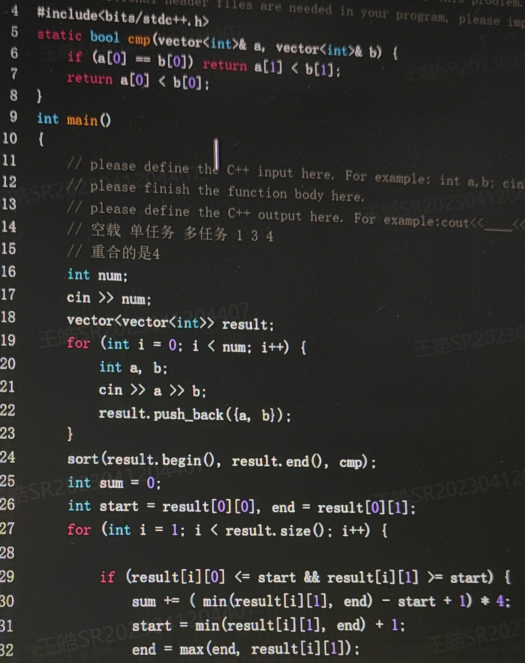
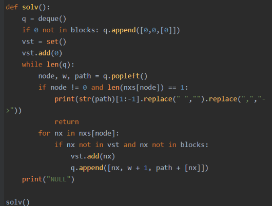
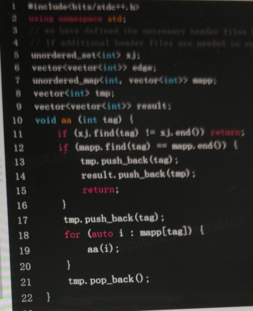
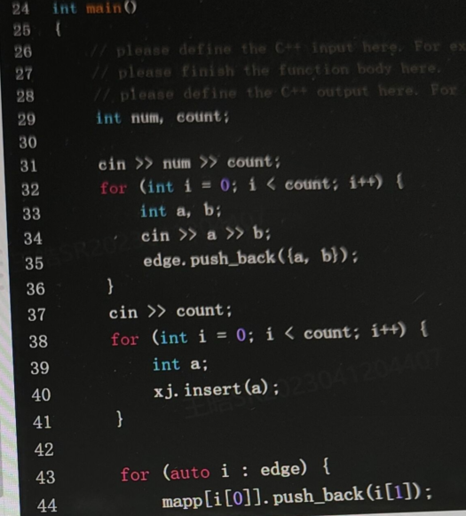
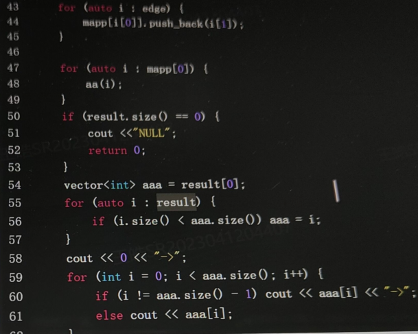

## 领鹰

你有遇到过压力很大的时候吗？你会采用什么措施排解？你有这样的例子吗？你是不是没怎么经历过大挫折？假设场景，你毕业答辩只完成了70,80%，老师说你准备不充分，打算延毕你，你会怎么做？还看性格测试结果，说你性格值比较偏低，面试时候紧张吗？在大众面前讲话你紧张吗？你是怎么看待芯片设计的？你对华为公司，海思的了解是什么？芯片设计这个行业很累，加班很多，你对此看法？

总而言之，如何排解压力，遇到压力怎么做，整体面试逐渐变紧张。


一面：主要问了项目，自我介绍了一下，然后介绍了项目，后面是手撕代码

二面：和一面类似，也是自我介绍，介绍项目，手写代码。其他问题比如几个人做的？怎么前面的工作花了这么久？


8.23二面: 
2.c++八\股，static, 虚函数，多态，const，面向对象特性，堆、栈特性，STL各种容器详情原理。


一面45min 。 

  


  数据库相关：分组查询  索引实现原理 巴拉巴拉 

  HTTP 与HTTPs的区别，HTTPS实现的过程（问了对称密钥和非对称密钥的区别以及实际使用情况） 

  一个软件上线前所需要的所有准备，涉及到哪些人员。 

  项目相关 

  java一些简单的八股文（问的很少） 

  记性不好，还有些问题给忘记了（因为紧张） 

  


  二面1h15min 。 

  上来先问项目 

  然后全程怼项目中计算机网络的相关知识，如：服务端如何处理GET和POST请求的，如果请求时间很长是什么原因导致的，采取哪些方法定位问题。TCP是如何实现可靠传输，然后在三次握手时还有什么其他的信息（流量控制，滑动窗口）,如果用户没有接受到返回值，在项目中又是怎么处理的巴拉巴拉。 

关系型数据库非关系型数据库的区别以及各自什么时候使用

如何判断项目是否需要使用数据库

  restful编程风格相关知识 

  问了学校，是否有分布式编程基础，是否熟悉Linux 

  问了专利的具体创新点（问的挺详细的，包括专利的背景） 

  最后两道算法题 


  总结：项目怼的很细，主要考察对项目的熟悉程度吧，然后手撕代码不是很难，但是听说还是要写出来才能通过。 

  本人是菜鸡，希望主管面能够通过。球球了。 

业务主管面30min 。8月5 

上来自我介绍

问了是哪里的，家庭情况

本科比赛以及项目，排名，研究生是保送还是考的

最近比较烦心的事

有没有对象

实习的项目

实习加班没，对加班的看法

目前有没有其他公司的面试流程

对华为有什么看法

自己的优势

性格怎么样

平时朋友多不多

什么时候会紧张

反问

主管给人的感觉好凶啊，全程非常紧张。

过了大概十分钟然后短信通知面试通过


一、技术面（30min）
1、自我介绍
2、C++擅长哪一块，主动介绍一下（说了STL）

3、对C++的智能指针了解吗？

4、unique_ptr是不是不能进行赋值，需要赋值的话，应该怎么操作？

5、`**web服务器中的难点与改进？**`

这个web服务器主要三个部分吧，就是**线程池**、socket网络编程实现TCP通信、HTTP部分、定时器部分

6、**代码可读性和性能之间的权衡？**（答的由场景和需求决定）

性能优先吧，可读性的话可以用注释来说明。


一面技术面：
1.自我介绍，说了说了项目。
2.开始问八股了，

3.智能指针相关的auto_ptr为什么被废除，c+11中引入的三个智能指针底层还有一些关系。


\11. 一个 C++ 程序从编写到执行有哪些阶段？

预处理、编译、汇编、链接

\12. 预处理过程中的宏定义？宏定义与 const 的区别？

\13. typedef 的作用？

typedef用于定义类型别名，比如可以给类型取一个新名字、定义一个复合类型等，而且可以用typedef来定义与平台无关的类型，当跨平台时，只要改下 typedef 本身就行，不用对其他源码做任何修改，就比如标准库的size_t。

功能和using是一样的，唯一的区别在于C++编译器不支持使用typedef关键字为模板类设置别名，即typedef不能和template一起使用。只有using才可以使用template

\14. 在 C++中最常用的数据结构？vector？它的**缺点？ sort 排序的底层实现**？

​	缺点在于内存空间不足时要进行扩容，进行数据的拷贝；插入操作比较耗费内存，需要移动部分数据；

​	sort算法只支持随机访问迭代器。使用的算法主要是快速排序，还结合了插入排序和堆排序。STL的sort算法，数据量大时采用快排算法，分段归并排序。一旦分段后的数据量小于某个门槛（16），为避免QuickSort快排的递归调用带来过大的额外负荷，就改用Insertion Sort插入排序，而且插入排序对于“几近排序”的序列效果更好。如果元素规模大于16，此时如果递归层次过深（2*lg（n）），还会改用HeapSort堆排序。在元素规模大于16，递归不深，才会用快排

它每次排序中不只选择一种方法，比如给一个数据量较大的数组排序，开始采用快速排序，分段递归，分段之后每一段的数据量达到一个较小值后它就不继续往下递归，而是选择插入排序，如果递归的太深，他会选择推排序。


就比如对一个数据，先进行快排，然后再对左部分和右部分进行递归排序。若数据<16，就插入排序；数据>16时，若深度 > 2log(N)，则堆排，否则继续快排


\15. 编码过程中的问题？（野指针问题）
\16. 如果使用了已经被释放的内存是否会出现错误？可能会出现什么错误？

\17. 反问
\1. base 地
\2. 实习项目
\3. 实习生的培养


> 1. 专业面试

介绍项目 研究生期间主要干啥了

竞赛怎么做的 怎么分工的

聊了大概二十多分钟

手撕代码 

八股 线程和进程有什么区别？……

你平时写的代码中用过并发编程吗？答webserver线程池……

socket编程？

vector几种删除方法？(remove，erase，clear，popback)，vector的内存管理？可以自己定义吗？

数据结构 栈的特性 双向链表怎么删除节点 怎么添加节点

问了解过交换机的原理吗？答不懂硬件只会协议。IP协议，mac地址和IP地址转换(arp协议)

没有反问环节


## 手撕

> 面试官给题目，在自己的IDE写，完全的ACM模式，输入输出都自己处理，就只给俩样例，不需要测评

> 兔子繁衍的问题（斐波那契，递归，动态规划） 
>
> 字符串最长字串的打印（滑动窗口） 
>
> 实现二叉搜索树，并且实现插入以及中序遍历的功能 
>
> 给定一个正整数n，求出所有相加为n的正整数集合。
>
> 稍微扩展的bfs
>
> 爬楼梯
>
> 跳跃游戏 leetcode 55。链表求和
>
> 树的遍历，限制时间。
>
> 判断一个字符串是否一定能被分割成三个回文子串。
>
> 主要就是用一个状态数组来保存每个子串是否为回文，而不是每次切割后再判断。

### 4.19机试

### 1、服务器能耗统计

服务器有三种运行状态:空载、单任务、多任务，每个时间片的能耗的分别为1、3、4;

每个任务由起始时间片和结束时间片定义运行时间:

如果一个时间片只有一个任务需要执行，则服务器处于单任务状态；

如果一个时间片有多个任务需要执行，则服务器处于多任务状态；

给定一个任务列表，请计算出从第一个任务开始，到所有任务结束，服务器的总能耗。

**输入**

一个只包含整数的二维数组:

```
1. num
2. start0 end0
3. start1 end1
4. ...
```

第一行的数字表示一共有多少个任务

后续每行包含由空格分割的两个整数，用于确定每一个任务的起始时间片和结束时间片;

任务执行时间包含起始和结束时间片，即任务执行时间是左闭右闭的;

结束时间片一定大于等于起始时间片;

时间片范围: [0，1000000]: 任务数范围: [1,10000];

**输出**

一个整数，代表服务器的总能耗。

**样例1**

```
输入: 2
          25
          89
输出: 20
解释: [01] 没有任务需要执行，能耗为0
[2.5]处于单任务状态，能耗为3*4 = 12
[6,7] 处于空载状态，能耗为1*2 = 2
[8,9]处于单任务状态，能耗为3*2 =6
共计能耗为12 + 2 + 6 = 20
```

**样例2**

```
输入: 3
          4 8
          1 6
          2 9
输出: 3 4
解释:
[1,1] 处于单任务状态,能耗为3*1= 3
[2,8] 处于多任务状态，能耗为4*7=28
[9,9]处于单任务状态，能耗为3*1 = 3
共计能耗为3 + 28 + 3 = 34
```

#### 差分

差分的思路：
	定义一个diff差分数组，起点处++，终点+1处--，顺便统计下start和end。然后在这个范围内遍历diff，res[i] += res[i - 1] + diff[i];得到结果数组。结果数组就存储着每个位置处重合的数量

```cpp
#include<bits/stdc++.h>
using namespace std;

int main() {
	int num;
	cin >> num;
	vector<int> diff(1e6 + 1, 0);
	// 确定时间片的最大范围
	int n = 0, start = 1e6 + 2;
	for (int i = 0; i < num; i++) {
		int a, b;
		cin >> a >> b;
		start = min(start, a);
		n = max(n, b);
		diff[a] += 1;
		diff[b + 1] -= 1;
	}
	// 根据diff中的起点终点进行累加
	// 如 2-5 8-9，在diff中
	// 2 3 4 5  6 7 8 9 10
	// 1 0 0 0 -1 0 1 0 -1
	// 在res中
	// 1 1 1 1  0 0 1 1
	vector<int> res(n + 1, 0);
	res[0] = diff[0];
	for (int i = 1; i < n + 1; i++) {
		res[i] += res[i - 1] + diff[i];
	}
	// 从2到9遍历
	int sum = 0;
	for (int i = start; i < n + 1; i++) {
		if (res[i] == 0) sum += 1;
		else if (res[i] == 1) sum += 3;
		else sum += 4;
	}
	cout << sum;
}
```

自写




### 美团一个类似的题

**题目描述**:

小美是一位天文爱好者，她收集了接下来一段时间中所有会划过她所在的观测地上空的流星信息。具体地,她收集了n个流星在她所在观测地上空的出现时刻和消失时刻。对于一个流星，若其的出现时刻为s,消失时刻为t,那么小美在时间段[s,t]都能够观测到它。对于一个时刻，观测地上空出现的流星数量越多，则小美认为该时刻越好。小美希望能够选择一个最佳的时刻进行观测和摄影，使她能观测到最多数量的流星。现在小美想知道，在这个最佳时刻，她最多能观测到多少个流星以及一共有多少个最佳时刻可供她选择。

输入描述

第一行是一个正整数n,表示流星的数量。

第二行是n个用空格隔开的正整数,第i个数si表示第i个流星的出现时间。

第三行是n个用空格隔开的正整数,第i个数ti表示第i个流星的消失时间。

1<=n<=100000, 1<=si<=ti<=10^9

**输出描述**

输出一行用空格隔开的两个数x和y，其中x表示小美能观测到的最多的流行数，y表示可供她选择的最佳时刻数量。

**示例1**

**输入**

3

2 1 5

6 3 7

**输出**

2 4

```cpp
#include<bits/stdc++.h>
using namespace std;

int main()   {
	int num;
	cin >> num;
	vector<int> diff(1e6 + 1, 0);
	int tmp;
	int start = 1e6, end = 0;
	for (int i = 0; i < num; i++) {
		cin >> tmp;
		start = min(start, tmp);
		diff[tmp] += 1;
	}
	for (int i = 0; i < num; i++) {
		cin >> tmp;
		end = max(end, tmp);
		diff[tmp + 1] -= 1;
	}
	vector<int> result(end + 1, 0);
	int maxVal = 0;
	for (int i = start; i <= end; i++) {
		result[i] = result[i - 1] + diff[i];
		maxVal = max(maxVal, result[i]);
	}
	int count = 0;
	for (int i = start; i <= end; i++) {
		if (result[i] == maxVal) {
			count++;
		}
	}
	cout << maxVal << " " << count;
	return 0;
}
```


### 2、树上逃离

​	给定一棵树，这个树有n个节点，节点编号从0开始依次递增，0固定为根节点。在这棵树上有一个小猴子，初始时该猴子位于根节点(0号) 上，小猴子一次可以沿着树上的边从一个节点挪到另一个节点，但这棵树上有一些节点设置有障碍物，如果某个节点上设置了障碍物，小猴子就不能通过连接该节点的边挪动到该节点上。问小猴子是否能跑到树的叶子节点(叶子节点定义为只有一条边连接的节点)，如果可以，请输出小猴子跑到叶子节点的最短路径(通过的边最少)，否则输出字符串NULL。

**输入**

第一行给出数字n，表示这个树有n个节点，节点编号从0开始依次递增，0固定为根节点，1<=n<10000

第二行给出数字edge，表示接下来有edge行，每行是一条边

接下来的edge行是边: x y，表示x和y节点有一条边连接

边信息结束后接下来的一行给出数字block，表示接下来有block行，每行是个障碍物

接下来的block行是障碍物: X，表示节点x上存在障碍物

**输出**

如果小猴子能跑到树的叶子节点，请输出小猴子跑到叶子节点的最短路径(通过的边最少)，比如小猴子从0经过1到达2 (叶子节点)  ，那么输出“0->1->2”，否则输出“NULL”。注意如果存在多条最短路径，请按照节点序号排序输出，比如0->1和0->3两条路径，第一个节点0一样，则比较第二个节点1和3，1比3小，因此输出0->1这条路径。再如 0->5->2->3 和0->5->1->4，则输出 0->5-31->4

**样例2**

```
输入: 7
          6
          0 1
          0 3
          1 2
          3 4
          1 5
          5 6
          1
          4
输出: 0->1->2
解释: 节点4上有障碍物，因此0-3-4这条路不通，节点2和节点6都是叶子节点，但0->1->2比0->1->5->6路径短(通过的边最少) ，
```

> 当时思路是用的bfs深度优先搜索，先找出来所有的边，在找最短的
>
> 问题1：路径相等的情况，按照节点序号排序输出
> 问题2：题目里给定一条边中x和y两个节点相连，没有保证过x是y的父节点!!!因此存边的时候，需要存两遍

典型最短路模型。使用bfs找到距离根最近的节点即可，注意要存储每个遍历状态经过的路径。




待补充

```cpp
#include<bits/stdc++.h>
using namespace std;
unordered_set<int> xj;
unordered_map<int, vector<int>> edge;
int main() {
	int num， count;
	cin >> num >> count;
	
	for (int i = 0; i < count; i++) {
		int a, b;
		cin >> a >> b;
		map[a].push_back(b);
		map[b].push_back(a);
	}
	cin >> count;

	for (int i = 0; i < count; i++) {
		int a;
		cin >> a;
		xj.insert(a);
	}
	
}

```









积水引流，未作


### ==739. 每日温度==

[739. 每日温度](https://leetcode.cn/problems/daily-temperatures/)

```cpp
class Solution {
public:
    vector<int> dailyTemperatures(vector<int>& temperatures) {
        stack<int> st;
        vector<int> result(temperatures.size(), 0);
        for (int i = 0; i < temperatures.size(); i++) {
        	while (!st.empty() && temperatures[st.top()] < temperatures[i]) {
                result[st.top()] = i - st.top();
                st.pop();
            }
            st.push(i);
        }
        return result;
    }
};
```


### ==543. 二叉树的直径==

[543. 二叉树的直径](https://leetcode.cn/problems/diameter-of-binary-tree/)

错误思路：左子树高度+右子树高度

```cpp
class Solution {
public:
    int aa(TreeNode* node, int count) {
        if (node == nullptr) return count;
        count++;
        return max(aa(node->left, count), aa(node->right, count));
    }
    int diameterOfBinaryTree(TreeNode* root) {
        // 左子树高度+右子树高度
        return aa(root->left, 0) + aa(root->right,0);
    }
};
```

正确思路：二叉树任意俩结点的直径！！！

首先我们知道一条路径的长度为该路径经过的节点数减一，所以求直径（即求路径长度的最大值）等效于求路径经过节点数的最大值减一。

而任意一条路径均可以被看作由某个节点为起点，从其左儿子和右儿子向下遍历的路径拼接得到。

我们就可以使用深度优先搜索，得到每个结点的左右孩子的深度，然后一边返回最大深度，一边保存这个路径

```cpp
/**
 * Definition for a binary tree node.
 * struct TreeNode {
 *     int val;
 *     TreeNode *left;
 *     TreeNode *right;
 *     TreeNode() : val(0), left(nullptr), right(nullptr) {}
 *     TreeNode(int x) : val(x), left(nullptr), right(nullptr) {}
 *     TreeNode(int x, TreeNode *left, TreeNode *right) : val(x), left(left), right(right) {}
 * };
 */
class Solution {
public:
    int result = 0;
    int aa(TreeNode* node) {
        if (node == nullptr) return 0;
        int left = aa(node->left);
        int right = aa(node->right);
        result = max(result, left + right + 1);
        return max(left, right) + 1;
    }
    int diameterOfBinaryTree(TreeNode* root) {
        // 左子树高度+右子树高度
        aa(root);
        return result - 1;
    }
};
```


### ==5.最长回文子串==

[最长回文子串](https://leetcode.cn/problems/longest-palindromic-substring/)

```cpp
class Solution {
public:
    string longestPalindrome(string s) {
        // 一个字符串的首尾相同，且中间部分为回文子串
        // dp[i][j]表示i开头j结尾的是否是回文子串
        // dp[i + 1][j - 1]，遍历顺序从第向上，从前向后
        string tmp = "";
        vector<vector<bool>> dp(s.size(), vector<bool>(s.size(), false));
        for (int i = s.size() - 1; i >= 0; i--) {
            for (int j = i; j < s.size(); j++) {  // j >= i
                if (s[i] == s[j]) {
                    if (j - i <= 1 || dp[i + 1][j - 1]) {
                        dp[i][j] = true;
                        if (j - i + 1 > tmp.size()) tmp = s.substr(i, j - i + 1);
                    }
                }
            }
        }
        return tmp;
    }
};
```


### ==438. 找到字符串中所有字母异位词(考了好几次)==

[438. 找到字符串中所有字母异位词](https://leetcode.cn/problems/find-all-anagrams-in-a-string/)


传统方法：size个进行遍历，会超时


```cpp
class Solution {
public:
    bool aa(int start, int size, string& s, unordered_map<char, int> mapp) {
        for (int i = start; i < start + size; i++) {
            mapp[s[i]]--;
            if (mapp[s[i]] < 0) return false;
        }
        return true;
    }
    vector<int> findAnagrams(string s, string p) {
        int size = p.size();
        vector<int> result;
        if (size > s.size()) return result;  // 情况1
        unordered_map<char, int> mapp;
        for (auto i : p) {
            mapp[i]++;
        }
        // 情况2 i < s.size() - size + 1
        for (int i = 0; i < s.size() - size + 1; i++) {
            if(aa(i, size, s, mapp)) result.push_back(i);
        }
        return result;
    }
};
```

滑动窗口

```cpp
class Solution {
public:
    vector<int> findAnagrams(string s, string p) {
        vector<int> result;  // 保存结果
        vector<int> cnt(26, 0);  // 记录p中字符
        vector<int> window(26, 0);
        for (auto i : p) cnt[i - 'a']++;

        int count = 0;  // 统计p中不同的字符的数量
        for (int i = 0; i < 26; i++) if (cnt[i] != 0) count++;

        for (int left = 0, right = 0, counts = 0; right < s.size(); right++) {
            if (cnt[s[right] - 'a']) {
                window[s[right] - 'a']++;
                if (window[s[right] - 'a'] == cnt[s[right] - 'a']) counts++;
            }
            // 如果长度超了，收缩left。这里用if或while都可以，因为只需要收缩一次
            while (right - left + 1 > p.size()) {
                if (cnt[s[left] - 'a']) {
                    if (cnt[s[left] - 'a'] == window[s[left] - 'a']) counts--;
                    window[s[left] - 'a']--;
                }
                left++;
            }
            if (count == counts) result.push_back(left);
        }
        return result;
    }
};
```

优雅写法

```cpp
class Solution {
public:
    vector<int> findAnagrams(string s, string p) {
        vector<int> result;  // 保存结果
        vector<int> cnt(26, 0);  // 记录p中字符
        for (auto i : p) cnt[i - 'a']++;

        int count = 0;  // 统计p中不同的字符的数量
        for (int i = 0; i < 26; i++) if (cnt[i] != 0) count++;

        for (int left = 0, right = 0, counts = 0; right < s.size(); right++) {
            if (--cnt[s[right] - 'a'] == 0) counts++;  // 必须先自减
            // 如果长度超了，收缩left
            if (right - left + 1 > p.size() && ++cnt[s[left++] - 'a'] == 1) counts--;
            if (count == counts) result.push_back(left);
        }
        return result;
    }
};
```


### ==75. 颜色分类==

[75. 颜色分类](https://leetcode.cn/problems/sort-colors/)

```cpp
#include<bits/stdc++.h>
using namespace std;

void sortColors(vector<int>& nums) {
    int start = 0, end = nums.size() - 1, i = 0;
    while (i <= end) {
        if (nums[i] == 0) {
            swap(nums[i], nums[start++]);
            i++;  // 注意这步
        }
        else if (nums[i] == 2) swap(nums[i], nums[end--]);
        else i++;
    }
}

int main() {
	vector<int> vec = {2,0,2,1,1,0};
	sortColors(vec);
	for (auto i : vec) cout << i << " ";
}
```

### 415. 字符串相加/NC1 大数加法

[**NC1** **大数加法**](https://www.nowcoder.com/practice/11ae12e8c6fe48f883cad618c2e81475?tpId=196&tqId=37176&rp=1&ru=/exam/company&qru=/exam/company&sourceUrl=%2Fexam%2Fcompany&difficulty=undefined&judgeStatus=undefined&tags=&title=%E5%A4%A7%E6%95%B0) [415. 字符串相加](https://leetcode.cn/problems/add-strings/)

模拟加法过程

```cpp
class Solution {
public:
    string addStrings(string num1, string num2) {
        // 
        int end_1 = num1.size() - 1;
        int end_2 = num2.size() - 1;
        string result = "";
        int ys = 0;
        while (end_1 >= 0 || end_2 >= 0) {
            int a = 0, b = 0;
            if (end_1 >= 0) a = num1[end_1--] - '0';
            if (end_2 >= 0) b = num2[end_2--] - '0';
            result += (a + b + ys) % 10 + '0';
            ys = (a + b + ys) / 10;
        }
        if (ys) result += "1";
        reverse(result.begin(), result.end());
        return result;
    }
};
```


```cpp
class Solution {
public:
    string solve(string s, string t) {
        // write code here
        int len1 = s.size();
        int len2 = t.size();
        // 首先要保证两个数的位数要保持一致
        while (len1 < len2) {
            s = "0" + s;
            len1++;
        }
        while (len1 > len2) {
            t = "0" + t;
            len2++;
        }
        string ans;
        int carry = 0;  // 定义一个变量作为进位位
        for (int i = len1 - 1; i >= 0; i--) {
            int tmp = s[i] - '0' + t[i] - '0' + carry;
            ans += char(tmp % 10 + '0');
            carry = tmp / 10;  // 不断更新进位位
        }
        // 最后还需要特判进位位
        if (carry) reverse(ans.begin(), ans.end());
        return ans;
    }
};
```

### 剑指 Offer II 025. 链表中的两数相加

[剑指 Offer II 025. 链表中的两数相加](https://leetcode.cn/problems/lMSNwu/)

hw：链表实现两个大数字相加，不用实现输入，类似于像leetcode那样写个接口，大概写了20分钟？

存在的问题：翻转了开始的俩链表。如果不让翻转的话，可以把他们翻转回去，或者将l1 l2存到栈中，然后一个个取出来

```cpp
struct ListNode {
    int val;
    ListNode *next;
    ListNode(int x) : val(x), next(nullptr) {}
};

class Solution {
public:
    ListNode* reverse(ListNode* node) {
        ListNode* pre = nullptr;
        ListNode* next;
        while (node) {
            next = node->next;
            node->next = pre;
            pre = node;
            node = next;
        }
        return pre;
    }
    ListNode* addTwoNumbers(ListNode* l1, ListNode* l2) {
        // 一个是翻转两个链表
        l1 = reverse(l1);
        l2 = reverse(l2);
        int jw = 0;
        ListNode* tmp = nullptr;
        while (l1 || l2) {
            int sum = 0;
            if (l1) sum += l1->val;
            if (l2) sum += l2->val;
            sum += jw;
            ListNode* node = new ListNode(sum % 10);
            node->next = tmp;
            tmp = node;
            jw = sum / 10;
            if (l1) l1 = l1->next;
            if (l2) l2 = l2->next;
        }
        if (jw) {
            ListNode* node = new ListNode(jw);
            node->next = tmp;
            return node;
        }
        return tmp;
    }
};
```


### ==1745. 回文串分割 IV==

[1745. 回文串分割 IV](https://leetcode.cn/problems/palindrome-partitioning-iv/)


```cpp
class Solution {
public:
    bool checkPartitioning(string s) {
        // dp[i + 1][j - 1]
        vector<vector<bool>> dp(s.size(), vector<bool>(s.size(), false));
        for (int i = s.size() - 1; i >= 0; i--) {
            for (int j = i; j < s.size(); j++) {
                if (s[i] == s[j] && (j - i <= 1 || dp[i + 1][j - 1])) {
                    dp[i][j] = true;
                }
            }
        }
        // 遍历dp，看看有没有符合的
        for (int i = 1; i <= s.size() - 2; i++) {
            for (int j = i; j < s.size() - 1; j++) {
                if (dp[0][i - 1] && dp[i][j] && dp[j + 1][s.size() - 1]) return true;
            }
        }
        return false;
    }
};
```


普通方法，超时

```cpp
class Solution {
public:
    bool is (string s) {
        int left = 0, right = s.size() - 1;
        while (left < right) {
            if (s[left++] != s[right--]) return false;
        }
        return true;
    }
    bool aa (string s, int start) {
        for (int i = start + 1; i < s.size(); i++) {
            string tmp = s.substr(start, i - start);
            string tmp2 = s.substr(i, s.size() - i);
            if (is (tmp) && is (tmp2)) return true;
        }
        return false;
    }

    bool checkPartitioning(string s) {
        // 回溯，两个分割位置
        for (int i = 1; i < s.size() - 1; i++) {
            if ( is(s.substr(0, i)) && aa(s, i) ) return true;
        }
        return false;
    }
};
```


### ==NC359 大数相减==

[**NC359** **大数相减**](https://www.nowcoder.com/practice/ae4d84312e384a1fa100b613f93f3fe0?tpId=196&tqId=40449&rp=1&ru=/exam/company&qru=/exam/company&sourceUrl=%2Fexam%2Fcompany&difficulty=undefined&judgeStatus=undefined&tags=&title=%E5%A4%A7%E6%95%B0)

```cpp
#include<bits/stdc++.h>
using namespace std;

string sub(string a, string b) {
    string res = "";
    int borrow = 0;
    int i = a.size() - 1, j = b.size() - 1;
    while (i >= 0 || j >= 0) {
        int x = i >= 0 ? a[i] - '0' : 0;
        int y = j >= 0 ? b[j] - '0' : 0;
        int z = (x - borrow - y + 10) % 10;
        res += '0' + z;
        borrow = x - borrow - y < 0 ? 1 : 0;
        i--, j--;
    }
    reverse(res.begin(), res.end());
    //删除前导0。循环条件是res.size()-1是为防止"0000"的情况
    //例如，当121-120=001，需要将前面的0删除，得到最终结果1。
    //注意121-121=000这种情况，不要把所有0都删了！
    int pos;
    for (pos = 0; pos < res.size() - 1; pos++) {
        if (res[pos] != '0') break;
    }
    return res.substr(pos);
}

bool cmp(string a, string b) {
    if (a.size() == b.size()) return a < b;
    return a.size() < b.size();
}

string substring(string num1, string num2) {
    string res;
    if (cmp(num1, num2)) {  // 保证大减小
        res = sub(num2, num1);
        if (res != "0") res.insert(0, "-");
    } else res = sub(num1, num2);
    return res;
}


int main() {
    string a, b;
    cin >> a >> b;
    cout << subStrings(a, b) << endl;
    return 0;
}
```


### 141. 环形链表

[141. 环形链表](https://leetcode.cn/problems/linked-list-cycle/)

```cpp
#include<bits/stdc++.h>
using namespace std;

struct Node {
	int val;
	Node* next;
	Node(int x) : val(x), next(nullptr) {}
};

bool hasCycle(Node *head) {
    Node* slow = head;
    Node* fast = head;
    if (head == nullptr) return false;
    while (fast && fast->next) {
        fast = fast->next->next;
        slow = slow->next;
        if (fast == slow) return true;
    }
    return false;
}
int main() {
	vector<int> vec = {3,2,0,-4};
	int pos = 1;
	vector<Node*> vecNode;
	for (auto i : vec) vecNode.push_back(new Node(i));
	for (int i = 0; i < vec.size() - 1; i++) {
		vecNode[i]->next = vecNode[i + 1];
	}
	vecNode[vec.size() - 1]->next = vecNode[pos];
	
	bool temp = hasCycle(vecNode[0]);
	if (temp) cout << "true" << endl;
	else cout << "false" << endl;
	return 0;
}
```


### 64. 最小路径和

[64. 最小路径和](https://leetcode.cn/problems/minimum-path-sum/)

力扣Hot100

```cpp
#include<bits/stdc++.h>
using namespace std;

int minPathSum(vector<vector<int>>& grid) {
    int m = grid.size(), n = grid[0].size();
    vector<int> dp(n + 1, INT_MAX);
    dp[1] = grid[0][0];
    for (int i = 1; i <= m; i++) {
        for (int j = 1; j <= n; j++) {
            if (i == 1 && j == 1) continue;
            dp[j] = min(dp[j], dp[j - 1]) + grid[i - 1][j - 1];
        }
    }
    return dp[n];
}

int main() {
	vector<vector<int>> vec = {{1,3,1},{1,5,1},{4,2,1}};
	cout << minPathSum(vec);
}
```

### 39. 组合总和

[39. 组合总和](https://leetcode.cn/problems/combination-sum/)

```cpp
#include<bits/stdc++.h>
using namespace std;

vector<vector<int>> result;
vector<int> tmp;
void aa(vector<int>& candidates, int tag, int sum, int target) {
	if (sum == target) {
		result.push_back(tmp);
		return;
	}
	if (sum > target) return;
	for (int i = tag; i < candidates.size(); i++) {
		tmp.push_back(candidates[i]);
		aa(candidates, i, sum + candidates[i], target);
		tmp.pop_back();
	}
}
void combinationSum(vector<int>& candidates, int target) {
    // 回溯
    aa(candidates, 0, 0, target);
}

int main() {
	vector<int> vec = {2,3,6,7};
	combinationSum(vec, 7);
	for (auto i : result) {
		for (auto j : i) cout << j << " ";
		cout << endl;
	}
}
```

剪枝，需要sort

```cpp
#include<bits/stdc++.h>
using namespace std;

vector<vector<int>> result;
vector<int> tmp;
void aa(vector<int>& candidates, int tag, int sum, int target) {
	if (sum == target) {
		result.push_back(tmp);
		return;
	}
	if (sum > target) return;
	// 剪枝
	for (int i = tag; i < candidates.size() && sum + candidates[i] <= target; i++) {
		tmp.push_back(candidates[i]);
		aa(candidates, i, sum + candidates[i], target);
		tmp.pop_back();
	}
}
void combinationSum(vector<int>& candidates, int target) {
    // 回溯
    aa(candidates, 0, 0, target);
}

int main() {
	vector<int> vec = {2,3,6,7};
	sort(vec.begin(), vec.end());
	combinationSum(vec, 7);
	for (auto i : result) {
		for (auto j : i) cout << j << " ";
		cout << endl;
	}
}
```

### 200. 岛屿数量(~)

[200. 岛屿数量](https://leetcode.cn/problems/number-of-islands/) 

dfs

```cpp
class Solution {
public:
    int dir[4][2] = {1, 0, 0, 1, -1, 0, 0, -1};
    int result = 0;
    void dfs(vector<vector<char>>& grid, int x, int y) {
        grid[x][y] = '0';
        for (int i = 0; i < 4; i++) {
            int a = x + dir[i][0];
            int b = y + dir[i][1];
            if (a < 0 || b < 0 || a >= grid.size() || b >= grid[0].size()) continue;
            if (grid[a][b] == '1') dfs(grid, a, b);
        }
    }
    int numIslands(vector<vector<char>>& grid) {
        // dfs，遇到1结果就加一，然后将所有连接的都变为0
        for (int i = 0; i < grid.size(); i++) {
            for (int j = 0; j < grid[0].size(); j++) {
                if (grid[i][j] == '1') {
                    result++;
                    dfs(grid, i, j);
                }
            }
        }
        return result;
    }
};
```

bfs

```cpp
class Solution {
public:
    // bfs
    int dir[4][2] = {1, 0, 0, 1, -1, 0, 0, -1};
    int result = 0;
    void dfs(vector<vector<char>>& grid, int x, int y) {
        queue<pair<int, int>> que;
        que.push({x, y});
        grid[x][y] = '0';
        while (!que.empty()){
            pair<int, int> tmp = que.front(); que.pop();
            int m = tmp.first;
            int n = tmp.second;
            for (int i = 0; i < 4; i++) {
                int a = m + dir[i][0];
                int b = n + dir[i][1];
                if (a < 0 || b < 0 || a >= grid.size() || b >= grid[0].size()) continue;
                if (grid[a][b] == '1') {
                    que.push({a, b});
                    grid[a][b] = '0';
                }
            }
        }
    }
    int numIslands(vector<vector<char>>& grid) {
        for (int i = 0; i < grid.size(); i++) {
            for (int j = 0; j < grid[0].size(); j++) {
                if (grid[i][j] == '1') {
                    result++;
                    dfs(grid, i, j);
                }
            }
        }
        return result;
    }
};
```


### 1. 两数之和

[1. 两数之和](https://leetcode.cn/problems/two-sum/)

```cpp
class Solution {
public:
    vector<int> twoSum(vector<int>& nums, int target) {
        // 回溯，组合问题，n * 2^n
        // 暴力 n^2
        // 差分、unordered_map n
        unordered_map<int, int> diff;
        for (int i = 0; i < nums.size(); i++) {
            diff[target - nums[i]] = i;
        }
        for (int i = 0; i < nums.size(); i++) {
            if (diff.find(nums[i]) != diff.end() && i != diff[nums[i]]) return {i, diff[nums[i]]};
        }
        return {};
    }
};
```

优化

```cpp
class Solution {
public:
    vector<int> twoSum(vector<int>& nums, int target) {
        unordered_map<int, int> map;
        for (int i = 0; i < nums.size(); i++) {
            if (map.find(nums[i]) != map.end()) {
                return {i, map[nums[i]]};
            }
            map[target - nums[i]] = i;
        }
        return vector<int>();
    }
};
```

### 15. 三数之和

[15. 三数之和](https://leetcode.cn/problems/3sum/)

双指针

```cpp
class Solution {
public:
    vector<vector<int>> threeSum(vector<int>& nums) {
        // 双指针
        sort(nums.begin(), nums.end());
        vector<vector<int>> result;
        for (int i = 0; i < nums.size() - 2; i++) {
            if (nums[i] > 0) return result;
            if (i > 0 && nums[i] == nums[i - 1]) continue;
            int left = i + 1, right = nums.size() - 1;
            while (left < right) {
                if (nums[i] + nums[left] + nums[right] > 0) right--;
                else if (nums[i] + nums[left] + nums[right] < 0) left++;
                else {
                    result.push_back({nums[i], nums[left], nums[right]});
                    // 去重
                    while (left < right && nums[left] == nums[left + 1]) left++;
                    while (left < right && nums[right] == nums[right - 1]) right--;
                    left++; right--;
                }
            }
        }
        return result;
    }
};
```


### 32. 最长有效括号

[32. 最长有效括号](https://leetcode.cn/problems/longest-valid-parentheses/)

**栈**

> * 维持一个stack，保存下标，通过下标计算长度
> * st.push(-1)，表示最后一个没有被匹配的右括号的下标是-1。比如输入()，左括号入栈，右括号先出栈，然后与栈顶做差计算长度，刚好1-(-1)=2。
> * 在程序中的意义，是因为右括号的情况会先st.pop()，若只有-1，被弹出，则说明没有对应左括号；若有左括号，则弹出左括号，剩下-1方便进行下标的计算
> * 左括号直接放入下标
> * 右括号的话，先出栈
>   * 如果是空栈，则放入栈中，表示**最后一个没有被匹配的右括号的下标**
>   * 若不是空栈，表示匹配，然后下标-栈顶下标就是当前括号为结尾的最长有效字串（如()是2，(())的话中间俩抵消了，就是()，弹出后栈中就一个-1，下标计算为3 - -1 = 4

```cpp
class Solution {
public:
    int longestValidParentheses(string s) {
        stack<int> st;
        int result = 0;
        st.push(-1);
        for (int i = 0; i < s.size(); i++) {
            if (s[i] == '(') st.push(i);
            else {
                st.pop();
                if (st.empty()) st.push(i);
                else result = max(result, i - st.top());
            }
        }
        return result;
    }
};
```

### 663 均匀树划分

给定一棵有 n 个结点的二叉树，你的任务是检查是否可以通过去掉树上的一条边将树分成两棵，且这两棵树结点之和相等。

```
样例 1:
输入:     
    5
   / \
  10 10
    /  \
   2   3
输出: True
解释: 
    5
   / 
  10
      
和: 15

   10
  /  \
 2    3

和: 15


样例 2:
输入:     
    1
   / \
  2  10
    /  \
   2   20
输出: False
解释: 无法通过移除一条树边将这棵树划分成结点之和相等的两棵子树。
注释 :
树上结点的权值范围 [-100000, 100000]。
1 <= n <= 10000
```


```cpp
#include <bits/stdc++.h>
#include<iostream>
using namespace std;

struct TreeNode {
	int val;
	TreeNode* left;
	TreeNode* right;
	TreeNode(int x) : val(x), left(nullptr), right(nullptr) {}
};

// 根据数组创建二叉树
TreeNode* aa(vector<int>& vec) {
	// 转换为数组
	vector<TreeNode*> vecNode(vec.size(), nullptr);
	TreeNode* root;
	for (int i = 0; i < vec.size(); i++) {
		TreeNode* node = nullptr;
		if (vec[i] != -1) node = new TreeNode(vec[i]);
		vecNode[i] = node;
		if (i == 0) root = node;
	}
	for (int i = 0; i * 2 + 1 < vec.size(); i++) {  // 遍历有子节点的
		if (vecNode[i] == nullptr) continue;
		vecNode[i]->left = vecNode[i * 2 + 1];
		if (i * 2 + 2 < vec.size()) vecNode[i]->right = vecNode[i * 2 + 2];
	}
	return root;
}

/*********************** 解题 ***********************/
// 前序遍历，求sum
int bb (TreeNode* node) {
	if (node == nullptr) return 0;
	int sum = node->val;
	sum += bb(node->left);
	sum += bb(node->right);
	return sum;
}

bool tag = false;
// 自底向上，后序遍历
int cc (TreeNode* node, int sum) {
	if (node == nullptr) return 0;
	int left = cc(node->left, sum);
	int right = cc(node->right, sum);
	if (left == sum || right == sum) tag = true;
	return left + right + node->val;
}

int main() {
	vector<int> vec1 = {5, 10, 10, -1, -1, 2, 3};
	vector<int> vec = {1, 2, 10, -1, -1, 2, 20};
	TreeNode* root = aa(vec);
	
	/*********************** 解题 ***********************/
	int sum = bb(root);
	
	// 找有没有和为sum/2的子树
	if (sum % 2 == 1) cout << false;
	else {
		cc(root, sum / 2);
		cout << tag;
	}
	
	return 0;
}
```

> 深度≤20说明了什么？


Java的一些常见线程安全和线程不安全的数据结构，以及对应数据结构实现线程安全的原理。

Java多线程下线程安全的三大特性，以及如何保证。


序列化和反序列化。 

  5.Mybatis里面#和$有什么区别 

  6.Java的线程池有几种，分别说说 

  7.sychronized和lock区别  

  8.Java GC机制  

6.课业压力重吗 业余时间都干什么
7.介绍了下他们的业务 说我掌握的东西都挺符合
8.待遇方面
然后让我等消息

6.说一下你用过的python flask和为什么
7.用过docker吗


java的垃圾回收


